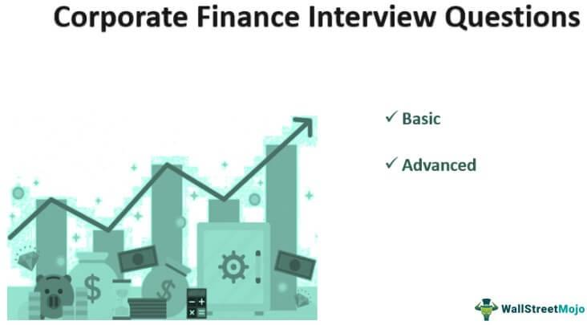

In the ever-evolving landscape of finance, understanding the basics of investment, financial planning, and algorithmic trading is more critical than ever. As the financial markets become increasingly complex, both novice and seasoned investors must keep abreast of these core components to ensure robust financial health. Whether you're a beginner contemplating your investment journey or an experienced investor looking to refine your strategies, asking the right questions is key. Proper communication with a financial advisor can provide clarity and guidance, helping align your financial decisions with your goals and risk tolerance.

In this article, we explore essential investment questions to ask your financial advisor, the basics of financial planning, and the role of algorithmic trading. These elements form the foundation of a well-rounded understanding of modern finance, equipping you to make informed decisions. The advent of technology has brought forward innovative solutions, such as robo-advisors, which leverage algorithms to provide investment management services traditionally offered by human advisors. This technological shift presents new opportunities for investors but also introduces challenges that require careful consideration.



Let's explore how these components—investment queries, financial planning, and algorithmic trading—work together to shape your financial future. Mastery of these areas empowers investors to navigate the markets effectively, making strategic decisions that enhance their financial portfolios and ensure long-term prosperity.

## Table of Contents

## Essential Investment Questions for Your Financial Advisor

Before entrusting your finances to a financial advisor, understanding their services and how they align with your personal financial goals is paramount. Here is a set of key questions to guide you in assessing potential advisors:

1. **What is their investing philosophy, and how does it align with your personal goals?**

   Every advisor operates under a specific investing philosophy which may include principles like value investing, growth investing, or a focus on index funds. It is important to understand whether their approach is aligned with what you're aiming to achieve with your investments. For example, if your goals are more growth-oriented, an advisor who focuses on income-generating strategies may not be the right fit. Ask for examples of investment strategies they have used in the past and how those align with current market conditions.

2. **What are the costs involved, and is the advisor incentivized to sell specific products?**

   Transparency in costs and fees associated with investment advisory services is critical. Advisors can have different compensation structures such as a percentage of assets under management (AUM) or a flat fee. Additionally, find out if they receive commissions for recommending specific financial products. Such commissions can create a conflict of interest, potentially compromising the impartiality of their advice.

3. **Do they have a fiduciary duty?**

   Inquire whether your financial advisor has a fiduciary responsibility to you. A fiduciary duty legally obligates advisors to act in your best financial interest, minimizing conflicts of interest. This distinction is crucial; advisors without a fiduciary duty might be subject to less stringent ethical considerations, possibly leading to recommendations that primarily benefit their own financial interests over yours.

4. **Which benchmarks do they use to measure investment performance and how do they plan to manage your assets?**

   Understanding the benchmarks your advisor uses to evaluate the success of their investment strategies can provide transparency and set expectations. Common benchmarks include indexes like the S&P 500 for stock portfolios or the Bloomberg Barclays U.S. Aggregate Bond Index for bond investments. Additionally, inquire about their asset management strategy — this includes asset allocation, risk management techniques, and any planned adjustments in response to market changes or your life circumstances.

An informed approach to selecting a financial advisor involves asking these critical questions, ensuring that your choice aligns not only with your financial objectives but also with ethical and strategic considerations.

## Understanding Financial Planning

Financial planning encompasses several key areas beyond mere investing, offering a holistic approach to managing one’s financial life. It involves integral components such as budgeting, retirement planning, debt management, and estate planning. These elements collectively contribute to constructing a stable financial future.

Working with a certified financial planner (CFP) or advisor can provide a structured and comprehensive approach to managing finances. These professionals are equipped with the knowledge and skills required to create detailed financial strategies. A CFP can help identify your financial goals, assess your current financial state, and develop a roadmap that guides you toward achieving those aims. Their expertise ensures that every financial decision considers broader lifestyle goals and adjusts to changes in personal circumstances or economic conditions.

Adapting a financial strategy is crucial as life circumstances, such as changes in income, job loss, or significant life events like marriage or childbirth, can affect financial plans. Moreover, shifts in the economic environment, including changes in interest rates or market [volatility](/wiki/volatility-trading-strategies), can also impact financial strategies. A flexible plan allows you to navigate these changes without deviating from your long-term financial objectives. Regular reviews of your financial plan with your advisor can ensure it remains aligned with your evolving needs and external market conditions.

Creating a customized financial plan involves tailoring strategies to fit your specific financial goals and risk tolerance. Personal monetary goals may range from buying a house, funding education, to ensuring a comfortable retirement. Risk tolerance varies from individual to individual and can influence investment strategies, impacting the choice between aggressive and conservative asset allocations. A personalized plan reflects your unique circumstances and preferences, maximizing the potential for achieving desired outcomes.

Financial literacy is an essential component underpinning effective communication with your advisor. It empowers you to ask informed questions and engage actively in the planning process. Understanding basic financial concepts, such as interest rates, inflation, and the importance of diversification, can enhance the effectiveness of your financial planning efforts. With increased financial literacy, you can make decisions that better align with your long-term financial vision and work collaboratively with your advisor to refine strategies as needed. 

In summary, understanding and engaging in financial planning is vital for anyone looking to secure their financial future. By leveraging the expertise of certified professionals and committing to continuous learning in financial literacy, individuals can craft comprehensive plans that resonate with their personal aspirations and adapt to changing circumstances.

## The Role of Algorithmic Trading in Financial Portfolio Management

Algorithmic trading utilizes advanced computer algorithms to automatically execute trades at high speeds, significantly enhancing the efficiency of financial markets. This method employs complex mathematical models and statistical analyses to scrutinize market data, identifying opportunities that may be imperceptible to human traders. The primary advantage of [algorithmic trading](/wiki/algorithmic-trading) is its ability to manage a vast number of securities and execute trades simultaneously across multiple markets, thus optimizing investment strategies based on historical data and prevailing market conditions.

Investors considering the inclusion of algorithmic trading in their financial portfolios should discuss with their advisor the extent to which their firm uses these technologies. Understanding the types of algorithms and technologies employed is crucial for ensuring they align with the investor's goals and risk tolerance. Firms might leverage popular programming languages such as Python to develop these algorithms due to their robustness in handling large datasets and performing complex calculations. A simple illustration of an algorithmic trading strategy might involve mean reversion, where the algorithm identifies stocks that have deviated significantly from historical averages and executes trades to capitalize on the expected return to the mean.

```python
import pandas as pd
import numpy as np

# Assuming `data` is a pandas DataFrame with columns ['Date', 'StockPrice']
data['Mean'] = data['StockPrice'].rolling(window=20).mean()
data['StdDev'] = data['StockPrice'].rolling(window=20).std()

# Buy signal: Price below Mean - 2 * StdDev
data['Buy_Signal'] = np.where(data['StockPrice'] < data['Mean'] - 2 * data['StdDev'], 1, 0)
# Sell signal: Price above Mean + 2 * StdDev
data['Sell_Signal'] = np.where(data['StockPrice'] > data['Mean'] + 2 * data['StdDev'], -1, 0)

# Example: Executing trades based on signals
data['Position'] = data['Buy_Signal'] + data['Sell_Signal']
```

While algorithmic trading offers numerous efficiencies, it also presents specific risks. High-frequency trading, a subset of algorithmic trading, can contribute to market volatility and has been implicated in events like the 2010 Flash Crash, where markets experienced a rapid, deep, and sudden drop in prices. Therefore, investors need to assess the risk-reward ratio of integrating algorithmic strategies into their portfolios.

Emerging technologies, particularly robo-advisors, have begun to incorporate similar algorithmic processes to deliver cost-effective, automated investment solutions. Robo-advisors use algorithms to tailor financial advice and manage portfolios with minimal human intervention, appealing to investors seeking passive management choices at lower fees. The combination of human insight with algorithmic precision, although still evolving, offers a promising avenue for achieving a well-balanced and diversified financial portfolio.

## The Rise of Robo-Advisors and Automated Investing

Robo-advisors represent a transformative development in the field of investment management by employing sophisticated algorithms to deliver customized financial recommendations. These digital platforms offer an accessible entry point for cost-sensitive investors who prefer low maintenance, passive investment strategies. By minimizing human intervention, robo-advisors can significantly reduce costs, making investment services available to a broader audience.

The automation provided by robo-advisors allows for a high degree of efficiency. Algorithms can quickly analyze vast amounts of data to allocate assets based on predefined criteria or investor preferences. This operates within the parameters of modern portfolio theory, which aims to create an optimal mix of investments to achieve a desired return for a given level of risk, as articulated by Harry Markowitz. The basic utility function here is not unlike: 

$$
U = E(R) - \frac{1}{2} \times A \times \sigma^2
$$

where $U$ is the utility of the portfolio, $E(R)$ is the expected return, $A$ is the risk aversion level of the investor, and $\sigma^2$ is the variance of the portfolio's return.

Despite the benefits of automation, robo-advisors may fall short when dealing with complex financial situations that benefit from human intuition and nuanced understanding. Personalized advice considering specific tax implications, estate planning, or significant life changes often requires the human touch. Thus, the role of human advisors remains vital as they offer personalized insight and nuanced decision-making that algorithms may not yet replicate.

Balancing automated tools with human advisors can provide a comprehensive approach to investment management. A hybrid model may integrate the efficiency of algorithmic processing with the nuanced understanding of a human advisor, potentially offering the best of both worlds. This hybrid strategy allows investors to benefit from the low costs and automated simplicity of robo-advisors while having the option to consult human advisors for personalized, complex decision-making.

It is crucial for individuals to evaluate whether a hybrid approach aligns with their financial goals and personal preferences. Investors should consider the complexity of their financial situation, the level of interaction they prefer, and the types of services they require. By understanding the strengths and limitations of both robo-advisors and human financial advisors, investors can craft a strategy that leverages the benefits of technology while ensuring their unique financial needs are met.

## Conclusion

Investing wisely necessitates a thorough understanding of one's financial goals and risk tolerance, as well as the tools and services available. This foundation enables individuals to make informed decisions and construct a strategic plan that aligns with their long-term objectives. Engaging in discussions with a financial advisor by asking targeted questions is crucial to ensure that their strategies align with your financial vision. These questions might pertain to investment philosophy, cost structures, and the advisor's fiduciary responsibilities. Such dialogue not only clarifies expectations but also fortifies the investor-advisor relationship.

The growing prominence of algorithmic trading and robo-advisors highlights the transformative impact of technology on financial planning. These innovations offer new avenues for optimizing investment strategies and managing portfolios efficiently. By staying informed about these technological tools, individuals can leverage their advantages to enhance their overarching financial strategy. Algorithmic trading, for instance, utilizes historical data to optimize trade execution and strategies within the market, while robo-advisors provide automated and personalized financial advice.

Effectively navigating the complexities of financial advice requires a balance of awareness and active involvement. This awareness encompasses understanding market conditions, technological advancements, and personal financial needs. Active involvement entails continuously evaluating financial strategies and making adjustments based on changes in life circumstances and market dynamics.

Ultimately, the most successful financial roadmap may result from integrating traditional wisdom with modern technological advancements. This hybrid approach respects time-tested strategies while embracing innovations that can provide efficiencies and insights unavailable in previous generations. By harmonizing these elements, investors can create a robust and adaptable financial plan that positions them for success in an ever-evolving financial landscape.

## References & Further Reading

[1]: Bergstra, J., Bardenet, R., Bengio, Y., & Kégl, B. (2011). ["Algorithms for Hyper-Parameter Optimization."](https://proceedings.neurips.cc/paper/2011/file/86e8f7ab32cfd12577bc2619bc635690-Paper.pdf) Advances in Neural Information Processing Systems 24.

[2]: ["Advances in Financial Machine Learning"](https://www.wiley.com/en-gb/Advances+in+Financial+Machine+Learning-p-9781119482109) by Marcos Lopez de Prado

[3]: ["Evidence-Based Technical Analysis: Applying the Scientific Method and Statistical Inference to Trading Signals"](https://www.amazon.com/Evidence-Based-Technical-Analysis-Scientific-Statistical/dp/0470008741) by David Aronson

[4]: ["Machine Learning for Algorithmic Trading"](https://github.com/PacktPublishing/Machine-Learning-for-Algorithmic-Trading-Second-Edition) by Stefan Jansen

[5]: ["Quantitative Trading: How to Build Your Own Algorithmic Trading Business"](https://books.google.com/books/about/Quantitative_Trading.html?id=j70yEAAAQBAJ) by Ernest P. Chan