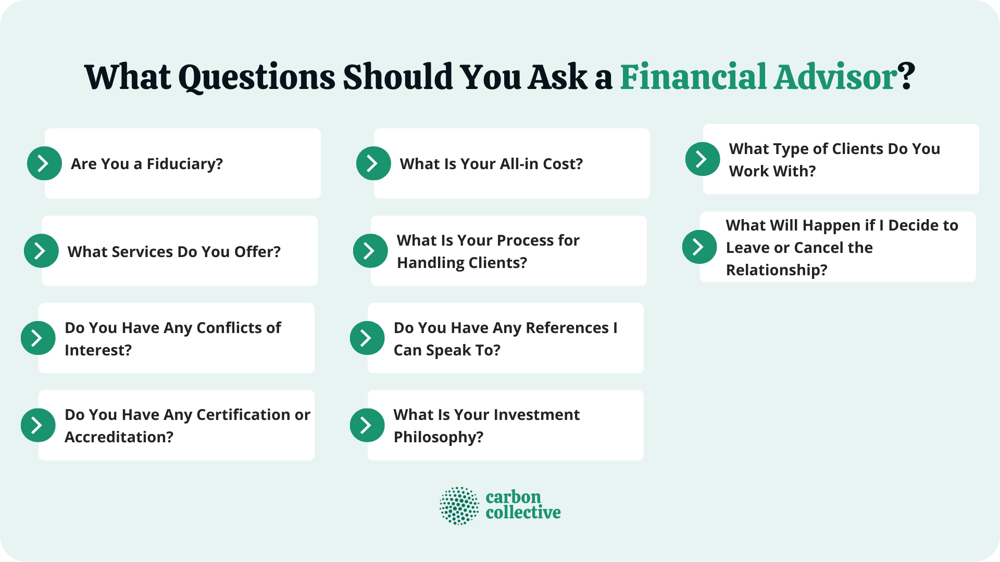

## Table of Contents

## What services do you offer as a financial advisor?

As a financial advisor, I help people manage their money better. I give advice on how to save, invest, and plan for the future. This includes helping you set up a budget, choosing the right investments, and planning for big life events like buying a house or retiring. My goal is to make your money work harder for you so you can reach your financial goals.

I also offer guidance on managing debt and improving your credit score. If you have loans or credit card debt, I can help you create a plan to pay them off faster. Additionally, I can explain different insurance options to protect you and your family. Whether it's life insurance, health insurance, or car insurance, I can help you choose what's best for your needs and budget.

Overall, my job is to be your partner in making smart financial decisions. I'm here to answer your questions, provide personalized advice, and support you in achieving financial stability and peace of mind.

## How do you charge for your services?

I charge for my services in a few different ways, depending on what you need. One way is by the hour. This means you pay me for the time we spend together, talking about your money and making plans. It's good if you just need some advice now and then. Another way is a flat fee. This is when you pay me one price for a specific job, like making a financial plan or helping you invest.

Sometimes, I also charge a percentage of the money I'm managing for you. This is called an assets under management fee. If you want me to handle your investments, I'll take a small part of the total amount as my fee. It's usually a good choice if you have a lot of money to invest and want ongoing help. Whichever way we choose, I'll make sure it's clear and fair for you.

## What is your investment philosophy?

My investment philosophy is all about keeping things simple and focusing on the long term. I believe in not trying to guess what the market will do next. Instead, I think it's better to build a mix of investments that can grow over time. This means picking a variety of stocks, bonds, and other investments that fit with your goals and how much risk you're okay with taking. By spreading your money across different types of investments, we can lower the risk and still have a chance to make good returns.

I also believe in being patient and sticking with the plan. The stock market can go up and down a lot in the short term, but over many years, it tends to grow. That's why it's important not to panic and sell when things look bad. Instead, we should keep investing regularly and let the power of time work in our favor. By doing this, we can build wealth slowly but surely, and reach your financial goals without taking big risks.

## Can you explain your approach to risk management?

My approach to risk management is about finding the right balance between growing your money and keeping it safe. I start by understanding how much risk you're comfortable with. Everyone is different, so I make sure to talk with you about what you can handle. Then, I spread your money across different types of investments. This is called diversification. By doing this, if one investment does badly, it won't hurt your whole plan too much because other investments might do well.

I also keep an eye on your investments all the time. The world changes, and so do the markets. If something big happens, I'll look at your plan again and make changes if we need to. But I don't make big changes just because the market goes up or down a little. I believe in sticking to the plan unless there's a good reason to change it. This way, we can manage risk without getting too worried about short-term ups and downs.

## How often will we meet to review my financial plan?

We will meet to review your financial plan at least once a year. This yearly meeting helps us check if you're on track to reach your goals and see if anything in your life has changed that might affect your plan. 

Sometimes, we might need to meet more often. If big things happen, like you getting a new job, buying a house, or having a baby, we might need to update your plan. In those cases, we can meet more often, maybe every three or six months, to make sure your plan still fits your life.

## What types of investments do you typically recommend?

I usually recommend a mix of different investments to help your money grow while keeping it safe. This mix often includes stocks, which are pieces of companies that can go up in value over time. I also suggest bonds, which are like loans you give to companies or governments that they pay back with interest. And I might include things like mutual funds or ETFs, which are baskets of different investments that help spread out your risk.

Another type of investment I often talk about is real estate. This can mean buying property to rent out or investing in real estate investment trusts (REITs), which let you invest in property without actually buying a building. I also look at other options like savings accounts or certificates of deposit (CDs) for money you might need soon or want to keep very safe. The key is to pick investments that match your goals and how much risk you're okay with taking.

## How do you tailor your advice to individual client needs?

I start by getting to know you and your life. We talk about what you want to achieve with your money, like saving for a house, paying for your kids' school, or retiring comfortably. I also find out how much risk you're okay with taking. Some people like to play it safe, while others are fine with more ups and downs if it means a chance for bigger gains. By understanding these things, I can make a plan that's just right for you.

Once I know your goals and risk level, I look at all parts of your money situation. This includes how much you earn, what you spend, any debts you have, and what you already own. Then, I suggest ways to save more, invest wisely, and protect what you have with insurance. I keep checking in with you to make sure the plan still fits your life as things change. This way, the advice I give is always tailored to your unique needs and helps you move towards your financial goals.

## Can you provide references from other clients?

I have worked with many clients who have been happy with the help I gave them. One client, Sarah, said she was really glad I helped her save for her first home. She liked that I listened to her and made a plan that was just right for her. Another client, Mike, told me he felt more sure about his money after I helped him with his investments. He said he was happy with how I explained things in a way that was easy to understand.

Another client, Lisa, was thankful for the advice I gave her about paying off her student loans. She said it made a big difference to have a clear plan and someone to talk to about her money. All these clients said they felt more in control of their finances because of the personalized advice I gave them. They appreciated how I took the time to understand their needs and help them reach their goals.

## What is your experience with tax planning and optimization?

I have a lot of experience helping people with their taxes. I know how to look at your money situation and find ways to pay less in taxes. This can mean using special accounts like IRAs or 401(k)s to save for retirement, or finding deductions and credits you might not know about. I work with you to make sure you're taking advantage of all the tax breaks you can.

I also help you plan for the future so you can keep your taxes low over time. This might mean thinking about how to take money out of your investments in a smart way, or planning for big life changes like selling a house or starting a business. By looking at the big picture, I can help you make choices that save you money on taxes now and later.

## How do you stay updated with the latest financial regulations and market trends?

I stay updated with the latest financial regulations and market trends by reading a lot. I look at news websites, financial magazines, and reports from government agencies every day. This helps me know about new laws or changes in the rules that might affect your money. I also read books and articles written by experts in finance to learn more about what's happening in the world of money.

I also go to meetings and conferences where people talk about the latest in finance. These events are good because I can learn from other financial advisors and hear from people who make the rules. Plus, I use special computer programs and tools that give me up-to-date information on how the stock market and other investments are doing. By doing all these things, I can give you the best advice based on what's happening right now.

## What strategies do you use for retirement planning?

When I help people plan for retirement, I start by figuring out how much money they'll need. We talk about what they want their life to be like when they're not working anymore. Do they want to travel a lot? Will they have a big house or a small one? Once we know this, we can guess how much money they'll need each year. Then, I help them save and invest enough now so they can have that money later. This often means putting money into special accounts like 401(k)s or IRAs, which can help them save on taxes and let their money grow over time.

I also think about when they should start taking money out of their retirement accounts. The right time can make a big difference in how long their money will last. We look at things like Social Security and how to get the most out of it. Plus, I help them think about what might happen if they live longer than they expect. By planning for different possibilities, we can make sure they have enough money no matter what. My goal is to help them feel secure and ready for a happy retirement.

## How do you handle conflicts of interest in your recommendations?

I always put my clients first. If there's a chance that a suggestion I make could help me more than it helps you, I'll tell you about it. That way, you can decide if you want to go with that suggestion or not. It's important to me that you trust me and feel good about the choices we make together.

I work hard to keep things fair. Sometimes, I might get paid a little bit more if you choose one investment over another. But I won't recommend something just because it makes me more money. Instead, I'll look at all the options and pick the one that's best for your goals and how much risk you want to take. By being honest and clear about any conflicts, I can help you make the best decisions for your money.

## What is the Rise of Robo-Advisors and Automated Investing?

Robo-advisors represent a transformative development in the field of investment management by employing sophisticated algorithms to deliver customized financial recommendations. These digital platforms offer an accessible entry point for cost-sensitive investors who prefer low maintenance, passive investment strategies. By minimizing human intervention, robo-advisors can significantly reduce costs, making investment services available to a broader audience.

The automation provided by robo-advisors allows for a high degree of efficiency. Algorithms can quickly analyze vast amounts of data to allocate assets based on predefined criteria or investor preferences. This operates within the parameters of modern portfolio theory, which aims to create an optimal mix of investments to achieve a desired return for a given level of risk, as articulated by Harry Markowitz. The basic utility function here is not unlike: 

$$
U = E(R) - \frac{1}{2} \times A \times \sigma^2
$$

where $U$ is the utility of the portfolio, $E(R)$ is the expected return, $A$ is the risk aversion level of the investor, and $\sigma^2$ is the variance of the portfolio's return.

Despite the benefits of automation, robo-advisors may fall short when dealing with complex financial situations that benefit from human intuition and nuanced understanding. Personalized advice considering specific tax implications, estate planning, or significant life changes often requires the human touch. Thus, the role of human advisors remains vital as they offer personalized insight and nuanced decision-making that algorithms may not yet replicate.

Balancing automated tools with human advisors can provide a comprehensive approach to investment management. A hybrid model may integrate the efficiency of algorithmic processing with the nuanced understanding of a human advisor, potentially offering the best of both worlds. This hybrid strategy allows investors to benefit from the low costs and automated simplicity of robo-advisors while having the option to consult human advisors for personalized, complex decision-making.

It is crucial for individuals to evaluate whether a hybrid approach aligns with their financial goals and personal preferences. Investors should consider the complexity of their financial situation, the level of interaction they prefer, and the types of services they require. By understanding the strengths and limitations of both robo-advisors and human financial advisors, investors can craft a strategy that leverages the benefits of technology while ensuring their unique financial needs are met.

## References & Further Reading

[1]: Bergstra, J., Bardenet, R., Bengio, Y., & Kégl, B. (2011). ["Algorithms for Hyper-Parameter Optimization."](https://proceedings.neurips.cc/paper/2011/file/86e8f7ab32cfd12577bc2619bc635690-Paper.pdf) Advances in Neural Information Processing Systems 24.

[2]: ["Advances in Financial Machine Learning"](https://www.wiley.com/en-gb/Advances+in+Financial+Machine+Learning-p-9781119482109) by Marcos Lopez de Prado

[3]: ["Evidence-Based Technical Analysis: Applying the Scientific Method and Statistical Inference to Trading Signals"](https://www.amazon.com/Evidence-Based-Technical-Analysis-Scientific-Statistical/dp/0470008741) by David Aronson

[4]: ["Machine Learning for Algorithmic Trading"](https://github.com/PacktPublishing/Machine-Learning-for-Algorithmic-Trading-Second-Edition) by Stefan Jansen

[5]: ["Quantitative Trading: How to Build Your Own Algorithmic Trading Business"](https://books.google.com/books/about/Quantitative_Trading.html?id=j70yEAAAQBAJ) by Ernest P. Chan