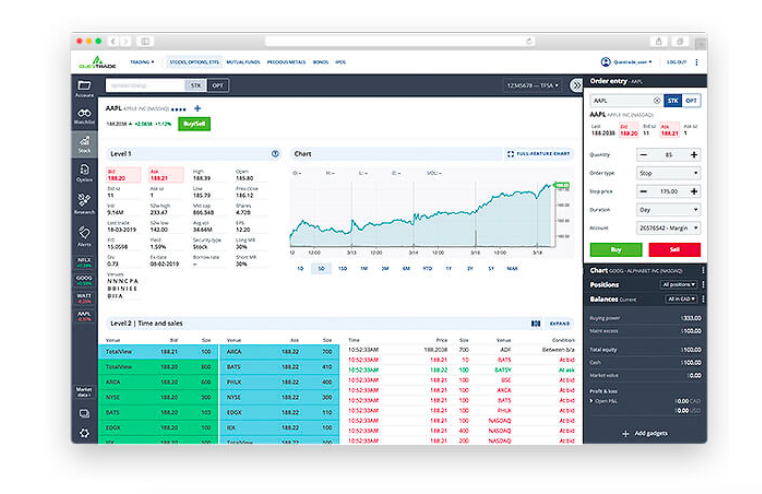

Questrade is a distinguished Canadian brokerage firm known for its comprehensive array of investment options. Founded in 1999, it offers a viable alternative to traditional banking institutions for Canadian residents, providing a competitive edge with its varied financial services. This review seeks to elucidate the facets of Questrade's platforms, trading technology, cost structure, and service offerings, with a particular emphasis on its algorithmic trading capabilities. The firm's user-friendly platforms, coupled with advanced trading tools, cater to both novice and experienced traders who value technology-driven investment strategies.

Questrade's focus on innovation has solidified its reputation as a top choice among Canadian brokerage firms. It provides an accessible gateway to a wide range of assets, including stocks, options, ETFs, mutual funds, and more. Questrade's commitment to competitive pricing and outstanding customer service has contributed to its growth and success over the past decades. Whether one is beginning their investment journey or is an experienced trader seeking sophisticated trading solutions, Questrade offers significant benefits, especially in the domain of algorithmic trading.



## Table of Contents

## Platform Features and Usability

Questrade offers two main trading platforms designed to meet the diverse needs of investors: Questrade Trading and IQ Edge. Both platforms are well-regarded for their user-friendly interfaces, providing seamless experiences for both novice and advanced traders. These platforms are part of Questrade’s commitment to offering robust and adaptable options for those seeking versatility in their trading strategies.

**Questrade Trading Platform**

Questrade Trading serves as the primary platform, particularly appealing to beginners and everyday traders. Its interface is straightforward, featuring intuitive navigation and essential tools that make the trading process efficient. Highlights of the Questrade Trading platform include customizable layouts that allow users to personalize their trading workspace, an important feature for those who prioritize quick access to specific functions. 

Moreover, the platform supports multiple order types, which is crucial for traders who use algorithmic strategies that may require complex instructions. These include market orders, limit orders, stop orders, trailing stops, and conditional orders, each providing different ways to manage risk and maximize returns. Accessibility via mobile app ensures that users can monitor and engage with the market on-the-go, which is especially advantageous for algorithmic trading, where time-sensitive decisions are often essential.

**IQ Edge Platform**

On the other hand, IQ Edge is designed for more advanced traders, offering a more comprehensive suite of tools and features. The platform is fully customizable, allowing users to tailor their trading environment to suit complex or high-frequency trading needs. This includes features such as advanced charting options, technical analysis tools, and expanded market data. 

IQ Edge is particularly beneficial for algorithmic traders because it supports enhanced data feeds and faster execution speeds, which are vital for implementing and managing automated trading strategies. The platform’s capability to support complex options strategies is another key feature, providing traders with the flexibility required for sophisticated trading models.

**Algorithmic Trading Capabilities**

In terms of [algorithmic trading](/wiki/algorithmic-trading), both Questrade Trading and IQ Edge provide support, though IQ Edge offers a more robust setup due to its advanced features. Traders can develop algorithms that execute predetermined trading strategies based on market conditions by utilizing the platforms' market data integration and order execution capabilities.

While both platforms offer fulfilling trading experiences, the choice between Questrade Trading and IQ Edge should be based on the trader's level of expertise and specific needs, especially those related to algorithmic trading. The variety of order types, customizable interfaces, and mobile access serve as foundational tools that benefit any trading strategy, while the advanced functionalities of IQ Edge empower traders to execute more sophisticated and automated approaches.

## Range of Investment Offerings

Questrade offers a comprehensive range of investment options that cater to diverse trading strategies and preferences. Central to its offerings are traditional asset classes such as stocks, options, exchange-traded funds (ETFs), and mutual funds, providing a solid foundation for a variety of investment strategies.

In addition to traditional assets, Questrade also provides access to advanced trading instruments, including foreign exchange ([forex](/wiki/forex-system)) and contracts for difference (CFDs), which are particularly attractive to those employing algorithmic trading strategies. Forex trading allows investors to exploit shifts in currency exchange rates, adding a layer of diversification and the possibility of enhanced returns to an investment portfolio. CFDs, on the other hand, offer the ability to trade on margin and bet on both rising and falling markets, making them suitable for sophisticated traders looking to leverage their trading strategies. However, the use of forex and CFDs involves substantial risk, requiring adequate risk management protocols to prevent significant losses.

Questrade extends its investment offerings to include international equities, thus broadening the geographical exposure of a trader's portfolio. This feature enables clients to invest in global markets beyond North America, potentially capturing opportunities present in emerging and developed markets worldwide. Accessing international equities can serve as a hedge against localized market [volatility](/wiki/volatility-trading-strategies), fostering portfolio stability through diversification.

Additionally, Questrade provides opportunities for investors to participate in initial public offerings (IPOs), allowing early access to companies entering public trading. This feature can be particularly beneficial for investors seeking to capitalize on the growth potential of newly-public enterprises.

By including these diverse asset classes and instruments, Questrade not only meets the needs of traditional investors but also appeals to tech-savvy individuals interested in leveraging advanced trading strategies. This robust offering reinforces Questrade's position as a versatile platform capable of supporting a wide array of investment approaches.

## Algo Trading with Questrade

Questrade has developed a robust ecosystem that supports algorithmic trading and automated investing, catering to the needs of both novice and expert traders. Algorithmic trading, which involves the use of computer programs to execute trading strategies automatically based on predefined criteria, is facilitated by Questrade through its API offerings and platform capabilities.

### Tools and Features Supporting Algo Trading

Questrade provides access to its Application Programming Interface (API), allowing traders to design and execute automated trading strategies. The API enables users to integrate their custom algorithms with Questrade's trading systems, providing real-time market data and trading execution capabilities.

#### API Features
The API supports various operations essential for algo trading:
- **Market Data Access**: Retrieve real-time quotes, historical data, and market status.
- **Account Management**: Access account information, balances, and positions.
- **Order Management**: Submit, modify, and cancel orders programmatically, essential for executing high-frequency strategies.

An example of using Python to interact with Questrade's API is illustrated below:

```python
import requests

# Define the base URL for Questrade API
base_url = "https://api.questrade.com"

def get_access_token(refresh_token):
    response = requests.post(f"{base_url}/oauth2/token", data={
        'grant_type': 'refresh_token',
        'refresh_token': refresh_token
    })
    return response.json()

access_token_info = get_access_token("your_refresh_token_here")
```

### Benefits of Using Questrade for Algo Trading

1. **Cost-Effectiveness**: Questrade offers competitive commission rates, particularly for frequent traders, which is advantageous for algorithmic traders whose strategies often rely on high trade volumes to generate profits.

2. **Flexibility**: Users can develop and backtest their own custom algorithms, providing an opportunity to tailor strategies to specific market conditions or personal investment goals.

3. **Comprehensive Data Access**: The ability to access extensive market data is crucial for developing algorithms that can react swiftly to market changes.

### Limitations Relative to Other Platforms

While Questrade provides substantial support for algo trading, there are certain limitations compared to some other international platforms:

- **Unique API Limitations**: Some users may find the API documentation less comprehensive than other platforms known for their advanced tech support and developer community.

- **Latency Concerns**: For traders engaging in ultra-high frequency trading (UHFT), the latency in trading execution may be a concern, as Questrade's infrastructure might not match those of more specialized trading platforms.

Despite these limitations, Questrade remains a strong contender for those considering algorithmic trading in Canada, owing to its combination of powerful tools, economic efficiency, and a commitment to integrating technology into trading solutions.

## Commissions and Fees

Questrade maintains a transparent fee structure that appeals to a wide array of investors, especially those engaging in stocks, ETFs, and options trading. For stock and [ETF](/wiki/etf-trading-strategies) trades, Questrade charges a basic commission of $4.95 to $9.95 per trade, which is competitive considering the Canadian brokerage landscape. Notably, ETF purchases are commission-free, which can be beneficial for cost-conscious investors seeking to build or balance their portfolios without incurring additional fees.

Options trading fees at Questrade are structured with a base fee of $9.95 plus $1 per contract. This pricing model can be advantageous for traders executing fewer option contracts per transaction, although heavy options traders might find the per-contract charge adds up quickly, affecting their overall trading costs.

For algorithmic and high-frequency traders, data fees are a critical consideration. Questrade offers various market data packages, which can influence the overall cost structure for algorithmic traders burning through a vast amount of market data. While basic real-time data is accessible, more advanced and comprehensive data packages come at an additional cost, starting from $19.95 monthly for Canadian data and up to $89.95 monthly for U.S. data, depending on the depth and scope of data required. These costs may diminish the competitive edge for high-frequency traders reliant on low-latency data for rapid execution.

In comparison to other Canadian brokers, Questrade's pricing remains attractive, especially for active traders and those utilizing algorithmic strategies. Brokerages like TD Direct Investing and RBC Direct Investing often have higher standard commission rates without the benefit of commission-free ETF purchases, positioning Questrade as a more cost-effective option for Canadian investors.

Nonetheless, traders need to weigh the impact of additional charges, such as data fees, and assess their trading frequency and strategy to determine the most cost-efficient broker for their specific needs. A careful analysis might reveal that while Questrade's base fees are competitive, the additional costs for data access and specific trade types could sway the overall cost-benefit balance. Thus, investors should align their trading needs with Questrade's fee structure to optimize their investment returns effectively.

## Research and Educational Resources

Questrade provides a variety of research and educational resources designed to empower traders in making informed investment decisions. The brokerage offers a comprehensive suite of research tools, which include real-time data feeds, advanced charting capabilities, and market analysis reports. These resources are essential for traders looking to assess market trends, evaluate specific securities, and optimize their trading strategies.

For traders interested in algorithmic trading, Questrade supports learning through various educational materials and tools. It provides access to a range of tutorials and webinars that demystify the concepts of algorithmic trading, from the basics of how algorithms work to the intricacies of developing and testing trading algorithms. The educational content is crafted to cater to both beginners and experienced traders, ensuring a foundational understanding of algorithmic frameworks and their application in real-world scenarios.

Questrade's educational platform also includes instructional videos and articles that highlight algorithmic trading strategies, software development kits (SDKs), and the use of APIs for automated trading. These resources are integral to helping traders develop their own trading algorithms using programming languages such as Python. The platform often collaborates with industry experts to provide insights into effective algorithmic trading practices and emerging trends in fintech.

The brokerage goes further by offering insights and courses on risk management, an essential aspect of algorithmic trading. These resources teach traders how to better control their exposure to market volatilities and enhance the robustness of their algorithmic strategies.

Overall, Questrade's research and educational offerings provide a robust foundation for traders aiming to leverage algorithmic trading. By equipping traders with the tools and knowledge necessary to develop, test, and deploy trading algorithms effectively, Questrade remains a valuable ally for tech-savvy investors pursuing automated investment strategies.

## Customer Support and Security

Questrade's customer support is a critical component of its service offerings, designed to assist traders from all experience levels, including those utilizing sophisticated algorithmic trading strategies. The brokerage provides several channels for customer support, including phone, email, and live chat. These channels are available during standard trading hours, ensuring traders can receive timely assistance when dealing with account-related issues or technical support for trading platforms.

The quality of Questrade's customer service is generally regarded as efficient, with knowledgeable representatives equipped to handle a variety of inquiries. Customers highlight the responsiveness and helpfulness of the support staff, which contributes to a positive user experience. While live chat and email offer convenience for less urgent queries, the phone support is particularly beneficial for addressing immediate concerns, such as technical glitches or urgent account inquiries.

Security is a forefront priority for Questrade, ensuring the protection of client data and financial assets through robust security measures. The brokerage employs encryption protocols to safeguard sensitive information during transactions and data transmission. Additionally, Questrade implements two-[factor](/wiki/factor-investing) authentication (2FA), adding an extra layer of security by requiring users to verify their identity using a secondary device or authentication app. This security feature is crucial for preventing unauthorized access to trading accounts, thus protecting investors from potential cyber threats.

For clients engaged in algorithmic trading, Questrade provides specific considerations to enhance security and support. Algorithmic traders often require access to real-time data feeds and API (Application Programming Interface) integration for their trading systems. Questrade offers robust API access, allowing traders to connect their algorithms directly to market data and execute trades automatically. However, traders need to ensure these connections are secure and adhere to best practices in software development and cybersecurity to mitigate risks associated with automated trading.

Questrade's infrastructure is designed to handle the demands of algorithmic trading by providing reliable and stable platform performance. This includes continuous monitoring and maintenance of server uptime to minimize disruptions during trading hours. By combining comprehensive customer support with strong security protocols, Questrade aims to provide a safe and efficient environment for all traders, particularly those employing algorithmic strategies.

## Conclusion

Questrade establishes itself as a significant player in the Canadian brokerage market, particularly appealing to tech-savvy investors seeking advanced and user-friendly trading solutions. Its comprehensive platform offerings cater to both traditional and modern investment strategies, with specific strengths in facilitating algorithmic trading. The dual platforms, Questrade Trading and IQ Edge, ensure traders have access to sophisticated tools capable of supporting various trading techniques, including automated functionalities, essential for executing algorithmic strategies effectively.

A critical reflection on Questrade's services reveals a competitive edge owing to its transparent fee structure and access to a diverse range of assets, accommodating the unique needs of algorithmic traders. The inclusion of advanced financial instruments and the ability to integrate third-party tools make Questrade an attractive option for users who prioritize technical trading capabilities and require platforms that support complex algorithms and high-frequency strategies.

Furthermore, Questrade demonstrates a firm commitment to education and research, equipping traders with substantial resources to nurture their understanding and application of algorithmic trading. This educational support aligns well with the needs of both novice and advancing investors eager to explore algorithmic and automated strategies.

In terms of security and customer support, Questrade implements robust measures to safeguard user data and assets, reassuring those engaged in high-tech trading methods. The comprehensive service from Questrade positions it as a leading broker in Canada, ensuring it meets the diverse requirements of investors seeking both traditional investment methods and cutting-edge trading solutions. The balance of competitive pricing, advanced technology, and educational initiatives confirms its stature as a leading choice for investors looking to explore the full potential of algorithmic trading within the Canadian financial landscape.

## References & Further Reading

[1]: Bergstra, J., Bardenet, R., Bengio, Y., & Kégl, B. (2011). ["Algorithms for Hyper-Parameter Optimization."](https://dl.acm.org/doi/10.5555/2986459.2986743) Advances in Neural Information Processing Systems 24.

[2]: ["Advances in Financial Machine Learning"](https://www.amazon.com/Advances-Financial-Machine-Learning-Marcos/dp/1119482089) by Marcos Lopez de Prado

[3]: ["Evidence-Based Technical Analysis: Applying the Scientific Method and Statistical Inference to Trading Signals"](https://www.amazon.com/Evidence-Based-Technical-Analysis-Scientific-Statistical/dp/0470008741) by David Aronson

[4]: ["Machine Learning for Algorithmic Trading"](https://github.com/stefan-jansen/machine-learning-for-trading) by Stefan Jansen

[5]: ["Quantitative Trading: How to Build Your Own Algorithmic Trading Business"](https://www.amazon.com/Quantitative-Trading-Build-Algorithmic-Business/dp/1119800064) by Ernest P. Chan