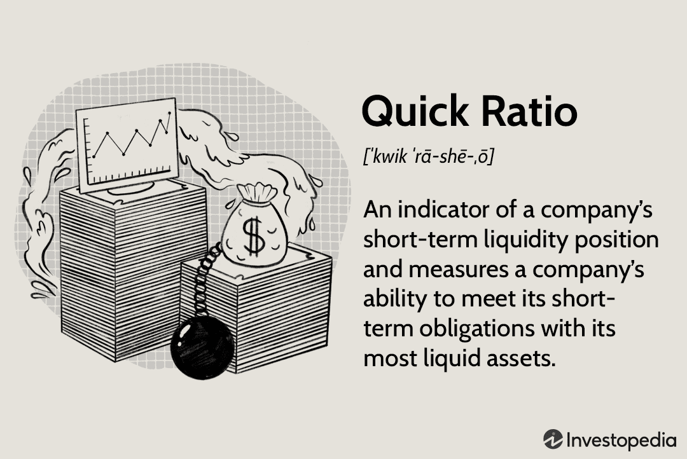

Liquidity ratios are fundamental tools in financial analysis, offering critical insights into a company's capacity to meet its short-term obligations. Among these ratios, the quick ratio stands out as it measures a company's ability to utilize its liquid assets to cover its current liabilities. Unlike the current ratio, the quick ratio provides a more stringent assessment by excluding inventory from its calculation, focusing on assets that can be quickly converted to cash. This approach offers a more accurate gauge of a firm's financial health and immediate liquidity.

The quick ratio is particularly vital for businesses and investors who need a clear indication of a company's short-term financial standing. A robust quick ratio signals strong liquidity and can reflect a company’s ability to manage unforeseen financial challenges. However, a low quick ratio may raise red flags about a firm's financial stability and potential difficulty in meeting its short-term debts.



In financial analysis, the quick ratio serves as a valuable metric not only for investors but also for lenders assessing credit risk and businesses evaluating their liquidity management strategies. Moreover, its role extends to algo trading, where algorithms can be designed to make investment decisions based on liquidity risk as indicated by the quick ratio. This integration into algorithmic strategies helps in identifying high-risk investments and refining decision-making processes.

This article explores the significance of the quick ratio, examining its calculation and application in financial analysis, with specific attention to its implications for algo trading. Through understanding the quick ratio, stakeholders can gain a comprehensive view of an organization's liquidity position, enhancing decision-making and risk management practices.

## Table of Contents

## Understanding the Quick Ratio

The quick ratio, commonly referred to as the acid-test ratio, evaluates a company's immediate liquidity by considering only the most liquid assets. Unlike other liquidity ratios, the quick ratio excludes inventory from its calculation. This exclusion is significant because inventory might not be easily converted into cash within a short period, especially during times of financial distress. Consequently, the quick ratio offers a more stringent perspective on a firm's capability to settle short-term liabilities swiftly.

The quick ratio is calculated using the following formula:

$$
\text{Quick Ratio} = \frac{\text{Cash} + \text{Cash Equivalents} + \text{Marketable Securities} + \text{Accounts Receivable}}{\text{Current Liabilities}}
$$

This formula highlights the focus on assets that can be quickly liquidated, providing a conservative view of [liquidity](/wiki/liquidity-risk-premium) by emphasizing cash and near-cash assets.

In practice, what constitutes an "ideal" quick ratio can vary significantly across different industries. However, a quick ratio greater than 1 is generally perceived as an indicator of strong liquidity. This implies that the company has more than enough liquid assets to cover its current liabilities. In industries where rapid inventory turnover is standard, such as retail, firms might operate effectively with a lower quick ratio compared to industries that do not rely heavily on inventory sales for cash flow.

Overall, the quick ratio is a valuable tool for stakeholders to assess a firm's financial health, especially during periods of uncertainty or economic fluctuations, by providing a cautious measure of the company's ability to meet its short-term obligations without relying on the sale of inventory.

## Components of the Quick Ratio

Quick assets are integral to calculating the quick ratio, providing a measure of a company's ability to immediately address its current liabilities. These assets include cash and cash equivalents, marketable securities, and net accounts receivable. Cash and cash equivalents are the most liquid, comprising currency, bank balances, and short-term, highly liquid investments that are readily convertible to known amounts of cash and subject to an insignificant risk of changes in value. Marketable securities are financial instruments that can be quickly sold in public markets with minimal loss of value, such as stocks and bonds. Net accounts receivable represent money owed to a company for goods or services delivered and invoiced but yet to be paid by customers, factoring in any allowances for doubtful accounts.

Current liabilities, on the other hand, encompass all debts and obligations due within one year. These typically include accounts payable, short-term debt, and other short-term obligations. This aspect of the equation highlights the imminent financial responsibilities a firm must meet using its liquid resources. 

The quick ratio specifically targets the most fluid assets, conspicuously excluding inventory. Inventory, while a current asset, is often slower to liquidate into cash due to its reliance on sales processes and market demand. Quick ratio's exclusion of inventory thus ensures a stringent assessment of immediate liquidity, focusing only on assets that can be quickly converted to cash to manage short-term liabilities. This conservative measure provides a clearer picture of a firm's financial agility, offering assurances to creditors and investors about its capability to face immediate financial demands.

## Calculating the Quick Ratio

Calculating the quick ratio is straightforward, involving the identification and summation of a company's most liquid assets, divided by its current liabilities. The quick ratio can be expressed mathematically as follows:

$$
\text{Quick Ratio} = \frac{\text{Cash} + \text{Cash Equivalents} + \text{Marketable Securities} + \text{Accounts Receivable}}{\text{Current Liabilities}}
$$

Alternatively, the quick ratio can be computed using the following formula:

$$
\text{Quick Ratio} = \frac{\text{Current Assets} - \text{Inventory} - \text{Prepaid Expenses}}{\text{Current Liabilities}}
$$

The alternative formula reflects the same underlying principle by adjusting current assets to exclude inventory and prepaid expenses, which tend to be less liquid compared to cash and cash equivalents. 

In practice, calculating an accurate quick ratio demands a meticulous approach to ensure precise accounting of both liquid assets and liabilities. Accountants typically categorize cash equivalents as assets that can be readily converted into cash with insignificant risk of changes in value. Familiar examples include Treasury bills and commercial paper. Marketable securities consist of financial instruments that can be quickly sold in the market at a fair price, such as stocks and bonds.

One must be attentive to the nature and timing of accounts receivable. While they represent promised payments, the actual realization into cash hinges on customers' financial health and payment practices, which can occasionally extend beyond the expected period.

For those interested in employing programming for financial analysis, here's a simple Python script that demonstrates how to compute the quick ratio:

```python
def calculate_quick_ratio(cash, cash_equivalents, marketable_securities, accounts_receivable, current_liabilities):
    quick_assets = cash + cash_equivalents + marketable_securities + accounts_receivable
    if current_liabilities == 0:
        return "Current Liabilities cannot be zero."
    return quick_assets / current_liabilities

# Example usage
cash = 50000
cash_equivalents = 30000
marketable_securities = 20000
accounts_receivable = 40000
current_liabilities = 80000

quick_ratio = calculate_quick_ratio(cash, cash_equivalents, marketable_securities, accounts_receivable, current_liabilities)
print(f"The Quick Ratio is: {quick_ratio}")
```

Accurate input data is critical to achieving meaningful results. Discrepancies in the valuation of liquid assets or current liabilities can skew the quick ratio, leading analysts to draw incorrect conclusions about a company’s liquidity position.

## Quick Ratio vs. Current Ratio

The quick ratio and the current ratio are both important metrics used to evaluate a company's liquidity, but they differ significantly in their approach to assessing financial stability. Both ratios provide insights into a company's capacity to cover its short-term obligations, yet the quick ratio is often seen as the more stringent of the two.

The quick ratio, known for its conservative nature, excludes inventory from its calculations. This approach is based on the assumption that inventory may not be quickly and easily converted into cash, especially in times of financial distress. The formula for the quick ratio is as follows:

$$
\text{Quick Ratio} = \frac{\text{Cash} + \text{Cash Equivalents} + \text{Marketable Securities} + \text{Accounts Receivable}}{\text{Current Liabilities}}
$$

This formula focuses exclusively on the most liquid assets, those that can rapidly be turned into cash to meet immediate liabilities.

In contrast, the current ratio provides a more comprehensive view by including all current assets. These assets encompass cash, cash equivalents, marketable securities, accounts receivable, and inventory. The formula for the current ratio is:

$$
\text{Current Ratio} = \frac{\text{Current Assets}}{\text{Current Liabilities}}
$$

By including inventory and other current assets, the current ratio paints a wider picture of a company's liquidity. However, it may not accurately reflect a company's immediate capability to cover short-term debts under sudden financial constraints, since some current assets may not be rapidly liquidated.

In summary, while the quick ratio offers a conservative assessment focusing on immediate liquidity by excluding inventory, the current ratio provides a broader overview by considering all current assets. Each ratio has its place in financial analysis, with the quick ratio being particularly valuable when there is a need to assess the most immediate liquidity situation.

## Importance of Quick Ratio in Financial Analysis

The quick ratio is a pivotal financial metric for investors and lenders as it reflects a company's capability to address its short-term liabilities using readily available liquid assets. This ratio serves as a conservative measure, as it excludes inventory and other less liquid assets from its calculation, thereby offering a sharper focus on the company's immediate financial health. 

A high quick ratio, often greater than 1, is typically seen as an indicator of strong financial health. It suggests that the company can comfortably meet its short-term obligations without needing to sell inventory or secure additional financing. This is particularly advantageous in unforeseen financial situations, where access to liquid capital is crucial.

For a comprehensive analysis, however, the quick ratio should not be evaluated in isolation. It is most effective when considered alongside other financial indicators such as the current ratio, debt-to-equity ratio, and cash conversion cycle. By analyzing these collectively, investors and lenders can gain a well-rounded understanding of a company's financial stability and operational efficiency. The quick ratio remains a vital tool in financial analysis, providing early warnings of potential liquidity issues which may affect the firm’s overall financial strategy.

## Incorporating Quick Ratio in Algo Trading

In [algorithmic trading](/wiki/algorithmic-trading), the integration of financial ratios is crucial for assessing a company's financial health and making informed trading decisions. Among these, the quick ratio offers valuable insights into liquidity risk—a key indicator of a firm's ability to meet its short-term obligations without needing to sell inventory. By evaluating this ratio, traders can gauge how financially stable a company is under immediate pressure.

Algorithms in trading systems can be fine-tuned to incorporate the quick ratio as part of their decision-making criteria. For instance, an algorithm can be programmed to automatically identify and flag stocks of companies with quick ratios below a predetermined threshold. Such stocks may be considered high-risk investments due to potential liquidity challenges. To implement this in a trading algorithm, one could use a condition where a company's quick ratio is evaluated and decisions are made based on the result. Here's an example in Python:

```python
import pandas as pd

# Sample data structure
data = {
    'company': ['Company A', 'Company B', 'Company C'],
    'cash': [100000, 150000, 120000],
    'cash_equivalents': [20000, 18000, 16000],
    'marketable_securities': [30000, 25000, 28000],
    'accounts_receivable': [50000, 40000, 45000],
    'current_liabilities': [120000, 100000, 130000]
}

df = pd.DataFrame(data)

# Function to calculate quick ratio
def calculate_quick_ratio(cash, cash_equivalents, marketable_securities, accounts_receivable, current_liabilities):
    return (cash + cash_equivalents + marketable_securities + accounts_receivable) / current_liabilities

# Calculating quick ratios
df['quick_ratio'] = df.apply(lambda x: calculate_quick_ratio(x['cash'], x['cash_equivalents'], 
                                                            x['marketable_securities'], x['accounts_receivable'], 
                                                            x['current_liabilities']), axis=1)

# Set threshold for quick ratio
quick_ratio_threshold = 1.0

# Flagging high-risk stocks
df['high_risk'] = df['quick_ratio'] < quick_ratio_threshold

print(df[['company', 'quick_ratio', 'high_risk']])
```

This script calculates the quick ratio for each company in the dataset and identifies those with a quick ratio below 1.0 as high-risk. Algorithmic strategies can further incorporate these evaluations into broader trading systems, potentially avoiding or shorting stocks that pose higher liquidity risks, which might indicate financial instability during periods of market stress. However, while useful, a single ratio should not be solely relied upon; it is most effective when used alongside a suite of financial metrics to ensure comprehensive risk assessment and strategic trading execution.

## Advantages and Limitations of the Quick Ratio

The quick ratio offers several advantages as a measure of a company's liquidity. One of its primary strengths is its conservative approach; by excluding inventory from current assets, the quick ratio provides a stringent measure of how effectively a company can meet its short-term liabilities using only its most liquid assets. This characteristic makes it particularly useful for assessing a firm's capacity to handle unexpected financial difficulties without resorting to the sale of inventory, which may not be readily convertible to cash.

Moreover, the quick ratio is straightforward to calculate. The formula is:

$$
\text{Quick Ratio} = \frac{\text{Cash} + \text{Cash Equivalents} + \text{Marketable Securities} + \text{Accounts Receivable}}{\text{Current Liabilities}}
$$

This ease of calculation allows it to be a practical tool for quick assessments, aiding in short-term financial health evaluations. For instance, having a quick ratio greater than 1 generally suggests that the company possesses enough liquid assets to cover its immediate liabilities, mitigating liquidity risk for investors and creditors.

However, despite these advantages, the quick ratio has its limitations. One of its drawbacks is that it does not account for the timing of cash flows. This omission can be problematic as it overlooks the specific periods when liabilities are due and when liquid assets can be converted to cash. As such, a company might appear to have adequate liquidity according to the quick ratio, yet face cash flow issues due to poor timing between asset realizations and liability settlements.

Additionally, the quick ratio can potentially overstate a firm's liquidity if accounts receivable are not easily collectible. In practice, some receivables may be delayed, disputed, or uncollectible, which the ratio might not capture accurately. Therefore, while the quick ratio provides valuable insights, it is essential to assess the quality and collectibility of the accounts receivable to ensure an accurate understanding of a company's liquidity status. To address these challenges, financial analysts might complement the quick ratio with other metrics and tools in their comprehensive liquidity assessment.

## Conclusion

The quick ratio is a pivotal tool in financial analysis, providing insights into a company's immediate capacity to meet short-term obligations using its most liquid assets. This metric focuses on readily convertible assets, excluding inventory and prepaid expenses, to offer a conservative measure of liquidity. Despite its importance, the quick ratio should not be examined in isolation. A comprehensive analysis requires integrating it with other financial ratios such as the current ratio, debt-to-equity ratio, and cash conversion cycle, ensuring a more holistic view of the company's financial health.

For algorithmic traders, the quick ratio can significantly enhance trading strategies and risk management. By embedding the quick ratio within trading algorithms, traders can systematically identify and flag stocks with potentially high liquidity risk. Utilizing Python, for instance, traders can develop scripts that automatically screen for companies with quick ratios below a specified threshold, thus aiding in making informed investment decisions based on liquidity risks. 

In conclusion, while the quick ratio is indispensable for assessing immediate liquidity, it should be complemented with other financial metrics for an encompassing financial analysis. Understanding the significance and application of the quick ratio is crucial for financial analysts and algorithmic traders aiming to optimize their decision-making processes.

## References & Further Reading

[1]: ["Financial Ratio Analysis: A Guide to Useful Ratios"](https://studylib.net/doc/8215979/financial-ratio-analysis) from the Chartered Financial Analyst (CFA) Institute

[2]: ["Essentials of Financial Analysis"](https://www.amazon.com/Essentials-Financial-Analysis-Samuel-Weaver/dp/007176836X) by George Troughton

[3]: ["Liquidity Risk and Asset Pricing"](https://pages.stern.nyu.edu/~lpederse/papers/LiquidityAssetPricing.pdf) by Yakov Amihud, Haim Mendelson, and Lasse Heje Pedersen

[4]: ["Algorithmic Trading and DMA: An Introduction to Direct Access Trading Strategies"](https://archive.org/details/algorithmictradi0000john) by Barry Johnson

[5]: ["Principles of Corporate Finance"](https://www.amazon.com/Principles-Corporate-Finance-Richard-Brealey/dp/0077404890) by Richard A. Brealey, Stewart C. Myers, and Franklin Allen