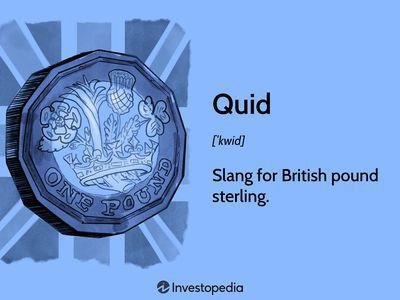

Slang plays a crucial role in the currency world, especially within the context of the British pound. Language is a powerful tool that reflects cultural identity, and currency slang embodies the everyday transactions and interactions that individuals have with money. Terms like "quid" are deeply embedded in British culture, often used to describe pounds informally and thereby influencing not just spoken language but also written and digital communication. This convergence of culture and finance becomes even more prominent in the context of modern financial systems and trading practices, where understanding such linguistic nuances can prove beneficial.

Currency slang, including terms like "quid," extends its influence to digital trading systems, where informal language often finds a place amidst sophisticated financial technology. Algorithmic trading, which refers to the use of computer algorithms to automate trading decisions in financial markets, can be impacted by the presence of these colloquial terms. While algorithmic trading relies heavily on data and analytics, a comprehensive understanding of market language, including slang, can provide a strategic edge. For instance, traders and automated systems alike may encounter communication containing regional slang, and being familiar with this jargon could facilitate more accurate market interpretations and decisions.



The British slang "quid," equivalent to one pound sterling, has found its way from everyday conversation into professional settings, highlighting its universal relevance. Its simplicity and widespread recognition make "quid" a term employed by a diverse group, ranging from local shopkeepers to financial traders. Thus, the term serves as a linguistic bridge, connecting informal transactions with formal financial strategies.

In conclusion, recognizing and understanding currency slang, particularly in the context of the British pound, is vital in a world where digital trading and algorithmic strategies are increasingly predominant. As language and finance continue to intersect, familiarity with terms like "quid" can enrich both personal and professional financial practices.

## Table of Contents

## Understanding the Quid: Slang for British Pound

The term "quid" is a widely recognized slang for the British pound, though its exact historical origins remain somewhat obscure. One theory suggests that "quid" derived from the Latin phrase "quid pro quo," which means "something for something." This phrase was historically used in trade and legal contexts, potentially seeping into other areas of commerce such as currency exchange. Another plausible root can be traced to the Italian immigrant community in London during the 17th and 18th centuries, where the Italian word "scudo," referring to a similar-sized coin, might have evolved into "quid." Despite multiple theories, no consensus has been reached, and its introduction remains partly speculative.

In terms of usage, "quid" has firmly planted itself in everyday British English, signifying one pound sterling while emphasizing its singular form. Unlike "pounds," "quid" doesn't change in the plural form; whether referring to one or several pounds, the term remains "quid." This linguistic characteristic simplifies conversational exchanges, contributing to its popularity.

When comparing "quid" to other British currency slang terms, distinctions become apparent. For instance, "smacker" is a colloquial term often used to refer to a pound, but it is less common than "quid." Meanwhile, "fiver" and "tenner" are widely used to denote five-pound and ten-pound notes, respectively. These terms describe specific denominations rather than being a general term for currency, differentiating them from "quid."

Beyond monetary transactions, "quid" carries cultural weight, often appearing in British literature, film, and music. It reflects societal attitudes towards money, symbolizing not merely a means of economic exchange but also a representation of British identity. Its prevalence in colloquial speech underlines the connection between language and culture, echoing through generations as a testament to the evolving yet consistent nature of British vernacular.

## The History and Evolution of British Currency

The British pound sterling, represented by the symbol £ and currency code GBP, holds the distinction of being one of the oldest currencies still in use today. Its origins trace back over a millennium, to a time when the economic landscape of England was vastly different from what it is now.

### Historical Timeline of the British Pound Sterling

The inception of the pound sterling can be traced to the Anglo-Saxon era, around the late 8th century. The term "pound" originates from the Latin word "libra," signifying weight or balance, as one pound of silver was equivalent to 240 silver pennies. This weight-based value eventually formed the standard for monetary transactions.

During the reign of King Offa of Mercia (757-796), silver pennies became the fundamental unit of currency, setting a precedence for future coinage. The introduction of the pound as a unit of account followed shortly thereafter. In the 12th century, Henry II mandated the minting of the silver penny, which persisted as the primary currency in England for the next few hundred years.

The 16th century marked significant developments with the introduction of gold coins, such as the guinea, which influenced commercial transactions and highlighted England's expanding influence in global trade. The 1707 Act of Union, which unified the Kingdom of England and the Kingdom of Scotland, further cemented the pound sterling as the standard currency across Great Britain.

### Changes in Currency Denominations and Materials

Throughout its history, the pound sterling has seen numerous changes in its denominations and the materials used for coinage. Originally composed entirely of silver, the currency adapted to include gold coins in the Tudor era due to the influx of gold from the Americas and Africa. This transition was emblematic of the growing economic stature of England.

In the late 18th century, the Industrial Revolution prompted further currency evolution. The Bank of England began issuing paper banknotes, signifying a shift in monetary practices from commodity-based to trust-based currency systems. The British currency system underwent another significant change with decimalization in 1971, which simplified the currency to the current system of pounds and pence, replacing the old system of pounds, shillings, and pence.

### Impact of Historical Events

Throughout the centuries, historical events have profoundly impacted the evolution of British currency. For example, the English Civil War (1642-1651) led to economic instability affecting currency value. In contrast, the victory at the Battle of Waterloo in 1815 solidified Britain's financial dominance, further entrenching the pound sterling as a key player on the international stage.

World War I and World War II posed substantial challenges; wartime expenditures necessitated currency devaluation and led to the eventual abandonment of the gold standard in 1931. Post-war, the Bretton Woods system established the pound as a reserve currency, although economic pressures and the rise of the US dollar diminished its status over time.

Today, the British pound remains a significant global currency, its rich history reflecting the nation's economic transformations and enduring legacy. These changes not only illustrate the adaptability and resilience of the pound sterling but also underscore the complex interplay between monetary systems and historical developments.

## Algorithmic Trading and Currency Slang

Algorithmic trading, also known as algo trading or black-box trading, has revolutionized the [forex](/wiki/forex-system) market by using computer algorithms to execute trades based on predefined criteria such as timing, price, and [volume](/wiki/volume-trading-strategy). This form of trading reduces human error and allows for faster execution, often taking advantage of even the smallest market inefficiencies. In this context, an understanding of currency slang, such as 'quid' for the British pound, becomes an asset, enabling traders and algorithms to better interpret market signals.

Currency slang plays a pivotal role in [algorithmic trading](/wiki/algorithmic-trading) by providing additional context that may not be captured by traditional market data. For instance, slangs can reflect market sentiment or cultural perspectives that influence trading behaviors. Understanding terms like 'quid' can improve the precision of algorithms, particularly in parsing trading messages and communication from different cultural or regional traders.

Technological solutions in algorithmic trading systems have begun to integrate cultural and historical elements of currencies to enhance decision-making processes. For instance, [machine learning](/wiki/machine-learning) algorithms can be trained to recognize and interpret currency slang within trading data, thereby adapting their trading strategies to real-time market nuances effectively. Natural Language Processing (NLP) techniques can also be employed to analyze news articles, social media feeds, and other textual data sources where slang frequently appears, thus enriching the dataset for better prediction of market trends.

One can observe successful application of currency slang in algorithmic trading through case studies. For example, one trading company developed an algorithm that could parse social media feeds for slang terms and sentiment analysis. By identifying trends like increased use of 'quid' in a positive context, the algorithm could anticipate bullish market movements for the British pound. This insight allowed the firm to place successful speculative trades before the market adjusted to new information.

Another example would be the use of a simple Python script to incorporate slang recognition into an existing trading system:

```python
import re

def adjust_for_slang(text):
    # Simple function to recognize 'quid' and increase sentiment score
    slang_terms = {'quid': 1}
    score = 0
    for term, value in slang_terms.items():
        if re.search(f"\\b{term}\\b", text):
            score += value
    return score

# Example usage
market_data = "Expect a shift; people are favoring quid over USD."
sentiment_score = adjust_for_slang(market_data)
print(f"Sentiment Score: {sentiment_score}")
```

In this example, the script could be part of a larger system that adjusts algorithmic trading strategies based on sentiment scores influenced by detected slang.

Understanding currency slang not only benefits human traders but also the machines they employ. Integrating cultural language into trading algorithms enhances their ability to adapt to dynamic market environments, thereby maintaining a competitive edge. As algorithmic trading continues to dominate the financial world, the integration of currency slang will likely play an increasingly important role.

## Using British Currency Slang in Forex Trading

In the dynamic environment of forex trading, understanding and utilizing British currency slang can provide traders with strategic advantages. British slang terms like "quid" for pound sterling, "fiver" for a five-pound note, and "tenner" for a ten-pound note have infiltrated trading platforms to create a more user-friendly experience, allowing traders to resonate more closely with the cultural context of the currency they are dealing with.

The integration of local slang into forex trading platforms can significantly enhance the user experience. Traders from different cultural backgrounds are often more engaged when the platform uses familiar terms. This cultural integration helps reduce misunderstandings and fosters a sense of inclusivity among users, making trading activities more intuitive.

Additionally, the influence of currency slang on financial market trends and online trading strategies is not negligible. Slang terms, deeply rooted in cultural and historical contexts, often convey more than just their literal meanings. They can reflect market sentiment or hint at trends that are culturally significant. For instance, a trader well-versed in British currency slang may deduce shifts in market behavior by parsing verbal transactions or written communications from other market participants who use these terms.

For traders looking to harness these insights, there are several strategies to consider:

1. **Cultural Familiarization**: Traders can benefit significantly by familiarizing themselves with the cultural and historical backgrounds of the slang. Such knowledge allows them to better interpret market communications and trends. Resources like cultural documentaries, scholarly articles, or historical texts on British economy and lexicon can be valuable.

2. **Platform Customization and Alerts**: Setting up trading platforms to recognize and emphasize local slang terms can provide early alerts on significant changes. Algorithmic settings can be adjusted to capture occurrences of specific slang in market data streams.

3. **Networking and Information Sources**: Engaging with local trading communities or forums where slang is commonly used will enhance understanding and provide richer, qualitative market insights. Traders should consider joining online platforms or attending regional financial seminars to expand their grasp on currency slang utilization.

4. **Incorporation of Language Processing Tools**: Implementing natural language processing (NLP) tools can be particularly useful. These tools can scan and analyze market data for slang terms, enabling traders to quantify sentiment shifts or detect emerging trends. Python libraries like `nltk` or `spacy` can be utilized to build custom models that categorize and score the prevalence of slang in text data.

By strategically leveraging the rich cultural language of British currency slang, forex traders can gain a competitive edge, aligning their strategies with subtle market shifts signaled through the vernacular. As trading technologies continue to evolve, the incorporation of localized linguistic elements is likely to play an increasingly pivotal role in understanding global financial markets.

## Conclusion

The use of currency slang, such as "quid" for the British pound, plays a vital role in bridging cultural nuances with both everyday financial transactions and the increasingly digital nature of financial markets. These colloquial terms not only reflect cultural identity and historical context but also provide an accessible and familiar way for individuals to engage with financial concepts. 

In today's world, where digital trading platforms dominate, the term "quid" extends beyond traditional verbal use to achieve relevance in algorithmic trading scenarios. Recognizing and incorporating such language nuances can serve as a strategic advantage for those engaging in forex trading, allowing technology systems to resonate more effectively with users by mimicking real-world dialogues. This can lead to enhanced user experiences and expanded market participation, showcasing the usefulness of understanding these terms in deepening market insights and strategies.

Looking ahead, as technology continues to evolve, the intertwining of cultural language and financial systems is likely to grow in importance. Financial institutions and technology developers may increasingly leverage cultural vernacular to improve product localization, user engagement, and algorithmic trading precision. Thus, the continued study and understanding of currency slang could yield significant benefits for enhancing digital communication frameworks within financial services.

Readers are encouraged to further explore how linguistic elements shape both local and global financial practices. Understanding these connections not only enriches one’s financial literacy but also prepares individuals and businesses to harness language as a tool for competitive advantage in the financial sector.

## References & Further Reading

[1]: Chris Taylor. (2005). ["The Guinness Guide to Money"](https://www.guinnessworldrecords.com/). Guinness Publishing.

[2]: Martin W. Lewis and Kären E. Wigen. (1997). ["The Myth of Continents: A Critique of Metageography"](https://en.wikipedia.org/wiki/The_Myth_of_Continents:_A_Critique_of_Metageography). University of California Press.

[3]: ["Advances in Financial Machine Learning"](https://www.amazon.com/Advances-Financial-Machine-Learning-Marcos/dp/1119482089) by Marcos Lopez de Prado

[4]: ["The Ascent of Money: A Financial History of the World"](https://en.wikipedia.org/wiki/The_Ascent_of_Money) by Niall Ferguson

[5]: ["The History of the British Pound Sterling"](https://en.wikipedia.org/wiki/Pound_sterling) by Adam Solomon