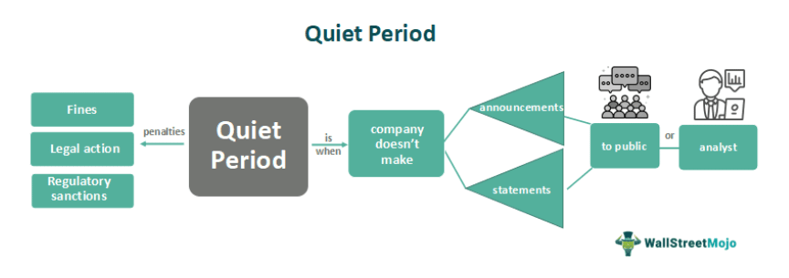

The financial industry operates under strict regulatory frameworks designed to maintain fairness and transparency for all market participants. This is particularly crucial during specific periods, such as the quiet period preceding initial public offerings (IPOs) and earnings reports. These quiet periods are established to mitigate the risk of market manipulation and to ensure that all potential investors have equal access to information. This article provides an exploration of quiet periods with a focus on their implications in financial markets and algorithmic trading. It also highlights notable instances of quiet period violations and their consequences on market dynamics.

Understanding the regulations governing quiet periods is vital for investors and traders. These rules are enacted to prevent the dissemination of information that could unduly influence market perceptions prior to significant financial events. As such, companies and trading entities must comply with these guidelines to avoid penalties imposed by regulatory authorities. This article will enhance your understanding of quiet periods, illustrating their significance in promoting equitable trading environments.

## Table of Contents

## Understanding the Quiet Period

A quiet period is a designated timeframe in the financial markets where companies are prohibited from sharing any new information that could influence market perceptions and decisions. This regulation aims to ensure that all potential investors have equal access to the same data when making investment choices, thereby maintaining fairness and transparency in the marketplace.

Before initial public offerings (IPOs) and ahead of earnings reports, quiet periods are particularly significant. They serve to uphold market integrity and prevent insider trading by ensuring that no individual or group gains an unfair advantage through exclusive or early access to company information. As such, executives and insiders are typically restricted from making public statements concerning their company’s future prospects during these times.

Regulatory bodies, such as the Securities and Exchange Commission (SEC) in the United States, enforce strict compliance with these rules. This enforcement is crucial to prevent market manipulation or the emergence of unfair competitive advantages. Adherence to quiet period regulations is not only a legal obligation but also a vital component in building trust among investors and maintaining a level playing field in the financial markets.

## Quiet Period in IPOs

In the context of Initial Public Offerings (IPOs), the quiet period represents a crucial timeframe that commences with the filing of the registration statement with regulatory authorities such as the U.S. Securities and Exchange Commission (SEC). This period extends until 40 days after the stock first starts trading on public markets. The primary purpose of this imposed silence is to ensure equitable access to information for all potential investors. During this time, companies are prohibited from engaging in any promotional activities that might convey biased insights into their financial performance or growth prospects. This restriction facilitates a level playing field where all investors make decisions based exclusively on the information included within the regulatory filings, such as the prospectus.

The quiet period serves as a safeguard against market manipulations by prohibiting selective dissemination of information that could advantage certain investors, thereby fostering transparency and fairness. Companies that fail to adhere to these restrictions face substantial consequences. Violations can lead to significant delays in the IPO process, legal consequences from regulatory bodies, and potential damage to the company’s reputation, all of which could have long-term financial implications. The risk of disseminating misleading or selective information emphasizes the necessity of strict compliance with quiet period regulations. Regulatory bodies strictly monitor this compliance to prevent any breach that could upset market stability or investor confidence.

By ensuring that all pertinent financial information is available in a controlled and equitable manner, quiet periods play an integral role in maintaining the integrity of financial markets as companies transition to public trading.

## Algorithmic Trading and Quiet Periods

Algorithmic trading has transformed financial markets by enabling complex strategies to be executed at speeds unattainable by human traders. However, the integration of these systems into the trading ecosystem requires strict adherence to regulatory frameworks, including the observance of quiet periods. Quiet periods, times when companies refrain from making specific public disclosures, pose particular challenges to [algorithmic trading](/wiki/algorithmic-trading) systems, which are programmed to rapidly analyze and act on available information.

To comply with quiet period regulations, these systems must be meticulously programmed to avoid reacting to unauthorized or non-public information. This involves incorporating safeguards within the algorithms to ensure that trading strategies only utilize legally permissible data sources. The fundamental principle is that automated systems should mirror the ethical standards expected of human traders, safeguarding market fairness and transparency.

Trading algorithms are primarily designed to process and respond to public market data, such as price movements, volumes, and order [books](/wiki/algo-trading-books). Nonetheless, if an algorithm is inadvertently configured to act on unauthorized proprietary information or leaks during quiet periods, it could result in severe repercussions. Such breaches undermine market integrity, leading to implications such as institutional penalties, hefty fines, or regulatory sanctions against the firm.

The penalties for violations of quiet period regulations by algorithmic traders are stringent. Firms found guilty of executing trades based on insider information processed by algorithms may face substantial fines, trading bans, or could be subjected to enhanced regulatory scrutiny. These repercussions not only affect the financial standing of institutions but can also tarnish their reputation and investor trust.

It's crucial for algorithmic trading systems to integrate mechanisms that align with legal compliance requirements. This could involve adopting [machine learning](/wiki/machine-learning) models and natural language processing techniques to filter unauthorized messages or adopting risk management frameworks that halt trading activities during potentially ambiguous periods.

Given the evolving regulatory landscape and the increasing complexity of financial markets, maintaining fairness and transparency with algorithmic trading systems is paramount. High-frequency trading firms must therefore continue to invest in compliance technologies and practices to ensure their operations remain within legal boundaries while effectively participating in the financial marketplace.

## Violation Examples

Facebook's 2012 Initial Public Offering (IPO) serves as a prominent example of alleged breaches of quiet period regulations. During this event, claims emerged that selective information about revenue forecasts was communicated to certain investors, contravening the principles of equal information dissemination required in quiet periods. Such actions not only defy regulatory standards but can also result in distinct advantages for privileged entities, undermining investor confidence and market integrity.

A similar scenario unfolded in 2019 with WeWork. Reports indicated that the company's CEO participated in interviews during the designated quiet period, potentially disclosing sensitive information. These communications raised concerns about the transparency and fairness of the IPO process, prompting regulatory bodies to scrutinize the company's adherence to quiet period requirements.

The repercussions of violating quiet period rules are significant. Legal actions may ensue, regulatory authorities might intensify oversight, and there can be palpable damage to a company's reputation among investors. For instance, legal interventions can include hefty fines, while the reputational damage often results in diminished investor trust and reluctance to engage with the company in future transactions.

These cases exemplify the critical nature of compliance with quiet period regulations. They underscore the necessity for companies to implement stringent internal controls and communication policies that ensure adherence to these regulations. Moreover, such instances serve as cautionary tales for other organizations, highlighting the importance of maintaining strict confidentiality during quiet periods to uphold market fairness and equity.

Ultimately, the stakes involved in breaching quiet period regulations extend beyond immediate legal and financial consequences, impacting long-term market dynamics and investor relationships. As such, they provide a clear imperative for steadfast compliance to maintain the overall health and integrity of financial markets.

## Impact on Market Dynamics

Quiet periods have a significant impact on market dynamics primarily by restricting the flow of new information, which is pivotal for decision-making in financial markets. This limitation can bring about a stabilizing effect on market perceptions as it temporarily curtails new data that might otherwise influence investor behavior. However, this reduced transparency can also lead to increased speculation, as market participants may resort to conjecture in the absence of formal disclosures. Consequently, if unofficial information channels disseminate leaked information, it can spur [volatility](/wiki/volatility-trading-strategies) within the market.

Adherence to quiet periods is crucial to maintain investor confidence and ensure market integrity. When all investors operate with access to the same information set, it upholds the fundamental principle of fair trading practices. Any breach, such as premature disclosure of sensitive information, can lead to asymmetric information distribution, where some investors gain an unfair advantage over others. This undermines the level playing field that regulations strive to maintain.

Regulatory authorities are vigilant in monitoring compliance with quiet periods. Their objective is to uphold transparent and equitable trading environments. Through continuous oversight, they seek to preclude scenarios where violations could lead to mistrust in market mechanisms—potentially deterring investment and destabilizing financial systems. As markets increasingly evolve and integrate digital technologies, the role of regulatory bodies becomes even more critical in enforcing these timelines and guaranteeing adherence to established norms.

## Conclusion

Quiet periods are fundamental to ensuring transparency and fairness, especially during initial public offerings (IPOs) and earnings announcements. By restricting the dissemination of new information during these times, quiet periods help maintain a level playing field for all investors. Both manual and algorithmic trading systems are required to adhere to these regulations to avoid potential penalties and retain investor trust. Compliance is mandatory, as it safeguards the integrity of the market and the interests of investors. 

Understanding and respecting the rules surrounding quiet periods allows market participants to operate within a clear legal framework. Without strict enforcement, there would be a risk of asymmetric information distribution, potentially leading to unfair trading advantages. Regulatory authorities are vigilant in monitoring compliance to preserve the market's integrity.

As technology continues to reshape the financial sector, ongoing adaptation of regulations is crucial. The evolution of financial instruments and trading strategies demands continuous re-evaluation and updating of compliance measures. Maintaining fairness and transparency in such a dynamic environment remains paramount, necessitating that regulations evolve alongside technological advancements to effectively oversee and guide market behavior.

## References & Further Reading

[1]: Lee, P. L., & Maske, R. D. (2017). ["IPO Quiet Period Violations: What You Should Know."](https://fastercapital.com/content/Quiet-Period--The-Quiet-Period--What-Companies-and-Investors-Need-to-Know-Pre-IPO.html) SAGE Journals.

[2]: Sherman, A. E. (2005). ["Global Trends in IPO Methods: Book Building versus Auctions with Endogenous Entry."](https://www.sciencedirect.com/science/article/pii/S0304405X05001091) Journal of Financial Economics.

[3]: ["Flash Boys: A Wall Street Revolt"](https://en.wikipedia.org/wiki/Flash_Boys) by Michael Lewis

[4]: Schwert, G. W. (2003). ["Anomalies and Market Efficiency."](https://www.nber.org/papers/w9277) NBER Working Paper No. 9878.

[5]: Barker, R. (2013). ["How can we improve the IPO process?"](https://www.scribd.com/document/703029312/George-Angelopulo-and-Rachel-Barker-2013-Integrated-Organisational-Communication-2nd-Edition-Juta-Cape-Town) CFA Institute Magazine.

[6]: Fama, E.F. (1998). ["Market Efficiency, Long-Term Returns, and Behavioral Finance."](https://www.sciencedirect.com/science/article/pii/S0304405X98000269) Journal of Financial Economics.