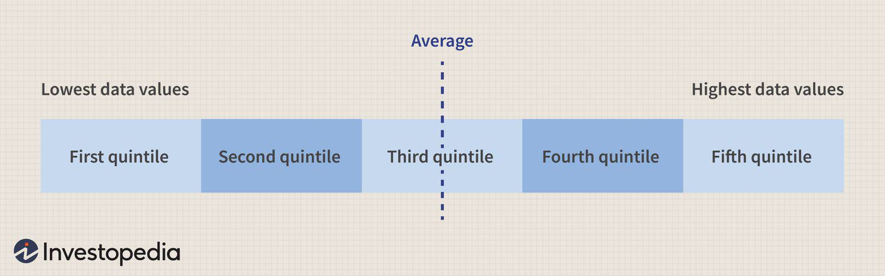

In today's fast-paced trading environment, data analysis serves as a fundamental tool for traders and investors aiming to achieve a competitive edge. As financial markets become increasingly complex and volatile, the ability to swiftly analyze and interpret vast amounts of data is crucial for success. The integration of statistical methods, such as quintiles, into algorithmic trading systems has unlocked new pathways for enhanced financial analysis. This integration allows traders to elucidate patterns and trends within datasets, facilitating more informed decision-making processes.

Quintiles are statistical measures that divide a dataset into five equal parts, each representing 20% of the data. This segmentation aids traders and analysts in gaining a deeper understanding of the distribution and performance of financial datasets. By applying quintiles to market data, traders can identify and capitalize on emerging trends, adjust their strategies accordingly, and optimize asset management.



Algorithmic trading, which relies on predetermined rules executed by computer algorithms, benefits significantly from these statistical techniques. Algorithms can be designed to respond uniquely to different quintiles, tailoring trading actions to specific market conditions and enhancing the precision and reliability of market predictions.

This article examines the powerful synergy between data analysis, statistical methods, and algorithmic trading. By leveraging these tools, traders can construct effective trading strategies, minimizing risks and maximizing returns. As statistical methodologies continue to advance, their applications in trading are expected to broaden, offering traders further opportunities to refine their strategies in a continuously evolving market landscape.

## Table of Contents

## Understanding Quintiles in Data Analysis

Quintiles are statistical measures that segment a dataset into five equal parts, with each part encompassing 20% of the data. In financial data analysis, quintiles are instrumental for examining the distribution and performance of datasets. A quintile-based approach aids traders in understanding a dataset's structure, leading to informed decisions in asset management and strategic planning.

The practical application of quintiles lies in their ability to reveal the range and variability within a dataset. For instance, if a dataset of stock returns is divided into quintiles, the first quintile represents the bottom 20% of returns, while the fifth quintile represents the top 20%. This segmentation allows traders to identify outliers, trends, and shifts in asset performance, which are pivotal for devising competitive trading strategies.

Analyzing quintiles involves computing the quintile ranks for any given dataset. Suppose a dataset $X$ consists of numerical values representing daily returns of a particular stock. The quintiles can be estimated using statistical software or programming languages such as Python. For example, in Python, the following code can be used to calculate and display quintiles:

```python
import numpy as np

# Sample dataset of daily returns
daily_returns = np.array([0.01, 0.015, -0.02, 0.005, 0.02, -0.015, 0.03, 0.04, -0.01, 0.025])

# Calculate quintiles
quintiles = np.percentile(daily_returns, [20, 40, 60, 80])
print("Quintile values:", quintiles)
```

By employing quintiles, traders can evaluate and compare different assets or portfolios, facilitating enhanced assessments of risk and return. For example, if a portfolio consistently falls into higher quintiles, it suggests higher-than-average returns, whereas frequent positioning in lower quintiles may indicate underperformance.

Quintiles also assist in risk management by assessing the distribution of returns. They highlight the probability and magnitude of extreme returns, thus offering insights into the potential risks associated with particular trading decisions. Consequently, this statistical tool plays a pivotal role in enhancing portfolio resilience and performance by providing a clear picture of asset distribution and market behavior.

## Statistical Methods in Trading

Statistical analysis in trading leverages mathematical models to interpret historical and real-time data, aiding in the prediction of market trends and price movements. These techniques provide a framework for traders to analyze market data, understand potential risks, and formulate effective trading strategies based on empirical evidence.

One of the foundational techniques in statistical trading is regression analysis. This method examines the relationship between one or more independent variables and a dependent variable, often aiming to forecast future prices based on historical data. Linear regression is the simplest form, represented by the equation:

$$
y = \beta_0 + \beta_1x + \epsilon
$$

where $y$ is the dependent variable (e.g., asset price), $x$ represents one or more independent variables (e.g., time, volume), $\beta_0$ and $\beta_1$ are coefficients, and $\epsilon$ is the error term. Regression models help traders identify trends and assess the potential impact of different market factors on asset prices.

Time series analysis is another crucial statistical method used in trading. It involves studying datasets over time to identify patterns, trends, and seasonal variations. By applying techniques such as moving averages and autoregressive models, traders can generate forecasts that inform buy or sell decisions. The Autoregressive Integrated Moving Average (ARIMA) model, for example, is formulated as follows:

$$
ARIMA(p, d, q)
$$

- $p$ represents the number of lag observations included in the model (autoregressive part).
- $d$ denotes the degree of differencing required to make the time series stationary.
- $q$ is the size of the moving average window.

By optimizing these parameters, traders can refine their predictions and manage trading risks more effectively.

Probability modeling further enhances trading strategies by quantifying uncertainty and likelihood of future events. Techniques such as Monte Carlo simulations generate a range of possible outcomes based on random variables, allowing traders to assess the probability of different market scenarios and prepare accordingly.

Here's a simple example of a Monte Carlo simulation in Python to forecast future stock prices:

```python
import numpy as np

def monte_carlo_simulation(S0, mu, sigma, T, steps, iterations):
    dt = T / steps
    price_paths = np.zeros((steps, iterations))
    price_paths[0] = S0
    for t in range(1, steps):
        brownian_motion = np.random.normal(0, 1, iterations)
        price_paths[t] = price_paths[t - 1] * np.exp((mu - 0.5 * sigma**2) * dt + sigma * np.sqrt(dt) * brownian_motion)
    return price_paths

S0 = 100  # initial stock price
mu = 0.05  # expected return
sigma = 0.2  # volatility
T = 1  # time horizon in years
steps = 252  # number of time steps
iterations = 10000  # number of simulation paths

simulated_prices = monte_carlo_simulation(S0, mu, sigma, T, steps, iterations)
```

These statistical methods form the backbone of systematic trading strategies, allowing traders to design and evaluate trading systems that improve operational efficiency while minimizing risks. The application of such techniques not only empowers traders to uncover intricate patterns and correlations within financial data but also facilitates the development of robust models that enhance decision-making processes.

## Quintiles in Algorithmic Trading

Quintiles play a significant role in enhancing [algorithmic trading](/wiki/algorithmic-trading) strategies through their ability to segment data. By dividing datasets into quintiles, each containing 20% of the data, traders can create more granular insights into market conditions. This segmentation is particularly useful in capturing the underlying patterns and variabilities within financial markets, thus allowing algorithms to adapt to different trading environments.

Consider a scenario where a dataset includes the historical returns of various stocks. By applying quintile analysis, these stocks can be categorized into five groups based on their performance. This approach helps identify outliers and assess which quintile outperforms or underperforms under specific market conditions. Consequently, trading algorithms can be fine-tuned to respond more effectively to these conditions, improving the precision of trades.

The application of quintiles in algorithmic trading also aids in the optimization of risk management strategies. For example, algorithms can prioritize investments in stocks that consistently fall into higher-performing quintiles, thereby minimizing exposure to riskier assets found in lower quintiles. The segmentation of datasets into quintiles allows for a more targeted approach to asset allocation.

In practice, implementing quintiles into algorithmic trading can be executed with Python, using libraries like Pandas for data manipulation. Here is a simple code snippet illustrating how to classify data into quintiles:

```python
import pandas as pd

# Sample dataset
data = {'Stock': ['A', 'B', 'C', 'D', 'E'],
        'Returns': [0.05, 0.02, 0.15, 0.01, 0.07]}

df = pd.DataFrame(data)

# Calculate quintiles
df['Quintile'] = pd.qcut(df['Returns'], q=5, labels=False) + 1

print(df)
```

This code assigns each stock's return to a quintile, enabling traders to further analyze or implement this segmented data in algorithmic models. By incorporating quintiles, the adaptability and foresight of trading algorithms are enhanced, leading to better market predictions and improved strategic outcomes.

## Quantitative Asset Management

Quantitative asset management is an approach that relies on statistical analysis to manage investment portfolios effectively. A fundamental aspect of this strategy is leveraging the concept of quintiles, which divide datasets into five equal parts to facilitate insightful analysis and informed decision-making in portfolio management. 

By systematically analyzing large datasets, asset managers can enhance portfolio diversification—a critical strategy in risk management. Diversification helps mitigate the impact of individual asset [volatility](/wiki/volatility-trading-strategies) and thus reduces overall portfolio risk while seeking to optimize returns. For instance, quintile analysis can identify different performance tiers over time and across asset classes, allowing managers to allocate resources more effectively and maintain balanced risk profiles.

Quantitative models play a pivotal role in identifying asset relationships and correlations. These models use historical market data and advanced statistical tools to predict future asset behavior. For example, correlation matrices can help managers understand how different assets move in relation to one another. This understanding allows for strategic decisions such as reducing exposure to highly correlated assets or increasing holdings in negatively correlated ones to achieve greater stability.

The power of quantitative models further extends to spotting potential investment opportunities. By employing regression analysis and [machine learning](/wiki/machine-learning) techniques, asset managers can uncover hidden patterns in the data. These patterns can reveal undervalued assets poised for growth or alert managers to possible market corrections. Python, with its extensive libraries like pandas and scikit-learn, provides robust capabilities for building these quantitative models. Consider this simple Python snippet for calculating asset returns:

```python
import pandas as pd

# Assume we have a DataFrame 'df' with stock prices, indexed by date
df['returns'] = df['price'].pct_change()

# Compute average return per quintile
df['quintile'] = pd.qcut(df['returns'], 5, labels=False)
average_returns = df.groupby('quintile').mean()
```

In this code, `pandas.qcut` efficiently divides the historical returns into quintiles, allowing analysts to compute average returns for each segment. Such computations can guide asset managers in making data-backed decisions regarding asset allocation or rebalancing.

By employing these quantitative methods, asset managers are equipped to navigate complex financial markets with greater precision, enhancing their ability to manage risks and maximize returns efficiently. As technology and data analytics continue to evolve, the tools available for quantitative asset management will become only more sophisticated, offering further opportunities for optimizing portfolio performance.

## The Role of Data Visualization and Mining

Data visualization and mining have become essential tools for traders seeking to interpret extensive datasets and identify patterns and market trends efficiently. In the context of trading, data visualization tools allow traders to transform complex numerical data into graphical representations, making it easier to detect trends, spot anomalies, and gain insights quickly. These visualizations, such as candlestick charts, heat maps, and scatter plots, can highlight performance metrics and help traders to make informed decisions by seeing patterns that might not be evident in raw data.

Text mining is another crucial element of data mining that traders use to analyze large volumes of textual data from news articles, social media, and financial reports. By employing natural language processing (NLP) techniques, text mining extracts useful information about market sentiment and potential impacts on trades. For instance, algorithms can classify words into positive, negative, or neutral sentiments, thereby quantifying market sentiment and aiding traders in making strategic decisions.

Data mining, in general, involves using statistical models, machine learning algorithms, and database systems to discover patterns within large datasets that can predict financial outcomes. These techniques help traders understand market dynamics by providing insights into potential price movements and market behaviors. Methods such as cluster analysis can identify stocks with similar price movements, while association rule mining detects relationships between different market variables, offering a data-backed basis for trading strategies.

Combining these techniques with statistical methods provides traders with a comprehensive understanding of market dynamics. For instance, through a heat map visualization of stock movements, traders can assess the performance across different sectors at a glance. When coupled with quintile-based segmentation of market data, these visualization techniques allow for a nuanced market analysis. Meanwhile, text mining complements this by offering an additional layer of sentiment analysis, helping traders to anticipate market shifts.

As a simple example, consider using Python with libraries like Matplotlib and NLTK for visualization and text analysis. A trader might use Matplotlib to plot a stock’s moving average convergence divergence (MACD) indicators, making it easier to predict potential price movements visually. Simultaneously, they could use NLTK to perform sentiment analysis on the latest financial news, correlating positive or negative scores with market behavior:

```python
import matplotlib.pyplot as plt
from nltk.sentiment.vader import SentimentIntensityAnalyzer

# Example data
price_data = [100, 102, 101, 105, 110]
dates = ["2023-01-01", "2023-01-02", "2023-01-03", "2023-01-04", "2023-01-05"]
news_headlines = ["Stock climbs on positive earnings", 
                  "Market sees slight downturn", 
                  "Positive forecast ahead for tech stocks"]

# Plotting price data
plt.plot(dates, price_data, marker='o')
plt.title('Stock Price Over Time')
plt.xlabel('Date')
plt.ylabel('Price')
plt.show()

# Analyzing sentiment of news headlines
sid = SentimentIntensityAnalyzer()
for headline in news_headlines:
    sentiment = sid.polarity_scores(headline)
    print(f"Headline: {headline}, Sentiment: {sentiment}")
```

By integrating data visualization and mining with statistical methods, traders can develop a robust framework for analyzing market data. This blend facilitates enhanced decision-making processes and provides a strategic edge in a constantly evolving trading environment.

## Conclusion

The integration of statistical methods such as quintiles into algorithmic trading empowers traders with a robust toolkit for analyzing market data with greater precision. Quintiles, which divide data into five equal parts, provide insights into the distribution of datasets, enabling traders to recognize patterns and predict market trends effectively. This statistical segmentation aids in the development of more accurate and responsive trading algorithms, allowing traders to adapt swiftly to changing market conditions.

By employing data-driven strategies, traders enhance their decision-making processes and optimize potential returns. These strategies utilize vast amounts of data and employ sophisticated techniques, including regression analysis, time series analysis, and probability modeling, to understand complex market dynamics. As algorithmic trading systems continue to evolve, they become increasingly adept at uncovering subtle patterns and anomalies, thus providing strategic advantages in the highly competitive financial markets.

Furthermore, advancements in trading technology continually expand the potential for data analysis in trading. Tools for data visualization and mining allow traders to interpret large datasets efficiently, revealing market trends and sentiment with clarity. As such, the future of trading lies in the ability to harness the power of data analytics and statistical methodologies, creating opportunities for both innovation and improved performance.

As this progression continues, traders and financial professionals must remain adaptable and forward-thinking, ready to embrace new technologies and methodologies. The intersection of data analysis and trading represents not only a field ripe with possibilities but also one where continuous learning and technological adaptation are paramount.

## References & Further Reading

[1]: ["Advances in Financial Machine Learning"](https://www.amazon.com/Advances-Financial-Machine-Learning-Marcos/dp/1119482089) by Marcos Lopez de Prado

[2]: ["Evidence-Based Technical Analysis: Applying the Scientific Method and Statistical Inference to Trading Signals"](https://www.amazon.com/Evidence-Based-Technical-Analysis-Scientific-Statistical/dp/0470008741) by David Aronson

[3]: ["Machine Learning for Algorithmic Trading"](https://github.com/stefan-jansen/machine-learning-for-trading) by Stefan Jansen

[4]: ["Quantitative Trading: How to Build Your Own Algorithmic Trading Business"](https://www.amazon.com/Quantitative-Trading-Build-Algorithmic-Business/dp/1119800064) by Ernest P. Chan

[5]: Bergstra, J., Bardenet, R., Bengio, Y., & Kégl, B. (2011). ["Algorithms for Hyper-Parameter Optimization."](https://proceedings.neurips.cc/paper/2011/file/86e8f7ab32cfd12577bc2619bc635690-Paper.pdf) Advances in Neural Information Processing Systems 24.