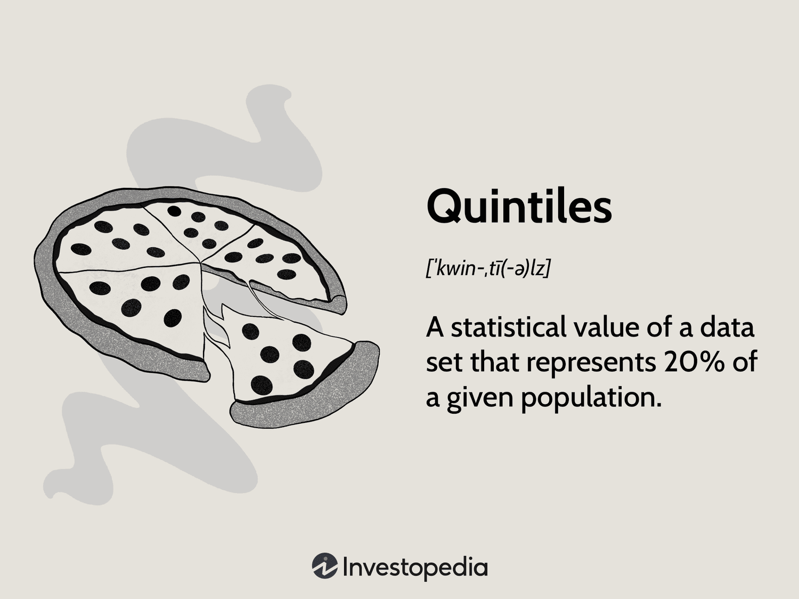

## Table of Contents

## What are quintiles and how are they defined?

Quintiles are a way to divide a set of data into five equal parts. Imagine you have a list of numbers sorted from the smallest to the largest. If you split this list into five groups, each group is called a quintile. The first quintile includes the lowest 20% of the numbers, the second quintile includes the next 20%, and so on until the fifth quintile, which includes the highest 20%.

Quintiles are useful for understanding how data is spread out. For example, if you want to see how income is distributed in a country, you can use quintiles to see how much the poorest 20% earn compared to the richest 20%. This helps to see if the data is evenly spread or if there are big differences between the groups.

## How do you calculate quintiles in a dataset?

To calculate quintiles in a dataset, first, you need to sort your data from the smallest to the largest number. Once your data is sorted, you can find the positions where you need to split the data into five equal parts. To do this, you use a formula to find the position of each quintile. The formula for the position of the k-th quintile is: (k/5) * (n + 1), where k is the quintile number (1, 2, 3, 4, or 5) and n is the total number of data points. For example, to find the position of the second quintile, you would use k = 2 and calculate (2/5) * (n + 1).

After finding the positions, you can determine the values at these positions in your sorted list. The first quintile is at the position calculated for k = 1, the second quintile at the position for k = 2, and so on. If the position you calculate is not a whole number, you usually round it to the nearest whole number or use interpolation to find the exact value. For instance, if you have 100 data points, the position for the third quintile would be (3/5) * (100 + 1) = 60.6, which you might round to 61 or use the values at positions 60 and 61 to interpolate.

## What are the common uses of quintiles in data analysis?

Quintiles are often used in data analysis to understand how data is spread out. For example, if you want to know how income is distributed among people in a country, you can divide the population into five groups using quintiles. This helps you see if the income is evenly spread or if there are big differences between the richest and poorest groups. By looking at quintiles, you can easily spot if the top 20% of earners have much more money than the bottom 20%.

Another common use of quintiles is in performance analysis. For instance, in a school, teachers might use quintiles to see how students are doing on a test. By dividing the test scores into five groups, they can quickly see how many students are in the top 20%, the middle 20%, and so on. This helps them understand if most students are doing well or if many are struggling. It also helps in deciding where to focus more teaching efforts to help students improve.

## Can you explain the difference between quintiles, quartiles, and percentiles?

Quintiles, quartiles, and percentiles are all ways to divide a set of data into smaller groups. Quintiles divide the data into five equal parts. This means you take all the numbers, sort them from smallest to largest, and then split them into five groups, each containing 20% of the data. Quartiles, on the other hand, divide the data into four equal parts. So, you sort the numbers and split them into four groups, each with 25% of the data. Percentiles are a bit different because they divide the data into 100 equal parts. Each percentile represents 1% of the data, so the 50th percentile, for example, is the middle number in the sorted list.

These ways of dividing data help us understand how the numbers are spread out. For example, if you want to see how income is spread among people, you could use quintiles to see how the top 20% earn compared to the bottom 20%. Quartiles might be used to see how students score on a test, dividing them into four groups to see how many are in the top 25%, the middle 50%, and the bottom 25%. Percentiles are often used in standardized tests to tell students where they stand compared to everyone else who took the test. The higher the percentile, the better the student did compared to others.

## How do quintiles help in understanding income distribution?

Quintiles help us see how money is spread out among people in a country. When we divide everyone into five groups based on how much they earn, we can see if the money is shared fairly or if some groups have a lot more than others. For example, if the top 20% of earners have a lot more money than the bottom 20%, it shows there's a big difference in how much people earn. This helps us understand if the economy is helping everyone or just a few.

By looking at quintiles, we can also see trends over time. If the gap between the richest and poorest groups is getting bigger, it might mean that some people are getting richer while others are not. This information can be useful for governments and organizations that want to make policies to help make things more equal. Understanding income distribution through quintiles gives us a clear picture of how well the economy is working for everyone.

## What are the limitations of using quintiles in statistical analysis?

One limitation of using quintiles in statistical analysis is that they can hide important details within each group. When you divide data into five parts, you might not see the differences between people inside each quintile. For example, if you're looking at income, two people in the same quintile might have very different earnings, but quintiles won't show that. This can make it hard to understand the full picture of how things are spread out.

Another problem is that quintiles can be affected by extreme values, or outliers. If there's one person with a very high income, it might make the top quintile look richer than it really is for most people in that group. This can give a wrong idea about how money is shared. Also, quintiles are not very useful if you have a small amount of data because you need enough numbers to make the five groups meaningful.

## How can quintiles be applied in market research?

In market research, quintiles can help us understand how different groups of customers behave. For example, if we want to know how much people spend on a product, we can divide them into five groups based on their spending. This helps us see if the top 20% of spenders buy a lot more than the bottom 20%. By looking at these groups, we can learn a lot about who our best customers are and how we can reach them better.

Quintiles can also be used to study how satisfied customers are with a product or service. If we survey customers and then divide them into five groups based on their satisfaction scores, we can see if most people are happy or if there are a lot of unhappy customers. This information is really useful for businesses because it helps them know where to focus their efforts to make their customers happier.

## What are some alternative methods to quintiles for data segmentation?

One alternative to quintiles for data segmentation is using quartiles. Quartiles divide data into four equal parts instead of five. This can be useful if you want to focus on the top 25% or bottom 25% of your data. For example, in a company, you might use quartiles to see how the top 25% of employees perform compared to the bottom 25%. This helps you understand if there's a big difference between the best and worst performers.

Another method is using percentiles. Percentiles divide data into 100 equal parts. This gives a very detailed view of how data is spread out. For instance, if you're looking at test scores, you might use percentiles to see how a student's score compares to everyone else. If a student is in the 90th percentile, it means they did better than 90% of the students. This can be really helpful for understanding where someone stands in a large group.

A third way to segment data is by using deciles. Deciles divide data into ten equal parts. This is a middle ground between quintiles and percentiles, offering more detail than quintiles but less than percentiles. For example, in a study about household income, deciles can help you see how the top 10% earn compared to the bottom 10%. This can be useful for understanding income distribution in more detail than quintiles allow.

## How do quintiles assist in risk assessment in finance?

In finance, quintiles help us understand how risky investments are by dividing them into five groups based on their risk levels. If we want to know how risky a group of stocks is, we can sort them from the least risky to the most risky and then split them into five parts. This way, we can see if the top 20% of stocks are much riskier than the bottom 20%. By looking at these groups, we can decide if we want to invest in the safer stocks or if we're willing to take more risk for possibly higher returns.

Quintiles also help us see how risk is spread out across different investments. For example, if we're looking at a bunch of loans, we can use quintiles to see how likely each group is to default. If the top 20% of loans have a high chance of defaulting, it tells us that those loans are very risky. This information helps banks and investors make better decisions about which loans to give out or invest in, and how to manage their overall risk.

## What advanced statistical techniques can be used alongside quintiles for deeper analysis?

One advanced statistical technique that can be used with quintiles is regression analysis. Regression helps us see how different things affect each other. For example, if we are looking at income quintiles, we can use regression to see how education, age, or where someone lives might change their income. By combining quintiles with regression, we can get a clearer picture of what makes people in the top 20% different from those in the bottom 20%. This can help us understand not just how income is spread out, but why it's spread out that way.

Another technique is cluster analysis. This method groups things that are similar to each other. When used with quintiles, cluster analysis can help us find patterns within each quintile. For example, in market research, we might use quintiles to divide customers by how much they spend. Then, with cluster analysis, we can see if there are different types of customers within each spending group. This can show us that even though two people spend the same amount, they might buy different things or come from different backgrounds. Using cluster analysis alongside quintiles gives us a deeper understanding of the data and helps us make better decisions.

## How have quintiles been used in academic research to study social and economic trends?

In academic research, quintiles have been used a lot to study how money and resources are spread out in society. For example, researchers might use quintiles to look at income distribution in a country. They divide people into five groups based on how much they earn. This helps them see if the richest 20% have a lot more money than the poorest 20%. By doing this, they can understand if the economy is helping everyone or just a few people. It also helps them track changes over time, like if the gap between the rich and poor is getting bigger or smaller.

Quintiles are also used to study other social trends, like education and health. Researchers might look at how test scores or health outcomes are spread out among different groups of people. For example, they might divide students into five groups based on their test scores to see if most students are doing well or if there are a lot of students who are struggling. In health research, quintiles can help show if certain groups have better access to healthcare than others. By using quintiles, researchers can get a clear picture of how different aspects of society are doing and where improvements might be needed.

## What are the future trends in the use of quintiles and their alternatives in big data analytics?

In big data analytics, the future use of quintiles and their alternatives like quartiles, deciles, and percentiles will likely become more advanced as technology improves. With more data being collected every day, these methods will be used to quickly break down large amounts of information into smaller, easier-to-understand parts. For example, companies might use quintiles to see how their customers are spread out in terms of spending or satisfaction. But with big data, they will be able to do this analysis faster and on a much larger scale, helping them make better decisions about their business.

As data analysis tools get better, we might see more use of other methods alongside quintiles. Techniques like [machine learning](/wiki/machine-learning) and [artificial intelligence](/wiki/ai-artificial-intelligence) will help find patterns and trends in data that might be missed with just quintiles. These advanced methods can work with quintiles to give a deeper understanding of the data. For example, while quintiles might show how income is spread out, machine learning could help predict future income trends or find out what factors affect income the most. This combination of old and new methods will make data analysis more powerful and useful in the future.

## What are Statistical Methods in Trading?

Statistical analysis in trading leverages mathematical models to interpret historical and real-time data, aiding in the prediction of market trends and price movements. These techniques provide a framework for traders to analyze market data, understand potential risks, and formulate effective trading strategies based on empirical evidence.

One of the foundational techniques in statistical trading is regression analysis. This method examines the relationship between one or more independent variables and a dependent variable, often aiming to forecast future prices based on historical data. Linear regression is the simplest form, represented by the equation:

$$
y = \beta_0 + \beta_1x + \epsilon
$$

where $y$ is the dependent variable (e.g., asset price), $x$ represents one or more independent variables (e.g., time, volume), $\beta_0$ and $\beta_1$ are coefficients, and $\epsilon$ is the error term. Regression models help traders identify trends and assess the potential impact of different market factors on asset prices.

Time series analysis is another crucial statistical method used in trading. It involves studying datasets over time to identify patterns, trends, and seasonal variations. By applying techniques such as moving averages and autoregressive models, traders can generate forecasts that inform buy or sell decisions. The Autoregressive Integrated Moving Average (ARIMA) model, for example, is formulated as follows:

$$
ARIMA(p, d, q)
$$

- $p$ represents the number of lag observations included in the model (autoregressive part).
- $d$ denotes the degree of differencing required to make the time series stationary.
- $q$ is the size of the moving average window.

By optimizing these parameters, traders can refine their predictions and manage trading risks more effectively.

Probability modeling further enhances trading strategies by quantifying uncertainty and likelihood of future events. Techniques such as Monte Carlo simulations generate a range of possible outcomes based on random variables, allowing traders to assess the probability of different market scenarios and prepare accordingly.

Here's a simple example of a Monte Carlo simulation in Python to forecast future stock prices:

```python
import numpy as np

def monte_carlo_simulation(S0, mu, sigma, T, steps, iterations):
    dt = T / steps
    price_paths = np.zeros((steps, iterations))
    price_paths[0] = S0
    for t in range(1, steps):
        brownian_motion = np.random.normal(0, 1, iterations)
        price_paths[t] = price_paths[t - 1] * np.exp((mu - 0.5 * sigma**2) * dt + sigma * np.sqrt(dt) * brownian_motion)
    return price_paths

S0 = 100  # initial stock price
mu = 0.05  # expected return
sigma = 0.2  # volatility
T = 1  # time horizon in years
steps = 252  # number of time steps
iterations = 10000  # number of simulation paths

simulated_prices = monte_carlo_simulation(S0, mu, sigma, T, steps, iterations)
```

These statistical methods form the backbone of systematic trading strategies, allowing traders to design and evaluate trading systems that improve operational efficiency while minimizing risks. The application of such techniques not only empowers traders to uncover intricate patterns and correlations within financial data but also facilitates the development of robust models that enhance decision-making processes.

## References & Further Reading

[1]: ["Advances in Financial Machine Learning"](https://www.amazon.com/Advances-Financial-Machine-Learning-Marcos/dp/1119482089) by Marcos Lopez de Prado

[2]: ["Evidence-Based Technical Analysis: Applying the Scientific Method and Statistical Inference to Trading Signals"](https://www.amazon.com/Evidence-Based-Technical-Analysis-Scientific-Statistical/dp/0470008741) by David Aronson

[3]: ["Machine Learning for Algorithmic Trading"](https://github.com/stefan-jansen/machine-learning-for-trading) by Stefan Jansen

[4]: ["Quantitative Trading: How to Build Your Own Algorithmic Trading Business"](https://www.amazon.com/Quantitative-Trading-Build-Algorithmic-Business/dp/1119800064) by Ernest P. Chan

[5]: Bergstra, J., Bardenet, R., Bengio, Y., & Kégl, B. (2011). ["Algorithms for Hyper-Parameter Optimization."](https://proceedings.neurips.cc/paper/2011/file/86e8f7ab32cfd12577bc2619bc635690-Paper.pdf) Advances in Neural Information Processing Systems 24.