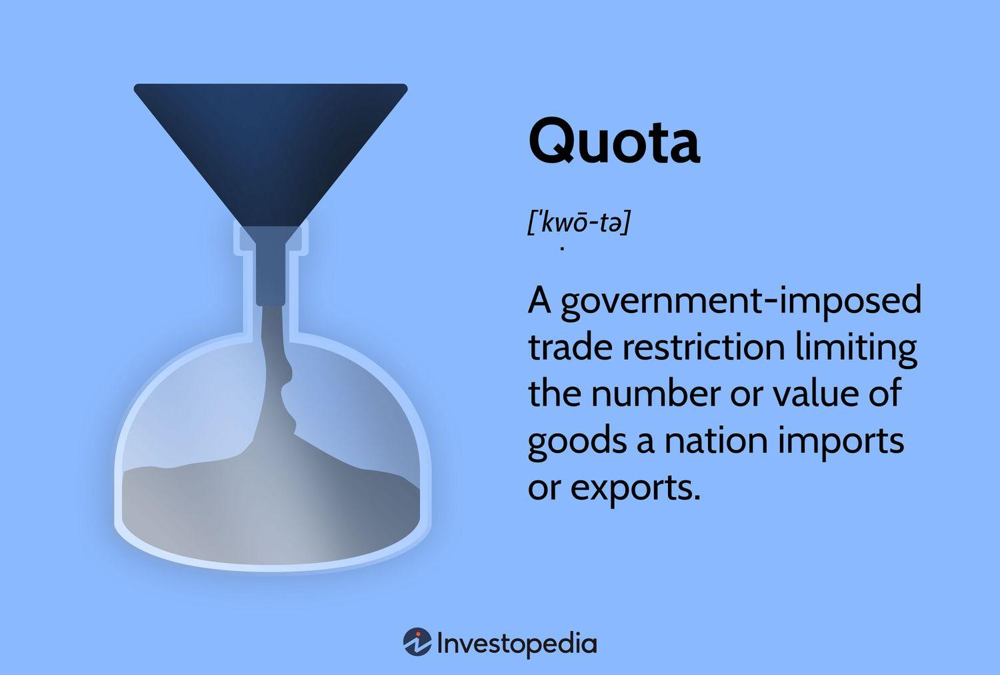

## Table of Contents

## What is a quota?

A quota is a limit or a specific amount of something that is allowed or required. It can be used in many different situations. For example, in business, a sales quota is the amount of products a salesperson or team needs to sell in a certain time. In immigration, a quota might be the number of people from a certain country who are allowed to enter another country each year.

Quotas are used to manage resources, control activities, or meet certain goals. They help make sure that things are shared fairly or that targets are reached. For example, a country might set a quota on how much fish can be caught to protect the fish population. Or, a company might set a quota for hiring more women or people from different backgrounds to make their workforce more diverse.

## What are the different types of quotas?

There are different kinds of quotas, and they are used in many areas. One type is the import quota, which is a limit on how much of a certain product can come into a country. This is often used to protect local businesses from too much competition. Another type is the production quota, which sets a limit on how much of something can be made. This can help control the supply of goods and keep prices stable. There are also export quotas, which limit how much of a product can be sent out of a country. These are used to make sure there is enough of the product left at home.

Another kind of quota is the employment quota, which is used to make sure that certain groups of people get jobs. For example, a company might have a quota to hire more women or people from different backgrounds. This helps make the workplace more diverse. There are also fishing quotas, which limit how many fish can be caught. This helps protect fish populations and keep the ocean healthy. Lastly, there are sales quotas, which are targets that salespeople need to meet. These help businesses know how well they are doing and push their sales teams to do better.

## How are quotas used in business?

In business, quotas are often used to set goals for sales teams. A sales quota is a target that a salesperson or a team needs to reach in a certain time. For example, a company might tell a salesperson they need to sell 100 units of a product each month. This helps the company know how well they are doing and pushes the sales team to work harder. If everyone meets their quotas, the company can make more money and grow.

Quotas are also used in other ways in business. For example, a company might set a hiring quota to make sure they have a diverse workforce. This means they might aim to hire a certain number of women or people from different backgrounds. This helps the company be fair and can bring in new ideas and skills. Another use of quotas in business is to manage production. A production quota can limit how much of a product is made, which can help keep prices stable and make sure there is enough supply for everyone.

## What is the purpose of implementing quotas?

Quotas are used to set limits or targets for different things. They help manage resources and make sure things are shared fairly. For example, a country might use a fishing quota to stop too many fish from being caught, so there are enough fish left in the ocean. In business, a sales quota helps a company know if they are selling enough of their products. By setting these limits, quotas help keep things balanced and protect important resources.

Quotas also help reach certain goals. In a company, an employment quota might be used to make sure more women or people from different backgrounds get jobs. This makes the workplace more diverse and fair. In another case, a country might use an import quota to protect local businesses from too much competition from other countries. By using quotas, people and organizations can work towards specific targets and make sure everyone gets a fair chance.

## How do quotas affect international trade?

Quotas can change how countries trade with each other. When a country sets an import quota, it limits how much of a certain product can come into the country. This can help protect local businesses because it stops too many foreign products from coming in and taking away customers. But it can also make things more expensive for people in that country because there are fewer choices and less competition. For example, if a country limits how many cars can be imported, the price of cars might go up because people have to buy the more expensive local cars.

Export quotas can also affect international trade. These quotas limit how much of a product can leave a country. A country might use an export quota to make sure they have enough of a product for their own people. But this can make it harder for other countries to get what they need. For instance, if a country limits how much wheat they export, other countries that rely on that wheat might have to pay more or find it somewhere else. This can cause tension between countries and change how they trade with each other.

## What are the legal implications of quotas in employment?

Quotas in employment can have important legal effects. In many countries, it is against the law to use quotas to favor one group over another in hiring. For example, in the United States, the Civil Rights Act says that employers cannot discriminate based on race, color, religion, sex, or national origin. This means that setting a quota to hire only people from a certain group can lead to legal problems. If someone thinks they were not hired because of a quota, they might take the company to court.

However, some countries and organizations use quotas to help certain groups that have been treated unfairly in the past. These are called affirmative action policies. For example, a company might have a goal to hire more women or people from minority groups to make the workplace more diverse. But even these policies must be careful not to break anti-discrimination laws. The key is to use these quotas as goals, not strict rules, and to make sure everyone has a fair chance to get a job. If not done right, these policies can still lead to legal challenges.

## How can quotas be used to promote diversity and inclusion?

Quotas can be used to promote diversity and inclusion by setting goals for hiring people from different backgrounds. For example, a company might set a goal to hire more women or people from minority groups. This helps make sure that everyone has a fair chance to get a job. When a company uses quotas like this, it can show that they care about having a diverse team. This can make the workplace feel more welcoming and can bring in new ideas and skills.

However, using quotas to promote diversity needs to be done carefully. It's important that quotas are used as goals, not strict rules. This means that while a company might aim to hire more people from certain groups, they should still look at everyone who applies and choose the best person for the job. If quotas are used the wrong way, they can lead to legal problems. But when used right, quotas can help make a company more diverse and inclusive, which is good for everyone.

## What are the economic impacts of quotas on industries?

Quotas can have big effects on industries. When a country puts a limit on how much of a product can come in from other countries, it can help local businesses. This is because fewer foreign products means less competition for local companies. They can sell more of their own products and might even be able to charge more for them. But, this can also make things more expensive for people who want to buy those products. They might have to pay more because there are fewer choices.

On the other hand, quotas can also hurt industries. If a country limits how much of a product can be sent out to other countries, it can make it hard for local companies to sell their products abroad. This can lead to less money coming in and fewer jobs. Also, if other countries feel like they are not getting a fair deal, they might put their own limits on trade. This can lead to trade wars, where countries keep putting up more and more limits, and everyone ends up losing out.

## How do governments enforce quota policies?

Governments use different ways to make sure quota policies are followed. They might use laws and rules to set limits on how much of something can be imported, exported, or produced. For example, they might need companies to get special permits or licenses before they can do certain things. If a company does not follow the rules, the government can give them fines or other punishments. This helps make sure that everyone sticks to the quotas.

Governments also use checks and inspections to enforce quotas. They might have people who watch and check how much of a product is being made or traded. If they find that someone is not following the rules, they can take action. Sometimes, governments work with other countries to make sure quotas are followed. They might share information and work together to stop people from getting around the rules. This helps make sure that quotas work the way they are supposed to.

## What are the challenges and criticisms associated with quotas?

Quotas can be hard to use and some people do not like them. One big problem is that quotas can be unfair. For example, if a company has to hire a certain number of people from one group, it might not choose the best person for the job. This can make other people feel left out or treated unfairly. Also, quotas can be hard to enforce. Governments need to watch and check to make sure people are following the rules, and this can be a lot of work. If people find ways to get around the quotas, they do not work well.

Another problem is that quotas can lead to higher prices. If a country limits how much of a product can come in, there might not be enough to go around. This can make things more expensive for people who want to buy them. Also, other countries might not like quotas. If one country sets limits on what can come in, other countries might do the same thing back. This can lead to trade wars, where everyone loses out. Critics say that quotas can hurt the economy and make it harder for people to get what they need.

## How can data analytics be used to manage and optimize quotas?

Data analytics can help manage and optimize quotas by looking at past information and finding patterns. For example, a company can use data to see how well their sales team did in the past and set better sales quotas for the future. They can look at things like which products sold the best, what time of year sales were highest, and which salespeople did the best. By understanding these patterns, the company can set quotas that are fair and achievable. This helps everyone know what they need to do and can make the company do better overall.

Data analytics can also help with other kinds of quotas, like employment quotas. A company can use data to see if they are hiring enough people from different backgrounds. They can look at things like how many women or people from minority groups they have hired in the past and see if they need to do more. This can help them set goals that will make their workplace more diverse and fair. By using data to manage quotas, companies can make sure they are doing the right thing and reaching their goals.

## What are the future trends and potential reforms in quota systems?

In the future, quota systems might change a lot because of new technology and changing ideas about fairness. One big trend could be using more data and computers to set and manage quotas. For example, companies might use smart computer programs to look at a lot of information and set quotas that are fair and help everyone. This could make quotas work better and be easier to manage. Also, as people care more about the environment, governments might use more quotas to protect nature. They could set limits on things like how much fish can be caught or how much pollution companies can make. This would help keep the planet healthy.

Another trend could be changes in how quotas are used to help different groups of people. As more people talk about fairness and equality, governments and companies might change their quota rules to make sure everyone gets a fair chance. For example, they might use quotas to help more women or people from different backgrounds get good jobs. But they will need to be careful to do this in a way that does not break the law. There could also be new rules to make sure quotas are used in a way that is good for everyone, not just a few people. This would help make society more fair and equal.

## What is Allocation Quota?

Allocation quota refers to the predetermined amount of capital assigned to various financial instruments or trades, based on a trader's strategy and risk tolerance. It serves as an essential guideline in [algorithmic trading](/wiki/algorithmic-trading) to ensure that capital distribution aligns with a trader’s objectives. By setting an allocation quota, traders can systematically decide how much capital should be allocated to each potential trade when certain signals or criteria are triggered. 

More specifically, this concept operates as a management tool that assists traders in maintaining a structured approach to trading. Allocation quotas are often derived from quantitative models, which utilize historical data and statistical methods to predict viable trading opportunities. These models help in calculating the expected return and associated risk, thereby influencing how allocation quotas are determined.

Mathematically, the allocation quota can be expressed using various methodologies such as fixed allocations or variable allocations based on percentages or confidence levels. An example could be:

$$
\text{Allocation Quota} = \frac{\text{Capital allocated to a trade}}{\text{Total capital available}}
$$

This ratio provides insight into how much of the available capital is committed to a particular trade or set of trades. Implementing an effective allocation quota system ensures that the capital is utilized efficiently, potentially reducing risk and increasing return on investment over time. 

Successful application of allocation quotas requires continuous adjustment and calibration according to the dynamic nature of financial markets. Traders must take into account various factors such as market [volatility](/wiki/volatility-trading-strategies), individual asset performance, and overall trading strategy objectives to adapt their allocation quotas effectively.

## What are the methods for defining allocation quota?

Various methods are employed to define allocation quotas in algorithmic trading, introducing flexibility and precision in trade management. These methods include fixed [volume](/wiki/volume-trading-strategy), percentage-of-capital, and confidence-based allocations, each offering unique approaches to capital distribution across trades.

### Fixed Volume Allocation

Fixed volume allocation involves assigning a consistent number of shares or contracts per trade. This method is relatively straightforward and provides simplicity in execution, ensuring that each trade receives an identical allocation irrespective of the underlying asset price or market conditions. While easy to implement, this method may not account for fluctuations in asset prices, potentially leading to disproportionate risk exposure relative to the capital size.

```
def fixed_volume_allocation(total_trades, volume_per_trade):
    return [volume_per_trade for _ in range(total_trades)]
```

### Percentage-of-Capital Allocation

Percentage-of-capital allocation distributes a specific percentage of the total available capital to each trade. This method ensures that as the capital base grows or shrinks, the exposure per trade adjusts accordingly, reflecting the overall financial state of the trading portfolio. By using a percentage approach, traders can maintain a consistent risk level proportional to the size of the capital.

$$
\text{Allocation per trade} = \frac{\text{Total Capital} \times \text{Percentage Allocation}}{\text{Number of Trades}}
$$

```
def percentage_of_capital_allocation(total_capital, percentage_allocation, number_of_trades):
    allocation = total_capital * (percentage_allocation / 100)
    return [allocation / number_of_trades for _ in range(number_of_trades)]
```

### Confidence-Based Allocation

Confidence-based allocation varies the quota based on the perceived strength or probability of success of each trading signal. This dynamic approach involves assigning more capital to trades with higher confidence levels, derived from historical data, signal accuracy, or predictive models. This method requires a robust mechanism to evaluate the confidence level of each trading signal, often involving [machine learning](/wiki/machine-learning) models or statistical analyses.

```
def confidence_based_allocation(total_capital, confidence_levels):
    total_confidence = sum(confidence_levels)
    return [(confidence / total_confidence) * total_capital for confidence in confidence_levels]
```

Confidence levels here are hypothetical numerical values indicative of the strength of each trade signal. This allocation strategy is sophisticated and aligns capital distribution with expected trade outcomes, potentially enhancing overall portfolio returns but also introducing higher complexity and dependency on accurate signal evaluation.

Each of these methods offers distinct advantages and challenges, and their applicability depends on the trader's objectives, risk tolerance, and market conditions. A well-considered combination of these approaches may also be used to benefit from the strengths each method brings to the trading strategy.

## How is Allocation Quota Implemented in Practice: A Case Study?

In this case study, we explore the practical implementation of allocation quotas in an algorithmic trading strategy conducted by ABC Trading, a fictional trading firm. The firm specialized in equities trading, deploying a [momentum](/wiki/momentum)-based algorithm designed to capitalize on short-term price movements. 

### Implementation of Allocation Quotas:

ABC Trading utilized a percentage-of-capital allocation method, allocating a specific percentage of their total assets to each trade. The strategy was automated, relying on historical price data and technical indicators to generate buy and sell signals. Once a signal was triggered, the allocation quota determined the portion of capital dedicated to the corresponding trade. For instance, with an initial capital of $1,000,000 and an allocation quota of 5%, each trade would execute with $50,000.

This approach was chosen to maintain a consistent risk level across trades, aligning with the firm’s risk management objectives and allowing capital allocation to scale with the overall growth or decline of the portfolio.

### Outcomes:

During a six-month testing period, the algorithm executed 200 trades. The allocation quota system ensured that despite high market volatilities, no individual trade overly impacted the overall portfolio. The performance yielded a 15% return on investment, outperforming the standard market index by 3%.

### Adjustments Made:

ABC Trading recognized the need for strategic adjustments based on varying market conditions. Initially, during periods of heightened volatility, the 5% allocation led to substantial fluctuations in daily returns. This prompted the firm to implement a dynamic adjustment mechanism based on the average true range (ATR), which adjusts the allocation percentage inversely with market volatility. The modified formula for dynamically adjusting the allocation quota became:

$$
\text{Adjusted Quota} = \frac{\text{Base Quota}}{\text{ATR}_{normalized}}
$$

where $\text{ATR}_{normalized}$ is the ATR value normalized against a typical level of market volatility.

### Lessons Learned:

1. **Dynamic Allocation Enhances Stability**: By incorporating a volatility-sensitive adjustment, ABC Trading could cushion the portfolio's volatility, resulting in more stable returns over time.

2. **Continuous Monitoring and Adjustment**: The case study underscored the necessity of routine monitoring of both market conditions and trading performance, driving tweaks to allocation strategies to align with changing dynamics.

3. **Risk Management Alignment**: Proper allocation quotas not only managed risk but also permitted an exploratory approach toward new strategies without substantial exposure, catering to diversified portfolio management.

### Real-World Impact:

The effective management of allocation quotas within the algorithmic strategy enabled ABC Trading to maintain robust performance amidst market fluctuations. This approach to capital allocation demonstrated the vital role of well-structured quotas in optimizing trade execution and safeguarding against undesired risk exposure. Through this method, the firm illustrated how systematic allocation, dynamic adjustment, and rooted risk management practices could collectively enhance algorithmic trading performance.

## References & Further Reading

[1]: Bergstra, J., Bardenet, R., Bengio, Y., & Kégl, B. (2011). ["Algorithms for Hyper-Parameter Optimization."](https://papers.nips.cc/paper/4443-algorithms-for-hyper-parameter-optimization) Advances in Neural Information Processing Systems 24.

[2]: ["Advances in Financial Machine Learning"](https://www.amazon.com/Advances-Financial-Machine-Learning-Marcos/dp/1119482089) by Marcos Lopez de Prado

[3]: ["Evidence-Based Technical Analysis: Applying the Scientific Method and Statistical Inference to Trading Signals"](https://www.amazon.com/Evidence-Based-Technical-Analysis-Scientific-Statistical/dp/0470008741) by David Aronson

[4]: ["Machine Learning for Algorithmic Trading"](https://github.com/stefan-jansen/machine-learning-for-trading) by Stefan Jansen

[5]: ["Quantitative Trading: How to Build Your Own Algorithmic Trading Business"](https://www.amazon.com/Quantitative-Trading-Build-Algorithmic-Business/dp/1119800064) by Ernest P. Chan