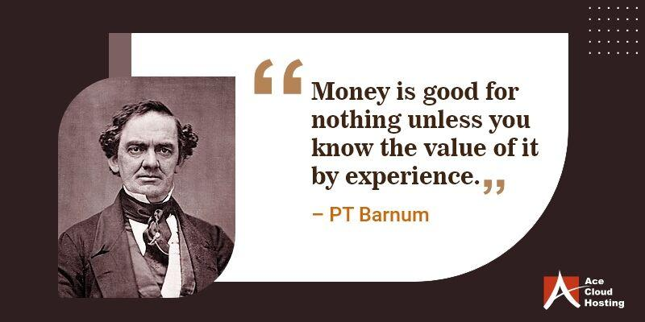

In the world of finance, understanding the role of quotations is crucial for making informed trading decisions. Quotations serve as essential indicators of market dynamics, providing real-time data on the prices at which assets such as stocks, bonds, or commodities are traded. They encompass various price points, including the bid and ask prices, as well as historical data like high, low, open, and close values. This information allows traders to gauge the current market sentiment and liquidity, forming the basis for both short-term and long-term financial strategies.

Quotations are particularly significant in the domain of algorithmic trading, where they are used to inform and execute trades with minimal human intervention. Algorithmic trading relies on complex algorithms and computer programs to analyze vast amounts of financial data quickly and conduct trades at optimal periods, thus enhancing efficiency and accuracy. By integrating quotations into these automated systems, algorithmic trading is able to improve trade execution and strategy formulation, ensuring that trades occur at the most advantageous times based on real-time market data.

This article explores the importance of financial quotations, emphasizing their significance in algorithmic trading. We delve into how algorithmic trading utilizes these quotations, demonstrating their role in enhancing trade execution and optimizing strategies in a rapidly evolving market environment.

## Table of Contents

## What is a Financial Quotation?

A financial quotation represents the current market snapshot of a traded asset, capturing the most recent sale price of financial instruments such as stocks, bonds, commodities, and derivatives. In addition to this sale price, quotations include vital bid and ask prices, serving as indicators of the highest price a buyer is willing to pay and the lowest price a seller will accept for a given asset. These prices are foundational for investors, as they reveal the asset's market value at a glance and assist in making time-sensitive trading decisions.

Quotations serve a critical function in providing a comprehensive view of an asset's market performance. They typically encompass additional data points such as high, low, open, and closing values. The high and low values represent the highest and lowest asset prices over a specific period, usually a trading day. These metrics allow investors to understand the volatility and price range of an asset within a given timeframe. The opening price reflects the asset’s price at the beginning of the trading session, while the closing price indicates its value at the end of the session. Traders and analysts often use these figures to gauge the momentum and trend direction of an asset.

The bid-ask spread, calculated by subtracting the bid price from the ask price, offers insights into the asset's liquidity and market interest. A narrow spread often signifies high liquidity and a competitive market environment, whereas a wider spread can indicate lower liquidity and higher transaction costs. Understanding the nuances of financial quotations enables investors to assess market sentiment and devise strategic trading decisions based on real-time data, ensuring they remain competitive in dynamic financial markets.

## Importance of Quotations in Financial Markets

Quotations are a fundamental component of financial markets, serving as a cornerstone for transparency and market efficiency. They provide real-time data necessary for making informed trading decisions, thereby shaping the strategies employed by different market participants. These quotations reflect the current market sentiment and [liquidity](/wiki/liquidity-risk-premium), which are critical for strategic trade planning.

Real-time data from quotations offer a clear snapshot of the market's supply and demand dynamics. Investors and traders rely heavily on this information to anticipate price movements and optimize their trading strategies. By examining these quotations, participants can determine market trends and potential future price fluctuations, enabling them to act swiftly and decisively.

One of the key aspects of quotations is the bid-ask spread, which represents the difference between the highest price a buyer is willing to pay (bid) and the lowest price a seller is prepared to accept (ask). The bid-ask spread is a crucial indicator of market liquidity and transaction costs. A narrower spread often signifies a more liquid market with lower transaction costs, while a wider spread may indicate reduced liquidity and higher costs for executing trades.

Both traditional and high-frequency traders depend significantly on the accuracy and immediacy of quotations to ensure effective trade execution. For traditional traders, quotations provide essential insights into the market's direction, allowing them to align their trading strategies accordingly. High-frequency traders, on the other hand, utilize sophisticated algorithms to capitalize on even the smallest discrepancies in quotations, executing trades within milliseconds to maximize their returns.

In summary, financial quotations are indispensable tools that underpin the functionality of modern financial markets. They not only enhance transparency and efficiency but also play a pivotal role in the strategic planning of trades by providing critical insights into market sentiment and liquidity. As such, quotations are integral to both the day-to-day operations and long-term strategies of various market participants.

 to Algorithmic Trading

Algorithmic trading involves the use of computer algorithms to automate trading processes based on a set of predefined criteria. This automation significantly enhances the speed and efficiency of trading activities, allowing for rapid execution that is unattainable through manual methods. By eliminating the need for constant human oversight, [algorithmic trading](/wiki/algorithmic-trading) reduces the likelihood of errors arising from emotional decision-making, ensuring more consistent and reliable performance.

One of the key advantages of algorithmic trading is its ability to process vast quantities of data in real-time. This capability enables traders to develop and implement highly precise trading strategies. Algorithms leverage data analytics to identify patterns and trends that would be impossible to discern manually. This data-driven approach enhances the ability to predict market movements, optimize trade timing, and execute orders at the most favorable prices.

Algorithmic trading is particularly beneficial for large-scale investors, such as hedge funds and institutional traders. These entities often need to conduct substantial trades without significantly impacting market prices. By breaking large trades into smaller, strategically-timed orders, algorithms can mitigate the market impact, thereby preserving the value of the trade. This approach, often referred to as "order slicing," ensures that large trades remain undetected by other market participants, thus avoiding undesirable shifts in stock prices.

The mathematical foundation underlying algorithmic trading often involves complex modeling and statistical techniques. For instance, mean reversion and statistical [arbitrage](/wiki/arbitrage) strategies rely on the assumption that prices will revert to their historical mean over time. These models require sophisticated understanding and implementation of statistical methods, often using programming languages such as Python to code and back-test trading strategies. Python's libraries like NumPy, pandas, and scikit-learn are commonly employed to handle large datasets and apply [machine learning](/wiki/machine-learning) algorithms.

Overall, algorithmic trading represents a paradigm shift in trading practices, moving away from manual transactions towards a more systematic, data-driven approach. This shift not only optimizes execution efficiency but also opens up new opportunities for innovation in the development of trading strategies. As technology continues to advance, the integration and refinement of algorithmic trading strategies will play an increasingly pivotal role in the financial markets.

## Integrating Quotations with Algorithmic Trading

Real-time quotations are indispensable in the domain of algorithmic trading, serving as the foundational data that algorithms require to make informed and timely trading decisions. These quotations include vital information such as the latest bid and ask prices, which are pivotal in determining the optimal timing and pricing for executing trades. By leveraging this data, algorithms are able to strategically assess market conditions, leading to enhanced trade execution and potentially increased profitability.

A crucial aspect of algorithmic trading is the ability to automate trading decisions and executions with precision, and this relies heavily on the accuracy of the bid and ask prices. When an algorithm receives accurate real-time quotations, it can identify opportune moments to enter or [exit](/wiki/exit-strategy) trades, optimizing trade execution and improving profitability margins. For instance, if an algorithm identifies a lower ask price in comparison to its valuation model, it may trigger a buy order to capitalize on perceived undervaluation. Conversely, a higher bid price could prompt a sell order to realize profits in an overvalued scenario.

In addition to trade execution, quotations play a significant role in risk management. Algorithms utilize real-time market data to identify anomalies or deviations from expected patterns, enabling them to adjust trading strategies dynamically. For example, sudden changes in the bid-ask spread, which may indicate shifting market liquidity or increased [volatility](/wiki/volatility-trading-strategies), can trigger risk mitigation strategies within the algorithmic framework. This capability allows traders to minimize potential losses and safeguard profitability despite the inherent risks associated with rapid market changes.

Moreover, these real-time data points contribute to building predictive models that can anticipate future market movements. By continuously analyzing historical and current market quotations, algorithmic systems can fine-tune their predictive capabilities, enhancing their ability to forecast price movements and execute trades accordingly.

As the landscape of algorithmic trading evolves, the integration of advanced technologies such as [artificial intelligence](/wiki/ai-artificial-intelligence) and machine learning is expected to further refine the use of real-time quotations. These technologies can enhance pattern recognition and improve the algorithms' responsiveness to market conditions, ultimately advancing the efficacy of algorithmic trading strategies. In conclusion, real-time quotations are a critical pillar in the construct of algorithmic trading, facilitating informed decision-making and effective risk management.

## Challenges and Future of Algorithmic Trading

Algorithmic trading offers numerous advantages, including accelerated trade execution and reduced human error, yet it faces several significant challenges. One primary concern is market impact. Algorithmic executions can affect the very prices they seek to exploit, particularly in markets with limited liquidity. When large orders are broken down into smaller trades to avoid significant price shifts, they can still influence market conditions, potentially leading to slippage and increased transaction costs.

Technology dependency is another challenge. Algorithmic trading relies heavily on sophisticated computer systems and network infrastructure. Any malfunction or latency in these technologies can result in substantial financial losses. Moreover, the rapid pace of technological advancement requires traders and financial institutions to continually update their systems to remain competitive, involving considerable costs and resources.

Regulatory scrutiny also adds a layer of complexity to algorithmic trading. Regulators across the globe are increasingly concerned about the potential for algorithms to contribute to market volatility and systemic risks. As a result, there is a growing trend towards implementing stringent regulations to monitor and control algorithmic trading activities. Market participants must navigate these evolving regulatory landscapes to ensure compliance and avoid penalties.

The future of algorithmic trading is closely tied to advancements in artificial intelligence (AI) and machine learning. These technologies promise to enhance the sophistication and efficacy of trading algorithms. AI can help in identifying hidden patterns in large datasets, enabling more predictive and adaptive trading strategies. Machine learning models can continually learn from market data, optimizing algorithms in real-time to adapt to changing market conditions.

To maintain a competitive edge in this fast-evolving environment, traders must stay informed about technological advancements and the implications of new regulations. This involves not only technological investments but also a strategic focus on risk management practices. As algorithmic trading continues to evolve, the integration of AI and machine learning will likely become increasingly crucial, offering enhanced capabilities for coping with the complexities of modern financial markets.

## Conclusion

Understanding quotations and their integration into algorithmic trading is vital for today's traders. Financial quotations offer a comprehensive view of market dynamics by providing real-time data on asset prices, including bid and ask prices. This data is crucial for the formulation and execution of trading strategies, as it helps traders assess market conditions and react promptly to market changes.

Algorithmic trading leverages these quotations by utilizing sophisticated algorithms to process vast amounts of data quickly and efficiently. By doing so, it enhances decision-making processes, allowing trades to be executed at the most opportune times to maximize returns and minimize risks. For instance, accurate bid-ask quotations support algorithms in identifying optimal entry and exit points, ensuring that trades align with the trader's strategic objectives.

Moreover, the integration of real-time quotations into algorithmic systems aids in adaptive risk management. Algorithms can detect and respond to market anomalies swiftly, adjusting trading strategies to mitigate potential losses. This adaptability is crucial in volatile market conditions, where quick responses can significantly impact trading outcomes.

As technology evolves, the symbiotic relationship between quotations and algorithmic trading is set to become even more integral to financial markets. The advancements in artificial intelligence and machine learning may enhance the sophistication of trading strategies, further reinforcing the importance of real-time data. Consequently, traders must remain informed about technological developments and market regulations to maintain a competitive advantage.

In conclusion, the ability to effectively incorporate financial quotations into algorithmic trading systems is a fundamental skill for modern traders, shaping the future of trading strategy development and execution. As algorithmic trading continues to progress, its dependence on accurate and timely quotations will persist as a foundational aspect of efficient and strategic trading.

## References & Further Reading

[1]: Bergstra, J., Bardenet, R., Bengio, Y., & Kégl, B. (2011). ["Algorithms for Hyper-Parameter Optimization."](https://papers.nips.cc/paper/4443-algorithms-for-hyper-parameter-optimization) Advances in Neural Information Processing Systems 24.

[2]: ["Advances in Financial Machine Learning"](https://www.amazon.com/Advances-Financial-Machine-Learning-Marcos/dp/1119482089) by Marcos Lopez de Prado

[3]: ["Evidence-Based Technical Analysis: Applying the Scientific Method and Statistical Inference to Trading Signals"](https://onlinelibrary.wiley.com/doi/book/10.1002/9781118268315) by David Aronson

[4]: ["Machine Learning for Algorithmic Trading"](https://github.com/stefan-jansen/machine-learning-for-trading) by Stefan Jansen

[5]: ["Quantitative Trading: How to Build Your Own Algorithmic Trading Business"](https://www.amazon.com/Quantitative-Trading-Build-Algorithmic-Business/dp/1119800064) by Ernest P. Chan