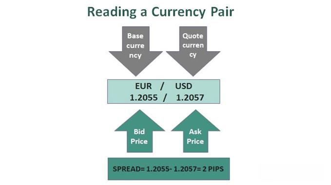

The world of finance is a complex and multifaceted domain, with the foreign exchange (forex) market being one of its most significant components. The forex market is renowned as the largest and most actively traded financial arena, operating 24 hours a day and involving a vast array of participants, from central banks to individual retail investors. A fundamental aspect of forex trading is understanding currency pairs, which consist of two currencies: the base currency and the quote currency. The quote currency, also known as the counter currency, is crucial in these pairs as it indicates how much of this currency is required to purchase one unit of the base currency.

Algorithmic trading, or algo trading, has ushered in a new era of efficiency and precision in currency trading. It leverages sophisticated computer programs to execute trades at speeds and volumes that are beyond human capability. This technological advancement allows for faster execution of trades and enables the deployment of advanced trading strategies that can adapt to market changes in real time. Algo trading has therefore become increasingly integral to the dynamics of forex trading.



In this article, we explore the essential concepts surrounding quote currency, the mechanisms of forex trading, and the transformative effects of algorithmic trading within this context. Understanding these facets is vital for anyone looking to navigate the forex market effectively, as they collectively shape the strategies and outcomes of trading activities in one of the most dynamic sectors of global finance.

## Table of Contents

## Understanding Quote Currency in Forex Trading

The quote currency, also known as the counter currency, plays a pivotal role in the forex market. In forex trading, currencies are quoted in pairs, with the first currency in the pair referred to as the base currency and the second currency known as the quote currency. The quote currency indicates the amount needed to purchase one unit of the base currency. 

For instance, in the currency pair GBP/USD, the USD serves as the quote currency. This means that the exchange rate conveys how much one British pound (GBP) is worth in terms of U.S. dollars (USD). If the exchange rate for GBP/USD is 1.30, it signifies that 1 GBP can be exchanged for 1.30 USD. This kind of notation helps traders understand the relative value of currencies against each other and assists in calculating gains or losses.

Understanding the quote currency is crucial for setting accurate pricing and devising effective trading strategies. Traders frequently need to interpret fluctuations in exchange rates to make informed decisions. A rise in the value of the base currency (GBP in the GBP/USD pair) relative to the quote currency means the exchange rate is increasing, indicating that more of the quote currency is required to purchase one unit of the base currency. Conversely, if the base currency depreciates, less of the quote currency is needed.

Pricing strategies in [forex](/wiki/forex-system) trading often hinge on the performance of the quote currency against the base currency. Market participants use this information not only to conduct transactions but also to speculate on currency movements. This dynamic nature underscores the importance of both currency constituents of a forex pair, determining trading positions, potential profits, and risks involved.

## Basics of Forex Trading

Forex trading involves the exchange of one currency for another, executed through currency pairs. Each pair consists of a base currency and a quote currency, with traders speculating on the price movement between the two. The value of a currency pair is affected by the relative demand for each currency within that pair. For instance, if a trader expects the euro to increase in value relative to the US dollar, they would buy the EUR/USD pair.

The forex market is known for its continuous operation, running 24 hours a day, five days a week. This round-the-clock schedule is due to the global nature of currency markets, allowing trading across different time zones. The peak trading periods coincide with the overlap of major financial market sessions, such as the London and New York sessions, which results in higher [liquidity](/wiki/liquidity-risk-premium) and [volatility](/wiki/volatility-trading-strategies).

Forex trading strategies can be broadly classified based on the trading time frame and risk appetite. Short-term strategies, such as [scalping](/wiki/gamma-scalping), involve making numerous small trades to capture minute price changes, often within seconds or minutes. Scalpers rely on high liquidity to quickly enter and [exit](/wiki/exit-strategy) positions with minimal price slippage. In contrast, long-term position trading involves holding positions for weeks, months, or even years, based on broader economic trends and [fundamental analysis](/wiki/fundamental-analysis). This strategy typically requires a larger capital investment and a more in-depth understanding of macroeconomic indicators that influence currency movements.

Traders, regardless of strategy, must stay informed about economic data releases, geopolitical events, and central bank policies, as these factors significantly impact currency values by affecting supply and demand dynamics. Understanding these elements is foundational for making informed trading decisions in the forex market.

## Algorithmic Trading in Forex

Algorithmic trading, commonly referred to as algo trading, utilizes computer programs to automate trading strategies based on predetermined criteria. This approach has significantly transformed the forex market by increasing the speed, accuracy, and efficiency of transactions. In the forex market, algorithms are designed to execute trades promptly, removing the emotional biases that human traders may have. This allows for consistent decision-making and the ability to manage trades around the clock without the need for continuous human intervention.

A key component of [algorithmic trading](/wiki/algorithmic-trading) is High-Frequency Trading ([HFT](/wiki/high-frequency-trading-strategies)), a specialized form of algo trading that seeks to exploit minimal price discrepancies that occur in fractions of a second. These trades are typically executed in large volumes and at a high velocity, allowing traders to capitalize on fleeting market opportunities. HFT relies heavily on sophisticated algorithms and robust technology infrastructure to maintain an edge in the competition.

While algorithmic trading contributes positively to market efficiency by increasing liquidity and ensuring tighter spreads, it is not without risks. One significant challenge is the risk of market fragmentation. As different trading venues emerge, liquidity can become dispersed, making it challenging to gauge true market depth. Additionally, during periods of market disruption, algorithmic trading can sometimes exacerbate volatility. This occurs when numerous algorithms concurrently react to an anomaly, potentially triggering cascading effects and large price swings.

To manage these risks, traders implementing algorithmic systems must ensure comprehensive risk management protocols. This includes setting appropriate stop-loss levels, implementing circuit breakers to pause trading during abnormal market conditions, and continuously monitoring the performance of the algorithms. 

The evolution of algo trading continues to shape the forex market landscape, necessitating that traders remain informed of technological and regulatory developments. As algorithms become more sophisticated, the potential for both opportunities and disruptions in the market grows, underscoring the importance of balancing innovation with prudent risk management practices.

## Advantages and Risks of Algo Trading

Algorithmic trading, commonly referred to as algo trading, offers several advantages that have transformed the trading landscape, particularly in the forex market. One of the primary benefits is the significant improvement in execution speed. By using automated systems, trades are executed in milliseconds, which minimizes the latency between decision-making and order placement. This speed is crucial in forex markets where currency values can fluctuate rapidly within short periods.

Another key advantage is the reduction in transaction costs. Automated systems often enable more efficient trade execution, which can lower the bid-ask spreads and reduce slippage—thereby decreasing overall trading expenses. Additionally, algorithmic trading allows for the [backtesting](/wiki/backtesting) of strategies. Traders can simulate their strategies against historical data to evaluate their performance and make necessary adjustments before live deployment.

However, algorithmic trading also presents distinct risks. One major concern is the potential for system failures. Technical glitches can lead to unexecuted trades or unintended orders, which can result in financial losses. Furthermore, unexpected market behavior poses another risk. Algo trading systems are based on predefined rules and past data, and they may fail to adapt to unforeseen market conditions, leading to suboptimal trading decisions.

Regulatory scrutiny is another critical [factor](/wiki/factor-investing) to consider in algo trading. Regulatory bodies may impose rules to prevent market manipulations or excessive volatility driven by high-frequency trading and other algorithmic strategies. Consequently, traders must ensure compliance with these regulations to avoid legal repercussions.

Effective risk management is essential to mitigate the downsides of algorithmic trading. Regular system checks and maintenance can prevent and address technical failures. It's also crucial to continually evaluate and adapt trading algorithms to changing market conditions. Implementing stop-loss mechanisms and diversifying trading strategies can further manage risk exposure in volatile markets. Thus, while algorithmic trading unlocks efficiencies and capabilities in forex trading, it requires rigorous oversight to navigate potential pitfalls successfully.

## Integrating Algo Trading into Forex Strategies

Integrating algorithmic trading into forex strategies involves a comprehensive understanding of market dynamics, effective risk management, and strategic development. A trader's success with algorithmic trading in the forex market largely hinges on the ability to design robust algorithms that can adapt to the fast-paced and ever-changing market conditions.

Backtesting is a critical step in the development of any algorithmic trading strategy. It involves applying trading algorithms to historical data to evaluate their effectiveness before risking actual capital. Backtesting allows traders to simulate trading over a past period and provides crucial insights into how a strategy might perform in the live market. Implementing backtesting requires access to reliable historical data and a solid understanding of the algorithms at hand. 

Here is a simple Python example using the popular library `[backtrader](/wiki/backtrader)` to perform a backtest of a moving average crossover strategy:

```python
import backtrader as bt

class MovingAverageCrossover(bt.Strategy):
    params = (('fast_period', 10), ('slow_period', 30),)

    def __init__(self):
        self.fast_ma = bt.indicators.SMA(self.data.close, period=self.params.fast_period)
        self.slow_ma = bt.indicators.SMA(self.data.close, period=self.params.slow_period)

    def next(self):
        if self.fast_ma > self.slow_ma:
            if not self.position:
                self.buy()
        elif self.fast_ma < self.slow_ma:
            if self.position:
                self.sell()

cerebro = bt.Cerebro()
data = bt.feeds.YahooFinanceData(dataname='EURUSD=X', fromdate=datetime(2020, 1, 1), todate=datetime(2020, 12, 31))
cerebro.adddata(data)
cerebro.addstrategy(MovingAverageCrossover)
cerebro.run()
```

Simulating trades in various market conditions is equally important as it tests the robustness of a strategy across different market environments, whether bullish, bearish, or ranging markets. This step ensures that algorithms are versatile and can sustain profitability across a variety of market scenarios.

Traders must stay updated with technological advancements and regulatory changes. The rapid developments in technology mean that successful algorithmic traders need to be agile and ready to incorporate new tools and methods. For instance, innovations in [machine learning](/wiki/machine-learning) and [artificial intelligence](/wiki/ai-artificial-intelligence) are increasingly being utilized in developing more sophisticated trading algorithms that can learn and adapt from large datasets.

Moreover, the forex market is subject to regulatory environments that can affect trading conditions. Staying compliant with the regulatory requirements ensures the longevity and legality of trading strategies. Regular updates and adaptations to both technology and regulations are not just beneficial but necessary for staying competitive and avoiding potential legal pitfalls.

In summary, integrating algorithmic trading into forex strategies requires diligent preparation, including backtesting, simulations, and continuous learning. It combines a tactical approach to risk management with an adaptability to both emerging technologies and changing regulatory landscapes.

## Conclusion

The intersection of quote currency, forex trading, and algorithmic strategies presents significant prospects and challenges for market participants. Understanding these elements is crucial for traders aiming to effectively capitalize on market fluctuations and improve their trading results. A thorough comprehension of quote currency enables traders to grasp price dynamics within currency pairs, forming the foundation of successful trading strategies.

Algorithmic trading has transformed forex markets, enhancing trade executions beyond manual capabilities by automating complex strategies. This evolution demands a nuanced approach, balancing the potential for heightened efficiency against inherent risks. Algorithmic tools, when used proficiently, can streamline operations, minimize human bias, and capitalize on fleeting opportunities resulting from minor price variations.

Looking ahead, the fusion of artificial intelligence (AI) and machine learning into forex and algorithmic trading heralds a new era of advanced trading methodologies. These technologies are anticipated to refine algorithms, enhance decision-making processes through predictive analytics, and enable the customization of trading strategies based on vast datasets. As AI continues to evolve, traders will likely benefit from increasingly sophisticated and adaptive trading solutions, positioning themselves advantageously within the dynamic forex market landscape.

## References & Further Reading

[1]: ["Quantitative Trading: How to Build Your Own Algorithmic Trading Business"](https://books.google.com/books/about/Quantitative_Trading.html?id=j70yEAAAQBAJ) by Ernest P. Chan

[2]: ["Advances in Financial Machine Learning"](https://www.amazon.com/Advances-Financial-Machine-Learning-Marcos/dp/1119482089) by Marcos Lopez de Prado

[3]: ["Machine Learning for Algorithmic Trading"](https://github.com/PacktPublishing/Machine-Learning-for-Algorithmic-Trading-Second-Edition) by Stefan Jansen

[4]: ["Evidence-Based Technical Analysis: Applying the Scientific Method and Statistical Inference to Trading Signals"](https://www.amazon.com/Evidence-Based-Technical-Analysis-Scientific-Statistical/dp/0470008741) by David Aronson

[5]: Osler, C. L. (2005). ["Currency Orders and Exchange Rate Dynamics: An Explanation for the Predictive Success of Technical Analysis."](https://www.jstor.org/stable/3648174) The Journal of Finance, 60(5), 1791-1820. 

[6]: Menkhoff, L., Sarno, L., Schmeling, M., & Schrimpf, A. (2012). ["Currency Momentum Strategies."](https://papers.ssrn.com/sol3/papers.cfm?abstract_id=1809776) The Journal of Financial Economics, 106(3), 660-684.