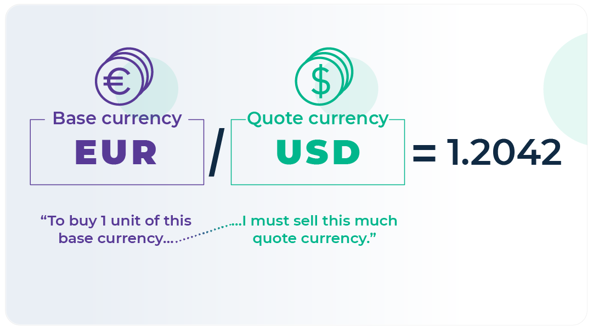

## Table of Contents

## What is a quote currency?

A quote currency is the second currency in a currency pair used in foreign exchange trading. It is the currency that the value of the base currency is being compared to. For example, if you are looking at the EUR/USD pair, the USD is the quote currency. This means that the price you see tells you how many US dollars you need to buy one Euro.

In simple terms, the quote currency helps you understand how much of one currency you can get for another. It's important because it allows traders and investors to see the relative value of different currencies and make decisions based on that information. Without a quote currency, it would be hard to know how much your money is worth in another country's currency.

## How does the quote currency differ from the base currency in a currency pair?

In a currency pair, the base currency and the quote currency have different roles. The base currency is the first currency listed in the pair. It's the main currency that you want to know the value of. For example, if you see EUR/USD, the EUR (Euro) is the base currency. This means you're trying to find out how many US dollars you can get for one Euro.

The quote currency, on the other hand, is the second currency in the pair. It tells you how much of this currency you need to buy one unit of the base currency. Using the same example, USD (US Dollar) is the quote currency in EUR/USD. So, the price you see shows how many US dollars you need to buy one Euro. The quote currency helps you understand the value of the base currency in terms of another currency.

## Why is the quote currency important in forex trading?

The quote currency is really important in [forex](/wiki/forex-system) trading because it helps traders know how much one currency is worth compared to another. When you see a currency pair like EUR/USD, the quote currency (USD) tells you how many US dollars you need to buy one Euro. This is key because it lets traders see if a currency is getting stronger or weaker. If the number of US dollars needed to buy one Euro goes up, it means the Euro is getting stronger compared to the US dollar.

Understanding the quote currency also helps traders make smart choices about when to buy or sell currencies. For example, if a trader thinks the Euro will get stronger against the US dollar, they might buy the EUR/USD pair. They would do this hoping to sell it later for more US dollars than they paid. Without knowing the value of the quote currency, it would be hard to make these kinds of decisions. So, the quote currency is a big part of what makes forex trading work.

## Can you give examples of common quote currencies?

In forex trading, some currencies are used a lot as quote currencies. The most common one is the US dollar (USD). You will see the US dollar as the quote currency in many currency pairs like EUR/USD, GBP/USD, and AUD/USD. This means that these pairs show how many US dollars you need to buy one Euro, one British pound, or one Australian dollar.

Another common quote currency is the Japanese yen (JPY). You can see it in pairs like USD/JPY, EUR/JPY, and GBP/JPY. These pairs tell you how many Japanese yen you need to buy one US dollar, one Euro, or one British pound. The yen is often used because Japan is a big player in the world economy.

Sometimes, the euro (EUR) is also used as a quote currency. You might see pairs like GBP/EUR or USD/EUR. These pairs show how many euros you need to buy one British pound or one US dollar. The euro is used a lot because it's the currency of many countries in Europe, making it important in global trade.

## How is the value of a quote currency determined?

The value of a quote currency is determined by how much of it you need to buy one unit of the base currency. This value changes all the time because of things like how strong a country's economy is, interest rates, and what people think will happen in the future. For example, if more people want to buy the base currency, the value of the quote currency goes up because you need more of it to buy the same amount of the base currency.

A lot of things can affect the value of a quote currency. If a country's economy is doing well, its currency might get stronger, which means you need less of it to buy other currencies. On the other hand, if a country is having problems, its currency might get weaker, and you would need more of it to buy the same amount of another currency. Traders and investors watch these things closely to try to guess what will happen next and make their trades at the best times.

## What impact does the strength of a quote currency have on trading?

The strength of a quote currency really matters in trading because it changes how much you need to buy other currencies. If the quote currency gets stronger, you need less of it to buy the base currency. This means the price of the currency pair goes down. For example, if the US dollar (USD) is the quote currency and it gets stronger, the price of EUR/USD will go down because you need fewer US dollars to buy one Euro. Traders need to watch this closely because it can affect how much money they make or lose.

On the other hand, if the quote currency gets weaker, you need more of it to buy the base currency. This makes the price of the currency pair go up. Using the same example, if the US dollar gets weaker, the price of EUR/USD will go up because you need more US dollars to buy one Euro. This can be good for traders who have bought the currency pair because the value of their trade goes up, but it can be bad for those who want to buy it now because it costs more. Keeping an eye on the strength of the quote currency helps traders make better choices about when to buy or sell.

## How do exchange rates involving the quote currency affect international trade?

Exchange rates involving the quote currency play a big role in international trade. When a country's currency gets stronger, it means other countries need less of their own money to buy goods from that country. This can make their products cheaper for foreign buyers, which might help them sell more stuff abroad. But, it can also make it more expensive for that country to buy things from other places because they need more of their own money to do it. So, a strong quote currency can help a country's exports but hurt its imports.

On the flip side, if a country's currency gets weaker, it means other countries need more of their own money to buy the same goods. This can make those goods more expensive for foreign buyers, which might lead to fewer sales abroad. But, it also makes it cheaper for that country to buy things from other places because they need less of their own money to do it. So, a weak quote currency can hurt a country's exports but help its imports. Understanding these changes is important for businesses that trade across borders because it affects how much they can buy and sell.

## What are the risks associated with fluctuations in the quote currency?

When the value of the quote currency goes up and down a lot, it can make trading risky. If you're trying to buy or sell something in another country, a sudden change in the quote currency's value can mean you end up paying more or getting less money than you expected. This can hurt businesses that rely on selling stuff to other countries because if their currency gets weaker, their products might cost more for foreign buyers, and they might sell less. It can also make it harder for them to plan because they can't be sure how much money they'll make.

For people who invest in forex trading, big swings in the quote currency can lead to big wins or big losses. If you think a currency will get stronger and it does, you can make a lot of money. But if it gets weaker instead, you can lose a lot. This kind of risk can make forex trading exciting but also stressful because you have to keep a close eye on what's happening and be ready to act fast. Understanding these risks is important for anyone involved in international trade or forex trading because it helps them make better choices and protect their money.

## How can traders hedge against movements in the quote currency?

Traders can hedge against movements in the quote currency by using financial tools like forward contracts. A forward contract lets you agree to buy or sell a currency at a set price on a future date. This means you can lock in the current exchange rate, so even if the quote currency's value changes a lot later, you know exactly how much you'll pay or get. This can help protect you from sudden changes in the currency's value and make it easier to plan your trades.

Another way to hedge is by using options. An option gives you the right, but not the obligation, to buy or sell a currency at a certain price before a certain date. If the quote currency moves against you, you can use the option to trade at the better price you locked in earlier. But if the currency moves in your favor, you don't have to use the option and can trade at the new, better rate. This gives you more flexibility and can help reduce the risk of big losses from unexpected changes in the quote currency's value.

## What role does the quote currency play in cross-currency transactions?

In cross-currency transactions, the quote currency helps you understand how much of one currency you need to buy another currency. Let's say you want to trade Euros for Japanese yen. You would look at the EUR/JPY pair, where the yen is the quote currency. This pair tells you how many yen you need to buy one Euro. Knowing this helps you figure out the cost of the trade and make sure you're getting a good deal.

The value of the quote currency can change because of things like how well a country's economy is doing or what people think will happen with that currency in the future. If the yen gets stronger, you would need fewer yen to buy one Euro, making the EUR/JPY pair's price go down. If the yen gets weaker, you would need more yen to buy one Euro, making the EUR/JPY pair's price go up. Traders need to keep an eye on these changes to make smart choices about when to do their cross-currency trades.

## How do central bank policies influence the value of the quote currency?

Central bank policies can have a big impact on the value of the quote currency. When a central bank changes its interest rates, it can make the currency stronger or weaker. If a central bank raises interest rates, it can attract more foreign money because people want to get a better return on their investments. This makes the currency stronger because more people want to buy it. On the other hand, if the central bank lowers interest rates, it might make the currency weaker because it's less attractive to foreign investors.

Central banks also use other tools, like buying or selling their own currency, to influence its value. If a central bank wants to make its currency weaker, it might sell a lot of it in the market. This increases the supply of the currency, making it less valuable. If the central bank wants to make its currency stronger, it might buy a lot of it, which reduces the supply and makes it more valuable. These actions by central banks can change how much of the quote currency you need to buy the base currency, affecting the exchange rate and how traders and businesses plan their moves.

## What advanced strategies can traders use to capitalize on quote currency volatility?

Traders can use a strategy called [carry](/wiki/carry-trading) trading to make money from quote currency [volatility](/wiki/volatility-trading-strategies). In carry trading, they borrow money in a currency with a low interest rate and then use that money to buy a currency with a higher interest rate. If the quote currency they borrowed gets weaker, they can pay back the loan with less of their own money, making a profit from the difference in interest rates and the change in the exchange rate. This strategy works well when there's a lot of volatility because big swings in the quote currency's value can lead to bigger profits. But it's also risky because if the quote currency gets stronger instead, traders could lose money.

Another advanced strategy is using technical analysis to predict and trade on quote currency volatility. Traders look at charts and patterns to guess where the quote currency's value might go next. They might use tools like moving averages, which help them see the general direction of the currency's value, or indicators like the Relative Strength Index (RSI) to see if the currency is overbought or oversold. By understanding these patterns and indicators, traders can make trades that take advantage of the ups and downs in the quote currency's value. This strategy needs a lot of practice and understanding of the market, but it can help traders make money from volatility if they do it right.

## What is the understanding of quote currencies?

In Forex trading, the quote currency is integral to establishing the exchange rate, as it pairs with the base currency to depict the relative value. The quote currency is the second currency in a currency pair; for instance, in the EUR/USD pair, USD is the quote currency. This currency signifies the amount required to purchase a single unit of the base currency, thus playing a crucial role in transactions. An understanding of quote currencies is vital for grasping the intricacies of exchange rates and anticipated transaction costs.

Exchange rates are represented as:

$$
\text{Exchange Rate} = \frac{\text{Base Currency}}{\text{Quote Currency}}
$$

This equation outlines how much of the quote currency is needed to acquire one unit of the base currency. For instance, if the EUR/USD exchange rate is 1.20, it means 1 Euro (EUR) is equivalent to 1.20 US Dollars (USD).

Fluctuations in the value of the quote currency can substantially impact the profitability of Forex trades. When the value of the quote currency rises, the exchange rate falls if the base currency remains constant, affecting gains or losses in trading positions. Conversely, a decrease in the quote currency's value would elevate the exchange rate, potentially affecting trade outcomes favorably or unfavorably, depending on the position taken.

Traders consistently monitor economic indicators and geopolitical events that could influence the quote currencies. Variables such as inflation rates, interest rates, political stability, and fiscal policies are key drivers that can lead to shifts in currency value. For example, an [interest rate](/wiki/interest-rate-trading-strategies) hike in the United States might strengthen the USD, affecting any currency pair where USD is the quote currency. 

Staying informed about these factors assists traders in making educated predictions about potential market movements, allowing them to adjust their trading strategies accordingly. This constant analysis and adaptation can optimize trading outcomes by enhancing the trader's awareness of potential risks and opportunities linked to the quote currency and its relative influence on market dynamics.

## References & Further Reading

[1]: Bank for International Settlements. (2019). ["Triennial Central Bank Survey: Foreign exchange turnover in April 2019."](https://www.bis.org/statistics/rpfx19_fx.pdf)

[2]: Investopedia. ["Forex Market Hours and Trading Sessions."](https://www.investopedia.com/articles/forex/08/3-market-system.asp)

[3]: Lopez de Prado, Marcos. ["Advances in Financial Machine Learning."](https://www.amazon.com/Advances-Financial-Machine-Learning-Marcos/dp/1119482089) Wiley.

[4]: Aronson, David. ["Evidence-Based Technical Analysis: Applying the Scientific Method and Statistical Inference to Trading Signals."](https://www.amazon.com/Evidence-Based-Technical-Analysis-Scientific-Statistical/dp/0470008741) Wiley.

[5]: Jansen, Stefan. ["Machine Learning for Algorithmic Trading."](https://github.com/stefan-jansen/machine-learning-for-trading) Independently Published.

[6]: Chan, Ernest P. ["Quantitative Trading: How to Build Your Own Algorithmic Trading Business."](https://github.com/ftvision/quant_trading_echan_book) John Wiley & Sons.