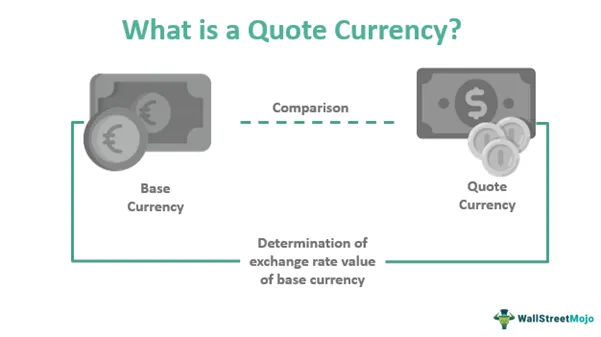

In the fast-paced world of foreign exchange (Forex) trading, the use of quote currencies and algorithmic trading is crucial for success. Quote currencies play a vital role as they are paired with base currencies to establish the exchange rate, determining how much of the quote currency is required to obtain a single unit of the base currency. Mastering the dynamics of quote currencies can give traders an edge in predicting market movements, as fluctuations in these currencies can significantly impact trade profitability.

Algorithmic trading, or algo trading, involves the integration of technology and financial strategies to enhance trading efficiency. By using pre-set algorithms, traders can swiftly analyze vast data sets, execute trades with precision, and adhere to consistent trading strategies devoid of emotional interference. This synergy between cutting-edge technology and trading tactics is essential for optimizing operations in the highly volatile currency markets.



This article introduces foundational aspects of quote currencies and the mechanisms of foreign exchange, along with the utilization of algo trading. Whether you're a novice trader aiming to build your skillset or a seasoned professional seeking to stay competitive, harnessing these tools and concepts can markedly enhance your trading capabilities. Through continuous learning and adaptation, traders can better position themselves in this dynamic financial environment, maximizing their potential for success.

## Table of Contents

## Understanding Quote Currencies

In Forex trading, the quote currency is integral to establishing the exchange rate, as it pairs with the base currency to depict the relative value. The quote currency is the second currency in a currency pair; for instance, in the EUR/USD pair, USD is the quote currency. This currency signifies the amount required to purchase a single unit of the base currency, thus playing a crucial role in transactions. An understanding of quote currencies is vital for grasping the intricacies of exchange rates and anticipated transaction costs.

Exchange rates are represented as:

$$
\text{Exchange Rate} = \frac{\text{Base Currency}}{\text{Quote Currency}}
$$

This equation outlines how much of the quote currency is needed to acquire one unit of the base currency. For instance, if the EUR/USD exchange rate is 1.20, it means 1 Euro (EUR) is equivalent to 1.20 US Dollars (USD).

Fluctuations in the value of the quote currency can substantially impact the profitability of Forex trades. When the value of the quote currency rises, the exchange rate falls if the base currency remains constant, affecting gains or losses in trading positions. Conversely, a decrease in the quote currency's value would elevate the exchange rate, potentially affecting trade outcomes favorably or unfavorably, depending on the position taken.

Traders consistently monitor economic indicators and geopolitical events that could influence the quote currencies. Variables such as inflation rates, interest rates, political stability, and fiscal policies are key drivers that can lead to shifts in currency value. For example, an [interest rate](/wiki/interest-rate-trading-strategies) hike in the United States might strengthen the USD, affecting any currency pair where USD is the quote currency. 

Staying informed about these factors assists traders in making educated predictions about potential market movements, allowing them to adjust their trading strategies accordingly. This constant analysis and adaptation can optimize trading outcomes by enhancing the trader's awareness of potential risks and opportunities linked to the quote currency and its relative influence on market dynamics.

## The Role of Foreign Exchange Markets

Foreign exchange markets, commonly known as Forex markets, are crucial for the conversion of national currencies, enabling global economic activities and the facilitation of international trade and finance. These markets represent the world's largest financial market with a staggering daily trading [volume](/wiki/volume-trading-strategy) that exceeds $6 trillion, highlighting their importance and the breadth of participation across the globe [1].

One of the defining characteristics of Forex markets is their continuous operation. As a decentralized market, Forex trading spans the global financial hubs, ensuring that trades can occur 24 hours a day across different time zones. This uninterrupted operation from markets opening in Asia and moving through Europe to North America allows for a seamless and fluid trading environment that accommodates international business and investments [2].

Forex markets significantly contribute to providing [liquidity](/wiki/liquidity-risk-premium) and stability. Liquidity ensures that large transactions can be executed with minimal price impact, a vital aspect for both traders and large entities moving substantial sums for business purposes. Stability, on the other hand, is essential for fostering confidence among international traders and investors, making Forex indispensable for managing global financial risks and facilitating trade agreements.

Traders in the Forex market have the opportunity to profit by capitalizing on fluctuations in currency values. The market's [volatility](/wiki/volatility-trading-strategies), while presenting challenges, also opens avenues for applying various trading strategies. For instance, traders may employ technical analysis to predict currency trends or engage in [arbitrage](/wiki/arbitrage) to exploit pricing discrepancies between different markets.

However, the inherent volatility of Forex markets also brings a unique set of opportunities and risks. Swift changes in currency prices can lead to substantial profits, but they can also result in significant losses if not managed properly. This environment necessitates informed and strategic decision-making. Traders often use tools and strategies such as stop-loss orders and diversification to mitigate risks and optimize returns.

In conclusion, the role of foreign exchange markets in global finance is pivotal, providing a mechanism for currency conversion, a platform for global commerce, and opportunities for traders to engage with the constant ebb and flow of currency valuations.

### References
1. Bank for International Settlements. (2019). Triennial Central Bank Survey: Foreign exchange turnover in April 2019.
2. Investopedia. "Forex Market Hours and Trading Sessions." Retrieved from https://www.investopedia.com/articles/forex/06/forextrading.asp

 to Algorithmic Trading in Forex

Algorithmic trading in Forex involves the use of automated software to execute trades based on predetermined criteria. This approach enables traders to process vast datasets much quicker than human analysts could, significantly enhancing the efficiency of decision-making in Forex markets. The software evaluates numerous market indicators simultaneously, allowing traders to capitalize on even the slightest market fluctuations in a timely manner.

One of the primary benefits of [algorithmic trading](/wiki/algorithmic-trading) is its capacity to eliminate emotion-driven trading decisions. Human traders can be swayed by biases or impulses; however, algorithmic systems execute trades strictly according to their coded strategies, ensuring consistency and objectivity. This objectivity helps in maintaining a disciplined trading approach, which is particularly crucial in the volatile currency markets.

Recent advancements in [artificial intelligence](/wiki/ai-artificial-intelligence) (AI) and [machine learning](/wiki/machine-learning) have further evolved algorithmic trading systems, endowing them with adaptive learning capabilities to refine strategies over time. These systems can now identify complex patterns and trends in financial data that were previously impossible to detect with traditional trading strategies. For example, machine learning algorithms can be trained on historical data to recognize recurring trading signals, optimizing strategies for various market conditions.

The growing popularity of algorithmic trading in Forex reflects its potential to improve both the accuracy and speed of trading operations. High-frequency trading, a form of algorithmic trading, is particularly noteworthy. It involves executing a large number of orders at extremely high speeds, often in fractions of a second. This can yield significant profits by exploiting small price discrepancies in the market.

The integration of algorithmic trading in Forex is further facilitated by the continuous advancements in computing power and network technologies. Traders can deploy algorithms that operate around the clock, ensuring no profitable trading opportunities are missed during offline hours. Additionally, the ability to backtest trading strategies using historical data allows traders to evaluate their potential effectiveness and refine their algorithms before applying them to real-time trading.

Overall, algorithmic trading in Forex leverages technology to enhance trading precision and efficiency, offering traders a powerful tool to navigate the complexities of the currency markets.

## Benefits of Using Algo Trading in Currency Markets

Algorithmic trading, often referred to as algo trading, offers numerous advantages in currency markets, significantly enhancing trading efficiency and effectiveness. A notable benefit is its ability to conduct [backtesting](/wiki/backtesting) on trading strategies using historical data. This process allows traders to evaluate and refine their strategies' performance before deploying them in live trading environments. By simulating trades on past data, traders can identify potential flaws and optimize their approach, ensuring greater reliability when applied in real market conditions.

Another advantage of algo trading is its facilitation of high-frequency trading ([HFT](/wiki/high-frequency-trading-strategies)). HFT enables the execution of a large number of trades at exceptionally fast speeds, capturing short-term market inefficiencies for profit. The ability to act on these minute discrepancies can provide substantial financial returns that human traders may miss due to slower reaction times. This continuous operation capability of algorithmic systems ensures that trades are executed even during off-hours, thereby maximizing potential profit windows and improving overall market presence.

Algorithmic trading also significantly reduces the scope for human error, which is a common issue in manual trading. By adhering strictly to pre-set strategies and criteria, algo trading ensures that trades are executed with high accuracy and consistency. This precision helps in maintaining discipline, as trades are carried out devoid of the emotional biases that often cloud human judgment.

Moreover, algorithmic trading is instrumental in effective risk management. Algo systems can be configured with predetermined stop-loss and take-profit levels, automatically executing trades when specific market conditions are met. This feature allows traders to manage their exposure efficiently, protecting against excessive losses and securing profits systematically. For instance, a Python snippet for setting up a simple stop-loss mechanism could look like this:

```python
def execute_trade(current_price, stop_loss, take_profit, entry_price):
    if current_price <= stop_loss:
        print("Stop-loss triggered, exiting trade.")
        return "Exit Trade"
    elif current_price >= take_profit:
        print("Take-profit triggered, exiting trade.")
        return "Exit Trade"
    else:
        print("Holding position.")
        return "Hold Position"

# Example usage
result = execute_trade(current_price=105, stop_loss=100, take_profit=110, entry_price=102)
```

In conclusion, the incorporation of algorithmic trading in currency markets offers substantial benefits by enhancing the precision, speed, and efficiency of trading operations. While tackling complex market dynamics, algo trading stands out as a powerful tool for both novice and seasoned traders, providing a competitive edge through systematic and disciplined trading methodologies.

## Challenges and Considerations in Algo Trading

Developing a successful algorithmic trading strategy in the Forex market is a complex task that demands a sophisticated blend of technical skills and financial acumen. One of the primary challenges is adapting to the rapid fluctuations in market conditions. These fluctuations require algorithms to be flexible and capable of quick adjustments to avoid losses. Unlike static investment strategies, algorithmic systems must evolve with the market to remain effective.

A significant risk in algo trading is over-optimization, often referred to as curve fitting. This occurs when a model is tailored too closely to historical data, performing impressively in backtesting scenarios but failing to deliver similar results in live markets. Over-optimized algorithms may miss out on future market dynamics, thus failing to generate expected returns. Developers must strive for a balance between complexity and generalization, ensuring algorithms are robust enough to handle unforeseen market behaviors.

System robustness against external threats is another crucial consideration. With the increasing sophistication of cyber threats, ensuring the security of trading systems is paramount. This requires implementing stringent cybersecurity measures and routinely testing system vulnerabilities. Additionally, technical failures such as hardware malfunctions or connectivity issues can disrupt operations, necessitating the development of fail-safes and backup systems to maintain trading continuity.

Regulatory compliance and ethical considerations play a critical role in algorithmic trading. Traders must navigate a landscape of regulations that vary across jurisdictions, ensuring their strategies adhere to legal standards. This includes respecting market manipulation rules and maintaining transparency in trading operations. Ethical considerations, such as the fairness of trading algorithms and their impact on market dynamics, are increasingly under scrutiny, necessitating a responsible approach to algo trading practices.

In conclusion, while the potential of algorithmic trading is substantial, realizing its benefits requires navigating a complex array of challenges. From maintaining adaptive strategies and ensuring robust systems to adhering to regulatory frameworks, traders must adopt a comprehensive approach to succeed in the competitive Forex market.

## Conclusion

The integration of quote currencies and algorithmic trading is pivotal in shaping effective Forex trading strategies today. Algo trading offers significant advantages, such as enhanced speed, accuracy, and the ability to process vast quantities of data. However, traders must remain vigilant and aware of the challenges that accompany these benefits. These challenges include potential over-optimization, the necessity for constant updates in response to market changes, and maintaining regulatory compliance.

To optimize trading success, it is essential to combine a robust understanding of market fundamentals with the capabilities offered by advanced technology. A firm grip on the intricacies of quote currencies allows traders to navigate exchange rate fluctuations and make informed decisions. Meanwhile, algorithmic trading empowers traders to execute strategies with precision and efficiency. 

Markets and technologies are continuously evolving, demanding ongoing learning and adaptation from Forex traders. Staying informed about the latest trends, tools, and practices is crucial to maintaining a competitive edge. By mastering both the fundamental and technological aspects of Forex trading, traders can strategically position themselves to capitalize on opportunities in this dynamic market environment. As the landscape of Forex continues to develop, those who can effectively integrate these elements will likely experience greater success and resilience in their trading endeavors.

## References & Further Reading

[1]: Bank for International Settlements. (2019). ["Triennial Central Bank Survey: Foreign exchange turnover in April 2019."](https://www.bis.org/statistics/rpfx19_fx.pdf)

[2]: Investopedia. ["Forex Market Hours and Trading Sessions."](https://www.investopedia.com/articles/forex/08/3-market-system.asp)

[3]: Lopez de Prado, Marcos. ["Advances in Financial Machine Learning."](https://www.amazon.com/Advances-Financial-Machine-Learning-Marcos/dp/1119482089) Wiley.

[4]: Aronson, David. ["Evidence-Based Technical Analysis: Applying the Scientific Method and Statistical Inference to Trading Signals."](https://www.amazon.com/Evidence-Based-Technical-Analysis-Scientific-Statistical/dp/0470008741) Wiley.

[5]: Jansen, Stefan. ["Machine Learning for Algorithmic Trading."](https://github.com/stefan-jansen/machine-learning-for-trading) Independently Published.

[6]: Chan, Ernest P. ["Quantitative Trading: How to Build Your Own Algorithmic Trading Business."](https://github.com/ftvision/quant_trading_echan_book) John Wiley & Sons.