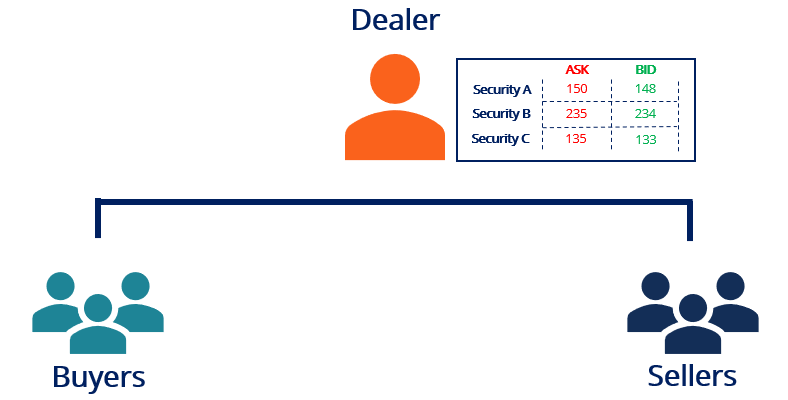

## Table of Contents

## What is a quote-driven market?

A quote-driven market is a type of financial market where dealers or market makers provide the prices at which they are willing to buy and sell securities. These dealers post their "quotes," which include a bid price (the price they are willing to pay to buy the security) and an ask price (the price at which they are willing to sell the security). Investors then trade with these dealers based on the posted quotes.

In a quote-driven market, the dealers act as intermediaries between buyers and sellers. They profit from the difference between the bid and ask prices, known as the bid-ask spread. This system is common in markets for less liquid securities, where it might be harder for buyers and sellers to find each other directly. Examples of quote-driven markets include the over-the-counter (OTC) markets for stocks and bonds.

## How do quote-driven markets differ from order-driven markets?

In quote-driven markets, dealers or market makers set the prices. They tell you how much they will buy a security for (the bid price) and how much they will sell it for (the ask price). When you want to buy or sell, you deal directly with these dealers. They make money from the difference between the bid and ask prices, called the spread. This type of market is often used for securities that are not traded a lot, like some stocks and bonds in over-the-counter markets.

Order-driven markets work differently. Here, buyers and sellers come together and trade directly with each other without dealers. They place their own orders into a system, saying what price they want to buy or sell at. The system matches these orders. If your buy order matches someone else's sell order, the trade happens. This type of market is common in big stock exchanges where lots of people are trading, like the New York Stock Exchange.

The main difference is who sets the prices. In quote-driven markets, dealers control the prices, while in order-driven markets, the prices come from what buyers and sellers are willing to do. This can affect how easy it is to trade and how much it costs.

## What are the primary functions of dealers in quote-driven markets?

In quote-driven markets, dealers are really important because they help people buy and sell things like stocks or bonds. They do this by telling everyone how much they will pay to buy something (the bid price) and how much they want to sell it for (the ask price). When someone wants to trade, they go to the dealer. The dealer makes money from the difference between these two prices, which is called the spread. This is good for the market because it makes sure there is always someone ready to buy or sell, even if not many people are trading that security.

Dealers also help keep the market running smoothly. They keep an eye on how much of a security they have and adjust their prices if needed. This helps keep the market stable. Because dealers are always there, people feel more confident about trading. It's like having a store where you can always go to buy or sell something, no matter how popular it is. This is especially helpful for securities that don't get traded a lot, making the market work better for everyone.

## Can you explain the role of bid and ask prices in quote-driven markets?

In quote-driven markets, dealers set two important prices: the bid price and the ask price. The bid price is what the dealer is willing to pay to buy a security from you. If you want to sell, you can sell it to the dealer at this price. The ask price is what the dealer wants to sell the security for. If you want to buy, you have to pay this price to the dealer. These two prices are like the dealer's shopping list - one for buying and one for selling.

The difference between the bid and ask prices is called the spread. This is how dealers make money. They buy low at the bid price and sell high at the ask price. The spread gives dealers an incentive to be in the market, ready to buy or sell whenever someone wants to trade. This makes the market more stable and easier to use, especially for securities that don't trade very often. By setting these prices, dealers help keep the market running smoothly and make sure there's always someone to trade with.

## What are the advantages of participating in quote-driven markets for traders?

Quote-driven markets can be really helpful for traders, especially if they are trading things that don't get traded a lot. In these markets, dealers are always there, ready to buy or sell. This means that if you want to trade a security that's not very popular, you can still do it easily. You don't have to wait around hoping to find someone else who wants to trade the same thing at the same time. This makes trading quicker and more reliable.

Another advantage is that dealers in quote-driven markets give you clear prices. They tell you exactly what they will pay to buy something from you (the bid price) and what they want to sell it for (the ask price). This makes it easier for you to decide if you want to trade. You can see right away if the price is good for you. Plus, knowing that dealers are always there can make you feel more confident about trading, because you know you can always make a trade when you need to.

## What are the potential risks and disadvantages for traders in quote-driven markets?

One big risk in quote-driven markets is that dealers set the prices. This means they can change the bid and ask prices whenever they want. If a dealer decides to change the prices a lot, it could make trading less fair for you. You might end up buying at a higher price or selling at a lower price than you expected. This can happen because dealers are trying to make money from the difference between the bid and ask prices, called the spread.

Another disadvantage is that trading in quote-driven markets can be more expensive. The spread between the bid and ask prices is how dealers make their money. Sometimes, this spread can be big, especially for securities that don't get traded a lot. This means you might have to pay more to buy something or get less money when you sell. It can make trading more costly and might affect how much profit you can make or how much you might lose.

Lastly, quote-driven markets can be less transparent. Since dealers control the prices, it can be harder for you to know if you're getting a good deal. You might not have as much information about what other people are willing to pay or accept for a security. This lack of transparency can make it trickier to make smart trading decisions and can increase the risk of making a bad trade.

## How do regulatory frameworks impact the operation of quote-driven markets?

Regulatory frameworks are really important for how quote-driven markets work. They help make sure that dealers, who set the prices for buying and selling securities, play fair. Rules from regulators can say things like how much dealers can charge between the bid and ask prices, which is called the spread. This helps keep trading costs down for everyone. Regulators also make sure dealers have enough money to cover their trades, so they don't go out of business and leave traders in a bad spot. This makes the market safer and more reliable for everyone who uses it.

Another way regulations affect quote-driven markets is by making sure there's enough information for everyone. Regulators can require dealers to report their prices and trades, so everyone can see what's going on. This helps make the market more transparent, which means traders can make better decisions. Without these rules, dealers might be able to hide what they're doing, and that could make trading unfair. So, regulations help keep the market honest and working well for all traders.

## What is the impact of market maker activities on liquidity in quote-driven markets?

Market makers are really important for keeping quote-driven markets liquid. They do this by always being ready to buy and sell securities, which means there's always someone to trade with. This is especially helpful for securities that don't get traded a lot. When market makers are active, it's easier for traders to buy or sell quickly, without having to wait for someone else who wants to do the opposite trade. This makes the market more active and easier to use.

However, the activities of market makers can also affect how much it costs to trade. They make money from the difference between the bid and ask prices, called the spread. If the spread is big, it can make trading more expensive. Sometimes, if there's not a lot of trading going on, market makers might make the spread even bigger to cover their risk. So, while market makers help keep the market liquid, they can also make trading more costly, especially for securities that aren't very popular.

## How do technological advancements affect the efficiency of quote-driven markets?

Technological advancements have made quote-driven markets a lot more efficient. With computers and the internet, dealers can update their bid and ask prices very quickly. This means traders can see the latest prices in real-time and make faster decisions. Also, technology helps dealers handle more trades at the same time without making mistakes. This makes the whole market run smoother and helps traders get in and out of their trades more easily.

Another way technology helps is by making information more available. With online platforms, traders can see what's happening in the market anytime, anywhere. This makes the market more transparent because everyone can see the same information. Plus, technology has made it easier for dealers to connect with more traders, which can increase the number of people trading and make the market more liquid. Overall, technology has made quote-driven markets faster, clearer, and easier to use for everyone involved.

## What are the implications of quote-driven markets on price discovery processes?

In quote-driven markets, dealers set the prices for buying and selling securities, which affects how prices are discovered. Price discovery is all about figuring out the right price for something based on what people are willing to pay or accept. In these markets, dealers post their bid and ask prices, and traders use these prices to decide if they want to buy or sell. This can make price discovery a bit different because the dealers' quotes are the main guide for what the price should be. If dealers have good information and set fair prices, it helps everyone find the right price more easily.

However, there can be challenges with price discovery in quote-driven markets. Since dealers control the prices, they might not always set them in a way that reflects what everyone else thinks is fair. If dealers set their bid and ask prices too far apart, it can make the market less transparent. This means traders might not know if they're getting a good deal or not. Also, if there aren't many dealers or if they're not competing much, it can be harder for the market to find the true price of a security. So, while dealers help keep the market running, their control over prices can sometimes make it trickier to figure out what the right price should be.

## How do quote-driven markets influence the overall market structure and financial stability?

Quote-driven markets play a big role in how the overall market works and how stable it is. In these markets, dealers are always there to buy and sell securities, which makes the market more liquid. This means traders can easily buy or sell things without waiting for someone else to trade with them. When markets are more liquid, it helps keep things stable because there's less chance of big price swings. Also, dealers help make sure there's someone to trade with, even for securities that don't get traded a lot. This can make the whole market feel more reliable and safe for everyone.

However, quote-driven markets can also affect financial stability in some tricky ways. Since dealers set the prices, they can change them quickly. If dealers start changing prices a lot, it can make the market feel less stable. Traders might get worried and start trading differently, which can lead to more ups and downs in prices. Also, if dealers don't have enough money to cover their trades, it can cause problems. If a dealer goes out of business, it can make people lose trust in the market. So, while dealers help keep the market running smoothly, their actions can also make it less stable if things go wrong.

## What advanced strategies can traders employ to optimize their performance in quote-driven markets?

Traders can use some smart strategies to do well in quote-driven markets. One good idea is to pay close attention to the bid and ask prices that dealers set. By watching these prices closely, traders can spot times when the spread between the bid and ask prices is smaller. When the spread is smaller, it's usually cheaper to trade, so traders can save money by buying or selling at those times. Another strategy is to build good relationships with dealers. If dealers know and trust a trader, they might offer better prices or smaller spreads, which can help the trader make more money.

Another advanced strategy is to use technology to their advantage. Traders can use computer programs to quickly see and react to changes in the dealers' prices. This can help them make trades faster and at better prices. Also, traders can use data and analysis tools to understand market trends and predict how prices might change. By knowing what might happen next, traders can make smarter decisions about when to buy or sell. Overall, by being smart about when to trade, building good relationships, and using technology, traders can do better in quote-driven markets.

## References & Further Reading

[1]: Bergstra, J., Bardenet, R., Bengio, Y., & Kégl, B. (2011). ["Algorithms for Hyper-Parameter Optimization."](https://dl.acm.org/doi/10.5555/2986459.2986743) Advances in Neural Information Processing Systems 24.

[2]: ["Advances in Financial Machine Learning"](https://www.amazon.com/Advances-Financial-Machine-Learning-Marcos/dp/1119482089) by Marcos Lopez de Prado

[3]: ["Evidence-Based Technical Analysis: Applying the Scientific Method and Statistical Inference to Trading Signals"](https://www.amazon.com/Evidence-Based-Technical-Analysis-Scientific-Statistical/dp/0470008741) by David Aronson

[4]: ["Machine Learning for Algorithmic Trading"](https://github.com/stefan-jansen/machine-learning-for-trading) by Stefan Jansen

[5]: ["Quantitative Trading: How to Build Your Own Algorithmic Trading Business"](https://github.com/LucindaYa/quant-resources/blob/master/Quantitative%20Trading%20How%20to%20Build%20Your%20Own%20Algorithmic%20Trading%20Business.pdf) by Ernest P. Chan