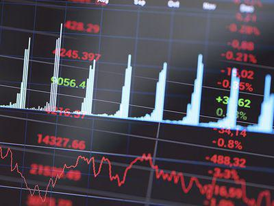

Financial markets serve as platforms where financial instruments, such as stocks, bonds, currencies, and derivatives, are traded. These markets are crucial for the allocation of resources, price setting, providing liquidity, and reducing the cost of transactions. Trading strategies within these markets are critical as they determine how traders make decisions to buy or sell assets to generate profits or mitigate risks. Over time, these strategies have evolved from traditional approaches to more sophisticated, technology-driven models.

Algorithmic trading is at the forefront of this evolution, significantly impacting how trades are executed in modern markets. This type of trading uses computer algorithms—sets of specific rules and calculations—to execute orders at high speeds and volumes much beyond human capacity. Algorithmic trading can capitalize on minute price discrepancies, often relying on strategies that involve complex computations and rapid trade execution. It is estimated that a substantial portion of trading volume in major financial markets is driven by algorithms, underscoring their influence.



A subset of algorithmic trading is high-frequency trading (HFT), characterized by the execution of a large number of orders at extremely fast speeds. Quote stuffing is a controversial tactic associated with HFT. It involves rapidly placing and canceling a large number of orders, confusing the market, and potentially creating artificial volatility. This can disadvantage other market participants, particularly those not employing HFT technologies. The term "quote stuffing" reflects the overwhelming number of quotes generated and quickly withdrawn, which can congest the trading systems of exchanges.

The purpose of this article is to explore quote stuffing comprehensively, assessing its mechanics, effects on market dynamics, and regulatory perspectives. By understanding quote stuffing, traders, regulators, and other market participants can better navigate the challenges it presents and work towards ensuring fair and efficient markets.

## Table of Contents

## Understanding Financial Markets Trading Strategy

Financial markets encompass a diverse array of trading strategies, each tailored to capitalize on specific opportunities and manage risk. Among these strategies are [fundamental analysis](/wiki/fundamental-analysis), technical analysis, [arbitrage](/wiki/arbitrage), and high-frequency trading. Fundamental analysis involves evaluating a security's intrinsic value based on economic factors and financial metrics. Technical analysis, on the other hand, relies on historical price and volume data to identify trends and predict future movements. Arbitrage strategies exploit price discrepancies in different markets or instruments to generate risk-free profits. High-frequency trading (HFT) leverages speed and automation to capitalize on minor price discrepancies occurring over short timeframes.

Algorithmic trading, particularly significant in executing these strategies, employs computer algorithms to automate trading decisions. This automation enhances precision, speed, and efficiency, allowing traders to execute complex strategies that would be infeasible manually. Algorithms can process vast amounts of data to make split-second decisions, enabling the rapid execution of large volumes of trades while minimizing human error.

Technological advancements continually provide traders with new tools and methodologies to gain a competitive edge. Machine learning techniques are increasingly being integrated into trading algorithms to analyze patterns and predict market movements. Big data analytics enables the processing of unstructured data sources, such as social media sentiment, to inform trading strategies. Additionally, developments in low-latency communication networks and enhanced computational power facilitate faster data processing and trading execution, essential components in the arsenal of market participants seeking to exploit microsecond-level opportunities. Such technological prowess is pivotal in high-frequency trading, where the race for speed and data accessibility defines success. The constant evolution of technology pushes traders to continually innovate and adapt strategies to maintain an advantage in increasingly competitive financial markets.

## What is Quote Stuffing?

Quote stuffing is a tactic employed by some high-frequency trading ([HFT](/wiki/high-frequency-trading-strategies)) firms, characterized by the rapid submission and subsequent cancelation of a large [volume](/wiki/volume-trading-strategy) of orders to generate congestion and confusion in the financial markets. Typically associated with nanosecond trading speeds, quote stuffing leverages the technological prowess of HFT systems to momentarily create distortions, seeking either information advantages or to disrupt other participants' trading strategies.

The origins of quote stuffing are intertwined with the evolution of electronic trading. As financial markets transitioned from floor-based trading to electronic exchanges, the speed at which orders could be placed and canceled increased dramatically. High-frequency trading emerged during this period, using sophisticated algorithms to capitalize on minute price discrepancies across different markets. Quote stuffing, as a byproduct of these capabilities, was identified as a way to manipulate market data feeds and trading signals on extremely short timescales.

Key takeaways regarding quote stuffing include its role as a manipulative tactic designed to exploit the mechanical workings and latency differences inherent in electronic trading platforms. It seeks to overload market data systems, thereby generating artificial noise and potential inefficiencies that can be exploited by those initiating the tactic. The vast volume of quotes can lead to information asymmetry, where some market participants may interpret the flood of activity as substantive when it is primarily deceptive.

The impact on market dynamics and participants is considerable. For trading systems, particularly those not equipped to handle such high volumes of data, the practice may result in disrupted operations and increased processing delays. Liquidity providers could find themselves compelled to withdraw from the market, leading to reduced [liquidity](/wiki/liquidity-risk-premium) and potential spikes in [volatility](/wiki/volatility-trading-strategies). This volatility can, in turn, erode market confidence, particularly among retail investors and institutional participants who may not possess the technological infrastructure to compete with HFT firms.

In conclusion, while the tactic may offer short-term advantages for practitioners, the broader implications of quote stuffing reflect its potential to undermine market efficiency, transparency, and fairness. The pervasive presence of HFT and associated strategies like quote stuffing necessitate ongoing scrutiny and regulatory oversight to maintain market integrity.

## Mechanism of Quote Stuffing

Quote stuffing is a high-frequency trading (HFT) tactic designed to exploit the speed advantages of algorithmic systems. High-frequency traders execute quote stuffing by rapidly entering and withdrawing large volumes of orders, creating false supply and demand patterns within milliseconds. This swift process aims to overload the processing capacity of exchanges and trading platforms, thereby gaining a microsecond advantage over competitors.

### Technological Requirements and Algorithmic Implementations

High-frequency traders implementing quote stuffing require advanced technological infrastructure. This includes powerful computing hardware capable of executing decisions in nano- or microseconds; high-speed data feeds to receive real-time market information; and ultra-low latency networks to minimize the delay in communication with trading venues.

Algorithmically, quote stuffing strategies are coded into trading systems using languages such as C++ or Python due to their capability to handle real-time data processing and execution. The algorithms may function as follows in Python:

```python
import time
import random

def quote_stuffing(order_book, num_orders):
    for _ in range(num_orders):
        # Generate random order data
        order_id = random.randint(1000, 9999)
        price = random.uniform(100, 200)
        quantity = random.randint(1, 100)

        # Place an order
        order_book[order_id] = {'price': price, 'quantity': quantity}

        # Simulate a rapid cancellation
        time.sleep(0.001)  # 1 millisecond delay
        del order_book[order_id]

# Example order book
order_book = {}
quote_stuffing(order_book, 1000)
```

The code above simulates rapid order placements and cancellations, reflecting the essential dynamics of quote stuffing where orders flood the market momentarily before being withdrawn, overloading the [order book](/wiki/order-book-trading-strategies).

### Process from Order Placement to Cancellation and Its Market Effects

The quote stuffing process involves the following sequential steps:

1. **Order Entry**: High volumes of buy and/or sell orders are entered into the order book, typically involving multiple stocks or securities. The goal is to overwhelm the systems of slower traders or exchanges.

2. **Immediate Cancellation**: These orders are cancelled almost as quickly as they are placed, sometimes within a few milliseconds, preventing actual transactions from occurring. 

3. **Market Effects**: This strategy results in artificial congestion, causing delays in order processing by congesting the order queue. Market participants might experience increased latency, leading to delayed execution of their orders.

4. **Exploiting Latency**: While the market processes bogus data, the perpetrator can analyze legitimate market information and act upon it faster than others. This can distort price discovery and lead to incorrect evaluations of supply and demand.

Overall, quote stuffing significantly impacts market integrity, often leading to increased volatility and compromised liquidity. It distorts the view of the market supply and demand, misleading other traders, especially those with slower trade execution capabilities. Consequently, it can erode trust among participants and destabilize the trading environment.

## Quote Stuffing and Securities Regulators

Quote stuffing, a strategy employed in high-frequency trading (HFT), poses significant challenges to the integrity and stability of financial markets. This section scrutinizes the regulatory landscape targeting quote stuffing, highlighting actions and measures by authorities like the U.S. Securities and Exchange Commission (SEC), the Commodity Futures Trading Commission (CFTC), and the Financial Industry Regulatory Authority (FINRA).

### Regulatory Landscape

Recognizing the potential for market manipulation and the risk associated with quote stuffing, regulatory bodies have dedicated efforts to detect, investigate, and mitigate its impacts. The nature of HFT, characterized by swift order placements and cancellations, complicates the task of distinguishing malicious activities from normal market behavior. This complexity prompts regulators to create robust frameworks and employ sophisticated technologies.

### Regulatory Actions

#### SEC Involvement

The SEC plays a pivotal role in policing quote stuffing by implementing rules aimed at minimizing market manipulation. Under the Market Access Rule (Rule 15c3-5), brokers and traders must have risk management controls to prevent erroneous or manipulative orders. The SEC has been proactive in employing advanced surveillance systems to identify suspicious trading patterns that resemble quote stuffing.

#### CFTC Measures

The CFTC regulates futures and options markets, including those involving HFT strategies. It has utilized its enforcement powers to pursue cases of disruptive trading practices. The Dodd-Frank Wall Street Reform and Consumer Protection Act of 2010 strengthened the CFTC's ability to address HFT-related issues, mandating the use of technology to detect violations efficiently.

#### FINRA's Role

FINRA oversees brokerage firms and their activities in the securities industry. It conducts routine examinations and employs real-time surveillance to flag irregularities indicative of manipulation. FINRA's focus on transparency and compliance reinforces the industry's commitment to integrity, promoting fair practices among market participants.

### Legal Considerations and Enforcement

The legal framework surrounding quote stuffing aims at deterrence through the imposition of significant penalties on perpetrators. Regulators have the authority to levy substantial fines, suspend trading activities, and in severe cases, pursue criminal charges against violators. Enforcement actions serve as a crucial deterrent, affirming the commitment to maintaining orderly markets.

The collaboration among the SEC, CFTC, and FINRA underscores a comprehensive approach in tackling quote stuffing. By leveraging technology and fostering coordination, these bodies enhance their capability to protect market participants and uphold confidence in the financial ecosystem. The evolving regulatory landscape continues to adapt, ensuring resilience against such sophisticated trading practices.

## Impact of Quote Stuffing on Market Participants

Quote stuffing can significantly impact market participants through alterations in liquidity, volatility, and overall confidence in financial markets. 

### Effects on Liquidity, Volatility, and Market Confidence

Quote stuffing involves the rapid placing and canceling of large numbers of orders within a short timeframe, often creating the illusion of high market activity. This artificial inflation of market signals can lead to perceptions of increased liquidity, which may not truly exist. When genuine orders are placed, the perceived liquidity can rapidly dissipate as numerous orders are canceled, leaving traders in a compromised state, often referred to as a "ghost liquidity" scenario (Johnson, 2010).

Volatility is similarly affected as the market constantly adjusts to the barrage of quote changes, leading to erratic price movements. The unpredictable shifts may discourage broader market participation and increase the cost of transactions due to wider bid-ask spreads. This indirectly reduces market confidence as participants become wary of entering trades in a manipulated environment (Aitken et al., 2012).

### Impact on Low-Frequency Traders and Retail Investors

Low-frequency traders and retail investors are disproportionately affected by quote stuffing. These participants typically lack the sophisticated infrastructure necessary to process rapid, large-scale data inflows. As a result, they may be delayed in receiving accurate market information, leading to suboptimal trading decisions.

For instance, low-frequency traders operating on delayed data may pursue a strategy based on outdated information, leading to losses or missed opportunities. Furthermore, retail investors, often using market orders, may find themselves trading at unfavorable prices due to the fluctuating market conditions induced by quote stuffing practices. These repercussions can foster a sense of mistrust in financial markets, potentially deterring smaller investors from participating.

### Case Studies of Notable Incidents Involving Quote Stuffing

One striking incident illustrating the impact of quote stuffing was the "Flash Crash" of May 6, 2010. On this day, major U.S. stock indices plunged about 9% within minutes before rebounding just as swiftly. Investigations revealed that high-frequency trading firms played a significant role in exacerbating this market turmoil by deploying strategies, including quote stuffing, that contributed to a lack of market depth and heightened volatility (U.S. Securities and Exchange Commission & Commodity Futures Trading Commission, 2010).

This event highlighted the vulnerabilities within highly automated markets and emphasized the need for robust regulatory frameworks to mitigate the potential adverse effects of quote stuffing. Additional case studies continue to underscore the importance of technological and regulatory measures to protect market integrity and ensure equity for all participants.

Quote stuffing thus presents significant challenges to market participants by distorting normal market operations, eroding liquidity, and diminishing confidence. Understanding and addressing these impacts are vital for maintaining fair and efficient financial markets.

## Technological and Market Mitigation Strategies

Advancements in surveillance technologies have become essential in the effort to detect and prevent quote stuffing, a type of high-frequency trading strategy that impacts market stability. Modern surveillance systems leverage [machine learning](/wiki/machine-learning) algorithms to monitor trading patterns in real-time, identifying anomalies that suggest manipulative behaviors. These systems can process vast amounts of trading data quickly, using techniques such as anomaly detection, clustering, and predictive modeling to flag suspicious activities.

For the prevention of quote stuffing, exchanges and trading platforms have implemented specific technological measures such as velocity logic tools and circuit breakers. Velocity logic tools temporarily pause trading if certain thresholds are met, allowing time for human intervention to assess the situation. Circuit breakers halt trading across the market during periods of extreme volatility, providing a cooling-off period to restore order and confidence.

Traders and exchanges adopt various strategies to mitigate the effects of quote stuffing. Traders increasingly use smart order routing systems that execute trades in smaller increments and at multiple venues, thus reducing the impact of any manipulative spike in quotes. Exchanges, on the other hand, employ message traffic limitations and introduce noise filtering algorithms to manage and minimize data congestion caused by quote stuffing. Additionally, fee structures that penalize excessive order cancellations relative to executions are also introduced by some exchanges to discourage quote stuffing.

Looking towards the future, regulatory frameworks are expected to evolve further, embracing technological innovations to adapt to the changing landscape of trading. Regulatory bodies continue to explore collaborations with tech firms to develop robust surveillance algorithms and predictive analytics tools. Governments and market regulators are also focusing on data sharing initiatives that provide a more comprehensive view of trading activities across different platforms and jurisdictions, helping to identify cross-market manipulation attempts.

In addition, the development of blockchain and distributed ledger technologies presents new opportunities for improving transparency and traceability in trading operations. These technologies could facilitate real-time audit trails, making it harder for entities to engage in manipulative practices such as quote stuffing without detection.

The integration of [artificial intelligence](/wiki/ai-artificial-intelligence) (AI) and machine learning (ML) in market regulation stands as a promising frontier. These technologies enable adaptive learning systems that improve with exposure to new trading data, potentially providing regulators with dynamic tools to anticipate and counteract emerging manipulation strategies. This continuous evolution and adaptation are crucial for maintaining the integrity of financial markets amidst the relentless pace of technological advancement.

## Conclusion

Quote stuffing in financial markets poses significant challenges that encompass technological, regulatory, and ethical dimensions. As a strategy rooted in high-frequency trading (HFT), quote stuffing can disrupt market function by inundating trading systems with false orders that are quickly canceled. This practice affects liquidity, increases market volatility, and can erode investor confidence. Its implications are vast, influencing the experience and strategy of both high-frequency and low-frequency traders, as well as retail investors.

The primary challenge remains in balancing the benefits of technological advancements with the preservation of market integrity. HFT, by nature, offers advantages such as improved market efficiency and liquidity. However, practices like quote stuffing reveal potential vulnerabilities. As technology continues to evolve, regulators and market participants must work to ensure that such innovations do not undermine fair trading principles. Achieving this balance necessitates an understanding of the fine line between legitimate trading strategies and manipulative practices.

Collaboration among exchanges, regulators, and traders is crucial to maintaining the integrity of financial markets. Recent advancements in surveillance technologies are promising tools in identifying and curbing practices like quote stuffing. Nevertheless, these tools require continual enhancement and adaptation to keep pace with the ever-increasing speed and complexity of trading algorithms. Market participants must prioritize vigilance and act collaboratively to develop comprehensive frameworks that can mitigate the negative impacts of quote stuffing, supporting both robust market performance and investor trust.

In conclusion, while quote stuffing represents a niche yet potent threat to market stability, addressing it requires a multifaceted approach integrating technological, regulatory, and strategic perspectives. Future success in mitigating such practices will depend on ongoing innovation, regulation, and cooperative efforts to ensure a fair and transparent trading environment.

## References & Further Reading

[1]: Johnson, B. (2010). "Algorithmic Trading & DMA: An Introduction to Direct Access Trading Strategies". 4Myeloma Press.

[2]: Aitken, M., Harris, F. H., & Ji, S. (2014). ["Quote Stuffing, Quote Throttling, and Trading in Modern Markets."](https://www.semanticscholar.org/paper/A-Worldwide-Examination-of-Exchange-Market-Quality%3A-Aitken-Harris/4916a5b275d1f5f5f78cb5ce4b0d6ea4592baeb5) Journal of Trading, 9(1).

[3]: U.S. Securities and Exchange Commission & Commodity Futures Trading Commission. (2010). ["Findings Regarding the Market Events of May 6, 2010."](https://www.sec.gov/sec-cftc-prelimreport.pdf)

[4]: Patterson, S. (2013). ["Dark Pools: The Rise of the Machine Traders and the Rigging of the U.S. Stock Market."](https://www.amazon.com/Dark-Pools-Machine-Traders-Rigging/dp/0307887189) Crown Business.

[5]: Aldridge, I. (2013). ["High-Frequency Trading: A Practical Guide to Algorithmic Strategies and Trading Systems."](https://books.google.com/books/about/High_Frequency_Trading.html?id=6l0DDQAAQBAJ) Wiley.