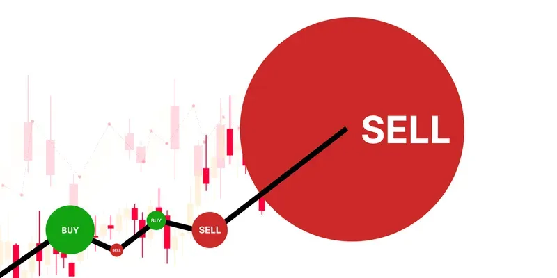

## Table of Contents

## What is quote stuffing in financial markets?

Quote stuffing is a tactic used by some traders in financial markets to gain an advantage over others. It involves sending a lot of buy and sell orders to the market very quickly, but then canceling them before they are completed. This can slow down the market's trading system and create confusion among other traders, making it harder for them to make quick decisions.

By flooding the market with these fake orders, the traders who use quote stuffing hope to manipulate the market in their favor. They can use the slight delays and confusion caused by their actions to buy or sell stocks at better prices than they would have otherwise. This practice is considered unfair and is often criticized because it can harm the overall fairness and efficiency of the market.

## How does quote stuffing affect market efficiency?

Quote stuffing makes the market less efficient. When traders send lots of fake orders and then cancel them quickly, it can slow down the whole trading system. This slowdown means that other traders can't buy or sell as quickly as they want to. It's like trying to drive on a busy road where some cars keep changing lanes and slowing everyone down. Because of this, the market doesn't work as smoothly as it should, and it takes longer for prices to reflect all the information available.

This practice also makes the market less fair. When some traders use quote stuffing, they can trick other traders into making bad decisions. For example, if a trader sees a lot of buy orders for a stock, they might think the stock's price will go up and decide to buy it too. But if those orders were fake and get canceled, the price might not go up, and the trader could lose money. This means that the market doesn't always show the true value of stocks, which is what market efficiency is all about.

## Can you explain the basic mechanism of quote stuffing?

Quote stuffing is when some traders send a lot of fake buy and sell orders to the market really fast, and then cancel them before they go through. This can make the market's computer systems slow down because they have to handle so many orders at once. When the market slows down, it takes longer for other traders to make their trades.

By doing this, the traders who use quote stuffing can confuse other traders and make it harder for them to make quick decisions. They might see all these fake orders and think the price of a stock is going to go up or down, but then the orders get canceled. The traders using quote stuffing can use this confusion to buy or sell stocks at better prices than they would have if the market was working normally.

## What are the potential benefits of quote stuffing for those who use it?

Quote stuffing can help some traders make more money. They do this by sending lots of fake orders to the market very quickly and then canceling them. This makes the market's computers slow down, which can confuse other traders. When other traders are confused, they might not buy or sell at the right time. The traders using quote stuffing can take advantage of this confusion to buy or sell stocks at better prices than they would have if the market was working normally.

This practice can also give traders who use it a small advantage over others. By making the market slower and more confusing, they can see what other traders are doing and react faster. This can help them make trades that are more profitable. Even though quote stuffing is seen as unfair and can harm the market, the traders who use it might see it as a way to get ahead.

## How does quote stuffing impact individual investors?

Quote stuffing can make things harder for individual investors. When some traders send lots of fake orders and then cancel them, it slows down the market's computers. This means that individual investors might not be able to buy or sell stocks as quickly as they want. They could miss out on good opportunities because the market is moving slower than usual.

This practice can also trick individual investors into making bad decisions. If they see a lot of fake buy or sell orders, they might think the price of a stock is going to change and decide to trade based on that. But when those orders get canceled, the price might not change the way they expected. This can lead to losses for individual investors who are trying to make smart choices based on what they see in the market.

## What regulatory measures have been implemented to combat quote stuffing?

Regulators have taken steps to stop quote stuffing because it's not fair to other traders. In the United States, the Securities and Exchange Commission (SEC) has rules to prevent this kind of market manipulation. One important rule is called Regulation NMS, which aims to make sure that the market works fairly and efficiently. This rule helps to stop traders from sending too many fake orders that can slow down the market.

Another way regulators fight quote stuffing is by keeping a close eye on trading activity. They use special computer systems to watch for patterns that might show someone is using quote stuffing. If they find traders doing this, they can take action against them, like fining them or banning them from trading. These measures help to make the market a fairer place for everyone, including individual investors.

## Can you describe a real-world example of quote stuffing?

In 2010, a company called Trillium Brokerage Services was caught using quote stuffing. They sent a lot of fake orders to the stock market very quickly and then canceled them before they went through. This made the market's computers slow down and confused other traders. Trillium did this to make money by buying and selling stocks at better prices than they should have been able to. The Securities and Exchange Commission (SEC) found out about it and fined Trillium $1 million for breaking the rules.

This case showed how quote stuffing can harm the market. When Trillium flooded the market with fake orders, it made it harder for other traders to do their jobs. Individual investors might have seen all these orders and thought the price of stocks was going to change, but then the orders got canceled. This could have led them to make bad decisions and lose money. The SEC's action against Trillium helped to show that quote stuffing is not allowed and that regulators are working to keep the market fair for everyone.

## How do high-frequency trading firms utilize quote stuffing?

High-frequency trading firms use quote stuffing to try to gain an edge over other traders. They send a lot of fake buy and sell orders to the market very quickly and then cancel them before they go through. This can slow down the market's computers and make it harder for other traders to make quick decisions. By doing this, high-frequency trading firms can see what other traders are doing and react faster. This gives them a small advantage because they can buy or sell stocks at better prices than they would if the market was working normally.

This practice can be harmful to the market because it makes it less fair and efficient. When high-frequency trading firms use quote stuffing, it can trick other traders into thinking the price of a stock is going to change. But when the fake orders get canceled, the price might not change the way they expected. This can lead to losses for individual investors who are trying to make smart choices based on what they see in the market. Regulators like the Securities and Exchange Commission work to stop quote stuffing because it's not fair to other traders and can harm the overall fairness of the market.

## What are the technological tools required to execute quote stuffing?

To do quote stuffing, traders need fast computers and special software. The computers need to be able to send a lot of orders to the market very quickly. This means they need to have a lot of processing power and be connected to the market's systems with high-speed internet. The software is also important because it helps the traders send and cancel orders at just the right time. It's like having a very fast car and a good map to drive it.

These tools help traders do quote stuffing without getting caught easily. The fast computers and special software let them send fake orders and cancel them before anyone else can react. This can make the market's computers slow down and confuse other traders. But regulators are always trying to stop this kind of cheating, so they use their own special tools to watch for quote stuffing and catch the traders who do it.

## How can market surveillance detect quote stuffing?

Market surveillance uses special computer programs to watch for quote stuffing. These programs look for patterns that show someone might be sending a lot of fake orders and then canceling them quickly. If they see a trader doing this over and over, it can be a sign of quote stuffing. The programs also check how fast the orders are coming in and going out, because quote stuffing needs very fast computers to work.

When the surveillance systems find something that looks like quote stuffing, they tell the regulators. The regulators then look more closely at what the trader is doing. They might use other tools to see if the trader is really trying to cheat the market. If they find out that the trader is using quote stuffing, they can take action to stop it, like fining the trader or banning them from trading. This helps keep the market fair for everyone.

## What are the ethical implications of using quote stuffing in trading?

Using quote stuffing in trading raises big ethical questions because it's not fair to other people in the market. When traders use quote stuffing, they send lots of fake orders and then cancel them to slow down the market and trick other traders. This can make the market less fair because it gives an advantage to the people using quote stuffing. They can buy or sell stocks at better prices than they should, while other traders, especially individual investors, might lose money because they are confused by all the fake orders.

This practice also goes against the idea of a fair and efficient market. Markets are supposed to work smoothly so that everyone can buy and sell based on real information. When traders use quote stuffing, they mess up this system. They make it harder for the market to show the true value of stocks, which hurts everyone who relies on the market to be fair. Because of this, many people think quote stuffing is wrong and should not be allowed.

## What future trends might affect the prevalence of quote stuffing in financial markets?

In the future, better technology might make it easier for regulators to catch traders who use quote stuffing. As computers get faster and smarter, they can watch the market more closely and spot fake orders more quickly. This could make traders think twice before trying to use quote stuffing because they know they are more likely to get caught. Also, new rules and laws might be made to stop quote stuffing even more. Regulators are always working to keep the market fair, and they might come up with new ways to make sure no one can use this trick.

On the other hand, as trading gets faster and more high-tech, some traders might still try to find new ways to use quote stuffing. They might come up with new tricks that are harder to spot. But if more people learn about quote stuffing and why it's bad, they might push for even stronger rules to stop it. In the end, it will depend on how well regulators can keep up with new technology and how much people care about making the market fair for everyone.

## References & Further Reading

[1]: Johnson, B. (2010). "Algorithmic Trading & DMA: An Introduction to Direct Access Trading Strategies". 4Myeloma Press.

[2]: Aitken, M., Harris, F. H., & Ji, S. (2014). ["Quote Stuffing, Quote Throttling, and Trading in Modern Markets."](https://www.semanticscholar.org/paper/A-Worldwide-Examination-of-Exchange-Market-Quality%3A-Aitken-Harris/4916a5b275d1f5f5f78cb5ce4b0d6ea4592baeb5) Journal of Trading, 9(1).

[3]: U.S. Securities and Exchange Commission & Commodity Futures Trading Commission. (2010). ["Findings Regarding the Market Events of May 6, 2010."](https://www.sec.gov/sec-cftc-prelimreport.pdf)

[4]: Patterson, S. (2013). ["Dark Pools: The Rise of the Machine Traders and the Rigging of the U.S. Stock Market."](https://www.amazon.com/Dark-Pools-Machine-Traders-Rigging/dp/0307887189) Crown Business.

[5]: Aldridge, I. (2013). ["High-Frequency Trading: A Practical Guide to Algorithmic Strategies and Trading Systems."](https://books.google.com/books/about/High_Frequency_Trading.html?id=6l0DDQAAQBAJ) Wiley.