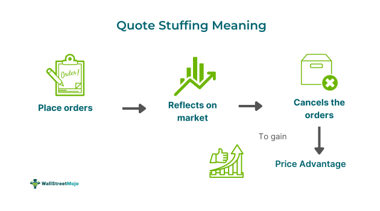

## Table of Contents

## What is quote stuffing?

Quote stuffing is when someone puts too many quotes or bits of text into a piece of writing. It often happens in school essays or online articles. The person doing it might be trying to make their work look longer or more important. But, it can make the writing hard to read and understand.

Teachers and readers don't like quote stuffing. It can make them think the writer is not doing their own work or thinking for themselves. Instead of stuffing quotes, it's better to use them carefully. Pick quotes that really help explain your ideas and make sure to explain them in your own words too.

## Why do people use quote stuffing in their content?

People use quote stuffing in their content mainly to make it look longer or more impressive. They might think that adding lots of quotes from famous people or experts will make their work seem smarter or more credible. This can be especially tempting when they have to write a certain number of words or pages for school or work.

However, quote stuffing can also happen because someone is trying to avoid doing their own thinking or writing. Instead of coming up with their own ideas, they fill their work with other people's words. This can make their writing seem lazy and can confuse readers who have trouble following the main point amidst all the quotes.

## How does quote stuffing affect the readability of an article?

Quote stuffing makes an article hard to read. When there are too many quotes, it can be tough to follow the main idea. The reader might get lost trying to figure out what the writer is really saying. Instead of helping, all those quotes can make the article confusing and messy.

It's important for an article to have a clear message. When someone stuffs it with quotes, it can seem like they are hiding behind other people's words. This can make readers feel like the writer isn't confident in their own ideas. In the end, quote stuffing can turn readers away because it's just too hard to understand what the article is really about.

## What are the SEO implications of quote stuffing?

Quote stuffing can hurt a website's SEO. Search engines like Google want to see original content that is useful for readers. When a page is stuffed with quotes, it might seem like the writer isn't adding much value. This can make search engines think the page isn't very good, so they might not show it as often in search results.

Also, quote stuffing can make a page harder to read and understand. If readers don't stay on a page because it's confusing, search engines might think the page isn't helpful. This can lower the page's ranking. It's better to use quotes carefully and make sure the main content is clear and easy to read.

## Can quote stuffing be considered a form of content manipulation?

Yes, quote stuffing can be seen as a form of content manipulation. When someone fills their writing with too many quotes, they might be trying to trick readers into thinking their work is more important or longer than it really is. They might also be trying to avoid doing their own thinking by using other people's words instead.

This kind of manipulation can hurt the trust between the writer and the reader. If readers find out that the writer is using quotes to make their work look better, they might not believe what the writer says in the future. It's better to use quotes honestly and only when they really help explain the main ideas.

## How can you identify quote stuffing in an article?

You can spot quote stuffing in an article if you see lots of quotes one after another. It might look like the writer is using other people's words to fill up the page instead of writing their own ideas. If the quotes don't really help explain the main point, or if they make the article hard to follow, that's a sign of quote stuffing.

Another way to tell is if the article seems too long because of all the quotes. Sometimes, the writer might be trying to reach a certain word count or make the article look more important. If the quotes are not connected well to the rest of the writing, and they don't add much to what the writer is saying, then the article might be stuffed with quotes.

## What are the ethical considerations of using quote stuffing?

Using quote stuffing is not an honest way to write. It can make people think you are trying to trick them into believing your work is better than it really is. When you stuff your writing with too many quotes, you might be trying to make it look longer or more important. But this can make readers feel like you're not being honest with them. They might lose trust in you because it seems like you're hiding behind other people's words instead of sharing your own ideas.

It's important to think about what's fair to your readers. They come to your writing expecting to learn something new or get a clear message. When you use quote stuffing, you're not giving them that. Instead, you're making it hard for them to understand what you're really trying to say. In the end, using quote stuffing goes against the idea of being honest and clear in your writing, which is something that good writers always try to do.

## How does quote stuffing impact the credibility of a source?

Quote stuffing can make a source seem less credible. When a writer uses too many quotes, it might look like they are trying to make their work look smarter or longer without adding their own ideas. Readers might think the writer is not confident in their own thoughts and is hiding behind other people's words. This can make the reader question if the writer really knows what they are talking about.

If readers find out that a writer is using quote stuffing, they might not trust the source anymore. Trust is important when people are looking for information. When a source uses quotes to fill up space instead of giving clear and useful information, it can make people think the source is not reliable. In the end, quote stuffing can hurt the reputation of the source and make it harder for them to be seen as a good place to get information.

## What are some alternatives to quote stuffing for enhancing content?

Instead of stuffing your writing with quotes, you can use your own words to explain things. Think about what you want to say and write it clearly. If you need to use a quote, pick one that really helps explain your point and then talk about it in your own words. This way, your writing will be easier to read and understand. It will also show that you have your own ideas and know how to use them well.

Another way to make your content better is to tell stories or give examples. People like hearing about real-life situations or stories that show what you mean. This can make your writing more interesting and help readers remember your message. You can also use simple charts or pictures to help explain things. These things can make your writing more fun and easier to follow without needing to fill it with quotes.

## How can content creators balance the use of quotes with original content?

Content creators can balance quotes and original content by using quotes carefully. They should only use a quote if it really helps explain their main idea. After using a quote, they need to talk about it in their own words. This shows that they understand the quote and can use it to make their point clearer. By doing this, they keep their writing honest and easy to read.

Another way to balance quotes is to make sure the original content is the star of the show. The writer's own thoughts and ideas should be the main focus, with quotes used as support. This means writing clearly and sharing personal insights or stories that connect with readers. By keeping the focus on their own content and using quotes sparingly, content creators can make their work more engaging and trustworthy.

## What are the best practices for integrating quotes into content without resorting to stuffing?

To integrate quotes into your content without stuffing, choose quotes that really help explain your main idea. Only use a quote if it adds something important to what you're saying. After you put in the quote, explain it in your own words. This shows that you understand the quote and can use it to make your point clearer. Don't use too many quotes in a row, or your writing might get hard to follow. Instead, mix them with your own ideas so that your writing stays clear and easy to read.

Keep the focus on your own content, with quotes used just to support your main points. Write about your own thoughts and experiences, and use quotes to back them up. This way, your writing will feel honest and interesting to readers. By using quotes carefully and making sure your own ideas are the main part of your content, you can make your writing more engaging and trustworthy.

## How have search engines evolved in detecting and penalizing quote stuffing?

Search engines like Google have gotten better at spotting quote stuffing. They use smart computer programs to look at how much of a page is made up of quotes. If there are too many quotes and not enough original writing, the search engine might think the page is not very good. This can make the page show up lower in search results. Search engines want to show people useful and honest content, so they don't like it when writers try to trick them with lots of quotes.

Over time, search engines have also started to pay more attention to how easy a page is to read. If a page is stuffed with quotes and hard to understand, people might leave the page quickly. Search engines notice this and might decide that the page is not helpful. They want to show pages that people like and stay on, so they might penalize pages that use quote stuffing. By doing this, search engines help make sure that the internet has more good and clear content for everyone to use.

## References & Further Reading

[1]: Kearns, M., & Nevmyvaka, Y. (2013). ["Machine Learning for Market Microstructure and High-Frequency Trading."](https://www.cis.upenn.edu/~mkearns/papers/KearnsNevmyvakaHFTRiskBooks.pdf) Advances in Neural Information Processing Systems 26.

[2]: Johnson, T. C. (2010). ["Algorithmic Trading and the Flash Crash."](https://www.sciencedirect.com/science/article/pii/S2214845013000082) The Journal of Portfolio Management, 37(2), 180-187.

[3]: Patterson, S. (2012). ["Dark Pools: The Rise of the Machine Traders and the Rigging of the U.S. Stock Market."](https://www.amazon.com/Dark-Pools-Machine-Traders-Rigging/dp/0307887189) Crown Business.

[4]: Aldridge, I. (2013). ["High-Frequency Trading: A Practical Guide to Algorithmic Strategies and Trading Systems."](https://www.ahmetbeyefendi.com/wp-content/uploads/2020/07/High-Frequency-Trading-Irene-Aldridge.pdf) Wiley.

[5]: Cartea, Á., Jaimungal, S., & Penalva, J. (2015). ["Algorithmic and High-Frequency Trading."](https://assets.cambridge.org/97811070/91146/frontmatter/9781107091146_frontmatter.pdf) Cambridge University Press.

[6]: U.S. Securities and Exchange Commission. (2010). ["Findings Regarding the Market Events of May 6, 2010."](https://www.sec.gov/news/studies/2010/marketevents-report.pdf) Report of the Staffs of the CFTC and SEC to the Joint Advisory Committee on Emerging Regulatory Issues.

[7]: Easley, D., Lopez de Prado, M. M., & O'Hara, M. (2012). ["Flow Toxicity and Liquidity in a High-Frequency World."](https://www.jstor.org/stable/41485533) The Journal of Financial Data Science, 1(2), 16-30.