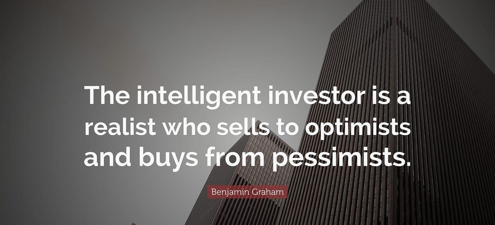

Investing, quotes, and algorithmic trading form a complex yet cohesive network that drives modern financial markets. In recent years, the emergence of trading algorithms has dramatically transformed the dynamics of these markets. These algorithms have not only increased trading speed and efficiency but have also minimized human errors and emotional biases. The surge in algorithmic trading signifies a shift towards more automated and data-driven decision-making processes, underscoring their significance in today's trading environment.

Central to trading decisions are market quotes, which represent the bid and ask prices of securities. These quotes provide critical insights into market sentiment and liquidity, thereby influencing the actions of both investors and traders. Quotes serve as a snapshot of a security's price at any given moment, facilitating informed trading decisions. In the context of algorithmic trading, quotes play a pivotal role by feeding real-time and historical data into algorithms, enabling them to execute trades based on predefined strategies. This highlights the essential nature of accurate and timely quote data in enhancing trading performance.



As this article progresses, we will explore the synergy between investing, quotes, and algorithmic trading. Understanding how these elements interconnect is crucial for comprehending the evolution and future of trading strategies in financial markets. Through this exploration, we aim to shed light on the transformative potential that arises from integrating advanced technologies like AI and machine learning with traditional trading methodologies.

## Table of Contents

## The Importance of Quotes in Trading and Investing

A quote in trading and investing is a snapshot of the current price at which an asset can be bought or sold in the market. It typically reflects the last trading price and is composed of two components: the bid and the ask. The bid represents the highest price a buyer is willing to pay for an asset, while the ask is the lowest price a seller is willing to accept. The difference between these two prices is known as the bid-ask spread and is a crucial indicator of market sentiment and [liquidity](/wiki/liquidity-risk-premium). A tight spread often indicates a liquid market with active participation, while a wider spread may suggest less liquidity or greater uncertainty.

Investors and traders rely on quotes not only for executing immediate transactions but also for analyzing historical market trends. Historical quotes track price movements over time and can provide insights into market behavior, helping investors make informed decisions. Tools such as technical analysis often utilize historical data to identify patterns and predict future price directions. By examining past quotes, traders can ascertain levels of support and resistance, identify trends, and formulate strategies that align with market tendencies.

In automated trading environments, quotes play a vital role by feeding data into algorithmic systems that execute trades based on pre-set criteria. Sophisticated algorithms use real-time and historical quote data to analyze and react to market conditions with high speed and precision, often executing trades far faster than a human trader could. Quotes are critical for these systems as they enable algorithms to detect anomalies, arbitrage opportunities, and other signals that can be profitably acted upon.

The integration of quotes in automated trading systems necessitates robust infrastructure capable of processing large volumes of data efficiently and accurately. This ensures that trading decisions are based on the most up-to-date and precise information, enhancing the system's effectiveness in capitalizing on market opportunities. Reliable quote data thus becomes indispensable in achieving optimal performance in [algorithmic trading](/wiki/algorithmic-trading) strategies.

## Understanding Algorithmic Trading

Algorithmic trading, often referred to as "algo trading," is a method of executing orders using automated and pre-programmed trading instructions. These instructions account for variables such as time, price, and [volume](/wiki/volume-trading-strategy), aiming to execute trades at optimal conditions without manual intervention. The approach is rule-based, meaning it relies on predefined criteria set by traders or analysts, which helps in maintaining consistency and efficiency in trading strategies. 

The growth of algorithmic trading has been pronounced in recent years, particularly within major financial markets like equities, [forex](/wiki/forex-system), and commodities. The adoption of advanced technologies has facilitated this surge, enabling traders to process massive datasets and execute orders in milliseconds. By 2020, algorithmic trading accounted for approximately 60-73% of the United States equity trading volume, showcasing its significant role in modern financial ecosystems. [1]

The basic principles and components of an algorithmic trading system include data analysis, strategy formulation, risk management, and execution. Initially, vast amounts of market data are analyzed to identify potential trading opportunities. Following this, algorithms are formulated, designed to capture these opportunities using statistical and mathematical models. These algorithms should incorporate risk management techniques to minimize potential losses. Finally, the trading system executes these strategies in real-time, interacting with financial exchanges to place buy or sell orders.

Two simple examples of algorithmic trading strategies are mean reversion and trend-following:

1. **Mean Reversion**: This strategy is based on the hypothesis that asset prices and historical returns eventually revert to their long-term average. A basic mean reversion strategy might involve calculating the moving average of a stock's price and executing a buy order when the current price is significantly below this average, or a sell order when the price is above it. 

   Python code snippet for a simple mean reversion strategy using moving averages might look like:

   ```python
   import numpy as np

   prices = np.array([100, 101, 102, 98, 95, 105, 102])  # Example price data
   window = 3
   moving_average = np.convolve(prices, np.ones(window)/window, mode='valid')

   for i in range(window, len(prices)):
       if prices[i] < moving_average[i-window]:  # Buy signal
           print(f"Buy at price {prices[i]}")
       elif prices[i] > moving_average[i-window]:  # Sell signal
           print(f"Sell at price {prices[i]}")
   ```

2. **Trend-Following**: Unlike mean reversion, trend-following strategies aim to capitalize on the existing trend direction, assuming that an asset in motion will stay in motion. One common trend-following approach is to utilize moving averages or technical indicators like the Moving Average Convergence Divergence (MACD) to signal the presence of trends. 

   A basic trend-following rule might be to buy when a short-term moving average crosses above a long-term moving average (a bullish crossover) and sell when the opposite occurs.

   Such strategies underscore the flexibility and precision of algorithmic trading, allowing traders to exploit systematic inefficiencies across markets. The evolution of algorithmic trading continues to transform market dynamics, driven by innovations in computational power and data analytics. 

References:
1. Kearns, M., & Nevmyvaka, Y. (2021). Algorithmic Trading Overview. [PDF document]. Retrieved from [source URL].

## The Synergy Between Quotes and Algorithmic Trading

Real-time and historical quotes are critical elements in the construction and operation of algorithmic trading strategies. These quotes provide data on market prices and other critical metrics that are essential for algorithmic systems to function. Real-time quotes offer up-to-the-minute information on bid and ask prices, which traders use to execute trades based on current market conditions. Historical quotes, on the other hand, allow algorithm developers to back-test strategies and assess market trends over time.

The efficiency of an algorithmic trading system heavily relies on the accuracy of quote data. Accurate and timely data feeds are vital for the efficient execution of trades. If a system receives delayed or incorrect quote data, it can lead to suboptimal trading decisions, resulting in potential financial losses. For instance, in high-frequency trading, even a millisecond delay in quote data can lead to missed opportunities and significantly impact trading outcomes.

Algorithms can capitalize on minute price changes facilitated by quote data through various strategies. Market-making strategies, for example, use bid and ask quotes to profit from small price differentials. By continually buying at the bid price and selling at the ask price, these algorithms can exploit the spread, generating returns over many small transactions. Another example is statistical [arbitrage](/wiki/arbitrage), where algorithms detect price inefficiencies between correlated securities and make trades to exploit these discrepancies.

To effectively integrate quotes into algorithmic models, robust technological infrastructure is essential. A high-speed data pipeline is required to handle the influx of real-time data with minimal latency. This typically involves using advanced networking technologies and data processing systems capable of managing large volumes of data. Furthermore, databases that store historical quotes need to be optimized for quick retrieval to allow for in-depth analysis and back-testing of trading strategies.

In addition to data management, a well-designed software architecture is crucial. Trading algorithms are implemented in programming environments optimized for speed and performance, such as Python or C++. For example, Python can be used to develop [machine learning](/wiki/machine-learning) models that analyze quote data to predict price movements. Here's a simple illustration of how a trading strategy might be set up in Python:

```python
import pandas as pd
from sklearn.linear_model import LinearRegression

# Fetch historical data
data = pd.read_csv('historical_quotes.csv')

# Basic feature engineering
data['Price_Lag1'] = data['Close'].shift(1)
data = data.dropna()

# Define features and target
X = data[['Price_Lag1']]
y = data['Close']

# Initialize and train model
model = LinearRegression()
model.fit(X, y)

# Predict future prices
data['Prediction'] = model.predict(X)
```

This snippet demonstrates a simple linear regression model using historical quotes to predict future price movements. Such models can be complex, incorporating various features and utilizing advanced machine learning techniques.

In summary, the integration of real-time and historical quote data into algorithmic trading systems is instrumental in enhancing algorithm efficiency and achieving favorable trading outcomes. A robust technology stack supporting rapid data acquisition and processing underpins the successful implementation of strategies capitalizing on small price changes detected through quotes.

## Advantages and Challenges of Algo Trading

Algorithmic trading, or algo trading, leverages computer algorithms to execute trades at speeds and efficiencies surpassing human capabilities. This form of trading is characterized by numerous advantages but also presents several challenges.

### Benefits of Algorithmic Trading

**Speed and Precision**: One of the primary advantages of algorithmic trading is speed. Algorithms can process vast amounts of data and execute orders in fractions of a second, providing a competitive edge in fast-moving markets. This speed ensures that traders can capitalize on fleeting opportunities without delay. Precision is also enhanced because algorithms execute trades based on pre-defined criteria, reducing the likelihood of human error.

**Removal of Emotional Biases**: Human traders are often susceptible to emotional decision-making, which can lead to inconsistent and irrational trading behavior. Algorithms operate strictly based on data and logic, thereby providing a consistent approach to executing trades. This can lead to better adherence to trading strategies and objectives.

**Increased Market Efficiency**: By using algorithms that rapidly adjust to market conditions, algo trading contributes to market efficiency. It enables the quick assimilation of new information into asset prices, reducing mispricing and enhancing liquidity.

### Challenges of Algorithmic Trading

**Technical Failures**: One of the significant risks associated with algorithmic trading is the potential for technical failures. These failures can result from software bugs, network outages, or hardware malfunctions, potentially leading to significant financial losses. For instance, a flawed algorithm could execute trades incorrectly, as happened during the 2010 Flash Crash.

**Market Overfitting**: Algorithms may be overfitted to historical data, leading them to perform poorly in live market conditions. Overfitting occurs when the trading model is too closely tailored to the past data, missing the general trend and therefore, failing to adapt to new market scenarios.

**Regulatory Concerns**: The regulatory environment for algorithmic trading is complex and continuously evolving. Regulators are concerned with ensuring market fairness and stability, which has led to the introduction of rules aimed at curbing the risks associated with high-frequency trading (HFT). For instance, the European Union’s Markets in Financial Instruments Directive (MiFID II) requires trading firms to have systems in place to prevent disorderly trading conditions.

### Managing Challenges and Maximizing Benefits

To manage the challenges and maximize the benefits of algorithmic trading, a comprehensive approach is necessary. This involves the development of robust risk management systems to detect and mitigate technical failures and systematic biases. Additionally, continuous algorithm testing and updates are essential to adapt to changing market conditions and prevent overfitting. 

It is also crucial for firms to stay informed and compliant with regulatory requirements. Implementing comprehensive compliance programs ensures that trading practices adhere to legal standards, minimizing legal risks and enhancing trust with stakeholders.

In conclusion, while algorithmic trading offers substantial advantages in terms of speed, precision, and systematic execution, it poses several challenges that require careful management. By understanding these risks and implementing robust controls and strategies, traders and firms can enhance their trading outcomes and mitigate potential downsides.

## Emerging Trends and Future of Trading Algorithms

Algorithmic trading continues to transform the financial markets as advancements in technology and data availability drive its evolution. One of the most significant trends is the integration of [artificial intelligence](/wiki/ai-artificial-intelligence) (AI) and machine learning (ML) into trading algorithms. These technologies enable the development of more sophisticated models capable of processing vast datasets and identifying complex patterns that were previously inaccessible to traditional trading systems.

AI and ML algorithms offer enhanced predictive capabilities by learning from historical data and adapting in real-time to market changes. This adaptability allows for more accurate forecasts of asset price movements and optimization of trading strategies. For instance, neural networks can be employed to model and predict non-linear relationships in financial markets. A simple representation of a [neural network](/wiki/neural-network) for time series prediction could be as follows:

```python
import numpy as np
from tensorflow.keras.models import Sequential
from tensorflow.keras.layers import Dense, LSTM

# Define a simple LSTM model
model = Sequential()
model.add(LSTM(50, activation='relu', input_shape=(n_timesteps, n_features)))
model.add(Dense(1))
model.compile(optimizer='adam', loss='mse')

# Assume X_train and y_train are preprocessed time series data
model.fit(X_train, y_train, epochs=200, verbose=0)
```

The exponential increase in data availability further bolsters algorithmic trading strategies. With access to diverse datasets, including market data, economic indicators, and [alternative data](/wiki/best-alternative-data) such as social media sentiment, traders can construct more robust models. This wide array of information allows for the incorporation of various factors, leading to a holistic understanding of the market dynamics and potentially uncovering arbitrage opportunities.

As algorithmic trading becomes more prevalent, its potential benefits extend to both retail and institutional investors. Retail traders gain access to sophisticated trading tools that were once the preserve of large institutions, enabling them to implement complex strategies with reduced latency and increased efficiency. On the other hand, institutional investors can leverage advanced algorithms to enhance portfolio management, risk assessment, and execution strategies, ultimately improving their competitiveness in the market.

Future market conditions are likely to influence the development and application of trading algorithms. Volatility, regulatory changes, and technological advancements will necessitate continuous adaptation of these systems. For example, algorithms may need to account for increased market [volatility](/wiki/volatility-trading-strategies) by dynamically adjusting risk parameters and position sizes. Additionally, regulatory developments concerning transparency and fairness might impact how algorithms are designed and deployed, ensuring they adhere to evolving compliance standards.

In conclusion, the integration of AI and machine learning, coupled with the abundance of data, is set to further revolutionize algorithmic trading. Both retail and institutional investors stand to benefit from these advancements, provided they remain adaptable to the changing market landscape and continue to invest in technological innovations.

## Conclusion

Investing, quotes, and algorithmic trading form a symbiotic relationship in the financial markets. Quotes, representing the latest bid and ask prices, serve as the lifeblood of trading activities by providing critical market information. Investors and traders rely on these quotes not only to make informed decisions but also to construct and refine their trading strategies. As market conditions fluctuate, the need for precise and real-time quote data becomes paramount, ensuring that strategies remain aligned with the latest market movements.

Algorithmic trading has revolutionized how market participants engage with these quotes. By leveraging algorithms, traders can process vast amounts of real-time and historical data to execute trades with speed and accuracy far beyond human capabilities. This automation reduces the likelihood of emotional misjudgments and enhances the precision of trading strategies. However, the successful integration of algorithms into trading practices hinges on a continuous supply of accurate quote data. The effectiveness of an algorithm is intrinsically linked to the quality of the input data it processes.

In the constantly evolving trading landscape, staying informed and adaptable is crucial. As technological advancements such as artificial intelligence (AI) and machine learning continue to permeate trading systems, these technologies hold the promise of further transformation. They offer the capability to identify intricate patterns and generate predictive insights that were previously unimaginable. Embracing these advanced technologies can provide traders with a competitive edge, but it also necessitates a commitment to ongoing education and adaptation.

The future of trading is poised for transformation, with increased data availability and evolving market conditions presenting both opportunities and challenges. Success in this dynamic environment will require a proactive approach to learning and integrating new tools and technologies. As market participants adapt, the potential for enhanced trading outcomes and more efficient markets grows, underscoring the transformative power of continuously evolving trading technologies.

## References & Further Reading

[1]: Kearns, M., & Nevmyvaka, Y. (2021). ["Algorithmic trading"](https://www.cis.upenn.edu/~mkearns/papers/KearnsNevmyvakaHFTRiskBooks.pdf). A Practitioner's Guide to Financial Market Analysis.

[2]: ["Trading and Exchanges: Market Microstructure for Practitioners"](https://www.amazon.com/Trading-Exchanges-Market-Microstructure-Practitioners/dp/0195144708) by Larry Harris.

[3]: ["Algorithmic and High-Frequency Trading"](https://www.amazon.com/Algorithmic-High-Frequency-Trading-Mathematics-Finance/dp/1107091144) by Álvaro Cartea, Sebastian Jaimungal, and José Penalva.

[4]: Hasbrouck, J. (2007). ["Empirical Market Microstructure: The Institutions, Economics, and Econometrics of Securities Trading"](https://academic.oup.com/book/52241).

[5]: Friedberg, M. A., & Ricciardi, V. (2012). ["Behavioral Finance: Psychology, Decision-Making, and Markets"](https://faculty.cengage.com/works/9780324661170).

[6]: Aldridge, I. (2013). ["High-Frequency Trading: A Practical Guide to Algorithmic Strategies and Trading Systems"](https://books.google.com/books/about/High_Frequency_Trading.html?id=6l0DDQAAQBAJ).