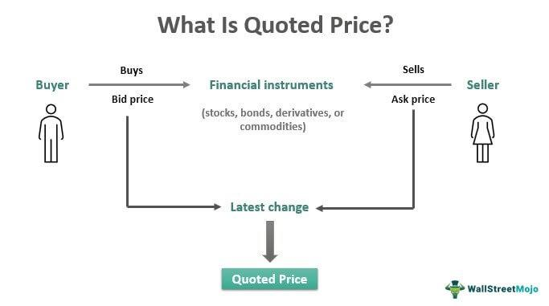

Understanding quoted price and pricing information is crucial in the financial sector, serving as the foundation for a wide array of transactions and investment decisions. Quoted price typically refers to the most recent price at which a security or commodity was bought or sold, encapsulating key elements such as the bid and ask prices. The bid price is the maximum price a buyer is willing to pay, whereas the ask price is the minimum price a seller is ready to accept. These prices reflect market sentiments and liquidity, underpinning the operational dynamics of financial markets.

In the context of algorithmic trading, which has rapidly transformed the financial landscape, quoted price and pricing information hold paramount importance. Algorithmic trading involves the use of computer algorithms to execute trades at optimal speeds and solutions. This approach relies heavily on accurate and timely pricing data to identify and leverage profitable opportunities. Algorithms can analyze vast amounts of historical and real-time data, adjusting strategies and executing trades in milliseconds, thus providing a competitive advantage in fast-paced markets.



Accurate pricing information is indispensable for both investors and traders as it directly influences trading strategies, risk management, and portfolio optimization. Discrepancies in pricing data can lead to suboptimal trading outcomes and financial losses. Hence, robust systems are constantly developed to ensure the integrity and timeliness of price information.

This article aims to explore the nuances of quoted price and pricing information, offering insights into their definitions, roles, and implications within financial transactions and algorithmic trading. With the advent of technology, especially in machine learning and artificial intelligence, the precision and speed of data handling have reached unprecedented levels, shaping modern market operations. We will examine how these technological advancements impact financial markets and trading strategies. Through this article, readers will gain a comprehensive understanding of the essential financial terms and their significance in the evolving world of finance.

## Table of Contents

## Understanding Quoted Price in Financial Markets

A quoted price is a critical component of financial markets, serving as the listed price at which securities, commodities, or currencies are bought and sold. This price acts as a fundamental reference point for traders and investors engaged in financial transactions.

**Bid and Ask Prices:**

The quoted price is typically framed by two pivotal components: the bid price and the ask price. The bid price represents the maximum price that a buyer is willing to pay for a security, while the ask price indicates the minimum price a seller is willing to accept. These two prices establish the bid-ask spread, a crucial measure of market [liquidity](/wiki/liquidity-risk-premium) and transaction costs. For instance, if a stock's bid price is $50 and its ask price is $51, the bid-ask spread is $1. A narrower spread often signifies high liquidity, allowing transactions to occur swiftly with minimal price variation.

**Market Liquidity:**

Market liquidity profoundly impacts quoted prices. In highly liquid markets, such as major stock exchanges or [forex](/wiki/forex-system) platforms, the bid-ask spread tends to be tighter, minimizing transaction costs. Conversely, in less liquid markets, spreads widen, reflecting increased trading costs and heightened [volatility](/wiki/volatility-trading-strategies). Liquidity can fluctuate based on various factors, including market events, economic news, and trading hours, influencing the stability and reliability of quoted prices.

**Variability Across Platforms and Markets:**

Quoted prices can differ across financial platforms and markets, driven by factors such as differing market participants, localized demand and supply, and specific trading protocols. For example, the New York Stock Exchange (NYSE) and the Nasdaq might exhibit slight variations in quoted prices for the same security, as each platform attracts different liquidity pools and trading behaviors. Additionally, international markets may present varied quoted prices due to currency exchange rates and regional economic conditions.

**Monitoring Quoted Prices:**

For investors and traders, monitoring quoted prices is essential for making informed decisions. Accurate and timely quoted prices enable market participants to evaluate potential entry and [exit](/wiki/exit-strategy) points, assess overall market trends, and develop effective trading strategies. Advanced trading platforms and financial data providers offer real-time access to quoted prices, empowering users to respond swiftly to market movements and optimize their trading outcomes.

Understanding the dynamics of quoted prices, along with their underlying components, facilitates better financial decision-making and enhances one's ability to navigate complex market environments frequently dominated by rapid changes and varied interactions.

## Significance of Accurate Pricing Information

Accurate pricing information is pivotal in the financial industry due to its direct influence on market dynamics, investment decisions, and trading outcomes. It serves as a foundation for effective market strategy, enabling traders and investors to assess market positions and opportunities with precision. 

Pricing information forms the backbone of market strategy, providing the data necessary to evaluate asset performance, market trends, and economic indicators. Investors rely on this data to develop strategies that maximize returns and mitigate risks. For instance, the calculation of the price-to-earnings ratio (P/E) or intrinsic value models helps determine the attractiveness of a stock relative to its current price, guiding buy or sell decisions. 

Inaccurate pricing can have severe consequences for traders and investors. Mispricing may lead to suboptimal trades, resulting in financial losses or missed opportunities. In the case of [algorithmic trading](/wiki/algorithmic-trading), where trades are executed based on advanced models and real-time data, inaccuracies can cause significant disruptions, leading to erroneous trades and potential financial crises, as exemplified by the 2010 Flash Crash.

Traders and institutional investors utilize price data extensively for analysis and forecasting. Historical pricing data allows for the [backtesting](/wiki/backtesting) of trading strategies, while real-time data assists in making instantaneous decisions. Quantitative analysts often employ mathematical models and [machine learning](/wiki/machine-learning) techniques to forecast pricing trends, optimizing their trading strategies for better performance.

In risk management and asset valuation, accurate pricing information is indispensable. Risk managers analyze pricing data to evaluate the volatility and correlation of assets, thereby informing decisions on portfolio diversification and hedging strategies. In asset valuation, precise pricing data ensures that assets are correctly valued, maintaining the integrity of financial statements and investment portfolios.

Overall, accurate pricing information underlies the functionality and stability of financial markets, influencing a wide array of activities from strategic planning to risk mitigation and asset evaluation.

## Financial Terms in Algorithmic Trading

Algorithmic trading, also known as algo trading, refers to the use of computer algorithms to execute trading strategies at speeds and frequencies that human traders cannot replicate. This approach relies heavily on financial data, as algorithms evaluate vast amounts of information to make split-second trading decisions. 

Key financial terms integral to algorithmic strategies include quoted price, market depth, spread, and volatility. The quoted price is crucial as it comprises the bid and ask prices, forming the foundation for executing trades. Market depth reflects the number of open buy and sell orders for a security at various prices, while the spread is the difference between the bid and ask price. Volatility measures the rate at which a security's price increases or decreases for a given set of returns. 

Algorithms utilize quoted price and pricing information by constantly scanning market conditions to identify profitable trading opportunities. For example, [arbitrage](/wiki/arbitrage) algorithms exploit price differentials of identical or similar financial instruments across different markets to attain risk-free profits. Market-making strategies aim to earn the spread by simultaneously posting buy and sell orders, relying on fluctuations in quoted prices.

Data accuracy and speed are paramount in algorithmic trading. High-frequency trading ([HFT](/wiki/high-frequency-trading-strategies)) involves executing a large number of orders within fractions of a second, where even microsecond delays can result in significant financial repercussions. Algorithms require precise data seamlessly delivered in real-time to maintain a competitive edge.

Despite its sophistication, maintaining precise financial data in automated trading environments poses challenges. Data discrepancies, latency issues, and incorrect market feeds can lead to erroneous trade executions, resulting in substantial losses. Traders must implement robust data validation processes and employ state-of-the-art technology to mitigate these risks.

Ultimately, algorithmic trading represents an advanced intersection of finance and technology, where precise and reliable pricing information is as valuable as the trading strategy itself.

## Application of Quoted Price and Pricing Information in Algo Trading

In algorithmic trading, quoted prices play a fundamental role in developing effective trading algorithms. These algorithms rely on real-time price data to identify opportunities, execute trades, and implement various trading strategies. Quoted prices, which include bid and ask prices, are pivotal in determining entry and exit points for trades, as well as evaluating market conditions.

**Pricing Strategies in Algorithmic Trading**

Two common pricing strategies employed in algorithmic trading are arbitrage and [market making](/wiki/market-making). Arbitrage algorithms exploit price discrepancies across different markets or platforms to gain profit. For example, if a stock is trading at a lower price on one platform and a higher price on another, an algorithm can buy at the lower price and sell at the higher price, capturing the difference without exposure to market risk. 

Market making involves algorithms providing liquidity by simultaneously quoting both the bid and ask prices. These algorithms profit from the spread between buying and selling prices and are essential for market efficiency, as they reduce price volatility and enhance market liquidity.

**Machine Learning in Pricing Models**

Machine learning has increasingly been used to refine pricing models within algorithmic trading. This involves using historical data to train models that can predict future price movements. For example, a machine learning algorithm might analyze patterns in historical bid-ask spreads to anticipate future changes, allowing for more precise trade execution. Python libraries such as scikit-learn and TensorFlow are often used for building and testing these predictive models.

```python
from sklearn.ensemble import RandomForestRegressor

# Example of a Random Forest model for predicting price movements
model = RandomForestRegressor(n_estimators=100, random_state=42)
# X_train and y_train are the training data and corresponding target prices
model.fit(X_train, y_train)
predictions = model.predict(X_test)
```

**Impact of High-Frequency Trading**

High-frequency trading (HFT) amplifies the importance of accurate and rapid pricing information. HFT algorithms execute orders at incredibly high speeds, necessitating ultra-low latency and precision in price data. These algorithms can adjust quoted prices in response to emerging market conditions within milliseconds, capitalizing on short-lived opportunities that human traders cannot exploit. The practice of HFT has transformed financial markets, leading to tighter bid-ask spreads and increased liquidity but also raising concerns about market stability and fairness.

**Case Studies of Successful Pricing Information Use**

Several case studies highlight the success of using pricing information in algorithmic trading. One notable case is Renaissance Technologies, a [hedge fund](/wiki/hedge-fund-trading-strategies) known for its use of sophisticated algorithms and quantitative models. By leveraging high-quality pricing data and applying complex mathematical models, Renaissance has consistently achieved high returns, showcasing the effectiveness of advanced pricing strategies and data analysis in achieving trading success.

These applications underscore the critical role that quoted prices and accurate pricing information play in algorithmic trading. As algorithms become increasingly sophisticated, the integration of real-time, precise pricing data will continue to be a key [factor](/wiki/factor-investing) in developing successful trading strategies.

## Challenges and Future Trends

Challenges in accessing and interpreting accurate pricing information often stem from the complexity and speed at which modern financial markets operate. The dynamic nature of these markets demands real-time data processing, which can be hindered by technological limitations such as latency in data transmission or outdated infrastructure. Additionally, the sheer [volume](/wiki/volume-trading-strategy) of data generated—ranging from stock exchanges to off-exchange trading platforms—can overwhelm systems, making it difficult to ensure that pricing information is both accurate and timely.

Security and ethical considerations in algorithmic trading are becoming increasingly prominent as the reliance on automated systems grows. Concerns include the potential for market manipulation through high-frequency trading (HFT) strategies or the emergence of "flash crashes," which are rapid, deep market drops fueled by algorithmic trades. Ethical issues also arise regarding fairness and equal access to trading technologies, as well as the transparency of algorithms used by firms. Regulations are being implemented to address these issues, but maintaining a balance between innovation and oversight remains a challenge.

Emerging technologies are poised to significantly influence quoted price and pricing information. Artificial intelligence and machine learning are expected to enhance pricing models by improving pattern recognition and predictive analytics. Blockchain technology also presents potential solutions for enhancing the transparency and security of pricing information, allowing all market participants to access verified data simultaneously.

Predictions for the future of financial trading and data analysis suggest a continued shift toward more sophisticated and automated systems. Quantum computing, in particular, could revolutionize how quickly and efficiently complex financial calculations are performed, potentially transforming pricing strategies entirely.

Strategies for staying updated with evolving financial terminologies and trading technologies include continuous education and adaptation. Professionals must engage with industry publications, attend relevant seminars and conferences, and participate in online courses that focus on the latest developments in financial technology. Collaborating with fintech startups and utilizing innovation labs to experiment with new technologies can also provide valuable insights into emerging trends and best practices.

## Conclusion

The quoted price and pricing information are fundamental components of financial markets and algorithmic trading. They provide a transparent and dynamic framework for the valuation of assets, enabling informed decision-making for traders and investors. Accurate pricing information ensures market efficiency, fostering liquidity and contributing to price discovery. Without such precise data, financial markets risk inefficiencies, increased volatility, and potential misalignments between market value and intrinsic value.

As financial landscapes become increasingly complex, understanding these fundamental elements becomes crucial. Continually learning about financial terms and their applications allows market participants to adapt to evolving conditions, harnessing the power of technological advancements. Algorithmic trading exemplifies this integration of technology and finance, offering speedy execution and the capacity to process vast datasets, ultimately leading to more informed trading strategies and efficient markets.

The intersection of quoted prices and technology presents opportunities for innovation in trading models, risk management, and asset valuation. Financial professionals must stay current with these developments, leveraging knowledge to optimize strategies and enhance market outcomes. As technology advances, the refinement of algorithms and pricing models will further transform the trading environment, promoting greater precision and efficiency.

In conclusion, quoted prices and pricing information are pivotal in shaping market dynamics. They are essential tools for price transparency and strategic decision-making. As market participants, continuous education and exploration of these concepts will empower us to navigate and contribute to the future of financial markets, blending the art of finance with the science of technology.

## References & Further Reading

[1]: Bergstra, J., Bardenet, R., Bengio, Y., & Kégl, B. (2011). ["Algorithms for Hyper-Parameter Optimization."](https://papers.nips.cc/paper/4443-algorithms-for-hyper-parameter-optimization) Advances in Neural Information Processing Systems 24.

[2]: ["Advances in Financial Machine Learning"](https://www.amazon.com/Advances-Financial-Machine-Learning-Marcos/dp/1119482089) by Marcos Lopez de Prado

[3]: ["Evidence-Based Technical Analysis: Applying the Scientific Method and Statistical Inference to Trading Signals"](https://www.amazon.com/Evidence-Based-Technical-Analysis-Scientific-Statistical/dp/0470008741) by David Aronson

[4]: ["Machine Learning for Algorithmic Trading"](https://github.com/stefan-jansen/machine-learning-for-trading) by Stefan Jansen

[5]: ["Quantitative Trading: How to Build Your Own Algorithmic Trading Business"](https://www.amazon.com/Quantitative-Trading-Build-Algorithmic-Business/dp/1119800064) by Ernest P. Chan