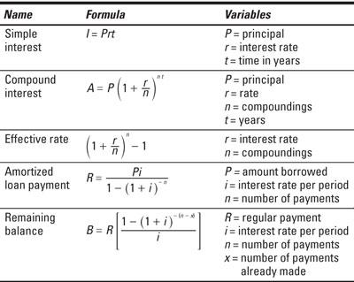

In the rapidly evolving financial world, data analysis and algorithmic trading have become essential tools for making informed investment decisions. R programming stands out as a particularly powerful tool for performing complex data analysis and facilitating algorithmic trading within the finance sector. Its strengths lie in the ability to handle extensive datasets, execute sophisticated statistical analyses, and produce high-quality visualizations, all of which are crucial for navigating the complexities of financial markets.

The significance of using R for data analysis in finance is underscored by its extensive range of packages specifically tailored to financial applications. For instance, the Quantmod package is widely used for quantitative financial modeling and trading strategy development. These packages, combined with R's statistical prowess, enable financial professionals to analyze market trends, assess risks, and optimize investment portfolios efficiently.



Furthermore, R's accessibility, being an open-source language, encourages a large community of users who continuously contribute to its growth, ensuring a robust platform that evolves in line with the industry's needs. This community support facilitates collaboration and innovation, providing finance professionals with an ever-expanding repository of tools and methodologies to draw upon.

When comparing R to other programming languages used in finance, it is essential to acknowledge its specialization in statistical computing and data visualization. While Python, for example, is recognized for its versatility and broad application range, R excels in tasks that demand high levels of statistical analysis. This makes R particularly appealing to analysts and traders who require precision and depth in their data analyses.

In summary, R programming's role in finance is vital for those seeking to leverage data-driven insights for strategic advantage in investment decisions. Its application in the field of algorithmic trading allows for the automation of complex trading strategies, enhancing both efficiency and precision in trade execution. As financial markets continue to integrate advanced technologies, R's influence in data analysis and algorithmic trading is likely to grow, reinforcing its status as a preferred tool among finance professionals.

## Table of Contents

## R Programming: An Overview

R is a widely used programming language and software environment tailored for statistical computing and graphics. Its origins trace back to the early 1990s, created by statisticians Ross Ihaka and Robert Gentleman, and it is part of the GNU project. R's open-source nature significantly contributes to its widespread adoption by statisticians and data scientists seeking robust data analysis capabilities.

In the financial industry, R has become a pivotal tool for analyzing market trends, developing predictive models, and performing econometric analyses. Its popularity is largely due to the comprehensive suite of statistical and graphical techniques it offers, including linear and non-linear modeling, time-series analysis, and clustering. These capabilities allow finance professionals to conduct refined and complex analyses of financial datasets, facilitating more informed decision-making.

A defining feature of R's utility in finance is its extensive library of packages, which enhances its functionality and makes it easier to perform intricate financial calculations. For instance, packages such as "quantmod" for quantitative financial modeling and "forecast" for time-series forecasting offer pre-built functions that simplify the implementation of statistical models. This modular approach not only accelerates the analysis process but also encourages the efficient use of statistical methodologies.

R's ability to handle diverse data structures and its functional programming language properties further contribute to its effectiveness in finance. It allows users to efficiently manage, manipulate, and visualize data, which is crucial when dealing with the voluminous and complex data typical in financial markets. Visualization capabilities, such as those provided by the "ggplot2" package, enable users to create detailed graphs and plots, enhancing the interpretability of financial trends and patterns.

Overall, R stands out in finance for its robust statistical analysis tools combined with a vast ecosystem of packages that keep it adaptable and relevant in the ever-evolving landscape of financial data analysis.

## R in Financial Data Analysis

The financial sector consistently demands precise and comprehensive data analysis to extract valuable insights and inform strategic decision-making. R programming serves as a fundamental tool in achieving these objectives, offering an array of advanced statistical tools crucial for analyzing extensive sets of financial data. These tools enable analysts to identify patterns, test hypotheses, and predict future market trends with a high degree of accuracy.

One of the pivotal applications of R in finance is [backtesting](/wiki/backtesting) trading strategies. Backtesting involves applying a trading strategy to historical data to gauge its potential success before applying it in real-world scenarios. R facilitates this process with packages like Quantmod and TTR, which simplify the manipulation and analysis of time series data. Analysts can evaluate the performance of different strategies across various market conditions, optimizing them based on historical results to enhance future performance.

Risk analysis is another area where R proves invaluable. Financial institutions constantly assess risk to minimize potential losses and maximize returns. R's statistical capabilities allow for sophisticated risk modeling, including Value at Risk (VaR), stress testing, and scenario analysis. Through these models, analysts can measure the potential impact of market fluctuations and establish appropriate risk management strategies.

Portfolio optimization, a task critical for maximizing returns while managing risk, is effectively tackled using R. Analysts employ optimization techniques to determine the most efficient asset allocation strategies. The language's optimization libraries, such as PortfolioAnalytics and DEoptim, provide tools to perform these calculations, balancing risk and return factors according to constraints and objectives.

Moreover, R excels in its ability to create graphical representations of data, which are essential for the visualization and interpretation of financial trends. Visual tools in R, like ggplot2 and lattice, enable the construction of detailed charts and graphs that provide a deeper understanding of market movements and relationships between financial variables. These visualizations aid in communicating complex data insights to stakeholders, facilitating informed decision-making.

In summary, R's robust statistical capabilities and flexibility make it a preferred tool for financial data analysis. Its applications in backtesting, risk analysis, and portfolio optimization—along with its superior data visualization functionalities—establish it as an integral component in the financial analyst's toolkit.

## Algorithmic Trading with R

Algorithmic trading is a key component in modern financial markets, characterized by the use of computer algorithms to execute trades automatically based on pre-set criteria. These algorithms can analyze market data at speeds unachievable by human traders, allowing for rapid and efficient transactions.

R programming language provides a robust ecosystem for [algorithmic trading](/wiki/algorithmic-trading), primarily through specialized libraries and packages like Quantmod and Technical Trading Rules (TTR). Quantmod offers tools for managing, modeling, and analyzing quantitative financial data, facilitating the quick retrieval of stock market data, while TTR provides technical trading rules that aid in decision-making processes.

Using R for algorithmic trading presents several advantages. Traders can create complex algorithmic strategies, backtest these strategies with historical financial data, and optimize them according to performance metrics. Backtesting is a crucial process in algorithmic trading, as it allows traders to simulate the execution of a trading strategy on historical data to gauge its potential effectiveness. R simplifies backtesting through its analytical capabilities, enabling the use of metrics such as Sharpe Ratio, maximum drawdown, and beta coefficients to assess strategy performance.

An example of implementing a simple moving average crossover strategy using R might involve utilizing the TTR package to compute moving averages and the Quantmod package to source historical price data. The strategy is typically designed to generate buy and sell signals based on the crossover of short-term and long-term moving averages.

Here's a basic illustration of how a moving average crossover strategy might be coded in R:

```R
library(quantmod)
library(TTR)

# Download historical stock data
getSymbols('AAPL', from='2020-01-01', to=Sys.Date())

# Calculate moving averages
short_ma <- SMA(Cl(AAPL), n=20)
long_ma <- SMA(Cl(AAPL), n=50)

# Generate trading signals
trading_signal <- ifelse(short_ma > long_ma, 1, 0)

# Calculate returns
returns <- dailyReturn(Cl(AAPL)) * trading_signal

# Performance summary
cumulative_returns <- cumprod(1 + returns) - 1
plot(cumulative_returns, main='Strategy Cumulative Returns')
```

R's flexibility in managing data and conducting statistical analyses makes it suitable for both individual traders and large financial institutions engaged in algorithmic trading. Individual traders can benefit from the open-source nature of R, while institutional environments can leverage its extensive package ecosystem and integration capabilities with other technologies. Despite language limitations, R’s focus on statistical analysis positions it as a powerful tool in developing data-driven trading strategies.

## Advantages of Using R in Finance

R is a free and open-source programming language that provides significant advantages for financial data analysis and algorithmic trading. One of the primary benefits is its accessibility without any licensing costs, making it an attractive option for individuals and organizations alike. R's open-source nature encourages collaboration and contribution, leading to a robust and ever-expanding repository of tools and packages designed for statistical computing and graphical visualization.

R is renowned for its comprehensive statistical capabilities, making it a preferred choice for detailed financial analyses. It offers a rich suite of packages such as 'dplyr' for data manipulation, 'ggplot2' for creating complex visualizations, and 'quantmod' for quantitative financial modeling. These packages enable users to perform sophisticated tasks like backtesting, portfolio optimization, and risk management.

The supportive and extensive community around R is another major advantage. Users benefit from diverse resources, including open-source code, documentation, and forums where they can seek advice and share insights. This collaborative environment continually enhances R's capabilities by introducing new packages and improving existing ones, ensuring that R remains abreast with the latest developments in data analysis and finance.

Moreover, R is particularly user-friendly for individuals who have a background in [statistics](/wiki/bayesian-statistics). Its straightforward syntax and structure make it an intuitive tool for those familiar with statistical methods, which facilitates adoption in academic settings and professional circles involved in financial research and analysis.

In summary, R's open-source accessibility, rich statistical and visualization capabilities, vast community support, and ease of use for statisticians collectively make it an advantageous tool in finance. These features enable practitioners to conduct thorough analyses and develop sophisticated financial models, contributing to informed decision-making in the finance industry.

## Limitations of R in Finance

R is a robust tool for statistical computing, widely used in financial data analysis, but it has certain limitations that users must consider. One notable challenge is its efficiency in handling extremely large datasets. While R provides various packages and functions for data manipulation, its performance can degrade significantly with very large volumes of data, especially in comparison to tools specifically optimized for big data processing. R's memory management operates primarily in-memory, which can lead to inefficiencies when datasets exceed available memory resources, thus requiring additional considerations, such as data chunking or use of external databases for storing data off-RAM.

Another limitation is the learning curve associated with mastering R, particularly for individuals who do not have a background in statistics or programming. Unlike general-purpose programming languages such as Python, which are designed with a broader audience in mind, R is primarily tailored towards statistical analysis. This can pose barriers to entry for beginners or those seeking to integrate more varied programming tasks.

Moreover, R's versatility as a general-purpose programming language is limited. While it excels in statistical analysis and graphical representation, tasks such as web development or complex application programming are better suited to languages like Python. Python, for instance, offers powerful libraries for data analysis, such as Pandas and NumPy, while also supporting robust frameworks for web development like Django and Flask.

Despite these limitations, R remains an invaluable resource in financial data analysis due to its focus on advanced statistical methods. The language's extensive repository of packages and active community continually contribute to its refinement, ensuring its ongoing relevance despite its constraints. Nevertheless, users must weigh these limitations against their specific needs and consider integrating R with other technologies to mitigate its weaknesses where necessary.

## Comparing R with Other Tools for Financial Analysis

Python is a notable contender against R in the financial data analysis domain, thanks to its comprehensive set of libraries such as Pandas and NumPy, which are fundamental in handling large datasets and performing quantitative analysis. Pandas provide high-performance data structures like DataFrames, which facilitate data manipulation and analysis in a manner similar to R's data frame. Moreover, Python's Scikit-learn adds powerful [machine learning](/wiki/machine-learning) capabilities, enhancing its application in financial prediction models.

Conversely, languages such as Julia and Matlab are also prevalent, albeit with smaller user communities compared to R and Python. Julia's claim to fame lies in its computational efficiency. It is specifically designed for high-performance numerical and scientific computing, which can be advantageous when it comes to managing complex mathematical models in finance. This is highlighted in its capability to perform intensive computations without the need to resort to low-level language like C or Fortran, thus offering a unique blend of performance and ease.

Matlab, traditionally used in academia and engineering contexts, boasts a comprehensive toolset for mathematical computations and algorithm development. Its financial toolbox specifically caters to financial data analysis, modeling, and visualization, making it a viable, albeit costlier, option for some institutions.

Each of these tools has its core strengths, making them suitable for different facets of financial analysis. R is unsurpassed when it comes to statistical analysis, thanks to its specialized packages like 'quantmod' and 'TTR' that are tailored for financial time series analysis. Python excels in building web applications and integrating with AI workflows, which is beneficial for developing comprehensive trading and financial systems. Julia delivers superior computational efficiency, making it suitable for simulations and complex quantitative analysis.

The decision to choose between these tools should be dictated by the specific requirements. For example, if the primary focus is detailed statistical analysis, R might be the best choice. If integration with web services and broader applications is a concern, Python offers unmatched versatility. Julia stands out when optimization and execution speed are critical. Additionally, budget considerations, such as open-source versus commercial licensing options, may also influence the decision-making process. 

In conclusion, each tool's capabilities and community support need to be weighed against individual project needs, ensuring that the chosen tool aligns suitably with the data characteristics, desired operational efficiency, and financial constraints.

## Conclusion

R remains a powerful tool for financial data analysis and algorithmic trading due to its statistical prowess and community support. Its extensive library of statistical techniques and packages facilitates the development of detailed models, enabling finance professionals to perform sophisticated analyses that provide data-driven insights. These insights are essential for formulating strategic decisions and managing risks effectively within the financial sector.

Despite facing challenges, such as handling large datasets or a steep learning curve, especially for those unfamiliar with statistical methods, the advantages of using R often outweigh these drawbacks. Its open-source nature, coupled with a robust community that continuously contributes to and enhances its capabilities, offers significant resources to practitioners. This ensures that R remains relevant and efficient for tasks heavily reliant on statistical analysis.

As the finance industry increasingly incorporates [artificial intelligence](/wiki/ai-artificial-intelligence) and machine learning to improve predictive accuracy and enhance decision-making processes, the role of R is expected to expand. Its statistical expertise aligns well with these advanced technologies, making it an invaluable tool in the continued evolution of financial analytics and algorithmic trading. The adoption of AI and machine learning provides an opportunity for further integration and innovation in using R, potentially leading to groundbreaking advancements in the field.

## References

- Investopedia offers comprehensive resources on trading and fundamental analysis, including the use of R programming in finance. These articles provide foundational knowledge on various financial strategies and the application of statistical tools using R [1].

- DataCamp provides educational resources and courses focusing on the practical use of R for algorithmic trading. This platform offers hands-on exercises and detailed tutorials on developing trading algorithms, enhancing the understanding of using R in a financial context [2].

- Amazon, a leader in technology-driven innovations, employs extensive algorithmic systems in automated trading processes. This highlights the significance of algorithmic trading solutions in global financial markets and showcases practical applications of R programming in developing such systems [3].

- Algo Trading 101, among other online courses, offers insights into the practical applications of R in trading, covering topics such as strategy formulation, performance backtesting, and risk management. These resources are invaluable for individuals seeking to understand how R can be effectively leveraged in the trading domain [4].

References:

[1] Investopedia. (n.d.). Trading basics and fundamental analysis. Retrieved from https://www.investopedia.com

[2] DataCamp. (n.d.). R programming for algorithmic trading. Retrieved from https://www.datacamp.com

[3] Amazon Web Services. (n.d.). Trading algorithms with AWS. Retrieved from https://aws.amazon.com

[4] AlgoTrading101. (n.d.). Algorithmic trading courses. Retrieved from https://algotrading101.com

## References & Further Reading

[1]: Bergstra, J., Bardenet, R., Bengio, Y., & Kégl, B. (2011). ["Algorithms for Hyper-Parameter Optimization."](https://dl.acm.org/doi/10.5555/2986459.2986743) Advances in Neural Information Processing Systems 24.

[2]: ["Advances in Financial Machine Learning"](https://www.amazon.com/Advances-Financial-Machine-Learning-Marcos/dp/1119482089) by Marcos Lopez de Prado

[3]: ["Evidence-Based Technical Analysis: Applying the Scientific Method and Statistical Inference to Trading Signals"](https://www.amazon.com/Evidence-Based-Technical-Analysis-Scientific-Statistical/dp/0470008741) by David Aronson

[4]: ["Machine Learning for Algorithmic Trading"](https://github.com/stefan-jansen/machine-learning-for-trading) by Stefan Jansen

[5]: ["Quantitative Trading: How to Build Your Own Algorithmic Trading Business"](https://www.amazon.com/Quantitative-Trading-Build-Algorithmic-Business/dp/1119800064) by Ernest P. Chan

[6]: Gilli, M., Maringer, D., & Schumann, E. (2019). ["Numerical Methods and Optimization in Finance,"](https://www.sciencedirect.com/book/9780128150658/numerical-methods-and-optimization-in-finance) 2nd Edition, Academic Press. 

[7]: Ruppert, D., & Matteson, D. S. (2015). ["Statistics and Data Analysis for Financial Engineering with R Examples."](https://archive.org/details/statisticsdataan0000rupp) Springer. 

[8]: Pfaff, B. (2008). ["Analysis of Integrated and Cointegrated Time Series with R."](https://link.springer.com/book/10.1007/978-0-387-75967-8) Springer.