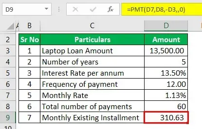

Algorithmic trading refers to the use of computer algorithms to automate trading decisions in financial markets. Through algorithmic trading, large volumes of trades can be executed with speed and precision that surpasses human capabilities. This form of trading has become increasingly integral to financial markets, given its ability to enhance liquidity, reduce transaction costs, and improve execution quality. According to a report by Mordor Intelligence, algorithmic trading accounted for approximately 60-73% of the overall trading volume in the US by 2020, underscoring its critical role in modern finance [1].

R is a programming language and environment broadly used for statistical computing and graphics. In the finance sector, R provides powerful tools for data analysis, statistical modeling, and graphical representation, making it well-suited for developing and implementing quantitative trading strategies. Its environment supports a wide range of packages dedicated to financial analysis, which facilitates the modeling and exploration of financial data.



The purpose of this article is to explore how R can be utilized effectively in the domain of algorithmic trading. The focus is on demonstrating R's capabilities in building, testing, and deploying trading strategies that leverage data-driven insights. By examining the various tools and libraries available in R, as well as providing practical implementation examples, this article aims to illustrate the advantages of using R from both a technical and strategic perspective.

Algorithmic trading continues to experience significant growth driven by advancements in technology and the increasing availability of financial data. As algorithms become more sophisticated and capable of processing vast amounts of information with speed, their potential to transform the trading landscape is immense. This evolution places R in a unique position, given its strengths in data manipulation and statistical analysis, to contribute significantly to the field.

The following sections will elucidate why R is particularly effective for algorithmic trading, how its packages can be harnessed for financial computations, and what considerations must be taken into account when implementing trading strategies using R. Through this discussion, the aim is to establish R as a powerful tool for traders and analysts aiming to maximize the potential of algorithmic trading in their operations.

---

[1] Mordor Intelligence, "Algorithmic Trading Market - Growth, Trends, COVID-19 Impact, and Forecasts (2023)," accessed September, 2023.

## Table of Contents

## Why Use R in Algorithmic Trading?

R is a powerful tool in [algorithmic trading](/wiki/algorithmic-trading), mainly due to its strengths in data manipulation and statistical analysis. As algorithmic trading involves the use of complex models and extensive historical data, R's ability to handle and manipulate data efficiently becomes invaluable. The language is designed for ease of use in data manipulation tasks through its robust set of data types and functions, such as data frames, matrices, and lists, which allow for intuitive and effective data management. R’s syntax is particularly suited for data aggregation, transformation, and summarization, all essential components in the development of algorithmic trading strategies.

R stands out with its comprehensive library support for finance and [quantitative trading](/wiki/quantitative-trading), offering packages specifically tailored to these domains. Libraries like Quantmod provide tools for modeling trade strategies, TTR offers technical trading rules, and PerformanceAnalytics supports performance and risk analysis. These libraries simplify the process of developing, testing, and implementing trading models, giving users a competitive edge in executing complex strategies.

Another advantage of using R is its compatibility with other programming languages and trading platforms. It can be integrated with languages such as Python, C++, and Java, allowing developers to leverage the strengths of multiple programming environments. Furthermore, R is known for its interaction capabilities with platforms like MetaTrader and Bloomberg Terminal, facilitating seamless data exchange and analysis. This interoperability ensures that traders can incorporate R into existing workflows or develop hybrid systems that maximize each language's benefits.

R's capabilities in data visualization and reporting are other notable strengths that support algorithmic trading. Visualization is crucial in making sense of the large volumes of data processed in trading. R excels in this area with powerful packages like ggplot2 and lattice, which provide extensive functionalities for creating detailed and dynamic visual representations of data. These visualizations can help traders easily interpret data trends and patterns, aiding in more informed decision-making.

When compared to other programming languages commonly used in algorithmic trading, such as Python or C++, R has unique offerings. While Python is praised for its simplicity and versatility, R's statistical prowess makes it superior in scenarios requiring intensive data analysis and hypothesis testing. Conversely, C++ is often favored for high-frequency trading due to its execution speed, yet it lacks the ease and flexibility of R for data manipulation and analysis tasks. Therefore, R is particularly appealing for traders focused on statistical modeling rather than speed-centric environments.

In summary, R is a potent tool for algorithmic trading, providing robust support for data manipulation, statistical analysis, and visualization. Its extensive library ecosystem and compatibility with other technologies make it a versatile choice for finance professionals seeking to develop sophisticated and data-driven trading strategies.

## R Packages for Finance and Algo Trading

R is a widely-used programming language in the finance sector, particularly in algorithmic trading, due to its strong statistical computing capabilities and extensive package ecosystem. Several R packages have been developed to aid in financial analysis and the development of trading strategies. Among them, Quantmod, TTR, and PerformanceAnalytics stand out for their functionality and ease of use.

Quantmod (Quantitative Financial Modelling Framework) is a package designed to assist traders in creating, testing, and managing financial models. It provides tools for data modeling and charting, which are essential for devising trading strategies. Quantmod allows users to interact with various data sources, retrieve historical financial data, and visualize it in multiple formats. This package is particularly advantageous for traders who prioritize technical analysis, as it supports charting functions and technical indicators that facilitate decision-making processes.

TTR (Technical Trading Rules) complements Quantmod by offering tools for technical analysis. It focuses on calculating various technical indicators used in developing trading strategies. These indicators, such as moving averages, Bollinger Bands, and MACD, provide traders with insights into market trends and potential buy/sell signals. By incorporating TTR into their workflows, traders can efficiently design rule-based strategies that rely on these mathematical formulas for executing trades.

PerformanceAnalytics stands out for its robust performance and risk analysis capabilities. It is used extensively to evaluate the effectiveness of trading strategies by providing functions for calculating and visualizing performance metrics. These include measures of return, risk, and performance attribution, which are critical for assessing a strategy's viability. The focus on [backtesting](/wiki/backtesting) is crucial because it allows traders to simulate trading scenarios and evaluate strategies under historical market conditions. Effective backtesting gives traders confidence in the robustness of their strategies before deploying them in live markets.

The importance of backtesting in algorithmic trading cannot be overstated. Backtesting involves simulating a trading strategy using historical data to assess its potential performance. R packages like Quantmod, TTR, and PerformanceAnalytics play pivotal roles in this process by enabling traders to efficiently model and evaluate strategies. These tools not only provide the necessary technical indicators and data visualization functions but also offer capabilities for analyzing the outcomes of simulated trades.

Case studies have demonstrated the efficacy of using these R packages in developing successful trading strategies. For example, a moving average crossover strategy, which relies on TTR for moving average calculations, can be implemented and tested using historical data obtained through Quantmod, with performance assessment performed using PerformanceAnalytics. Such an approach allows traders to refine their strategies and optimize parameters based on backtested results.

Recent developments in the R community have introduced new packages and enhancements to existing ones, further expanding the capabilities available for financial analysis and algorithmic trading. Emerging packages focus on improving computational efficiency, expanding data connectivity options, and enhancing user-friendly interfaces for strategy development. With R's open-source nature, the community continually contributes to the expansion of these resources, ensuring that traders have access to cutting-edge tools.

Overall, R continues to be a powerful choice for algorithmic trading due to its extensive library support, enabling traders to develop sophisticated trading strategies and conduct thorough performance analysis with ease.

## Implementing a Basic Algorithmic Trading Strategy in R

Implementing a basic algorithmic trading strategy in R involves a series of structured steps. This process is crucial for traders seeking to automate their trading decisions based on predefined criteria. Here, we will outline the process of setting up, coding, and backtesting a simple trading strategy using the R programming language, focusing on moving average crossover strategies and [momentum](/wiki/momentum)-based trading.

### Choosing a Strategy: Moving Average Crossover or Momentum-Based Trading

Two popular strategies in algorithmic trading are moving average crossover and momentum-based trading:

1. **Moving Average Crossover**: This strategy involves using two moving averages of different periods. A common setup uses the 50-day moving average and the 200-day moving average. The strategy signals a buy when the short-term moving average (50-day) crosses above the long-term moving average (200-day), and a sell when it crosses below.

2. **Momentum-Based Trading**: This strategy focuses on the velocity of price movements. Traders look for stocks that have been moving significantly in one direction on high volume, indicating potential continuation of the movement.

### Data Collection and Preprocessing Using R Packages like Quantmod

Data collection is a critical step, and R provides packages like `quantmod` to facilitate this:

```r
# Load the quantmod package
library(quantmod)

# Get historical stock data (e.g., Apple's stock)
getSymbols("AAPL", src = "yahoo", from = "2020-01-01", to = "2023-10-01")

# View the first few rows of the data
head(AAPL)
```

This code snippet collects Apple's stock data from Yahoo Finance, enabling analysis and strategy development.

### Coding the Strategy Logic and Executing Trades in R

Once data is collected, you can code your strategy:

#### Moving Average Crossover Strategy Example

```r
# Calculate moving averages
AAPL$SMA50 <- SMA(Cl(AAPL), n = 50)
AAPL$SMA200 <- SMA(Cl(AAPL), n = 200)

# Generate buy and sell signals
AAPL$Signal <- ifelse(AAPL$SMA50 > AAPL$SMA200, 1, 0)
AAPL$Position <- lag(AAPL$Signal, 1) # lag to avoid look-ahead bias

# View the signals
head(AAPL[, c("SMA50", "SMA200", "Signal", "Position")])
```

This code calculates 50-day and 200-day moving averages and generates buy (1) and sell (0) signals.

### Backtesting the Strategy and Analyzing Results with R's Visualization Tools

Backtesting involves simulating the strategy on historical data to evaluate performance:

```r
# Load necessary libraries for backtesting
library(PerformanceAnalytics)

# Calculate returns from the strategy
returns <- lag(AAPL$Signal) * dailyReturn(Cl(AAPL))

# Analyze and visualize performance
charts.PerformanceSummary(returns, main = "Strategy Performance")
```

This snippet calculates simulated returns from the moving average crossover strategy, leveraging R's `PerformanceAnalytics` package to visualize performance metrics.

By employing these steps, traders can develop a basic algorithmic trading strategy in R. The flexibility and comprehensive toolset R offers make it suitable for refining trading models and testing their effectiveness.

## Challenges and Considerations

Algorithmic trading using R, while advantageous, presents a unique set of challenges and considerations, particularly in high-frequency trading ([HFT](/wiki/high-frequency-trading-strategies)), live trading robustness, large dataset handling, security, and risk management. Understanding these challenges is essential for traders seeking to leverage R effectively.

### Speed Limitations in High-Frequency Trading

R is renowned for its data manipulation and statistical capabilities but is not traditionally designed for high-speed operations required in HFT. Unlike lower-level programming languages like C++ or Python, R operates as an interpreted language, which can result in slower execution times. In high-frequency trading, where microsecond trade executions are significant, the processing speed of R is a limiting [factor](/wiki/factor-investing). One common approach to mitigate this is integrating R with faster languages for critical sections of code. For instance, computationally intensive parts could be implemented in C++ and linked to R via packages like Rcpp for improved performance.

### Robustness and Reliability in Live Trading

The reliability of R scripts in live trading environments is another concern. R scripts must handle unexpected situations, such as missing data or malfunctioning trading APIs, gracefully to prevent erroneous trades. Traders must emphasize testing scripts extensively and employ robust error-handling mechanisms. This includes using try-catch blocks to manage exceptions and integrating logging systems to track and record trading activities for subsequent analysis and rectification.

### Handling Large Datasets and Computational Tasks

R's memory management can be an obstacle when handling large datasets inherent to financial markets. The entire dataset must often be loaded into memory, which may not be feasible with very large data volumes. Strategies to address this include using data.table or dplyr packages, which are optimized for handling larger datasets efficiently. Additionally, leveraging external databases and employing R's connection interfaces can help manage large data by processing subsets or querying data as needed. Parallel processing techniques using packages like parallel or furrr can also distribute workloads across multiple processors to enhance computational efficiency.

### Security and Risk Management

Security is paramount in trading systems to protect against unauthorized access and data breaches. R-based trading systems must incorporate security best practices, such as secure API connections using SSL/TLS protocols and properly managing authentication credentials. Furthermore, risk management is critical to avoid significant financial losses. Implementing stop-loss mechanisms and conducting thorough risk assessments of trading strategies through Monte Carlo simulations can provide insights into potential risks and inform necessary safeguards.

### Future Developments

Future advancements in R may address these challenges by improving performance and scalability. The R community continually develops new tools and packages to enhance R's capabilities in the financial sector. Promising developments include more efficient parallel processing libraries and better integration tools that allow more seamless interaction between R and high-performance languages. Efforts to improve R’s native speed and memory management, potentially through compiler enhancements or more efficient garbage collection, could also make it more viable for time-sensitive trading applications like HFT.

In conclusion, while R presents challenges in algorithmic trading, particularly in speed and data handling, ongoing developments and strategic integrations offer potential pathways to enhance its suitability for these complex tasks.

## Conclusion

The use of R in algorithmic trading presents significant advantages and potential for financial analysts and traders. A primary benefit of R is its robust analytical capabilities and extensive libraries, which are essential for developing sophisticated trading strategies. With packages designed specifically for financial analysis, such as Quantmod and TTR, traders can efficiently process and analyze financial data, backtest strategies, and visualize results, thereby enhancing decision-making processes.

Algorithmic trading continues to grow in importance within financial markets. As more market participants recognize the value of data-driven strategies, integrating R into their toolkit becomes increasingly advantageous. Its ease of use and comprehensive statistical functions make it an excellent choice for both developing and implementing complex algorithms.

R's compatibility with other programming languages and trading platforms is another significant advantage. This interoperability facilitates the seamless integration of R with technologies such as Python, allowing traders to leverage R’s statistical prowess alongside Python's flexibility and scalability. This combination can lead to innovative hybrid solutions that capitalize on the strengths of multiple tools.

Looking ahead, the future of R in finance appears promising. The ongoing developments in R, including improvements in computational efficiency and the expansion of finance-related packages, are likely to address current limitations and expand its applicability. Additionally, as the R community continues to grow and innovate, users can expect even more resources and tools to enhance trading strategy development.

In conclusion, R offers valuable benefits for algorithmic trading. Its comprehensive capabilities, combined with the growing demand for sophisticated financial analysis, make it an attractive option for traders seeking to optimize their strategies. By exploring R in conjunction with other technologies, financial professionals can gain a competitive edge in increasingly complex and fast-paced markets.

## Additional Resources and Further Reading

For those interested in furthering their understanding of R in the context of finance and algorithmic trading, a wealth of resources is available to facilitate learning and mastery.

### Online Courses and Tutorials

1. **Coursera: "Statistics with R Specialization"** - Offered by Duke University, this program guides learners through statistical concepts and data analysis using R. It is ideal for those wanting to strengthen their data manipulation skills for quantitative finance.

2. **DataCamp: "Quantitative Analyst with R" Career Track** - This comprehensive track covers R programming, financial data visualization, and implementing trading strategies using R.

3. **LinkedIn Learning: "R for Financial Data Analysis"** - This course is tailored for financial analysts and equips learners with skills to analyze and visualize financial datasets using R.

### Book Recommendations

1. **"Quantitative Trading with R" by Harry Georgakopoulos** - Focused on practical applications, this book provides insights into building financial models and trading strategies using R.

2. **"R for Finance" by Diethelm Wuertz and Yohan Chalabi** - A valuable resource offering practical approaches to solving financial problems with R.

3. **"R Programming for Data Science" by Roger D. Peng** - While not exclusively finance-focused, this book lays a strong foundation in R programming essential for financial data science.

### Community Forums and Online Resources

1. **R-Bloggers** - A blog aggregator that hosts finance-related R content, providing tutorials, articles, and coding examples from R experts.

2. **Stack Overflow (R Finance Tag)** - A robust online community where R users in finance share problems and solutions related to financial computations and algorithmic trading.

### Open-Source Projects and Repositories

1. **GitHub - R-Finance** - A project hosting multiple repositories aimed at using R for financial applications, including trading strategies and financial modeling.

2. **CRAN Task View: Finance** - An extensive collection of R packages related to finance on the Comprehensive R Archive Network (CRAN), covering topics from econometrics to portfolio analysis.

### Financial Data Sources and APIs

1. **Quandl** - A leading provider of financial, economic, and alternative datasets for financial analysis, accessible via R using the Quandl package.

2. **Alpha Vantage** - Offers free APIs for real-time and historical equity, forex, and crypto data, integrated with R through packages like alphavantager.

3. **Yahoo Finance** - Provides an R package, quantmod, for retrieving free financial data from Yahoo Finance, crucial for developing and backtesting trading strategies.

These resources provide a solid framework for mastering R in the financial sector, supporting both beginners and advanced practitioners in their journey toward effective quantitative finance and algorithmic trading.

## References & Further Reading

[1]: Mordor Intelligence, "Algorithmic Trading Market - Growth, Trends, COVID-19 Impact, and Forecasts (2023)," accessed September, 2023.

[2]: Georgakopoulos, Harry. ["Quantitative Trading with R"](https://www.amazon.com/Quantitative-Trading-Understanding-Mathematical-Computational/dp/1137354070). Palgrave Macmillan, 2015.

[3]: Wuertz, Diethelm, and Yohan Chalabi. ["R for Finance"](https://www.rmetrics.org/ebooks-basicr). Springer, 2016.

[4]: Peng, Roger D. ["R Programming for Data Science"](https://bookdown.org/rdpeng/rprogdatascience/). Leanpub, 2015.

[5]: Quantmod: Quantitative Financial Modelling Framework, available at [CRAN](https://cran.r-project.org/web/packages/quantmod/index.html).

[6]: TTR: Technical Trading Rules, available at [CRAN](https://cran.r-project.org/web/packages/TTR/index.html).

[7]: PerformanceAnalytics: Econometric Tools for Performance and Risk Analysis, available at [CRAN](https://rdrr.io/cran/PerformanceAnalytics/).

[8]: Quandl.com for financial, economic, and alternative datasets accessible via R.

[9]: Alpha Vantage API for real-time and historical market data, [Alpha Vantage](https://www.alphavantage.co/documentation/).

[10]: Yahoo Finance data accessed using the quantmod package, documentation available at [quantmod package](https://www.youtube.com/watch?v=KcTWf9wLOUE).