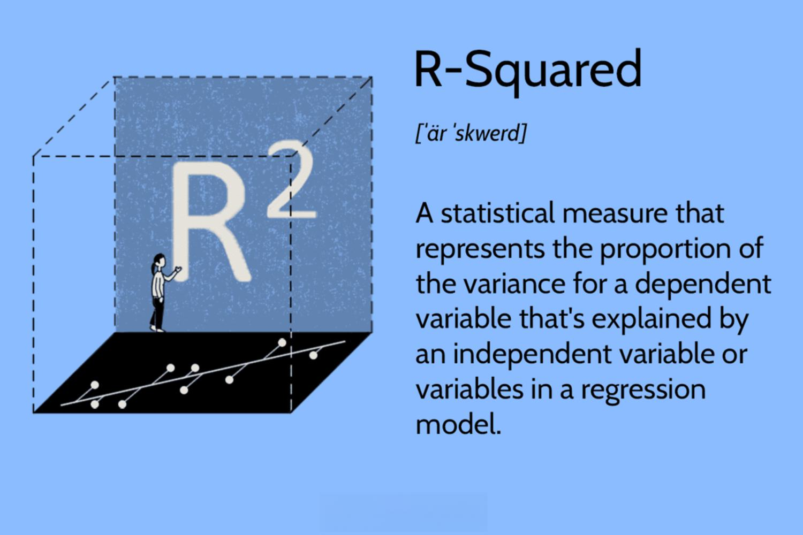

Algorithmic trading stands at the forefront of modern finance, leveraging advanced technology to execute trades based on pre-set criteria with speed and precision. This technology depends heavily on statistical calculations to analyze and predict market behaviors, a cornerstone of which is the R-squared measure. Understanding R-squared is crucial as it quantifies the proportion of variance in a dependent variable that can be explained by one or more independent variables within a regression model.

R-squared values range from 0 to 1, with a value closer to 1 indicating a greater explanatory power of the model. In a robust predictive model, a high R-squared suggests that the model captures a significant portion of the movement in market prices, providing traders with a tool to gauge model accuracy and reliability. This measure aids in discerning how much of movements in financial metrics or asset prices can be attributed to specified factors, which is vital for formulating precise trading strategies.



This article will examine the calculation and implications of the R-squared measure within algorithmic trading, placing emphasis on its essential role in creating predictive models. By also discussing its relationship and comparison to adjusted R-squared and beta, as well as recognizing its limitations, traders can refine their strategies to achieve better predictive accuracy and risk management.

## Table of Contents

## What is R-Squared?

R-squared (R²), also known as the coefficient of determination, is a key statistical measure that quantifies how well the variability in a dependent variable can be explained by one or more independent variables in a regression model. It provides insight into the goodness-of-fit of a model, indicating how effectively the selected predictors account for variations in the outcome. The value of R-squared ranges from 0 to 1, where 0 indicates that the model does not explain any of the variability in the response data around its mean, while an R-squared of 1 indicates that the model explains all the variability of the response data around its mean.

In more technical terms, R-squared is calculated as:

$$
R^2 = 1 - \frac{\text{SS}_{\text{res}}}{\text{SS}_{\text{tot}}}
$$

where $\text{SS}_{\text{res}}$ is the sum of squares of residuals (the unexplained variance), and $\text{SS}_{\text{tot}}$ is the total sum of squares (the total variance in the data). The formula effectively shows the proportion of variance "explained" by the independent variable or variables in the context of the dataset.

Understanding R-squared is essential in fields like [algorithmic trading](/wiki/algorithmic-trading), as it aids in developing predictive models that traders rely on to forecast market trends and asset movements. It helps in assessing how well certain economic indicators, such as interest rates or GDP, predict market behavior. However, while R-squared provides a useful measure of model accuracy, it is important for practitioners to be aware of its limitations, such as potential overfitting in models with too many predictors.

## How to Calculate R-Squared

The calculation of R-squared is central to regression analysis, especially in the application of algorithmic trading, where the precision of predictive models is paramount. At its core, R-squared is a statistical measure that evaluates how well the regression model approximates real data points. This is achieved by examining the proportion of the variance in the dependent variable that is predictable from the independent variable(s).

To compute R-squared, one must first perform a regression analysis to identify the line of best fit among a set of data points. This involves two primary steps: data collection and model implementation. In algorithmic trading, the data points, consisting of historical price movements (dependent variable) and various indicators or predictors (independent variables), are gathered and a regression model, often linear, is applied. 

The R-squared value is mathematically expressed as:

$$
R^2 = 1 - \frac{SS_{\text{residual}}}{SS_{\text{total}}}
$$

Here, $SS_{\text{residual}}$ (Sum of Squares of Residuals) represents the unexplained variation in the dataset, while $SS_{\text{total}}$ (Total Sum of Squares) denotes the total variation in the dependent variable. By computing the ratio of unexplained variation to total variation and subtracting that from one, R-squared quantifies the goodness of fit, where values close to 1 indicate a strong predictive power of the model.

In practice, Python is frequently utilized to perform such calculations due to its robust data manipulation and statistical libraries, such as pandas and statsmodels. An example Python snippet using statsmodels to compute R-squared is as follows:

```python
import pandas as pd
import statsmodels.api as sm

# Sample data
data = pd.DataFrame({
    'predictor': [1, 2, 3, 4, 5],
    'dependent': [2, 4, 5, 4, 5]
})

# Add constant to predictor variables
X = sm.add_constant(data['predictor'])
y = data['dependent']

# Perform regression analysis
model = sm.OLS(y, X).fit()

# Extract R-squared value
r_squared = model.rsquared
print(f"R-squared: {r_squared}")
```

Using these methods, traders can efficiently evaluate the reliability of their models, which is crucial for implementing effective trading strategies. However, it is vital to interpret R-squared in conjunction with other metrics to ensure a robust understanding of the model's predictive capabilities.

## Understanding R-Squared in Algorithmic Trading

R-squared values are critical in evaluating the reliability of predictive models used in algorithmic trading. In this context, R-squared quantifies how well past price movements explain the current performance of a trading model relative to market indices. High R-squared values, typically above 70%, indicate a strong correlation between the model's predictions and benchmark indices. This implies that much of the observed variability in returns can be attributed to the factors included in the model, suggesting more reliable forecasts and potential for improved risk-adjusted returns.

However, solely relying on R-squared without considering other statistical measures can lead to misleading conclusions. A high R-squared value does not necessarily confirm the quality or predictive power of a model. For instance, a model may achieve a high R-squared but still provide poor predictions due to overfitting—a scenario where the model captures noise rather than genuine market signals. Overfitting results in a model that performs well on historical data but fails to generalize to new, unseen data.

To interpret R-squared effectively, it is essential to analyze it alongside other metrics such as the p-values of the coefficients, residual plots, and the performance of the model out-of-sample. This comprehensive approach ensures that the model not only fits the historical data well but also maintains predictive accuracy and robustness when applied to future data. Additionally, incorporating other statistical tools and tests, such as the Durbin-Watson test for autocorrelation, can complement the insights provided by R-squared and enhance the overall reliability of the trading model.

## R-Squared vs. Adjusted R-Squared

In statistical modeling, especially in the context of algorithmic trading, R-squared and adjusted R-squared are two crucial metrics for evaluating the fit of regression models. While R-squared measures the proportion of variance in the dependent variable that can be explained by the independent variables, it does not take into account the number of predictors in the model. This limitation can lead to overestimation of model fit when additional predictors are included, even if they do not contribute meaningfully to the model's explanatory power.

Adjusted R-squared offers a solution to this issue by incorporating a penalty for the number of predictors. It adjusts the R-squared value according to the number of predictors, providing a more accurate measure of model adequacy. The formula for adjusted R-squared is:

$$
\text{Adjusted } R^2 = 1 - \left( \frac{(1 - R^2)(n - 1)}{n - p - 1} \right)
$$

where $n$ represents the number of observations, $p$ denotes the number of predictors, and $R^2$ is the R-squared value. By accounting for the number of predictors, the adjusted R-squared penalizes excessive addition of variables, thus reducing the risk of overfitting, where a model might appear to have a good fit but fails to generalize to new data.

In essence, a high adjusted R-squared value suggests a model where the independent variables effectively capture the variability in the dependent variable, taking into consideration the complexity introduced by additional predictors. This makes adjusted R-squared particularly valuable in algorithmic trading models that incorporate multiple variables, ensuring that model complexity is justified by significant improvements in predictive performance. Therefore, when constructing predictive models in trading, adjusted R-squared is often preferred over R-squared for evaluating model fit.

## R-Squared vs. Beta

Beta and R-squared are important metrics in trading analysis, offering insights into different aspects of asset performance in relation to a market benchmark. Despite their relatedness, they capture distinct characteristics of the asset's interaction with the market.

Beta ($\beta$) is a measure of the relative [volatility](/wiki/volatility-trading-strategies) or systemic risk of an asset compared to the overall market or a specified benchmark. It quantifies the extent to which the asset's returns fluctuate in relation to market movements. A beta of 1 indicates that the asset's price is expected to move with the market, while a beta greater than 1 signifies greater volatility than the market, and a beta less than 1 implies lower volatility. Beta is crucial for determining an asset's risk profile within a diversified portfolio, aiding investors in understanding the potential impact of market fluctuations on the asset's returns.

On the other hand, R-squared ($R^2$) elucidates how well the asset's price movements can be explained by the movements of the benchmark. It is a statistical measure representing the proportion of variation in the asset's returns that can be accounted for by the variation in the benchmark's returns. An $R^2$ value close to 1 suggests that a significant portion of the asset’s movements can be attributed to the benchmark, indicating a strong correlation with the market. Conversely, a lower $R^2$ value implies that the asset's price is less influenced by the benchmark, reflecting a lower degree of market correlation.

In algorithmic trading, using both beta and $R^2$ together provides a more nuanced understanding of an asset's market performance. While beta informs about potential risk and volatility characteristics relative to market shifts, $R^2$ provides insights into the degree to which market movements drive the asset's price variations. Therefore, these metrics collectively aid traders in constructing more informed and robust trading strategies. Understanding and applying both measures allow for better risk management and predictive modeling in trading systems, thus ensuring more resilient investment decisions.

## Limitations of R-Squared

R-squared, though widely used, has notable limitations that must be acknowledged to avoid misinterpretation in statistical modeling. Firstly, R-squared is a descriptive statistic, quantifying the proportion of variance in the dependent variable explained by the independent variable(s). However, it does not indicate causation, meaning that a high R-squared does not confirm a causal relationship between the variables.

Furthermore, a high R-squared value does not necessarily signify a well-fitted model. The measure is susceptible to overfitting, especially in models with numerous predictors. Overfitting occurs when a model learns the noise in the training data, capturing spurious patterns that do not generalize well to new data. Here, the R-squared may be misleadingly high, suggesting good model performance when, in reality, the model may not predict future observations accurately.

Another significant limitation is that R-squared assumes a linear relationship between independent and dependent variables. In scenarios where the relationship is non-linear, R-squared may not accurately represent the model's explanatory power. Non-linear relationships require different fitting techniques that R-squared may not aptly capture, leading to inaccurate interpretations.

Additionally, R-squared does not account for the presence of omitted variable bias. When relevant variables are not included in the model, the R-squared value can be misleadingly influenced by the randomness or the confounding of other unmeasured factors. This omission can make the model appear more or less predictive than it truly is, obscuring its genuine explanatory capacity.

In summary, while R-squared is a useful tool for measuring the goodness-of-fit in regression analysis, its limitations point to the necessity of careful analysis. It is critical for practitioners to use R-squared alongside other [statistics](/wiki/bayesian-statistics) and domain knowledge to ensure robust and accurate model interpretation.

## Tips for Improving R-Squared in Trading Models

Improving the R-squared value in trading models often requires a multistep approach beginning with refining model specifications. This involves revisiting the assumptions and structure of the existing model to ensure they are well-aligned with financial data characteristics. One step is ensuring that the independent variables selected genuinely contribute to explaining the variance of the dependent variable. This can be achieved through techniques like feature selection, where the most statistically significant predictors are chosen, and irrelevant variables are discarded.

Feature selection can be further optimized using methods such as stepwise regression, which systematically adds or removes predictors based on specific criteria, like the Akaike Information Criterion (AIC). This ensures that only variables that materially enhance the model's predictive ability are kept. The integration of regularization techniques, like Lasso or Ridge regression, can also help manage model complexity by penalizing the inclusion of less informative predictors, thus balancing bias and variance.

Addressing multicollinearity, where two or more predictors in a model are highly correlated, is equally crucial. Multicollinearity inflates the variance of coefficient estimates and affects the stability of the model. Techniques like Variance Inflation Factor (VIF) analysis can help identify and manage multicollinearity. Simplifying the model or combining correlated variables can mitigate these issues.

Exploring nonlinear relationships is another strategy to enhance R-squared. Financial markets often exhibit complex, nonlinear patterns that linear models may not capture. By employing models such as polynomial regression, or utilizing [machine learning](/wiki/machine-learning) techniques like decision trees and neural networks, traders can capture these intricate relationships. For example, kernel methods or spline regression can be employed to introduce flexibility into the model, allowing for a better fit to the data's shape.

Lastly, continuous model evaluation and validation are essential. Using cross-validation techniques helps assess the robustness and generalizability of the model. This iterative process of model refinement ensures that it evolves with changing market conditions and maintains its explanatory power over time.

Enhancing R-squared in trading models is not just about increasing its value but ensuring that the model remains statistically sound and applicable for effective decision-making in algorithmic trading.

## Conclusion

R-squared is a valuable statistical measure within algorithmic trading, instrumental in evaluating the effectiveness of predictive models. By quantifying the proportion of variance in the dependent variable explained by the independent variables, it provides traders with insights into model reliability. Understanding how to calculate and interpret R-squared allows traders to construct strategies anchored in solid statistical foundations. The formula for R-squared is typically expressed as:

$$
R^2 = 1 - \frac{\text{SS}_{\text{res}}}{\text{SS}_{\text{tot}}}
$$

where $\text{SS}_{\text{res}}$ is the sum of squares of residuals and $\text{SS}_{\text{tot}}$ is the total sum of squares.

Despite its usefulness, R-squared has its limitations and should be integrated as part of a wider set of analytical tools. Sole reliance on R-squared might lead to misinterpretations, especially in cases of overfitting or when evaluating models with non-linear characteristics. Traders should be conscious of these limitations and ensure a holistic approach to algorithmic strategy development. Adjunctive measures such as adjusted R-squared, Beta, and other robustness checks should be considered to form a comprehensive evaluation framework.

By integrating R-squared with other statistical techniques and continuously refining model strategies, traders can develop algorithms that are not only robust but also adapt to dynamic market conditions. This multifaceted approach enhances the potential for achieving consistent, data-driven outcomes in the competitive trading landscape.

## References & Further Reading

[1]: Bergstra, J., Bardenet, R., Bengio, Y., & Kégl, B. (2011). ["Algorithms for Hyper-Parameter Optimization."](https://proceedings.neurips.cc/paper/2011/file/86e8f7ab32cfd12577bc2619bc635690-Paper.pdf) Advances in Neural Information Processing Systems 24.

[2]: ["Advances in Financial Machine Learning"](https://www.amazon.com/Advances-Financial-Machine-Learning-Marcos/dp/1119482089) by Marcos Lopez de Prado

[3]: ["Evidence-Based Technical Analysis: Applying the Scientific Method and Statistical Inference to Trading Signals"](https://www.amazon.com/Evidence-Based-Technical-Analysis-Scientific-Statistical/dp/0470008741) by David Aronson

[4]: ["Machine Learning for Algorithmic Trading"](https://github.com/stefan-jansen/machine-learning-for-trading) by Stefan Jansen

[5]: ["Quantitative Trading: How to Build Your Own Algorithmic Trading Business"](https://books.google.com/books/about/Quantitative_Trading.html?id=j70yEAAAQBAJ) by Ernest P. Chan