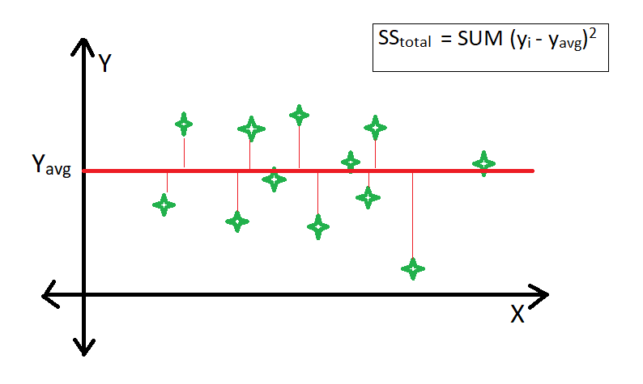

## Table of Contents

## What is R-Squared in the context of machine learning?

R-Squared, often written as R², is a statistical measure used in machine learning to evaluate the performance of regression models. It tells us how well the model's predictions match the actual data. The value of R² ranges from 0 to 1, where a value closer to 1 means the model fits the data better. If R² is 0, it means the model does not explain any of the variability of the response data around its mean.

To calculate R², you compare the model's predictions to the mean of the observed data. The formula for R² is $$ R^2 = 1 - \frac{\text{Sum of Squared Residuals}}{\text{Total Sum of Squares}} $$. The Sum of Squared Residuals is the difference between the actual values and the predicted values, squared and summed up. The Total Sum of Squares is the difference between the actual values and the mean of the actual values, squared and summed up. A higher R² indicates that a larger proportion of the variance in the dependent variable is predictable from the independent variable(s). However, R² alone isn't enough to judge a model's quality; it should be used alongside other metrics.

## How is R-Squared calculated?

R-Squared, or R², is a way to see how well a model's guesses match the real numbers. You start by figuring out the difference between what the model says and what actually happened. Then, you square those differences and add them all up. This is called the Sum of Squared Residuals. You also need to know the average of all the real numbers. You find the difference between each real number and this average, square those differences, and add them up to get the Total Sum of Squares.

To calculate R², you use this formula: $$ R^2 = 1 - \frac{\text{Sum of Squared Residuals}}{\text{Total Sum of Squares}} $$. This formula shows how much better the model is at guessing than just using the average of the real numbers. If R² is close to 1, it means the model's guesses are really good. If it's close to 0, the model isn't much better than just using the average.

Remember, R² is just one way to check a model. It's good to use other ways too, to make sure your model is really working well.

## What does an R-Squared value indicate about a model's performance?

An R-Squared value tells us how well a model's predictions match the real data. It's a number between 0 and 1. If R-Squared is close to 1, it means the model is doing a good job at predicting the data. If it's close to 0, the model isn't much better than just guessing the average of the data. For example, an R-Squared of 0.8 means the model explains 80% of the variability in the data, which is pretty good.

However, R-Squared alone isn't enough to say if a model is good. It doesn't tell us if the model is too simple or too complex. Sometimes, a model can have a high R-Squared but still not be useful because it's overfitting the data, meaning it's too focused on the specific data it was trained on and might not work well with new data. So, it's important to use other measures along with R-Squared to really understand how well a model is performing.

## Can R-Squared be negative, and if so, what does it mean?

Yes, R-Squared can be negative, but it's not common. When R-Squared is negative, it means the model is worse at predicting the data than if you just used the average of the data as your prediction. In other words, the model's guesses are further away from the real numbers than the average would be. This usually happens when the model is really bad at fitting the data, or if the data itself has a lot of noise or errors.

Negative R-Squared values can happen with certain types of models, like when you're using a model that doesn't fit the data well or when you're comparing models. For example, if you're using a model that's too simple for the data, it might not capture the patterns well, leading to a negative R-Squared. The formula for R-Squared is $$ R^2 = 1 - \frac{\text{Sum of Squared Residuals}}{\text{Total Sum of Squares}} $$. If the Sum of Squared Residuals is bigger than the Total Sum of Squares, you'll get a negative R-Squared.

## What are the limitations of using R-Squared as a performance metric?

R-Squared is a useful measure to see how well a model fits the data, but it has some limits. One big problem is that R-Squared can make a model look good even if it's not useful. This happens when the model is too complex and fits the training data too well, a problem called overfitting. When a model overfits, it might have a high R-Squared, but it won't work well with new data. Also, R-Squared doesn't tell us if the model's predictions are accurate enough for what we need them for. Just because a model has a high R-Squared doesn't mean its predictions are close enough to the real numbers to be useful.

Another limitation is that R-Squared only works well for linear models. If you're using a different kind of model, like a non-linear one, R-Squared might not be the best way to judge how well it's doing. Also, R-Squared can be misleading if the data has a lot of noise or if there are outliers. Outliers are data points that are very different from the others, and they can make R-Squared look worse than it really is. So, it's important to use other measures along with R-Squared to get a full picture of how good a model is.

## How does R-Squared differ from adjusted R-Squared?

R-Squared and adjusted R-Squared both tell us how well a model fits the data, but they do it a bit differently. R-Squared, or $$ R^2 $$, shows how much of the change in the data our model can explain. The problem with R-Squared is that it can go up just by adding more variables to the model, even if those variables don't really help. This can make the model look better than it is, especially if we're using a lot of variables.

Adjusted R-Squared fixes this problem by taking into account the number of variables in the model. It's calculated with a formula that adjusts the R-Squared value down if we add variables that don't really help the model. The formula for adjusted R-Squared is $$ \text{Adjusted } R^2 = 1 - \left( \frac{(1 - R^2)(n - 1)}{n - k - 1} \right) $$, where $$ n $$ is the number of observations and $$ k $$ is the number of predictors. This makes adjusted R-Squared a better choice when we're trying to decide if adding more variables to our model is really making it better.

## In what scenarios is R-Squared most appropriately used?

R-Squared is most useful when we're working with linear regression models. It helps us see how well our model's predictions match the real data. If we're trying to guess a number, like how much a house might cost based on its size and location, R-Squared tells us how good our guesses are. It's a number between 0 and 1, where a number close to 1 means our model is doing a good job at predicting the data. For example, if R-Squared is 0.7, it means our model explains 70% of the changes in the data, which is pretty good.

However, R-Squared works best when we're comparing models that have the same number of predictors. If we add more variables to our model, R-Squared might go up even if those variables don't really help. That's why, in these cases, it's better to use adjusted R-Squared. Adjusted R-Squared takes into account the number of variables in the model and adjusts the R-Squared value down if we add variables that don't help. The formula for adjusted R-Squared is $$ \text{Adjusted } R^2 = 1 - \left( \frac{(1 - R^2)(n - 1)}{n - k - 1} \right) $$, where $$ n $$ is the number of observations and $$ k $$ is the number of predictors. This makes adjusted R-Squared a better choice when we're trying to decide if adding more variables to our model is really making it better.

## How can R-Squared be misleading in certain types of regression models?

R-Squared can be misleading in certain types of regression models, especially when the model is too complex. If we add a lot of variables to our model, R-Squared might go up even if those variables don't really help. This can make us think our model is better than it really is. For example, if we're trying to guess how much a house costs and we add the color of the house as a variable, R-Squared might go up, but the color of the house probably doesn't help us guess the price better. This is called overfitting, where the model fits the data we have too well but won't work well with new data.

Another way R-Squared can be misleading is when we're using non-linear models. R-Squared is best for linear regression, where the relationship between the variables is a straight line. If our model isn't linear, R-Squared might not be the best way to see how well it's doing. For example, if we're trying to predict how fast a car goes based on how much gas it uses, and the relationship isn't a straight line, R-Squared might not tell us the whole story. In these cases, we might want to use other measures along with R-Squared to get a better idea of how good our model is.

To fix some of these problems, we can use adjusted R-Squared. Adjusted R-Squared takes into account the number of variables in the model and adjusts the R-Squared value down if we add variables that don't help. The formula for adjusted R-Squared is $$ \text{Adjusted } R^2 = 1 - \left( \frac{(1 - R^2)(n - 1)}{n - k - 1} \right) $$, where $$ n $$ is the number of observations and $$ k $$ is the number of predictors. This makes adjusted R-Squared a better choice when we're trying to decide if adding more variables to our model is really making it better.

## What are some alternative metrics to R-Squared for evaluating model performance?

When R-Squared isn't the best way to see how good our model is, we can use other measures. One good measure is Mean Squared Error (MSE). MSE tells us how far off our model's guesses are from the real numbers, on average. We find the difference between each guess and the real number, square those differences, and then find the average of all those squared differences. The formula for MSE is $$ \text{MSE} = \frac{1}{n} \sum_{i=1}^{n} (y_i - \hat{y}_i)^2 $$, where $$ y_i $$ is the real number, $$ \hat{y}_i $$ is the model's guess, and $$ n $$ is the number of guesses. A smaller MSE means our model's guesses are closer to the real numbers.

Another useful measure is Mean Absolute Error (MAE). MAE is like MSE, but instead of squaring the differences, we just take the absolute value of them. This means we don't make big differences even bigger by squaring them. The formula for MAE is $$ \text{MAE} = \frac{1}{n} \sum_{i=1}^{n} |y_i - \hat{y}_i| $$. MAE is easier to understand because it's in the same units as our data, so if we're guessing house prices, MAE will be in dollars. Both MSE and MAE help us see how well our model is doing, but they look at the errors in different ways.

## How does the interpretation of R-Squared vary across different types of regression models?

R-Squared is a measure that tells us how well a model's guesses match the real data. It's most useful for linear regression models, where the relationship between the variables is a straight line. In linear regression, R-Squared shows how much of the change in the data our model can explain. If R-Squared is close to 1, it means our model is doing a good job at predicting the data. For example, an R-Squared of 0.7 means our model explains 70% of the changes in the data, which is pretty good. However, R-Squared can be misleading if we add a lot of variables to our model, even if those variables don't really help. This is because R-Squared might go up just by adding more variables, making the model look better than it really is.

In non-linear regression models, R-Squared can be less helpful. Non-linear models don't have a straight-line relationship between the variables, so R-Squared might not tell us the whole story about how well the model is doing. For example, if we're trying to predict how fast a car goes based on how much gas it uses, and the relationship isn't a straight line, R-Squared might not be the best way to see how good our model is. In these cases, we might want to use other measures along with R-Squared to get a better idea of how good our model is. One such measure is adjusted R-Squared, which takes into account the number of variables in the model and adjusts the R-Squared value down if we add variables that don't help. The formula for adjusted R-Squared is $$ \text{Adjusted } R^2 = 1 - \left( \frac{(1 - R^2)(n - 1)}{n - k - 1} \right) $$, where $$ n $$ is the number of observations and $$ k $$ is the number of predictors.

## What steps can be taken to improve the R-Squared value of a regression model?

To improve the R-Squared value of a regression model, we need to make sure our model's guesses match the real data better. One way to do this is by adding more important variables to the model. These variables should be closely related to what we're trying to guess. For example, if we're guessing house prices, adding variables like the size of the house or the location might help. But we have to be careful not to add too many variables that don't really help, because this can make the model overfit. Overfitting means the model fits the data we have too well but won't work well with new data. We can check if adding a variable helps by looking at the adjusted R-Squared, which takes into account the number of variables. The formula for adjusted R-Squared is $$ \text{Adjusted } R^2 = 1 - \left( \frac{(1 - R^2)(n - 1)}{n - k - 1} \right) $$, where $$ n $$ is the number of observations and $$ k $$ is the number of predictors.

Another way to improve R-Squared is by making sure our model isn't too simple. Sometimes, a simple model might not capture all the patterns in the data. We can try using a more complex model or transforming our variables. For example, if we're guessing how fast a car goes based on how much gas it uses, and the relationship isn't a straight line, we might need to use a non-linear model. But we have to be careful not to make the model too complex, because this can also lead to overfitting. It's a good idea to use other measures along with R-Squared, like Mean Squared Error (MSE) or Mean Absolute Error (MAE), to get a better idea of how good our model is. These measures tell us how far off our model's guesses are from the real numbers, helping us see if our model is really getting better.

## How does multicollinearity affect the R-Squared value in multiple regression models?

Multicollinearity happens when two or more variables in our model are very closely related to each other. This can make it hard for the model to tell which variable is really helping to guess the outcome. When there's multicollinearity, the R-Squared value might still look good, but it can be misleading. The model might seem like it's doing a great job at explaining the data, but it's actually just using the same information over and over again from different variables. This doesn't make our model better at guessing new data, because it's not really learning anything new.

To deal with multicollinearity, we can look at the Variance Inflation Factor (VIF) for each variable. VIF tells us how much the variance of a variable's coefficient is inflated because of multicollinearity. If VIF is high, it means there's a lot of multicollinearity. We can fix this by removing some of the closely related variables or by combining them into one variable. For example, if we're guessing house prices and we have variables for the number of bedrooms and the number of rooms, these might be closely related. We could remove one of them or combine them into a new variable that measures the total size of the house. This can help make our model better at guessing new data, even if the R-Squared value might go down a bit.

## References & Further Reading

[1]: Cohen, J., Cohen, P., West, S. G., & Aiken, L. S. (2003). ["Applied Multiple Regression/Correlation Analysis for the Behavioral Sciences"](https://www.taylorfrancis.com/books/mono/10.4324/9780203774441/applied-multiple-regression-correlation-analysis-behavioral-sciences-jacob-cohen-patricia-cohen-stephen-west-leona-aiken) (3rd ed.). Routledge.

[2]: Draper, N. R., & Smith, H. (1998). ["Applied Regression Analysis"](https://onlinelibrary.wiley.com/doi/book/10.1002/9781118625590) (3rd ed.). Wiley-Interscience.

[3]: Gelman, A., & Hill, J. (2006). ["Data Analysis Using Regression and Multilevel/Hierarchical Models"](https://www.cambridge.org/highereducation/books/data-analysis-using-regression-and-multilevel-hierarchical-models/32A29531C7FD730C3A68951A17C9D983) Cambridge University Press.

[4]: Montgomery, D. C., Peck, E. A., & Vining, G. G. (2012). ["Introduction to Linear Regression Analysis"](https://archive.org/download/econometrics_books/Intro.%20to%20Linear%20Regression%20Analysis%20-%20D.%20C.%20Montgomery%2C%20E.%20A.%20Peck.pdf) (5th ed.). Wiley.

[5]: Weisberg, S. (2005). ["Applied Linear Regression"](https://onlinelibrary.wiley.com/doi/book/10.1002/0471704091) (3rd ed.). Wiley-Interscience.

[6]: Albright, S. C., Winston, W. L., & Zappe, C. J. (2010). ["Data Analysis and Decision Making"](https://archive.org/details/dataanalysisdeci0000albr) (4th ed.). Cengage Learning.