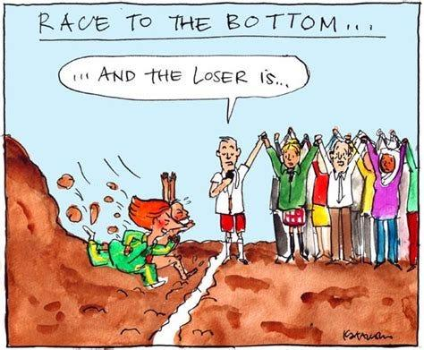

In today’s globalized economy, regulatory standards are instrumental in shaping competitive dynamics across international markets. The globalization of markets has led to increased economic competition, fostering innovation while simultaneously presenting a host of regulatory challenges. This dynamic landscape has given rise to algorithmic trading, a technological advancement that significantly impacts market efficiency and the broader competitive environment.

Globalization has removed many barriers to trade and investment, creating interconnected markets that offer vast opportunities and challenges. In this context, regulatory standards are necessary to ensure fair competition, protect consumers, and maintain market stability. The absence of robust regulation can lead to market failures, systemic risks, and diminished investor confidence. Thus, regulators around the world strive to harmonize standards to facilitate cross-border trade while addressing the negative externalities associated with globalization, such as regulatory arbitrage and the erosion of local standards.

Algorithmic trading, characterized by the use of complex algorithms to execute trading orders at speeds and frequencies beyond human capabilities, has become a significant component of the financial ecosystem. It leverages advances in technology to increase market liquidity and decrease transaction costs. Nonetheless, it introduces new regulatory complexities, including concerns about market manipulation, flash crashes, and the ethical use of artificial intelligence in financial decision-making.

This article examines the complex interplay between regulatory standards, globalization, economic competition, and algorithmic trading. By understanding how these factors interact, stakeholders can better navigate the challenges and opportunities presented in the modern economic landscape.

## Table of Contents

## Regulatory Standards in a Globalized Economy

Regulatory standards are essential for ensuring a level playing field in international markets, particularly as globalization continues to advance. The globalization of markets and economies has significantly increased the need for harmonized regulations across borders, as businesses and financial markets are now more interconnected than ever before. These standards are designed to provide fairness and consistency in trade, investment, and economic activities across different countries.

One core objective of regulatory standards in a globalized economy is to ensure compliance while fostering innovation and competition. This balance is often challenging to achieve, as overly stringent regulations can stifle innovation and market entry. Conversely, too lenient regulations may lead to unfair competitive practices and compromise the integrity of markets. Therefore, regulatory frameworks must be designed to encourage innovation while protecting market participants from unethical practices.

International regulatory bodies and agreements play a crucial role in promoting harmonized regulations. Organizations such as the World Trade Organization (WTO), the International Monetary Fund (IMF), and the World Bank are instrumental in setting guidelines and ensuring that countries adhere to agreed-upon standards. These bodies facilitate negotiations and agreements that align regulatory practices among countries, reducing the potential for conflicts and trade barriers.

For example, the Basel Accords, developed by the Basel Committee on Banking Supervision, set international standards for banking regulations regarding capital adequacy, stress testing, and market [liquidity](/wiki/liquidity-risk-premium) risk. These accords aim to strengthen the global financial system by ensuring that banks maintain sufficient capital buffers to withstand financial shocks. By adopting such international standards, countries can reduce risks associated with financial instability and enhance cooperative financial relationships worldwide.

However, challenges remain in the implementation of these regulatory standards. Countries have different economic priorities, legal systems, and regulatory environments, which can hinder the harmonization process. Additionally, there can be resistance from local businesses and industries that may be adversely affected by new regulations. Overcoming these challenges requires a collaborative approach, with countries working together to formulate mutually beneficial policies that recognize the unique circumstances of each nation.

In conclusion, regulatory standards are vital for maintaining fairness and competitiveness in a globalized economy. While there are challenges in achieving harmonization and compliance, international regulatory bodies and agreements provide a framework for collaboration and standardization. Achieving an optimal balance between innovation, competition, and compliance will remain a central challenge as globalization continues to evolve.

## Economic Competition and the Race to the Bottom

Increased economic competition on a global scale has resulted in what is often referred to as a "race to the bottom." This phenomenon sees countries and companies engaging in aggressive measures to reduce costs and attract business, often at the expense of labor standards, taxation policies, and environmental protections. The desire to provide the most competitive prices and optimal investment conditions leads to a downward pressure on these critical areas, resulting in a complex and often precarious balance between economic growth and ethical responsibility.

As businesses seek to outperform their international competitors, there is a tendency to minimize costs associated with labor by moving operations to regions with lower wage demands and less stringent labor laws. This migration can create job displacement in higher-cost regions and affect working conditions worldwide, potentially leading to ethical compromises and reduced job quality. For instance, in some developing countries, the absence of strict labor regulations may lead to exploitation, thus providing a stark illustration of the difficulties inherent in this competitive landscape.

Similarly, taxation strategies become a focal point as countries aim to attract foreign investments by offering favorable tax regimes. While such policies may encourage economic activity and business development, they can also undermine the tax bases of other nations, leading potentially to budget deficits and underfunded public services. This begs the question of sustainability and fairness in global tax initiatives, stoking debates over international tax reform and equitable contributions from multinational entities.

Environmental standards are also frequently impacted in this competitive context. Eager to attract industrial investments, some regions may relax or fail to enforce environmental regulations, leading to detrimental ecological impacts. The challenge of balancing economic benefits with environmental stewardship requires robust policy frameworks and international cooperation to prevent irreversible damage to ecosystems.

The implications of this competitive race are pronounced in both developed and developing economies. While developing nations may gain short-term economic benefits from attracting foreign business, they often do so at the cost of long-term social and environmental sustainability. Developed economies, on the other hand, face the risk of losing industries to more cost-competitive regions, impacting their local economies and labor markets.

Addressing the challenges posed by this race to the bottom requires innovative approaches that promote competitive advantage while adhering to ethical standards. One potential solution lies in the harmonization of international regulations and the creation of global standards that level the playing field, ensuring that economic competition does not compromise fundamental ethical and quality benchmarks. Initiatives such as global labor standards, cooperative tax policies like the OECD's Base Erosion and Profit Shifting (BEPS) project, and international environmental agreements are critical strategies in mitigating the adverse effects of this competition. 

In essence, navigating economic competition in a globalized economy necessitates a multifaceted approach that balances the pursuit of growth with the imperative of maintaining ethical responsibility and sustainability.

## Algorithmic Trading: A Catalyst for Change

Algorithmic trading leverages sophisticated algorithms to enhance market efficiency, executing trades at remarkable speeds. This technological evolution has significantly influenced traditional financial markets and expanded into other sectors, such as energy trading. By utilizing advanced algorithms, traders can analyze vast datasets instantaneously, identifying profitable opportunities that might elude human traders. This capability enables markets to operate with heightened liquidity, ensuring that trades can be executed without causing significant market disruptions.

In addition to providing increased liquidity, [algorithmic trading](/wiki/algorithmic-trading) also enhances market efficiency. The algorithms are designed to capitalize on [arbitrage](/wiki/arbitrage) opportunities, rapidly adjusting to market conditions and reflecting new information in prices. This increased efficiency can result in more accurate asset pricing, which benefits all market participants by reducing the costs associated with information asymmetry.

Moreover, algorithmic trading has the potential to diminish trading costs. Traditionally, trading involved significant human intervention, which often led to higher costs due to labor and time constraints. By automating the trading process, algorithms reduce the need for human inputs, thereby lowering both the direct costs of trading and the indirect costs associated with human error.

Despite the advantages, algorithmic trading introduces several risks. One primary concern is the potential for heightened market [volatility](/wiki/volatility-trading-strategies). Algorithms can react to market conditions faster than humans, potentially leading to rapid, unforeseen fluctuations in asset prices. This volatility was notably observed during the 2010 Flash Crash, where stock indexes quickly plummeted and rebounded within minutes, primarily driven by algorithmic trading errors.

Another significant risk is the potential for manipulative trading practices. High-frequency trading ([HFT](/wiki/high-frequency-trading-strategies)) algorithms can be programmed to exploit price patterns or engage in practices like spoofing, where traders send false signals to mislead the market about supply and demand dynamics. These practices can undermine market integrity, necessitating robust regulatory frameworks to protect fair market access for all participants.

The expansion of algorithmic trading into non-financial sectors, such as energy markets, raises additional regulatory considerations. As these markets increasingly rely on algorithmic methods for pricing and trading, ensuring transparent and fair practices becomes paramount to maintain market stability and trust.

In summary, while algorithmic trading acts as a catalyst for market innovation and efficiency, it also introduces complex challenges that need continuous regulatory oversight and adaptation. Balancing the innovative potential of algorithmic trading with necessary safeguards to mitigate risks is essential for sustaining healthy, competitive markets.

## Regulatory Challenges in Algorithmic Trading

Regulating algorithmic trading presents significant challenges, particularly in ensuring transparency, accountability, and market stability. These challenges arise from the complexity and speed of algorithmic trading systems, which can execute trades far faster than human traders. Ensuring transparency in such environments requires regulatory frameworks that mandate detailed reporting and disclosure of trading algorithms' logic and operations. 

Frameworks like the European Union's Markets in Financial Instruments Directive II (MiFID II) and the Regulation on Wholesale Energy Market Integrity and Transparency (REMIT) have been instrumental in setting standards for algorithmic trading. MiFID II, implemented in 2018, demands extensive pre-and post-trade transparency from trading firms. It requires them to test algorithms under various market conditions, ensure adequate risk controls, and maintain detailed records of trading activities. Similarly, REMIT is focused on preventing market abuse in the energy sector, requiring detailed disclosures to maintain fair competition and transparency.

Balancing innovation with the protection of market integrity and investor protection is a core challenge. Innovative trading strategies often push the boundaries of existing regulations, requiring a delicate balance between fostering technological advancement and ensuring robust safeguards. A prominent aspect of this balance is the implementation of circuit breakers and trading limits, designed to halt trading in instances of extreme volatility, thereby protecting investors and market stability.

As algorithmic trading progresses, the need for international regulatory coordination becomes increasingly critical. Different global markets have varying regulatory standards, which can create difficulties for multinational trading firms operating across borders. Harmonizing these regulations is essential to avoid regulatory arbitrage, where firms exploit differences in regulations to their advantage.

Overall, while advancements in technology can enhance market efficiency, they necessitate an adaptive regulatory approach to mitigate associated risks. Regulators must continuously update and refine their frameworks to address the complexities introduced by evolving technologies and trading strategies. International collaboration and coordination will be crucial in establishing cohesive, global standards that ensure both robust market integrity and the continued encouragement of innovation.

## The Future of Economic Competition in a Globalized World

Looking ahead, economic competition will be significantly shaped by ongoing technological advancements and the corresponding regulatory responses. As technology continues to evolve, its integration into market operations, particularly through algorithmic trading, will influence the competitive dynamics globally. 

Algorithmic trading, which utilizes advanced algorithms and computational models to execute trades at speeds and efficiencies beyond human capability, is expected to become more sophisticated. The development of [artificial intelligence](/wiki/ai-artificial-intelligence) (AI) and [machine learning](/wiki/machine-learning) algorithms will likely enhance the analytical capabilities of trading systems, enabling them to process vast datasets, identify patterns, and predict market trends more accurately. These technologies will not only make trading more efficient but also provide a deeper understanding of market behaviors, potentially offering a competitive advantage to those who can effectively implement them.

To ensure that markets remain fair and competitive amid these technological advancements, regulators will need to adapt their frameworks. This involves updating regulatory standards to address the new landscape shaped by AI-driven trading systems. Regulators will have to ensure transparency in algorithmic operations, prevent market manipulation, and safeguard investor interests. Moreover, there is a critical need for agile regulatory approaches that can keep pace with rapid technological changes without stifling innovation.

Global cooperation and the alignment of regulatory standards will be essential for navigating the challenges posed by a rapidly changing economic landscape. Regulatory bodies worldwide must work together to establish international norms and policies, minimizing regulatory arbitrage where companies take advantage of lower standards in certain jurisdictions. Such cooperation is vital to maintaining a level playing field in global markets, where disparities in regulatory approaches can lead to inefficiencies and increased systemic risks.

In conclusion, the future of economic competition in a globalized world will be heavily influenced by the interplay between technological advancements and regulatory strategies. As algorithmic trading becomes more sophisticated through AI and machine learning, the role of regulators will become increasingly crucial in ensuring that innovation leads to markets that are not only efficient but also fair and stable. Global collaboration in regulatory practices will be necessary to manage the opportunities and risks associated with these transformative developments in the economic landscape.

## Conclusion

The intersection of regulatory standards, globalization, economic competition, and algorithmic trading presents complex challenges that require a nuanced approach. Regulatory standards must evolve to address the sophisticated nature of algorithmic trading, ensuring that technological advances do not compromise market integrity. As globalization accelerates economic competition, it becomes increasingly important to balance robust regulation with the nurturing of innovation and competition. This balance is crucial to maintaining equitable markets and preventing a downward spiral in labor, taxation, and environmental standards.

Algorithmic trading has undeniably transformed financial markets by enhancing efficiency and liquidity. Yet, with these benefits come inherent risks such as market volatility and potential manipulative practices. Consequently, regulators face the intricate task of developing frameworks that promote transparency and accountability while still encouraging technological innovation.

In managing the multifaceted challenges presented by globalization and technological advancements, strategic and proactive measures are essential. This involves not only national but also international cooperation to align regulatory standards across borders. The rapid pace of change in technology and markets calls for a dynamic regulatory approach that can adapt to new challenges as they arise.

To navigate this evolving landscape successfully, partnerships between regulatory bodies, industry stakeholders, and technological innovators will be essential. These collaborations can foster an environment where competition thrives, markets remain fair, and risks are managed effectively. Ultimately, while the path forward is fraught with complexities, it also offers significant opportunities for growth and improvement in the global economic system.

## References & Further Reading

[1]: Zuboff, S. (2019). ["The Age of Surveillance Capitalism: The Fight for a Human Future at the New Frontier of Power."](https://academic.oup.com/sf/article-abstract/98/2/1/5489222) PublicAffairs.

[2]: Gomber, P., Arndt, B., Lutat, M., & Uhle, T. (2011). ["High-Frequency Trading."](https://papers.ssrn.com/sol3/papers.cfm?abstract_id=1858626) In Financial Information Systems and Analytics, pp. 339-358. Elsevier.

[3]: Kirilenko, A. A., & Lo, A. W. (2013). ["Moore's Law versus Murphy's Law: Algorithmic Trading and Its Discontents."](https://www.aeaweb.org/articles?id=10.1257/jep.27.2.51) National Bureau of Economic Research.

[4]: Farrell, H. (2017). ["The Shared Challenges of Globalization."](https://www.semanticscholar.org/paper/The-Shared-Challenges-of-Institutional-Theories%3A-Farrell/aaa54b40c1addf69365822668e877441425473fd) Annual Review of Political Science, 20, 423-439.

[5]: Bank for International Settlements. (2019). ["Basel III: International regulatory framework for banks."](https://www.bis.org/bcbs/basel3.htm)

[6]: OECD. (2021). ["Base Erosion and Profit Shifting (BEPS)."](https://www.oecd.org/en/topics/base-erosion-and-profit-shifting-beps.html)

[7]: Aldridge, I. (2013). ["High-Frequency Trading: A Practical Guide to Algorithmic Strategies and Trading Systems."](https://books.google.com/books/about/High_Frequency_Trading.html?id=8QpIsVUMhmEC) Wiley.

[8]: Johnson, B., & Stevens, T. (2018). ["Financial Markets and Institutions: A Modern Perspective."](https://books.google.com/books/about/Financial_Markets_and_Institutions.html?id=L636zQEACAAJ) Cengage Learning.

[9]: European Securities and Markets Authority. (2017). ["MiFID II."](https://www.esma.europa.eu/publications-and-data/interactive-single-rulebook/mifid-ii)