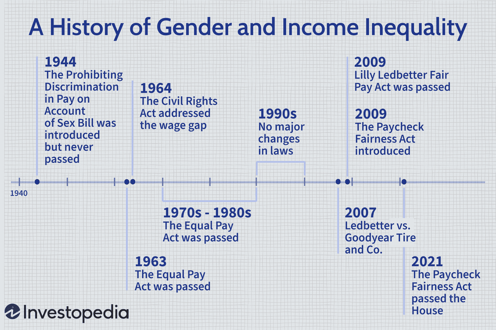

Diversity in education encompasses a wide spectrum of dimensions, including race, ethnicity, cultural perspectives, and socioeconomic backgrounds. It plays a pivotal role in creating inclusive learning environments where students from various backgrounds feel valued and are provided equitable opportunities to succeed. By embracing diversity, educational institutions can foster a culture of inclusivity that respects and celebrates individual differences, thus preparing students for a globalized society.

Racial dynamics and representation in academic leadership are intrinsically linked to the effectiveness of diversity initiatives. Leaders who reflect the demographic diversity of the student body can better advocate for policies that support underrepresented groups, ensuring their voices and needs are met. This representation is crucial not only for the student experience but also for the creation of policies that are equitable and just. Understanding this interconnectedness helps to highlight the importance of diversity at all levels of education.

Algorithmic thinking, the process of solving problems using a step-by-step analytical approach, is increasingly relevant in educational settings. This form of thinking aids in resolving complex educational inequities by providing data-driven insights into student performance and resource allocation. Algorithmic approaches can also assist in identifying and mitigating biases that may affect educational outcomes, ensuring more equitable learning experiences.

Diversity serves as a catalyst for innovation and critical thinking within education. It encourages students and educators to challenge assumptions, engage with a variety of perspectives, and develop solutions that are creative and comprehensive. The infusion of diverse viewpoints allows for more robust problem-solving strategies and stimulates intellectual curiosity, enhancing the learning experience for all involved.

This article explores the intersection of these concepts—diversity in education, racial dynamics in academic leadership, and algorithmic thinking—to demonstrate how they collectively enhance educational experiences. By examining the roles that each element plays, we gain a comprehensive understanding of their combined impact on fostering inclusive, equitable, and innovative educational environments.

## Table of Contents

## Understanding Diversity in Education

Diversity in education encompasses a range of dimensions, including race, ethnicity, and cultural backgrounds. These elements are essential in cultivating environments that reflect the nuances of the global society students will enter. Diversity efforts in education have evolved significantly over time, largely shaped by historical contexts and changing demographics.

Historically, education systems in various countries have struggled with segregation and inequality. For example, in the United States, landmark cases such as Brown v. Board of Education in 1954 were pivotal in challenging racial segregation in schools. This marked a crucial step towards fostering inclusivity, although significant challenges persist.

Current demographic shifts underscore the necessity for inclusive educational frameworks. In many countries, student populations are becoming increasingly diverse. According to the National Center for Education Statistics, as of 2020, over 50% of students in public schools in the U.S. were from minority groups. This highlights the need for educational systems to adapt and embrace these changes.

The benefits of diversity in education are manifold. For students, exposure to diverse perspectives can enhance critical thinking, creativity, and empathy. It prepares them to navigate multicultural environments, both in personal and professional contexts. These interactions can reduce prejudices and foster mutual respect. For educators, a diverse workforce brings varied teaching methods and problem-solving strategies, which can enhance the overall educational experience.

However, implementing diverse educational environments is not without challenges. There are systemic barriers such as funding disparities, implicit biases, and a lack of diverse representation among faculty and administrative roles. Addressing these issues requires comprehensive strategies and commitment from stakeholders at all levels.

Successful diversity initiatives provide insightful case studies. For instance, the University of Michigan has been recognized for its strategic plans to improve campus diversity through scholarships, recruitment, and retention efforts. Their focus on creating supportive networks for underrepresented students and staff exemplifies a holistic approach to inclusion.

In conclusion, understanding diversity in education is crucial for developing inclusive learning environments. Embracing multi-dimensional diversity can enhance educational outcomes for all participants. As institutions continue to evolve, the sustained effort and dedication to equity and inclusion will pave the way for more just and innovative education systems.

## Racial Dynamics in Academic Leadership

Racial representation within educational leadership roles remains a significant topic of discussion and concern. The current state reveals a disparity in racial diversity among leaders in education. According to recent studies, minority groups continue to be underrepresented in key leadership positions such as university presidents, deans, and school principals. This lack of diversity often results in a leadership cohort that does not reflect the broader student population, which is increasingly diverse in terms of race and ethnicity.

The impact of racial diversity in leadership extends beyond representation; it influences policy-making, academic culture, and the inclusivity of educational environments. Leaders from diverse backgrounds are more likely to prioritize and implement policies that address systemic inequities, support minority students and staff, and foster an educational atmosphere that values diverse perspectives. This can lead to improved academic outcomes and enhanced cultural competence for all students.

To improve racial diversity and inclusion in academic leadership, various strategies have been suggested. Institutions can implement targeted recruitment efforts to identify and nurture potential leaders from underrepresented groups. Leadership development programs that focus on mentoring and professional development for minority faculty and staff can also play a critical role. Additionally, establishing diversity-focused committees to oversee hiring and promotion processes can help ensure that equity considerations are prioritized in leadership appointments.

Personal narratives and testimonials from leaders of diverse racial backgrounds offer valuable insights and inspiration. These stories highlight the unique challenges faced by minority leaders and the innovative approaches they have employed to overcome barriers. For example, leaders have shared experiences of leveraging their cultural insights to connect with diverse student bodies, thereby enhancing engagement and retention.

Building pathways for future racial diversity in educational leadership involves creating structural changes that support the advancement of underrepresented groups. This includes developing clear career progression plans, offering scholarships and fellowships for aspiring leaders from minority backgrounds, and fostering an institutional culture that actively combats discrimination and bias. By laying down these pathways, educational institutions can nurture the next generation of diverse leaders poised to transform the landscape of academic leadership.

## Algorithmic Thinking and Its Role in Education

Algorithmic thinking is a computational problem-solving concept that focuses on developing a step-by-step procedure to solve problems efficiently. Its integration into modern education is increasingly recognized due to its capacity to enhance critical thinking, creativity, and problem-solving skills among students. By fostering a structured approach to problem-solving, algorithmic thinking helps students apply logic and precision in various disciplines, making it a valuable educational tool across diverse subjects.

Algorithmic approaches can play a significant role in addressing diversity and equity issues within educational environments. By using algorithms, educators can design personalized learning experiences that cater to individual student needs, thus promoting equity. For instance, [machine learning](/wiki/machine-learning) models can analyze student performance data to identify those who may need additional support, enabling targeted interventions that help bridge educational gaps. The data-driven insights generated through algorithmic methods allow for more equitable resource distribution and tailored educational experiences, ensuring that all students, regardless of their background, have equal opportunities to excel.

The intersection of technology, data, and educational strategies through algorithms presents numerous opportunities for enhancing educational outcomes. Algorithms can process large volumes of educational data to generate insights into student learning patterns, predict future performance, and optimize curriculum delivery. Such strategies can aid in the development of adaptive learning platforms, where content dynamically adjusts to suit the learning pace and style of each student. This technological integration fosters a more personalized and efficient learning environment, contributing to improved educational outcomes.

However, the implementation of algorithmic processes in education is not without challenges. Algorithms inherently rely on data; therefore, potential biases in the data can lead to biased educational outcomes. For example, if historical data used to train an algorithm reflects societal biases, the algorithm may inadvertently perpetuate these biases, leading to skewed results. Ensuring fairness and transparency in algorithmic processes is crucial to mitigating such biases. Continuous monitoring and updating of algorithms with new, unbiased data are essential practices to ensure that educational technology serves all students fairly.

Looking ahead, there are numerous trends and opportunities for algorithmic applications in diverse educational settings. The rise of [artificial intelligence](/wiki/ai-artificial-intelligence) and machine learning opens new possibilities for autonomous learning systems that can operate with minimal human intervention, providing scalable and efficient education solutions globally. Furthermore, the development of explainable AI can help build trust in algorithmic decisions by providing transparency in how decisions are made.

Incorporating algorithmic thinking and related technologies in education not only enhances the learning experience but also prepares students for a future dominated by technology and data-driven decision-making. Culturally-aware algorithms and inclusive data sets promise significant strides towards achieving equity and diversity in education. As educational institutions continue to embrace these advancements, they have the potential to create more inclusive and effective teaching and learning environments.

## The Intersection of Diversity and Algorithmic Trading Concepts

The intersection of diversity concepts in education and [algorithmic trading](/wiki/algorithmic-trading) in the financial sector reveals intriguing parallels and lessons. Both fields contend with issues of inclusivity, representation, and equitable outcomes, albeit through different mechanisms and impacts.

**Comparison of Diversity Dynamics**  
In both education and finance, diversity facilitates richer outcomes and more robust systems. Educational diversity encompasses race, ethnicity, and culture, fostering innovative ideas and critical thinking among students and educators. Similarly, in algorithmic trading, diversity—defined by a variety of strategies and data sources—enhances trading models' robustness and adaptability, leading to better risk management and improved returns. Both sectors recognize that having diverse input leads to superior decision-making processes and results.

**Lessons from Algorithmic Trading**  
Algorithmic trading provides several applicable lessons for educational diversity strategies. The first is the importance of diverse data inputs. In finance, algorithms learn from broad datasets to identify trends and make predictions. Likewise, educational systems can benefit from varied cultural and intellectual perspectives, improving learning models and teaching techniques. Furthermore, the adaptability seen in algorithmic models underscores the need for flexible educational frameworks that can quickly integrate new diverse insights into curricula and policy-making.

**Challenges in Algorithm-Driven Environments**  
Despite potential gains, algorithmic processes can inadvertently perpetuate biases and inequities. In algorithmic trading, if the input data reflects existing market biases, the output decisions will likely reinforce those biases. This mirrors challenges in educational systems, where algorithms used in adaptive learning or administrative decisions could perpetuate existing educational disparities if not carefully managed. Diversity initiatives in both sectors must therefore include rigorous scrutiny of input biases and ongoing audits of outcomes to safeguard against unintended consequences.

**Cross-Industry Collaborations**  
The financial sector's experiences with algorithmic systems and diversity initiatives offer valuable insights for education. Collaborative efforts between educators and financial technologists could lead to innovative solutions for enhancing diversity in education. For instance, educational policymakers can learn from financial risk management techniques to foresee and mitigate biases in educational algorithms. Additionally, cross-industry collaborations could lead to the development of advanced training programs that prepare diverse student populations for careers in algorithm-driven fields.

**Leveraging Insights for Academic Diversity**  
Insights from algorithmic trading emphasize the importance of continuous improvement and feedback loops. Algorithmic systems are dynamic, adapting to new data and trends in real-time. Similarly, educational strategies must be fluid, allowing for ongoing adjustments based on the diverse needs and experiences of students and educators. This adaptability, coupled with a commitment to diversity, can create learning environments that not only reflect but also celebrate the multifaceted global community.

By examining these intersections, both the educational and financial sectors can advance towards more inclusive and effective systems, benefitting from the wealth of perspectives that diversity brings.

## Fostering Innovation and Inclusive Excellence

Integrating diversity and algorithmic perspectives in education can significantly transform learning environments, fostering innovation and inclusive excellence. Diversity, when embraced, enriches the educational process by bringing multiple perspectives and experiences to the table. This enhances creativity and drives critical thinking, empowering students and educators to challenge conventional norms and explore novel solutions.

One of the critical approaches to cultivating environments that encourage creative and critical thinking is through diverse leadership. Leaders from varied backgrounds bring unique viewpoints that can inspire educational reforms and policies more attuned to the needs of a diverse student body. Diverse leadership models promote inclusivity and empathy, allowing for the development of curricula that reflect a broader spectrum of cultural and intellectual traditions.

Several educational programs have successfully integrated these facets to foster innovation. For instance, STEM educational initiatives are increasingly incorporating algorithmic thinking and diversity into their curriculum to prepare students for future challenges. Programs like Girls Who Code and Black Girls Code provide platforms for underrepresented groups to excel in technology fields, merging algorithmic thinking with an emphasis on diversity and inclusion.

The long-term impacts of fostering diversity in education extend beyond the classroom into society and the job market. A diverse educational environment prepares students for a globalized world, where they can navigate cross-cultural interactions with ease and competence. Employers increasingly value diversity for its role in driving innovation and improving organizational performance. As educational institutions embrace diversity, they contribute to a workforce that is well-equipped to handle complex, real-world problems.

Looking towards the future, the expansion of diversity and inclusion in educational frameworks is essential. This vision entails integrating algorithmic thinking into diverse educational practices and utilizing data-driven approaches to tailor educational experiences to diverse learning needs. Educational systems must also emphasize equity, ensuring that all students have access to resources and opportunities that enable them to thrive.

To achieve these goals, collaboration across sectors is crucial. Insights from fields like algorithmic trading can offer lessons on managing diverse data sets and optimizing decision-making processes. Educational institutions might adopt similar strategies to identify and address inequality or inefficiencies within their systems. Such cross-disciplinary partnerships can foster environments where diversity and innovation are not only encouraged but seen as essential to achieving educational excellence.

## Conclusion

Diversity in education and academic leadership serves as a cornerstone for creating learning environments that welcome and elevate a multitude of perspectives. A diverse educational framework not only enriches students' learning experiences but also prepares them to thrive in a multicultural world. When educational leadership reflects the diverse makeup of its community, it enriches policy-making and fosters an academic culture that values inclusivity and equity.

Algorithmic thinking holds promising potential to advance educational diversity. Through data-driven decision-making processes, algorithms can identify gaps in diversity and equity within educational settings and propose evidence-based solutions. However, the application of algorithmic approaches must be carefully managed to mitigate any inherent biases that may skew educational outcomes.

There is a pressing need for educators, policymakers, and institutions to prioritize diversity initiatives with renewed vigor and creativity. Investing in programs that encourage diverse voices within both student bodies and faculty can transform educational experiences. Engagement in cross-sector collaborations, especially with fields such as technology and finance that heavily utilize algorithmic methods, can bring fresh insights and strategies to educational contexts.

The journey towards achieving truly equitable and inclusive educational environments is ongoing. It requires a commitment to continual evaluation and adaptation of strategies that support diversity. By focusing on inclusivity, education sectors can contribute to building a society where diversity is not only recognized but celebrated as a valuable asset.

As we look towards the future, diversity must remain a priority across all societal facets. This commitment will ensure we are building educational systems that reflect our diverse world and equip future generations with the skills to engage with it critically and compassionately.

## References & Further Reading

[1]: Tanenbaum, C., & Shreiner, M. (2020). ["A Path to Equity for K-12 Computer Science Education: Expanding Capacity and Diversity to Broaden Participation."](https://www.fh-dortmund.de/modulhandbuecher/hio.import.modulehandbook.1889.de.php?loc=en) American Institutes for Research.

[2]: Ginther, D. K., Kahn, S., & Schaffer, W. (2016). ["Gender, Race/Ethnicity, and National Institutes of Health R01 Research Awards: Is There Evidence of a Double Bind for Women of Color?"](https://pubmed.ncbi.nlm.nih.gov/27306969/) Academic Medicine, 91(8).

[3]: ["The Benefits of Diversity in Schools." FutureLearn Blog.](https://empoweringeducation.org/blog/importance-of-school-diversity/) 

[4]: Cahn, P. S. (2015). ["Do Physician-Scientists from Underrepresented Groups in Medicine Share the Same Motivations and Learning Styles as Their Peers?"](https://libguides.usu.edu/c.php?g=1439156&p=10695578) Telemedicine and e-Health, 21(4).

[5]: Smith, D. G. (2015). ["Diversity’s Promise for Higher Education: Making It Work."](https://psycnet.apa.org/record/2015-36660-000) Johns Hopkins University Press.