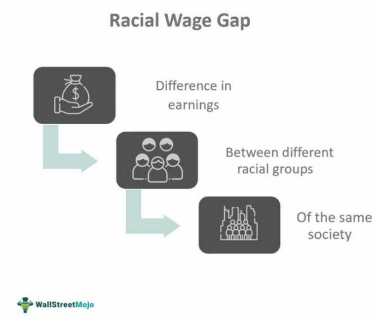

The intricate relationship between economic forces and societal structures continues to shape the fabric of modern economies. Central to this discourse are the pressing issues of income inequality and the racial wage gap, both of which significantly influence economic stability and growth. This has been exacerbated by technological advancements, particularly the rise of algorithmic trading, which has become a dominant force within financial markets. By utilizing computer algorithms to execute trades with rapid speed and precision, algorithmic trading holds the potential to influence market behavior and, consequently, economic outcomes.

Addressing how these elements intersect is crucial, as income inequality and the racial wage gap can exacerbate social tensions, hinder economic mobility, and potentially lead to slower economic growth. Algorithmic trading, with its capacity for high-frequency transactions, raises questions about accessibility and fairness in financial markets, potentially benefitting those with technological expertise and resources while sidelining others.

The convergence of these dynamics calls for a nuanced analysis to understand their impact on the broader economy. By exploring these intersections, we can develop strategies to mitigate their adverse effects and foster an inclusive economic environment that ensures equitable growth. This understanding is pivotal for policymakers, industry leaders, and communities striving to reduce economic disparities and enhance economic resilience. Ultimately, the insights gained from examining these issues pave the way for potential interventions aimed at creating a more balanced economic landscape.

## Table of Contents

## Understanding Income Inequality

Income inequality refers to the uneven distribution of income among individuals and groups within a society. This disparity in income allocation results in economic stratification, where a small fraction of the population accumulates substantial wealth while the majority gains comparatively less.

Economic theory posits that a certain level of income inequality is essential to inspire individuals to invest in education and innovation, thereby driving overall productivity and economic growth. Inequality, in this sense, serves as a motivating force by rewarding individuals for their skills, effort, and entrepreneurial risk-taking. For instance, high achievers in technology or entertainment sectors often earn significantly more, offering a cultural benchmark for success, encouraging others to follow suit.

However, when income inequality becomes excessive, it can have deleterious effects on economic growth and societal harmony. A critical threshold exists where the benefits of inequality turn negative, fostering economic instability. Excessive inequality can erode consumer purchasing power as wealth concentrates among those with lower marginal propensities to consume. This situation can lead to reduced demand and stifled economic growth. Furthermore, social unrest often follows substantial inequalities, as the disenfranchised seek more equitable resource distribution, potentially leading to political instability and reforms that may hinder economic dynamics.

Recent [statistics](/wiki/bayesian-statistics) illustrate a growing income disparity across several leading economies. In the United States, for example, the top 1% of earners saw a substantial increase in income share from 11% in 1980 to approximately 20% in recent years. In comparison, income growth for the bottom 50% was relatively stagnant. Similar patterns are observed in other developed economies, including the United Kingdom and Germany, where the income share of the top decile has burgeoned over the past few decades.

The macroeconomic consequences of such disparity are profound. High levels of income inequality have been correlated with increased economic [volatility](/wiki/volatility-trading-strategies), as seen in the financial crises of the late 20th and early 21st centuries. Inequality can undermine trust in institutions, reduce economic mobility, and propagate adverse conditions across generations, perpetuating cycles of poverty and social division.

Evidence from recent studies underscores the critical nature of these challenges. Research conducted by economists such as Thomas Piketty highlights the concentration of wealth as both a cause and result of economic policies that favor capital income (e.g., dividends, interest) over wage income. Understanding income inequality's impact is essential in crafting policies aimed at equitable growth, balancing incentives with social welfare to promote a more inclusive economic landscape.

## The Racial Wage Gap: A Persistent Issue

The racial wage gap is a significant aspect of income inequality, adversely affecting minority groups, particularly in the United States and other developed economies. This gap reflects the longstanding impacts of systemic racism and discrimination that have persisted through generations. Minority groups, including African Americans, Hispanics, and Native Americans, often find themselves on the lower end of the wage spectrum across various sectors. This disparity is influenced by a complex interplay of historical, socio-economic, and policy-driven factors.

Historically, discriminatory practices such as segregation, unequal educational opportunities, and biased employment practices have contributed to this wage gap. Despite advancements in civil rights and equality legislation, these historical injustices have had lasting effects on the economic positioning of minority groups. According to data from the U.S. Census Bureau, African American men, on average, earn only about 87 cents for every dollar earned by their white counterparts, while African American women earn even less, at approximately 63 cents [1].

Furthermore, the impact of the racial wage gap extends beyond individual hardships. On a macroeconomic level, it affects overall productivity and economic welfare. This is because income inequality can lead to reduced consumer spending, lower educational attainment, and increased social tensions, all of which could hinder economic growth.

Current statistics underscore the persistence of this issue. According to the Economic Policy Institute, the adjusted wage gap for white and Black workers was roughly 14.9% in 2020, even after controlling for education, experience, and region of residence [2]. Such disparities highlight the challenges minority groups face in accessing equal pay for equal work, often due to occupational segregation and differential access to high-paying industries and positions.

Several policy interventions have been proposed to address and mitigate the racial wage gap. These include enforcing stronger anti-discrimination laws, promoting diversity and inclusion initiatives in workplaces, and improving access to quality education and training for underrepresented groups. Additionally, increasing transparency in pay and mandating regular audits for wage disparities within companies can serve as critical steps toward closing the gap.

In conclusion, addressing the racial wage gap necessitates a multipronged approach consisting of policy reforms, societal changes, and continuous monitoring to ensure equitable treatment of all workers, regardless of race or ethnicity.

[1] U.S. Census Bureau: Income and Poverty in the United States: 2020. www.census.gov/library/publications/2021/demo/p60-273.html

[2] Economic Policy Institute: The State of Working America 2021. www.epi.org/publication/state-of-working-america-wages-2021/

## Algorithmic Trading: An Overview

Algorithmic trading utilizes sophisticated computer algorithms to automate the buying and selling of financial instruments. This technology-driven approach has fundamentally transformed trading activities across global financial markets, significantly increasing the speed and efficiency of transactions. It leverages historical data, mathematical models, and statistical analysis to make trading decisions that minimize human error and exploit market opportunities within milliseconds.

Algorithmic trading dominates trading floors globally, accounting for a substantial portion of the total market [volume](/wiki/volume-trading-strategy). According to a 2019 report by the Bank for International Settlements, around 70-80% of equity market volume in the United States is executed through such automated systems. These algorithms facilitate high-frequency trading ([HFT](/wiki/high-frequency-trading-strategies)), a subset of [algorithmic trading](/wiki/algorithmic-trading) characterized by extremely high turnover rates and the ability to hold positions for very short periods. 

The core advantage of algorithmic trading lies in its operational efficiency. It reduces transaction costs by executing large orders in a fraction of a second, minimizing the market impact and slippage. Additionally, algorithms can concurrently monitor multiple markets and instruments, identifying [arbitrage](/wiki/arbitrage) opportunities that would be impossible for human traders to spot in real-time. This results in improved [liquidity](/wiki/liquidity-risk-premium) and narrower bid-ask spreads, generally leading to more efficient markets.

However, the influence of algorithmic trading on market dynamics is multifaceted. While it enhances liquidity and market efficiency, it can also contribute to market volatility, as observed during the "Flash Crash" of May 6, 2010, when the Dow Jones Industrial Average plunged about 1,000 points within minutes before swiftly recovering. In such instances, algorithms may trigger cascading selling or buying, amplifying price movements instead of stabilizing them.

From an economic perspective, the implications of algorithmic trading are significant. It has the potential to either amplify or mitigate income disparities within the financial sector and broader economy. On one hand, those with the resources to develop and maintain advanced trading systems can leverage these tools to achieve substantial gains, potentially widening the gap between well-established financial entities and smaller players. On the other hand, democratizing access to algorithmic trading tools through fintech innovations and open-source platforms could enable underrepresented groups and smaller investors to participate more equitably in financial markets.

The potential role of algorithmic trading in affecting economic disparities must therefore be considered carefully. Regulatory frameworks are essential to ensure that it contributes to inclusive financial growth without exacerbating existing inequalities. By establishing robust guidelines and promoting transparency in algorithmic operations, stakeholders can work towards balancing the benefits of technological advancement with the need for fair and equitable economic policies.

## Intersections: Income Inequality, Racial Wage Gap, and Algorithmic Trading

The interplay between income inequality, the racial wage gap, and algorithmic trading is intricate and multifaceted. Income inequality and racial wage gaps are deeply embedded in societal structures and have historical roots, yet the modern phenomenon of algorithmic trading introduces new dimensions to consider.

Algorithmic trading, which relies on advanced computer algorithms to execute trades at speeds and frequencies beyond human capability, can potentially perpetuate economic inequalities. This is primarily because access to the technology and expertise necessary to develop and maintain these algorithms is concentrated among wealthier entities and individuals, often leaving minority and less affluent groups at a disadvantage. Those who can afford the resources to develop sophisticated trading algorithms can capitalize on market movements more effectively, potentially widening the gap between those with technological access and those without.

Despite these concerns, algorithmic trading also presents opportunities for mitigating some disparities. By enhancing market efficiency and transparency, these algorithms can reduce transaction costs and make it easier for a broader demographic to participate in financial markets. Through platforms that provide algorithmic trading tools to retail investors, there is potential for democratizing market access. If properly regulated and widely accessible, algorithmic trading can serve as an equalizer, providing underrepresented groups with the same opportunities that have long been the privilege of institutional investors.

Various perspectives exist on how these factors intersect and affect economic stability. Proponents argue that algorithmic trading improves liquidity and market function, which can benefit all market participants, including those from minority and underprivileged backgrounds. Critics, however, caution that without equitable access and comprehensive oversight, the technology could exacerbate existing income divides. They emphasize the need for policies that ensure fair access to technological advancements to prevent deepening disparities.

Real-world examples underscore these dynamics. Case studies examining the impact of algorithmic trading firms show that while some have used technology to democratize finance through platforms like Robinhood by allowing commission-free trading, others highlight issues such as "flash crashes" that demonstrate the potential for market instability, often affecting individual investors the hardest.

Ultimately, navigating the complexities of income inequality, the racial wage gap, and algorithmic trading requires careful consideration of both negative and positive potential outcomes. Strategic policymaking and inclusive technological innovation are crucial to harnessing the benefits of algorithmic trading while ensuring it doesn't reinforce systemic inequities.

## Economic Impacts: Long-term and Short-term Considerations

Income inequality and the racial wage gap are enduring issues that contribute to notable economic consequences if not addressed. As disparities in income widen, they can lead to decreased economic mobility, reduced consumer spending, and heightened social unrest. Income inequality often results in an accumulation of wealth within a small segment of the population, thus limiting broader economic growth. When economic resources are concentrated in the hands of a few, aggregate demand may decline, undermining economic stability and growth.

Algorithmic trading offers potential short-term gains, primarily through efficient market operations and enhanced liquidity. By automating the buying and selling of financial instruments, algorithmic trading can reduce transaction costs and improve market transparency. However, its unregulated application can lead to significant market distortions. Flash crashes, where market prices exhibit rapid and extreme fluctuations, are one such example. These phenomena underline the necessity of implementing careful regulation to mitigate the adverse effects of algorithmic trading.

Long-term consequences of unchecked income inequality and the racial wage gap may involve escalating wealth disparities and increased social tensions. Such conditions can foster environments where economic participation is limited, perpetuating cycles of poverty and marginalization. The concentration of economic power diminishes innovation and restricts the potential for inclusive growth.

Addressing these economic factors requires a multifaceted approach involving policy solutions and regulatory frameworks. Implementing progressive taxation, enhancing access to quality education for underrepresented communities, and enforcing anti-discrimination laws in employment are vital steps toward narrowing the racial wage gap and reducing income inequality. Additionally, regulating algorithmic trading by following transparency standards and circuit breakers can prevent excessive market volatility and concentration of trading technologies among a few market participants.

Ultimately, fostering an economy characterized by inclusive growth and sustainable policies is imperative. Promoting equitable access to economic resources and opportunities ensures a more robust and resilient economic future. Policymakers and industry leaders must collaborate to craft strategies that balance short-term market dynamics with long-term socio-economic objectives. By prioritizing these efforts, society can work toward diminishing economic disparities and enhancing overall economic well-being.

## Conclusion

The complexities of income inequality, racial wage gaps, and algorithmic trading present significant challenges and opportunities. These intertwined issues necessitate a multifaceted approach, where policymakers, industry leaders, and the wider community collaborate towards meaningful solutions. Understanding how these elements interact is crucial for building a more equitable and resilient economic future.

This article has identified key areas for consideration and further research, emphasizing that tackling income inequality and racial wage discrepancies requires both innovative thinking and pragmatic policy interventions. It is essential to recognize the role of algorithmic trading in either exacerbating or mitigating these disparities, depending on how it is managed and regulated.

By recognizing and acting on these insights, society can work towards reducing economic disparities. A concerted effort to address these issues will not only improve individual livelihoods but also enhance overall economic stability and growth. Encouraging inclusive growth policies and advocating for equitable technological advancements can pave the way for a fairer distribution of wealth. Hence, a future where economic disparities are minimized can be envisioned by fostering an environment of understanding, cooperation, and continuous dialogue among all stakeholders.

## References & Further Reading

[1]: Piketty, T. (2014). ["Capital in the Twenty-First Century."](https://www.jstor.org/stable/j.ctt6wpqbc) Harvard University Press.

[2]: U.S. Census Bureau. ["Income and Poverty in the United States: 2020."](https://www.census.gov/library/publications/2021/demo/p60-273.html)

[3]: Economic Policy Institute. ["The State of Working America 2021."](https://www.epi.org/research/state-of-working-america/)

[4]: Bank for International Settlements. (2019). ["Triennial Central Bank Survey of Foreign Exchange and Over-the-counter (OTC) Derivatives Markets in 2019."](https://www.bis.org/statistics/rpfx19.htm)

[5]: Haldane, A. G. (2016). ["The Sneetches' Myth: Market Inflation Expectations and Prudent Policy"](https://www.science.org/doi/10.1126/science.aad0299) Bank of England.

[6]: Carney, M. (2019). ["The Growing Challenges for Monetary Policy in the current International Monetary and Financial System."](https://www.bankofengland.co.uk/speech/2019/mark-carney-speech-at-jackson-hole-economic-symposium-wyoming) Bank for International Settlements.