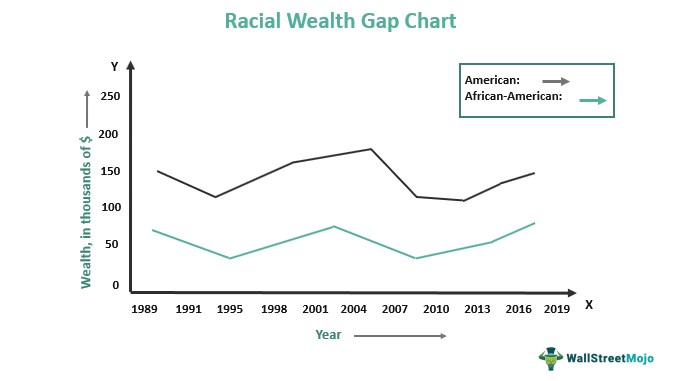

Economic inequality refers to the unequal distribution of economic resources, including wealth and income, among individuals and groups within a society. This inequality manifests in several forms, primarily distinguished between wealth disparity and income disparity. Wealth inequality pertains to the uneven distribution of assets, such as property, investments, and savings, whereas income inequality relates to the uneven distribution of earnings and wages among the population. Both forms of disparities contribute to broader socio-economic challenges, influencing access to education, healthcare, and social mobility.

A crucial facet of economic inequality is the racial wealth gap, which highlights the significant differences in wealth accumulation among different racial and ethnic groups. Statistical data indicates that, on average, white households possess substantially more wealth than Black and Hispanic households. For example, in the United States, the median white household has approximately 10 times more wealth than the median Black household and 7 times more than the median Hispanic household (Pew Research Center, 2021). This disparity can be traced back to historical injustices such as redlining, segregation, and discriminatory lending practices, which have impeded minority communities from building and sustaining wealth over generations.

Technology, particularly algorithmic trading, has become deeply intertwined with economic disparities. Algorithmic trading employs automated and complex mathematical models to make high-speed trading decisions, often giving an advantage to financial institutions with significant technological and data resources. This technological edge can exacerbate existing wealth disparities, as those with access to advanced trading technologies and expertise can potentially accumulate wealth more rapidly than those without such access.

Exploring the interplay between racial wealth gaps, broader economic inequalities, and advanced financial technologies requires an understanding of how these elements influence one another. For instance, algorithmic trading sets a new frontier in investment strategies, but its benefits are not equally accessible to individuals across different economic strata. Consequently, this technological advancement can widen the economic divide, with underrepresented and historically marginalized groups finding it challenging to partake in the wealth generated through these modern financial systems.

Understanding these concepts in today's socio-economic climate is vital as societies grapple with the repercussions of growing economic disparities. Addressing these issues is crucial not only for promoting economic justice but also for fostering sustainable economic growth and stability. As globalization intensifies economic competition, ensuring equitable access to financial opportunities becomes paramount. Hence, efforts to bridge the racial wealth gap and ensure fair participation in technological advancements in finance are essential for cultivating a more inclusive and equitable society.

## Table of Contents

## Understanding the Racial Wealth Gap

The racial wealth gap refers to the significant disparity in wealth between racial groups, often highlighted between White households and Black or Hispanic households in the United States. Wealth, defined as the total assets owned by an individual or household, minus any liabilities, is a crucial measure of economic security and opportunity. According to data from the Federal Reserve's 2019 Survey of Consumer Finances, the median wealth of White families was $188,200, compared to $24,100 for Black families and $36,100 for Hispanic families. Such discrepancies underscore the racial wealth gap's magnitude and signify diverse access to economic opportunities and resources.

### Historical Factors Contributing to the Racial Wealth Gap

Several historical factors have substantially contributed to the racial wealth gap. Redlining, a practice institutionalized in the 1930s by the Home Owners' Loan Corporation, involved denying mortgages to predominantly Black neighborhoods, thereby stifling their ability to build home equity—a primary vehicle for wealth accumulation. Additionally, discriminatory lending practices have persisted into modern times, with studies showing minority applicants facing higher denial rates or less favorable loan terms than their White counterparts even when similarly qualified.

### Systemic Racism and Wealth Accumulation

Systemic racism has profoundly impeded wealth accumulation opportunities for minorities. Discrimination in education and employment reinforces socioeconomic barriers, preventing equitable wealth-building prospects. For instance, historically Black colleges and universities (HBCUs) have been chronically underfunded compared to predominantly White institutions, impacting educational outcomes and subsequent [earning](/wiki/earning-announcement) potential for their graduates. Employment discrimination further diminishes these opportunities, as minorities frequently face disparities in hiring, pay, and promotion within industries.

### Education, Employment, and Housing Inequalities

Inequalities in education, employment, and housing are pervasive and self-reinforcing, perpetuating the racial wealth gap. Minority students often attend under-resourced schools that fail to provide the quality education necessary for competitive college entry and career opportunities. In the labor market, racial gaps in employment rates and income levels persist, with minorities often concentrated in lower-paying jobs lacking benefits or advancement prospects. Housing inequalities, influenced by longstanding discriminatory practices, further widen the wealth gap through limited access to homeownership and appreciation.

### Current Efforts and Policies

Several initiatives aim to address these disparities. Policies focused on affordable housing, fair lending practices, and educational equity have been proposed or implemented to mitigate the racial wealth gap. The Community Reinvestment Act (CRA) encourages financial institutions to meet the credit needs of all communities, including low- and moderate-income neighborhoods. Additionally, programs like the Dodd-Frank Act Consumer Financial Protection Bureau (CFPB) seek to protect consumers from discriminatory lending.

In summary, understanding the racial wealth gap requires recognition of its historical roots and systemic perpetuation through entrenched inequalities in key socioeconomic areas. While current initiatives and policies aim to close this gap, sustained and comprehensive efforts are essential for fostering genuine economic equity.

## Broader Economic Inequality and Wealth Disparity

Economic inequality refers to the unequal distribution of economic resources among individuals in a society. The two primary forms of economic inequality are wealth inequality and income inequality. Wealth inequality involves disparities in the accumulation and ownership of assets, such as property, stocks, and other investments. In contrast, income inequality relates to the uneven distribution of earnings from wages, salaries, and other income sources. While these two forms are interconnected, wealth inequality tends to be more entrenched, as wealth accumulation is often passed down through generations, exacerbating existing disparities.

### Global and National Trends in Wealth Disparity

Over recent decades, both global and national trends have indicated a widening gap in wealth distribution. Reports from institutions like the World Inequality Database show that the top 1% of the global population holds more wealth than the bottom 50% combined. In particular, in countries such as the United States, wealth inequality has reached historic levels, with the wealthiest 10% owning nearly 70% of total national wealth. The Gini coefficient, a common measure of inequality, has seen a rise in many nations, signaling growing disparities.

### Key Drivers of Wealth Disparity

Several factors contribute to expanding wealth disparity:

1. **Tax Policies**: Regressive tax policies often disproportionately benefit wealthier individuals and corporations, enabling them to accumulate more wealth while the broader population may face higher relative tax burdens.

2. **Wage Stagnation**: Even as productivity increases, wages for many workers have remained relatively flat. This stagnation in wages limits the ability of the middle and lower classes to grow their wealth.

3. **Globalization**: While globalization has driven economic growth, it has also contributed to inequality by favoring capital over labor. Corporations and individuals with capital to invest in global markets reap the benefits, whereas workers face increased competition driving down wages.

### Socio-Economic Implications of Growing Wealth Disparity

The rise in wealth disparity has numerous socio-economic implications. High levels of inequality can lead to reduced economic mobility, where people lack the opportunity to improve their economic status. It also correlates with lower educational outcomes, increased health disparities, and reduced overall economic growth. A high degree of inequality can strain social cohesion, as manifested in political polarization and social unrest.

### Relationship Between Economic Inequality and Social Mobility

Economic inequality has a significant impact on social mobility, the ability of individuals to move up or down the economic ladder. Studies demonstrate that societies with high levels of inequality tend to have lower social mobility. This relationship is often described through the Great Gatsby curve, which illustrates a positive correlation between inequality and intergenerational earnings elasticity (the extent to which income is correlated between parents and their children). In essence, the greater the disparity in wealth and income, the more likely it is that individuals will remain in the same economic position as their parents, hindering upward mobility.

Addressing the issue of wealth disparity requires comprehensive strategies that consider tax reform, wage policies, and initiatives to increase access to quality education and healthcare. Understanding the multifaceted nature of economic inequality is essential for devising effective solutions that foster a more equitable society.

## Algorithmic Trading: An Overview

Algorithmic trading uses computer algorithms to execute trades at speeds and frequencies impractical for human traders. It has become integral to modern financial markets due to its efficiency and ability to process vast amounts of data in real-time. These algorithms, which are essentially a set of instructions to complete a task, can analyze market conditions, execute orders, and manage risk without human intervention.

How Algorithmic Trading Works:
- **Types of Algorithms**: Algorithms can range from simple instructions based on moving averages to complex strategies involving multiple data sources. Common types include market-making, statistical arbitrage, and trend-following algorithms. For example, a basic moving average crossover strategy might buy a stock when a short-term moving average crosses above a long-term average.

- **Process**: At their core, algorithms follow a simple process: they receive market data, apply a pre-defined strategy, and execute trade orders based on this analysis. They can monitor numerous markets and securities simultaneously, updating strategies in real-time based on incoming data.

Advantages of Algorithmic Trading:
- **Speed and Efficiency**: Algorithms can execute orders within milliseconds, taking advantage of fleeting market opportunities. This speed is crucial in high-frequency trading, where traders aim to profit from minor price discrepancies that may exist for less than a second.

- **Reduced Transaction Costs**: By executing trades more effectively, algorithmic trading can minimize transaction costs, benefiting investors by squeezing more value from each trade.

- **Emotional Detachment**: Automated trading systems can execute strategies consistently without human emotions that often lead to irrational decisions.

Potential Drawbacks:
- **Market Volatility**: High-frequency trading, a type of algorithmic trading, has been linked to increased market volatility. The rapid execution of large trades can contribute to market instability, as seen in events like the 2010 Flash Crash.

- **Accessibility Issues**: The infrastructure required for algorithmic trading, including access to high-speed data and sophisticated algorithms, can be costly, often restricting participation to well-funded institutions.

- **System Failures**: Technical glitches or erroneous algorithms can lead to significant financial losses, highlighting the necessity for robust systems and thorough testing.

History of Algorithmic Trading:
Algorithmic trading began gaining traction in the 1970s following advancements in computer technology. The New York Stock Exchange introduced a designated order turnaround system, which enhanced the speed of buying and selling activities. Throughout the 1980s and 1990s, further improvements in computing power and data processing capabilities fueled the expansion of [algorithmic trading](/wiki/algorithmic-trading). By the 2000s, it had become a dominant force in global financial markets, facilitated by the increasing use of direct market access platforms.

Algorithmic trading has revolutionized financial markets, enhancing [liquidity](/wiki/liquidity-risk-premium) and efficiency. However, it has also introduced challenges, such as potential market instability and barriers to entry, emphasizing the need for continued evaluation and regulation.

## The Intersection of Algorithmic Trading and Economic Inequality

Algorithmic trading, characterized by the use of complex algorithms and high-speed data networks, has become a dominant force in global financial markets. While offering numerous advantages, such as speed and precision, it also contributes to economic inequality by disproportionately benefiting those with access to sophisticated technology and extensive data resources. 

Entities with substantial capital investment can afford the infrastructure necessary for algorithmic trading, such as high-frequency trading ([HFT](/wiki/high-frequency-trading-strategies)) systems that execute millions of transactions in milliseconds. This capability allows them to capitalize on minute price discrepancies and other market inefficiencies that are imperceptible to slower, traditional trading methods. Consequently, these entities often yield higher returns, further concentrating wealth among those who can afford such technologies. 

Marginalized groups face significant barriers in participating in algorithmic trading. High entry costs associated with acquiring necessary technology and data are substantial hurdles. Additionally, the technological expertise required to develop and maintain complex trading algorithms is often not accessible to those without advanced education in quantitative fields. This perpetuates a cycle where only well-resourced individuals or companies can partake, leading to increased inequality.

Financial literacy is paramount in accessing algorithmic trading opportunities. Many economically disadvantaged individuals lack education in financial markets and technology, further limiting their involvement in advanced trading strategies. Programs aimed at improving financial literacy and offering training in technology and programming could help bridge this gap, providing wider access to lucrative algorithmic trading opportunities.

Regulatory measures have been proposed and implemented to address inequalities caused by algorithmic trading. Some of these include financial transaction taxes designed to curb excessive trading and reduce market manipulation possibilities. Other proposals suggest increasing transparency in HFT practices and ensuring fair access to market data. However, the effectiveness of these regulations in leveling the playing field remains a subject of ongoing debate.

Several case studies highlight the disparities in algorithmic trading outcomes between socioeconomic groups. One notable example is the performance difference between individual retail traders and institutional investors. Institutional investors leverage advanced algorithms to achieve returns that significantly outperform those of smaller, manual trades executed by retail investors, underscoring the technological and resource gap.

In conclusion, while algorithmic trading offers significant benefits, it also poses challenges to economic equity by favoring those with access to advanced resources. Addressing these disparities requires a multifaceted approach, encompassing regulatory changes, enhanced financial education, and efforts to democratize access to trading technology. Without such interventions, the wealth gap enabled by algorithmic trading is likely to widen, entrenching economic inequality further.

## Towards Solutions: Bridging the Gaps

Addressing the racial wealth gap and increasing economic equity necessitate a comprehensive approach involving policy solutions, technology access, education, advocacy, and community engagement. 

One effective policy measure to mitigate the racial wealth gap involves reforming tax systems to ensure more equitable wealth distribution. Progressive taxation, for instance, which imposes higher tax rates on higher income brackets, can be a vital tool. Additionally, implementing tax incentives for low-income households and first-time homebuyers could enhance wealth accumulation among marginalized communities.

To address disparities exacerbated by algorithmic trading, regulatory frameworks must be established. These regulations could include mandating transparency in trading algorithms and ensuring equal access to market data. By leveling the playing field, low-resource traders can compete more effectively against large financial entities equipped with advanced trading technologies.

Promoting financial inclusion and democratizing access to technological advancements through initiatives such as open banking and fintech collaborations are crucial. Financial institutions can partner with fintech companies to provide affordable financial products and services to underserved populations. Moreover, integrating blockchain technology in financial transactions could reduce costs and enhance transparency, making financial services more accessible.

Education plays a pivotal role in bridging economic gaps. Enhancing financial literacy through community programs and integrating personal finance education in school curriculums can empower individuals with the knowledge needed to manage and grow their wealth. Furthermore, advocacy efforts focused on raising awareness about economic injustice and rallying for policy changes are vital. Community leaders and organizations can drive these initiatives, emphasizing the importance of collective action.

Community engagement can be bolstered by supporting local economic development projects and cooperatives. These entities can create wealth within communities by providing jobs and fostering entrepreneurship. Individuals can contribute by investing in community projects or supporting minority-owned businesses, thereby circulating wealth within marginalized groups.

In conclusion, addressing the racial wealth gap and broader economic inequalities requires a multifaceted approach involving strategic policy reform, equitable access to technology, education enhancements, and active community participation. Through combined efforts, it is possible to move toward a more equitable and inclusive economic landscape.

## Conclusion

Economic inequality, the racial wealth gap, and advancements in financial technologies like algorithmic trading remain some of the most pressing socio-economic issues of our time. Economic inequality manifests through disparities in wealth and income distribution, affecting global and national landscapes. Among these, the racial wealth gap underscores a significant dimension of economic disparity, rooted in historical injustices and systemic barriers.

Algorithmic trading, a key development in modern financial markets, presents both opportunities and challenges. While it offers enhanced efficiency and speed, it also risks widening economic disparities by favoring those with access to advanced technologies and data analytics. This intersection highlights a digital divide that parallels existing racial and wealth inequalities.

Addressing these multifaceted issues requires comprehensive strategies focusing on policy reform, education, and equitable access to technology. Policymakers must implement regulations that not only govern algorithmic trading for fairness but also address the systemic roots of racial wealth disparities, such as discriminatory lending and unequal educational opportunities. Educators and technologists play a crucial role in democratizing access to financial literacy and digital tools, empowering underrepresented communities.

Action towards a more equitable financial landscape necessitates an ongoing global dialogue among all societal players. Engaging in advocacy, investing in community outreach, and supporting policies that bridge economic gaps are crucial steps each individual and organization can undertake. By becoming informed and proactive participants, we can collectively contribute to combating economic inequality, paving the way for a just and inclusive economic future.

## References & Further Reading

[1]: Pew Research Center. (2021). ["Wealth Inequality in the U.S.: Wealth Gaps between Racial Groups."](https://www.pewresearch.org/social-trends/2020/01/09/trends-in-income-and-wealth-inequality/)

[2]: The National Bureau of Economic Research (NBER). ["Race and Economic Opportunity in the United States: An Intergenerational Perspective."](https://www.nber.org/papers/w24441)

[3]: Federal Reserve. (2019). ["Survey of Consumer Finances."](https://www.federalreserve.gov/econres/scf_2019.htm)

[4]: Rothstein, R., (2017). ["The Color of Law: A Forgotten History of How Our Government Segregated America."](https://archive.org/details/coloroflawforgot0000roth)

[5]: U.S. Securities and Exchange Commission (SEC). ["Algorithmic Trading in Financial Markets."](https://www.sec.gov/files/Algo_Trading_Report_2020.pdf)

[6]: World Inequality Database. ["Inequality Data."](https://wid.world/) 

[7]: López, Jan Erik, et al. (2021). ["The Racialized Costs of Algorithmic Capitalism: Black Fisheries in the Digital Ocean."](https://compass.onlinelibrary.wiley.com/doi/full/10.1111/soc4.12962)

[8]: U.S. Department of the Treasury. ["Community Reinvestment Act (CRA)."](https://home.treasury.gov/news/press-releases/sm0336)