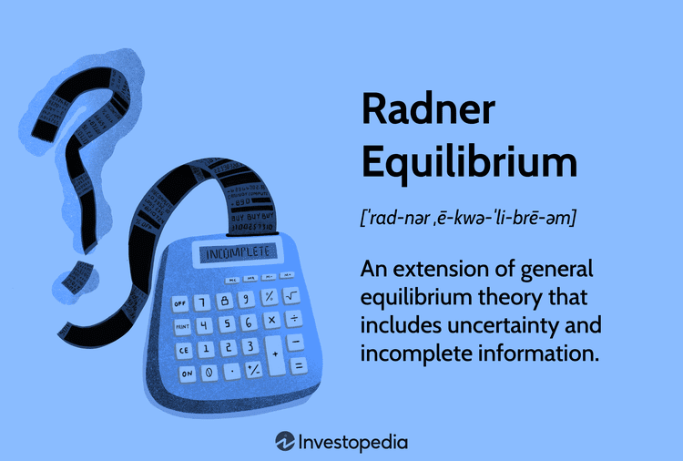

The concept of equilibrium is integral to economic theory, offering insight into the mechanics of markets under diverse scenarios. At the heart of this exploration lies the Radner Equilibrium, a sophisticated extension of the Arrow-Debreu General Equilibrium. This model uniquely incorporates elements of uncertainty, reflecting the realities of economic decision-making where information is often imperfect and incomplete. 

Economists have long relied on equilibrium models to predict market behavior and ensure efficient resource allocation. The Radner Equilibrium stands out for its capacity to address the unpredictability intrinsic to financial markets. As we examine this model, we can appreciate its ability to elucidate the complexities of market dynamics. It provides a more nuanced understanding of how decisions are made in environments where data may be scarce or delayed.

Furthermore, Radner's contributions have not only enriched theoretical frameworks but also possess significant ramifications for algorithmic trading. The model's emphasis on managing uncertainties aligns with the requirements of modern trading systems, where rapid data processing and adaptability are crucial. As algorithmic trading continues to flourish, understanding Radner Equilibrium could empower traders to devise strategies that effectively harness these insights, leading to improved market responsiveness and efficiency.

By focusing on these aspects, this article aims to clarify the role of Radner Equilibrium in evolving economic paradigms and its practical implications in today's trading systems. Through this exploration, we endeavor to enhance the comprehension of how advanced economic models can be applied to modern financial environments, ultimately aiding stakeholders in navigating the complexities of contemporary economic landscapes.

## Table of Contents

## Understanding Radner Equilibrium

Radner Equilibrium extends the foundational Arrow-Debreu model by incorporating elements of uncertainty and incomplete information, offering a more robust framework for understanding economic decision-making. Introduced by economist Roy Radner, this model addresses the limitations faced by agents in making optimal decisions without perfect information. Unlike traditional models, Radner Equilibrium navigates real-world conditions by considering information asymmetry and computational constraints that agents encounter.

In economic environments where perfect foresight is unachievable, Radner Equilibrium posits that agents rely on available information, albeit incomplete, to make rational decisions. This involves anticipating future states and market signals while acknowledging the intrinsic uncertainties. As a result, demand for liquidity becomes a crucial [factor](/wiki/factor-investing). Agents require liquidity to adapt and respond to changing information, which impacts their strategies when dealing with money and tradable assets. This perspective aligns with the reality that financial markets operate under conditions of continuous change, driven by both flowing information and the agents' interpretations of such data.

Moreover, Radner’s concept highlights the iterative nature of market interactions. Economic [agents](/wiki/agents) continuously adjust their behavior based on new information, reflecting a dynamic equilibrium process. This ongoing adjustment emphasizes that equilibrium is not a static state but rather a condition that evolves as agents react to market developments. Such a framework provides a deeper and more nuanced understanding of how market equilibriums are achieved and maintained.

In mathematical terms, Radner Equilibrium can be expressed using state-contingent strategies, where agents optimize their utility functions subject to budget constraints and information sets that evolve over time. The equilibrium condition involves ensuring that supply matches demand across various possible future states, factoring in the probability distribution of these states. Therefore, an important aspect of this equilibrium is the incorporation of stochastic processes in modeling economic decision-making, allowing for a more comprehensive approach to predict market behavior under uncertainty.

In summary, Radner Equilibrium offers a significant advancement in economic theory by adequately addressing uncertainty and information asymmetry. It provides a realistic reflection of market dynamics where agents actively manage gaps in information, adjusting their strategies to optimize outcomes in an environment characterized by constant change. This model not only bridges the theoretical gap posed by earlier models like Arrow-Debreu but also opens new avenues for understanding the fluidity and complexity of modern economic systems.

## Application in Economic Theory

Radner Equilibrium presents a significant shift in economic theory by acknowledging the limitations of traditional models that assume perfect foresight and complete markets. Radner's model introduces the concept of computational limitations and the necessity of [liquidity](/wiki/liquidity-risk-premium) within markets characterized by uncertainty and incomplete information.

The core of Radner Equilibrium lies in its departure from the utopian assumptions typically associated with equilibrium models. Under Radner's framework, individuals, firms, and financial entities are depicted as entities that must make decisions in the face of uncertain future states and imperfect information. This understanding addresses the criticisms of traditional equilibrium theories, which often unrealistically presume that market participants have complete knowledge and can foresee all future securities and states of the world.

A key aspect of Radner Equilibrium is its ability to elucidate the persistence of money and financial institutions within real markets. In traditional economic models, where perfect competition and foresight are assumed, the role of money as a medium of exchange diminishes. However, Radner's model reinforces the necessity of money as a tool for facilitating trades in an environment where information asymmetry exists, and market participants need a stable medium for transactions under uncertainty. This attribute of the Radner Equilibrium framework has led to a better understanding of why financial institutions and monetary systems persist in economies, even when theoretical constructs suggest otherwise.

The implications of Radner's insights extend to economic policy-making, particularly under conditions of uncertainty and incomplete information. Policymakers, empowered by the Radner framework, can explore the effects of liquidity demands and computational limitations on market dynamics, crafting policies that better cater to real-world conditions. This includes designing monetary and fiscal measures that can accommodate the uncertainties and information asymmetries that characterize modern economies.

Ultimately, Radner Equilibrium serves as a pivotal model, shedding light on economic phenomena that elude traditional theoretical frameworks. By incorporating elements of uncertainty and computational constraints into economic analysis, this model opens avenues for more robust interpretations of economic interactions. As we further apply Radner's insights to various economic and policy contexts, we enrich our understanding of intricate market systems beyond the confines of idealized assumptions.

## Impact on Algorithmic Trading

The rise of [algorithmic trading](/wiki/algorithmic-trading) underscores the practical application of advanced economic models, such as Radner Equilibrium. This sophisticated model is crucial in understanding and managing the uncertainties and information asymmetries that are inherent in financial markets. Algorithmic trading depends on the efficient processing and analysis of vast amounts of data, which dovetails with Radner's ideas on how economic agents operate under conditions of incomplete information and uncertainty.

In algorithmic trading, traders employ algorithms to process data and simulate various market scenarios. These algorithms optimize trading strategies based on predictions of market movements, reflecting concepts similar to Radner's competitive equilibria. The ability of algorithms to quickly analyze data and adjust strategies in real-time allows traders to capitalize on market efficiencies and inefficiencies. This adaptability is essential when dealing with unpredictable market dynamics and unforeseen events.

Furthermore, understanding Radner Equilibrium enables traders to navigate these complex dynamics more effectively. It enhances their ability to predict market behavior not just on static data but by considering the ongoing interactions and information flow within markets. By leveraging insights from the Radner model, traders can refine their algorithms to better anticipate market fluctuations, thereby minimizing risks and maximizing returns.

The implications of Radner Equilibrium in algorithmic trading extend to the development of advanced trading tools that incorporate data analytics and [machine learning](/wiki/machine-learning). These tools improve market efficiency by reducing transaction costs, increasing liquidity, and enabling faster and more precise execution of trades. As such, the integration of Radner's concepts into algorithmic trading strategies signifies a crucial advancement in leveraging economic theory for practical financial applications.

In conclusion, Radner Equilibrium provides a vital framework for the development of algorithmic trading strategies that effectively manage uncertainty and harness information asymmetry. Its adoption in trading tools highlights its significance in enhancing market efficiency and trader effectiveness, marking an important evolution in modern financial systems.

## Conclusion

Radner Equilibrium provides a nuanced understanding of market dynamics under uncertainty by challenging the limitations of traditional economic models. This equilibrium framework recognizes the inherent complexity of financial exchanges, shaped by information asymmetry and incomplete markets. Unlike models assuming perfect information and foresight, Radner Equilibrium realistically captures the decision-making processes of economic agents faced with uncertainty. Its integration into economic theory and practical applications such as algorithmic trading signifies its growing significance. 

As markets continue to evolve, embracing models that account for uncertainty and information asymmetry becomes essential for both theorists and practitioners. Understanding and utilizing Radner Equilibrium empowers stakeholders to develop more effective strategies for policy-making and trading. This framework enables a structured approach to managing the unpredictability of market dynamics, ultimately enhancing the efficiency and robustness of economic systems. By continually exploring and refining Radner's model, stakeholders in today's complex financial landscapes can better navigate challenges and opportunities, leading to more informed decision-making and innovative solutions.

## References & Further Reading

[1]: Arrow, K. J., & Debreu, G. (1954). ["Existence of an Equilibrium for a Competitive Economy."](https://www.semanticscholar.org/paper/EXISTENCE-OF-AN-EQUILIBRIUM-FOR-A-COMPETITIVE-Arrow-Debreu/e937fc6b51ab16bfdb3d7cde90a13c7e12e2c641) Econometrica, 22(3), 265-290.

[2]: Radner, R. (1968). ["Competitive Equilibrium under Uncertainty."](https://pages.stern.nyu.edu/~rradner/publishedpapers/20CompetitiveEquilibrium.pdf) Econometrica, 36(1), 31-58.

[3]: Duffie, D., & Huang, C.-F. (1985). ["Implementing Arrow-Debreu Equilibria by Continuous Trading of Few Long-Lived Securities."](https://www.jstor.org/stable/1913211) Econometrica, 53(6), 1337-1356.

[4]: LeRoy, S. F., & Werner, J. (2001). ["Principles of Financial Economics."](https://archive.org/details/principlesoffina0000lero) Cambridge University Press.

[5]: Ross, S. A. (2004). ["Neoclassical Finance."](https://press.princeton.edu/books/hardcover/9780691121383/neoclassical-finance) Princeton University Press.

[6]: Cvitanic, J., & Zapatero, F. (2004). ["Introduction to the Economics and Mathematics of Financial Markets."](https://mitpress.mit.edu/9780262532655/introduction-to-the-economics-and-mathematics-of-financial-markets/) MIT Press.

[7]: Barberis, N. (2000). ["Investing for the Long Run when Returns Are Predictable."](https://nicholasbarberis.github.io/alloc_jnl.pdf) Journal of Finance, 55(1), 225-264.