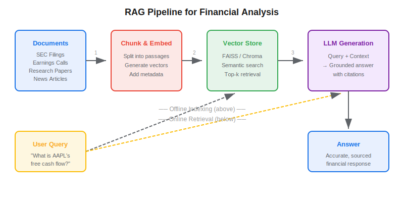
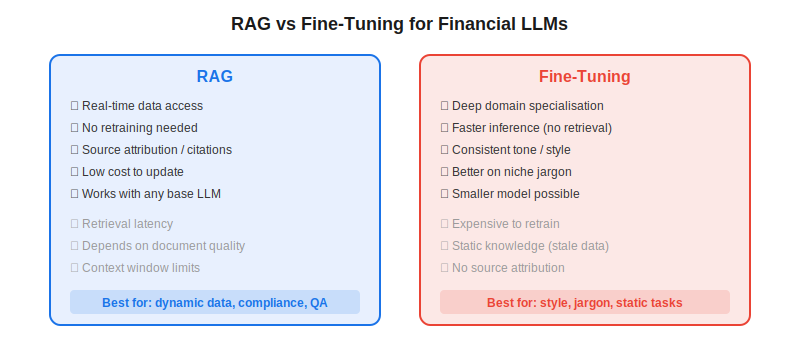

**Retrieval-Augmented Generation (RAG)** is an architecture pattern that combines a large language model with an external knowledge retrieval system so the model's answers are grounded in real, up-to-date documents rather than memorised training data. For algorithmic traders and quant analysts, RAG is the practical bridge between general-purpose chatbots and reliable financial AI — it lets you ask natural-language questions about SEC filings, earnings transcripts, or research papers and get sourced, verifiable answers instead of hallucinations.

## What Is RAG and Why Does It Matter for Finance?

Large language models are powerful text generators, but they have two critical weaknesses in financial contexts. First, their knowledge is frozen at training time — an LLM trained in 2024 knows nothing about a Q1 2026 earnings report. Second, they hallucinate: when uncertain, they produce plausible-sounding numbers that are simply wrong. In finance, a hallucinated revenue figure or an invented margin ratio is not a minor inconvenience — it is a compliance risk and a potential source of trading loss.

RAG solves both problems by splitting the workflow into two stages:

1. **Retrieval** — Given a user query, search an external document store (vector database) for the most relevant passages
2. **Generation** — Feed those passages into the LLM's context window alongside the query, so the model synthesises an answer from real source material

The original RAG framework was proposed by Lewis et al. (2020) at Meta, and it has since become the standard architecture for grounding LLMs in domain-specific knowledge. In finance, the approach has been validated on benchmarks like FinanceBench and FinQA, where metadata-enriched RAG pipelines outperform both vanilla LLMs and basic keyword search.



## How a Financial RAG Pipeline Works

A typical RAG system has two phases: an **offline indexing** phase (run once when documents change) and an **online query** phase (run per user question).

### Offline Indexing

**Document ingestion** — Collect financial documents: 10-K/10-Q filings, earnings call transcripts, broker research, news articles, or your own trading journals. Parse PDFs into clean text using tools like Docling or PyMuPDF.

**Chunking** — Split documents into passages of 200–500 tokens. Overlapping chunks (e.g., 50-token overlap) help preserve context across boundaries. Financial documents benefit from metadata-aware chunking — keeping tables intact, preserving section headers, and tagging each chunk with company ticker, fiscal year, and document type.

**Embedding** — Convert each chunk into a dense vector using an embedding model (OpenAI `text-embedding-3-small`, Sentence-Transformers, or a finance-tuned model). The vectors capture semantic meaning so that "free cash flow" and "operating cash minus capex" land near each other.

**Storage** — Store vectors in a database like FAISS, Chroma, Pinecone, or Weaviate. Attach the original text and metadata as payload.

### Online Query

When a user asks "What was Apple's free cash flow in FY2025?", the system embeds the query, retrieves the top-$k$ most similar chunks from the vector store, and passes them to the LLM as context. The prompt instructs the model to answer exclusively from the provided passages and cite its sources.

$$\text{similarity}(q, d) = \frac{q \cdot d}{\|q\| \|d\|}$$

Where $q$ is the query embedding and $d$ is a document chunk embedding. Cosine similarity is the standard metric, though some vector databases support dot-product or Euclidean distance.

## Python Implementation: Minimal Financial RAG with LangChain

The following example builds a RAG pipeline over a set of financial PDF documents using LangChain and FAISS:

```python
from langchain_community.document_loaders import PyMuPDFLoader
from langchain.text_splitter import RecursiveCharacterTextSplitter
from langchain_openai import OpenAIEmbeddings, ChatOpenAI
from langchain_community.vectorstores import FAISS
from langchain.chains import RetrievalQA
import os

# --- 1. Load and chunk financial documents ---
loader = PyMuPDFLoader("apple_10k_2025.pdf")
documents = loader.load()

splitter = RecursiveCharacterTextSplitter(
    chunk_size=400,
    chunk_overlap=50,
    separators=["\n\n", "\n", ". ", " "],
)
chunks = splitter.split_documents(documents)
print(f"Created {len(chunks)} chunks from {len(documents)} pages")

# --- 2. Embed and store ---
embeddings = OpenAIEmbeddings(model="text-embedding-3-small")
vectorstore = FAISS.from_documents(chunks, embeddings)

# --- 3. Build RAG chain ---
llm = ChatOpenAI(model="gpt-4o", temperature=0)
qa_chain = RetrievalQA.from_chain_type(
    llm=llm,
    chain_type="stuff",  # inject all retrieved docs into one prompt
    retriever=vectorstore.as_retriever(search_kwargs={"k": 5}),
    return_source_documents=True,
)

# --- 4. Query ---
result = qa_chain.invoke({"query": "What was Apple's free cash flow in FY2025?"})
print(result["result"])
for doc in result["source_documents"]:
    print(f"  Source: page {doc.metadata.get('page', '?')}")
```

This skeleton is intentionally minimal. Production systems add metadata filtering (e.g., restrict retrieval to a specific ticker or fiscal year), re-ranking stages, and guardrails against hallucinated numbers.

## Key Parameters and Design Choices

| Parameter | Typical Value | Effect |
|---|---|---|
| Chunk size | 200–500 tokens | Smaller = more precise retrieval; larger = more context per chunk |
| Chunk overlap | 50–100 tokens | Prevents information loss at boundaries |
| Top-$k$ retrieval | 3–10 | More docs = richer context but higher cost and noise |
| Embedding model | text-embedding-3-small | Balance of quality vs. cost; finance-tuned models may improve recall |
| Temperature | 0–0.1 | Low temperature for factual financial answers |

## RAG vs Fine-Tuning: When to Use Each

A common question is whether to use RAG or fine-tune a model on financial data. The answer is usually "both serve different purposes."



RAG excels when you need **current data**, **source attribution**, and **compliance traceability** — you can always point to the exact passage that generated an answer. [Fine-tuning](https://paperswithbacktest.com/wiki/how-are-neural-networks-used-in-quantitative-trading) is better when you need the model to deeply understand financial jargon, produce a consistent analytical style, or operate at very low latency without retrieval overhead.

The most effective production systems combine both: a fine-tuned base model (e.g., FinGPT) enhanced with RAG retrieval for real-time data. As Lehalle's 2026 Quant Calendar notes, the key to reliable financial AI is "curation of reference documents" — the quality of your document corpus matters more than the sophistication of your embedding model.

## Limitations and Risks

**Retrieval quality is the bottleneck.** If the vector store does not contain the right document, the LLM cannot produce a correct answer — and it may hallucinate a plausible one instead. Financial tables are notoriously hard to chunk and embed correctly.

**Context window limits.** Even with 128k-token windows, stuffing too many retrieved passages degrades answer quality. Careful re-ranking and filtering is essential.

**Numerical reasoning.** RAG pipelines struggle with questions requiring calculation (e.g., "What was the year-over-year revenue growth?"). The CFA Institute's research confirms that connecting [LLM trading agents](https://paperswithbacktest.com/wiki/llm-trading-agents) to code execution tools dramatically improves numerical accuracy.

**Latency.** Embedding a query, searching a vector store, and running an LLM inference adds 2–5 seconds per query — acceptable for analysis, too slow for real-time trading decisions.

## Conclusion

RAG is the foundational architecture for building trustworthy financial AI systems. It transforms a general-purpose LLM into a grounded, source-citing analyst that can work with your specific documents — from SEC filings to proprietary research. For algo traders, the key takeaway is that RAG does not replace [systematic trading strategies](https://paperswithbacktest.com/wiki/systematic-trading-strategies); it augments your research workflow by making it faster to query, cross-reference, and synthesise information from large document corpora.

---

**Explore further on PapersWithBacktest:**
- Browse [backtested trading strategies](https://paperswithbacktest.com/strategies) with Python code and performance metrics
- Access [clean historical market data](https://paperswithbacktest.com/datasets) for equities, crypto, and futures
- Take the [algo trading course](https://paperswithbacktest.com/course) — 60+ video lessons and notebooks
- Related wiki pages: [LLM Trading Agents](https://paperswithbacktest.com/wiki/llm-trading-agents) · [Best Alternative Data Sources](https://paperswithbacktest.com/wiki/best-alternative-data)
