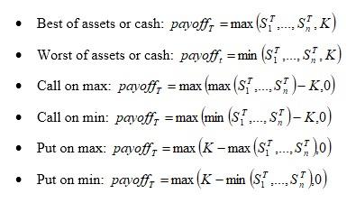

The world of financial derivatives is vast and multifaceted, offering numerous opportunities and instruments for investors to consider. Among these instruments are options, which provide strategic and complex ways to speculate or hedge within markets. Options allow investors to engage in transactions based on the anticipated movement of an underlying asset's price, providing a hedge against potential losses or leveraging positions for potential gains.

A lesser-known yet intriguing type of option is the rainbow option, classified as an exotic option due to its more complex structure compared to standard options. Unlike traditional options that depend on a single underlying asset, rainbow options link to the performances of two or more assets simultaneously. This link across multiple assets creates a spectrum of potential payoffs and risk profiles, much like the varied colors of a rainbow, hence the name.



This article focuses on understanding rainbow options, their mechanics, and the potential benefits of integrating algorithmic trading to enhance strategies involving these complex derivatives. Algorithmic trading, also known as algo trading, leverages advanced computing and pre-set algorithms to execute trades at high speeds and with precision, making it particularly useful for navigating the intricacies of exotic options.

A comprehensive understanding of rainbow options is essential for both new and experienced traders aiming to expand their knowledge and capabilities in financial derivatives. With insights into their structure and applications, investors can develop sophisticated strategies that harness the unique attributes of rainbow options, potentially boosting their investment returns while effectively managing risk.

## Table of Contents

## Understanding Financial Derivatives and Options

Financial derivatives are financial instruments whose value is reliant on or derived from an underlying asset, index, or rate. These underlying variables could be stocks, bonds, commodities, interest rates, or indices. Derivatives serve a variety of purposes such as risk management, price discovery, and access to additional assets or markets. Among the most commonly used derivatives are options, which are contracts providing the holder the right, but not the obligation, to buy or sell an underlying asset at a predetermined price, known as the strike price, on or before a specified expiration date.

Options come in two primary forms: call options and put options. A call option gives the holder the right to purchase, while a put option grants the right to sell the underlying asset. These instruments are highly versatile, enabling market participants to employ a range of strategies to hedge existing positions, enhance income, or speculate on market direction.

In more complex trading scenarios, exotic options come into play. Unlike standard or "vanilla" options, exotic options feature non-standard characteristics and structures, which can include varying payoff processes or conditional execution circumstances. These complexities allow traders to customize their risk exposure precisely according to their market expectations and risk appetite. Exotic options provide expanded possibilities for tailoring risk management strategies beyond what standard options offer.

The pricing models for financial derivatives often involve complex mathematics. For instance, the Black-Scholes model is widely used for pricing European options, while a range of numerical methods, such as Monte Carlo simulations and binomial trees, are employed to price more complex derivatives and exotic options. Here's a simple Python example of using the Black-Scholes formula to compute the theoretical price of a call option:

```python
from math import exp, log, sqrt
from scipy.stats import norm

def black_scholes_call(S, K, T, r, sigma):
    """
    Calculate the Black-Scholes price for a European call option.

    :param S: Current stock price
    :param K: Strike price
    :param T: Time to expiration in years
    :param r: Risk-free interest rate
    :param sigma: Volatility of the annual return of the stock
    :return: Call option price
    """
    d1 = (log(S / K) + (r + 0.5 * sigma ** 2) * T) / (sigma * sqrt(T))
    d2 = d1 - sigma * sqrt(T)

    call_price = S * norm.cdf(d1) - K * exp(-r * T) * norm.cdf(d2)
    return call_price

# Example usage:
S = 100  # Current stock price
K = 100  # Strike price
T = 1    # Time to expiration (in years)
r = 0.05 # Risk-free interest rate
sigma = 0.2 # Volatility

call_price = black_scholes_call(S, K, T, r, sigma)
print(f"The theoretical call option price is: {call_price:.2f}")
```

This code snippet provides a straightforward method for determining the theoretical price of a European call option given a set of market parameters. As investors navigate derivatives markets, the choice between standard and exotic options boils down to their individual needs and market views. Exotic options, with their sophisticated designs, offer a playground for experienced traders looking to manage complex risk profiles or capitalize on multi-faceted market trends.

## What Are Rainbow Options?

Rainbow options are a form of exotic derivatives that provide traders with the opportunity to link their financial strategy to the performances of multiple underlying assets. Unlike standard options that focus on a single underlying asset, rainbow options incorporate two or more assets, adding a layer of complexity and flexibility. These options derive their name from the diverse range of assets they can cover, much like the varied colors of a rainbow. This unique feature allows market participants to create tailored financial instruments to meet specific risk management or speculative needs.

The primary characteristic of rainbow options is their payoff structure, which is linked to the performance of a group of assets. Typically, these options are structured using scenarios such as "best of" or "worst of" performers. For instance, a "best of" rainbow option might provide a payoff based on the asset that performs best among a chosen set, offering potential gains from the strongest performer in the group. Conversely, a "worst of" scenario would result in a payoff based on the asset with the poorest performance, which might be used for risk management in scenarios where mitigating exposure to low-performing assets is needed.

Rainbow options are predominantly traded over-the-counter (OTC), allowing for significant customization but also potentially increasing risk due to the lack of standardized market pricing. This OTC nature enables traders to negotiate terms specifically tailored to their needs, whether for speculation on the performance spread between assets or for hedging complex portfolios.

For example, consider a trader interested in a rainbow option involving three assets: A, B, and C. If the option has a "best of" payoff structure, the payoff $P$ might be expressed mathematically as:
$$

P = \max(S_A, S_B, S_C) - K
$$
where $S_A, S_B,$ and $S_C$ are the final prices of assets A, B, and C respectively, and $K$ is the strike price. This equation highlights the potential for higher payouts based on the best-performing asset in the set.

Rainbow options serve both speculative and hedging purposes. As speculative tools, they allow traders to place bets on the relative performance differences between multiple assets. From a hedging perspective, they enable the creation of complex strategies to protect against adverse movements in a correlated group of assets, effectively dispersing risk across a spectrum.

Overall, rainbow options offer sophisticated investors a versatile and dynamic instrument in the world of financial derivatives. While they present unique opportunities, they also require a nuanced understanding of market movements and correlations among the selected assets to be used effectively.

## How Rainbow Options Work

Rainbow options are exotic financial derivatives designed to link their payoff to the performance of multiple underlying assets. The essential characteristic of these options is their dependency on diverse underlying assets, often structured with specific conditions that determine their payoff.

One standard structure involves setting the option's payoff based on the best or worst performing asset within a selected group. For example, suppose a rainbow option links to three assets: $A_1$, $A_2$, and $A_3$. The payoff might be determined by the performance of the asset that shows the highest gain (best-of) or the one with the lowest gain (worst-of) within a given timeframe. This structure provides traders an opportunity to benefit from the relative performance among a collection of assets, which can be particularly useful in diversifying risk or capitalizing on asset dynamics.

Another variant of rainbow options is the correlation option. These options do not rely solely on the best or worst asset performance but rather on the correlation among the selected assets. The payoff might be triggered by the assets moving within a specific performance range or reaching a certain correlation level. This level of complexity requires sophisticated analysis and modeling, typically involving statistical measures such as the correlation coefficient to quantify the asset movements. 

Custom-built structures tailor to the specific needs and preferences of investors, making rainbow options highly versatile. However, this customization introduces additional costs and complexities. The bespoke nature of these contracts often results in higher premium costs compared to standard options due to the intricacy involved in their structuring and payoff calculation. Furthermore, the associated risks are elevated as these options expose traders to multiple asset performances, making them sensitive to fluctuations not just in individual assets but in the interactions between them.

Overall, while rainbow options offer a customized and potentially profitable approach to options trading, they require a comprehensive understanding of their complex structures and the interdependencies between the underlying assets.

## Algorithmic Trading in Rainbow Options

Algorithmic trading, commonly referred to as algo trading, employs computational software to execute trades based on predefined criteria, which maximizes timing and efficiency. This approach is particularly apt for the trading of complex derivatives like rainbow options due to its ability to handle and interpret extensive data sets.

The appeal of [algorithmic trading](/wiki/algorithmic-trading) in rainbow options stems from its capacity to swiftly identify market patterns and execute trades within milliseconds. This capability is crucial in high-frequency trading environments and volatile markets where rapid decision-making can significantly affect outcomes. By leveraging algorithms, traders can manage and model intricate payoff structures inherent in rainbow options, which frequently involve assessing multiple underlying assets simultaneously.

For example, consider the payoff function for a rainbow option that relies on the 'best of' or 'worst of' performance among several assets $A_1, A_2, \ldots, A_n$. The payoff can be expressed as:

$$
\text{Payoff} = \max(S_1, S_2, \ldots, S_n) - K
$$

or 

$$
\text{Payoff} = \min(S_1, S2, \ldots, S_n) - K
$$

where $S_i$ is the spot price of asset $i$ at maturity and $K$ is the strike price. Efficient calculation of such payoffs entails handling large input data and intricate decision trees, where algo trading excels by automating these complex calculations. 

Moreover, algorithmic systems can rapidly adapt to market changes, recalibrating strategies and performing real-time adjustments far quicker than manual methods. This adaptability is invaluable when implementing sophisticated trading strategies that can include hedging, [arbitrage](/wiki/arbitrage), or trend analysis across various assets involved in the rainbow option. Python programming, with libraries such as NumPy or pandas, allows for handling the computational demands of such strategies effectively.

Here's a basic example of how such logic might be implemented in Python:

```python
import numpy as np

# Simulated spot prices of three assets at maturity
spot_prices = np.array([100, 105, 98])

# Strike price
strike_price = 100

# Algorithmic determination of a 'best of' payoff
payoff = max(spot_prices) - strike_price
payoff = max(payoff, 0)  # Ensure payoff is non-negative

print(f"The payoff for the rainbow option is: {payoff}")
```

By using algorithmic trading to interface with rainbow options, traders not only increase their strategic breadth but also augment the precision and timing of their trades. This integration of technology with financial acumen allows for a high degree of customization and efficiency in executing complex derivatives strategies.

## Strategies and Applications of Rainbow Options

Rainbow options provide traders with the opportunity to execute sophisticated strategies that take advantage of correlations and divergences in multiple asset classes. The complexity of these options allows for a variety of approaches, ranging from speculative plays to risk management techniques.

One core strategy employed with rainbow options is diversified speculation, whereby investors speculate on the performance of multiple underlying assets. This approach allows a trader to potentially benefit from the optimal performance of a set of assets while hedging against the underperformance of others. For example, a "best of" rainbow option provides a payoff based on the best-performing asset within a basket, whereas a "worst of" option does the opposite. These variants thereby enable traders to target specific market outcomes based on expected performances.

Delta hedging is a popular strategy that focuses on minimizing the risks associated with price movements of the underlying assets. By continuously adjusting the delta value of a portfolio through buying or selling the underlying assets or their derivatives, traders can maintain a neutral position relative to price swings. This strategy becomes particularly potent when applied to rainbow options, as it helps manage exposure to multiple assets simultaneously.

Trend following, another widely applied strategy, is used to ride market trends by analyzing ongoing market sentiment and price movements. In the context of rainbow options, traders may identify and leverage trends among the various assets in a rainbow option's basket, enabling decisions based on the observed [momentum](/wiki/momentum) or reversal patterns in those markets.

Algorithmic trading plays a crucial role in executing these strategies with precision and speed. By utilizing advanced algorithms and large datasets, traders can quickly analyze multiple asset performances, correlations, and market conditions to optimize trading decisions. Python, with its robust libraries like NumPy and pandas, is an excellent tool for implementing such strategies. An example snippet using Python might involve using a correlation matrix to determine asset relationships:

```python
import numpy as np
import pandas as pd

# Assume 'data' is a DataFrame containing historical prices of assets
correlation_matrix = data.corr()

# Function to analyze and plot correlations
def analyze_correlations(correlation_matrix):
    # Output the correlation matrix
    print(correlation_matrix)

    # Identify highly correlated asset pairs for potential trend strategies
    high_corr_pairs = [(i, j) for i in correlation_matrix.columns for j in correlation_matrix.index 
                       if correlation_matrix.loc[i, j] > 0.8 and i != j]

    return high_corr_pairs

highly_correlated_assets = analyze_correlations(correlation_matrix)
```

In conclusion, rainbow options provide dynamic avenues for advanced investors to strategically manage portfolios consisting of multiple assets. With algorithmic trading technologies enhancing execution speeds and analytical precision, traders can efficiently exploit market dynamics and correlations present in asset groups, elevating the potential success of diversified speculation, delta hedging, and trend-following strategies.

## Pros and Cons of Trading Rainbow Options

Rainbow options provide both opportunities and challenges due to their unique structure and characteristics. Here are the pros and cons of trading these complex financial instruments:

### Pros:

1. **Customization**: Rainbow options allow for highly customized investment strategies, as they can be designed to include a variety of underlying assets. This flexibility caters to specific investor preferences and market outlooks. For example, they can be structured to focus on the 'best of' or 'worst of' performances, providing tailored risk management solutions.

2. **Cost-Efficiency**: By encompassing multiple assets within a single derivative, rainbow options can be more cost-effective compared to trading individual options on separate assets. This bundled approach can lead to reduced transaction costs and more efficient capital allocation.

3. **Risk Diversification**: Trading rainbow options inherently involves multiple assets, thus diversifying risk across different entities. This feature can mitigate the effect of volatility in a single asset, spreading the risk more evenly and potentially leading to a more stable investment outcome.

### Cons:

1. **Higher Fees**: Due to their complexity and the bespoke nature, rainbow options often come with higher fees compared to standard options. The increased financial burden can erode potential gains, especially if the gains from the individual components of the option do not offset these additional costs.

2. **Complex Analysis**: The valuation and management of rainbow options involve sophisticated mathematical modeling and intricate analysis. The need for advanced understanding of correlation, volatility, and asset performance analysis can pose significant challenges for traders not well-versed in these areas.

3. **Quanto Risks**: When rainbow options involve assets denominated in multiple currencies, they introduce quanto risks, which arise from fluctuations in exchange rates. These risks complicate the valuation and potential payoff, requiring traders to factor in additional variables in their risk management strategies.

4. **Requirement for Advanced Knowledge**: Managing rainbow options demands a sophisticated understanding of both market dynamics and financial derivatives. Traders must be proficient in strategies such as delta hedging and must possess experience in handling exotic options to effectively utilize and manage risks associated with these instruments.

5. **Strategic Planning**: The potential rewards of rainbow options are substantial, but they necessitate meticulous strategic planning. Traders need to anticipate market movements, correlations among assets, and external economic factors that could impact their combined performance. This entails not only a deep analytical insight but also the ability to adapt quickly to changing market conditions.

Despite the complexities and challenges, rainbow options can be a powerful tool for seasoned investors who can effectively manage their intricacies. The balance between rewards and risks requires careful consideration and strategic acumen to harness their full potential.

## Conclusion

Rainbow options represent a compelling yet complex opportunity within financial derivatives, offering unique avenues for trading multiple assets. By linking the performance of diverse underlying assets, rainbow options allow traders to benefit from fluctuations across a range of market variables, thus providing unique payoff structures. These attributes make rainbow options attractive for sophisticated traders who seek to harness opportunities not available with standard options.

Algorithmic trading significantly enhances the effectiveness and precision in executing strategies for rainbow options. This technology allows for swift and efficient execution of trades by automating processes that involve a vast array of calculations and data analysis. Algorithms can optimize trading strategies by identifying patterns and correlations that might not be visible to the human eye, thus giving traders a competitive advantage in complex financial markets. For instance, Python, with its robust libraries for numerical and data analysis, enables the development of sophisticated models to evaluate payoff scenarios for rainbow options. The illustration below demonstrates a simple Python algorithm to simulate a basic payoff structure based on asset performance:

```python
import numpy as np

# Simulate asset performances
np.random.seed(42)
asset_1_performance = np.random.normal(0.05, 0.1, 1000)
asset_2_performance = np.random.normal(0.02, 0.08, 1000)

# Calculate rainbow option payoff (best of scenario)
payoffs = np.maximum(asset_1_performance, asset_2_performance)

# Expected payoff
expected_payoff = np.mean(payoffs)
print(f"Expected Payoff: {expected_payoff:.2f}")
```

Investors interested in rainbow options should carefully consider their level of expertise and risk tolerance due to the complexities involved. The intricate nature of these options necessitates a deep understanding of both the underlying assets and the market dynamics that influence their performance. Investors must also be aware of the potential for increased risk, especially when dealing with exotic options that are less standardized and may [carry](/wiki/carry-trading) higher costs due to their bespoke nature.

However, with the right knowledge and tools, rainbow options can serve as a powerful addition to a trader's toolkit. When combined with algorithmic strategies, they offer enhanced opportunities for risk management and speculative gains. This integration of technology and sophisticated financial instruments allows traders to execute intricate strategies with precision and confidence, contributing to a comprehensive approach to modern trading.

## References & Further Reading

[1]: Haug, E. G. (2007). ["The Complete Guide to Option Pricing Formulas."](https://www.amazon.com/Complete-Guide-Option-Pricing-Formulas/dp/0071389970) McGraw-Hill.

[2]: Hull, J. C. (2018). ["Options, Futures, and Other Derivatives."](https://www.semanticscholar.org/paper/Options%2C-Futures%2C-and-Other-Derivatives-Hull/89bdee500c8623864fc9eb7a471546aa713acc44) Pearson.

[3]: Kwok, Y. K. (2008). ["Mathematical Models of Financial Derivatives."](https://link.springer.com/book/10.1007/978-3-540-68688-0) Springer.

[4]: Wilmott, P. (2006). ["Paul Wilmott Introduces Quantitative Finance."](https://www.amazon.com/Paul-Wilmott-Quantitative-Finance-Set/dp/0470018704) Wiley.

[5]: Glasserman, P. (2004). ["Monte Carlo Methods in Financial Engineering."](https://archive.org/details/montecarlomethod0000glas) Springer.