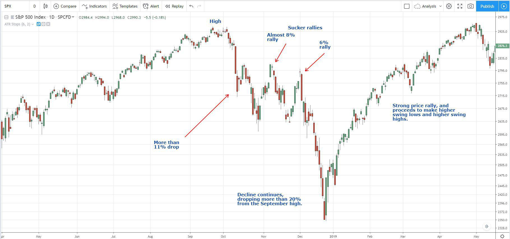

Rallies in financial markets are periods marked by a sustained increase in the prices of various financial instruments, signaling investor optimism. These upward trends are not confined to a single asset class but can be observed across bonds, stocks, and indexes. A rally reflects enhanced market sentiment, often fueled by factors such as positive economic indicators, strong corporate earnings, and favorable government policies. Understanding the dynamics of rallies is crucial for investors, as they offer insights into market behavior that can inform decision-making and strategy development.

Market rallies create opportunities and challenges; they can result in significant financial gains but also carry the risk of market corrections. Investors and traders must critically appraise the underlying factors driving a rally to distinguish genuine economic improvements from speculative bubbles. This awareness can help in crafting successful trading strategies that capitalize on favorable conditions while managing potential risks.



The phenomenon of market rallies will be explored in this article by examining their occurrence in various sectors. The focus will be on bonds, where declining interest rates often trigger rallies; stocks, where corporate earnings play a pivotal role; and indexes, which reflect overarching market confidence. Furthermore, the role of algorithmic trading will be emphasized, highlighting its impact on market dynamics during rally periods. By employing advanced computational techniques, algorithmic trading can analyze vast datasets to detect patterns, thus playing a significant role in amplifying or dampening rallies. Staying informed about these factors is essential for effectively navigating and engaging in financial markets.

## Table of Contents

## Understanding Market Rallies

Market rallies are periods during which there is a sustained increase in the prices of financial instruments such as stocks, bonds, or indexes. These uptrends can occur in both bull and bear markets. In bull markets, rallies are typically driven by positive sentiment and economic factors, while in bear markets, they might reflect short-term optimism or corrective movements.

Positive economic indicators are one of the primary drivers of market rallies. When key metrics, such as GDP growth rates, employment figures, or manufacturing output, indicate economic strength, investor confidence often grows, leading to increased buying activity. For instance, a rise in GDP typically signals overall economic health and increased corporate profitability, which can fuel stock and bond rallies.

Strong corporate earnings reports are another catalyst for market rallies. Companies posting higher-than-expected profits tend to instill confidence among investors, prompting them to buy stocks, which drives prices upward. This phenomenon is often observed during earnings season, a period when many publicly traded companies release their quarterly financial results.

Government policies also play a crucial role in initiating market rallies. Policies such as tax cuts, infrastructure spending, or deregulation can stimulate economic growth and improve business conditions, leading to higher investor confidence. Monetary policy, particularly [interest rate](/wiki/interest-rate-trading-strategies) cuts by central banks, can lower borrowing costs, encourage investment, and bolster consumer spending, further contributing to rally conditions.

Despite these positive signals, investors must critically evaluate the underlying drivers of a rally. Understanding whether a rally is based on genuine economic improvement or speculative behavior is essential. Speculative-driven rallies can occur when investors act on hype or fear of missing out, often ignoring fundamental valuations. Such rallies are typically unsustainable and prone to sharp corrections when market sentiment shifts.

In conclusion, market rallies often reflect a confluence of economic, corporate, and policy factors that bolster investor confidence. Nevertheless, a thorough examination of these elements is necessary to discern sustainable growth from mere speculation.

## Bonds Rally

Bond rallies often occur when interest rates decline, making existing bonds with higher yields relatively more appealing to investors. This inverse relationship between bond prices and interest rates is a fundamental dynamic in the bond market. When interest rates drop, newly issued bonds typically offer lower yields compared to existing bonds. Consequently, the market value of the existing bonds, which have higher coupon rates, increases to adjust for the more attractive yield in a lower interest rate environment.

During periods of economic uncertainty, investors typically seek to minimize risk, which can drive them towards bonds due to their relatively stable returns. Bonds, particularly government securities, are considered safer investments compared to stocks or other high-risk financial instruments. This flight to safety boosts demand for bonds, subsequently elevating their prices. For example, during the 2008 financial crisis, there was a significant increase in the demand for U.S. Treasury bonds, which were viewed as a safe haven, thus driving their prices upwards [Bergstra et al., 2011].

Government policies, particularly monetary easing, play a crucial role in bond rallies. Central banks, like the Federal Reserve in the United States, might introduce monetary easing to stimulate economic growth during downturns. This typically involves lowering interest rates or purchasing government securities, a process known as quantitative easing. Both actions increase money supply and market [liquidity](/wiki/liquidity-risk-premium), encouraging lending and investment. As the central bank buys long-term securities, bond yields decrease, pushing existing bond prices higher as investors react to the anticipated reduction in new security yields.

Such government actions reinforce the confidence of investors, prioritizing bond markets as a viable area for risk-averse investment. The substantial purchasing of bonds by central banks during quantitative easing acts as a catalyst for bond rallies. Additionally, these government interventions signal ongoing support for economic stability, encouraging private investors to follow suit, thereby amplifying the rally effect further.

## Stock Market Rally

Stock market rallies are substantial increases in stock prices, often fueled by factors such as robust corporate earnings reports and optimistic future economic projections. These rallies indicate heightened investor confidence and are typically marked by increased trading volumes. Identifying the precursors and characteristics of stock market rallies involves using various technical indicators and comprehensively understanding the economic environment.

Technical indicators are essential tools in pinpointing and predicting phases of a stock market rally. Oscillators and moving averages are among the most utilized indicators. Oscillators, such as the Relative Strength Index (RSI) and the Moving Average Convergence Divergence (MACD), help assess whether a stock is overbought or oversold, providing early signs of potential rally phases. For instance, an RSI value above 70 may suggest overbought conditions, which could signal a correction, whereas values below 30 indicate oversold conditions, potentially preceding a rally.

Moving averages, particularly the simple moving average (SMA) and exponential moving average (EMA), enable investors to observe price trends and make informed decisions. A commonly used strategy is the moving average crossover, where short-term moving averages crossing above long-term moving averages is a bullish sign, potentially indicating the start of a rally. Python code can help visualize and compute these indicators:

```python
import pandas as pd
import yfinance as yf
import matplotlib.pyplot as plt

# Fetch stock data
stock = yf.download('AAPL', start='2021-01-01', end='2023-10-01')

# Calculate moving averages
stock['SMA_50'] = stock['Close'].rolling(window=50).mean()
stock['SMA_200'] = stock['Close'].rolling(window=200).mean()

# Plotting
plt.figure(figsize=(12, 6))
plt.plot(stock['Close'], label='Close Price')
plt.plot(stock['SMA_50'], label='50-Day SMA', linestyle='--')
plt.plot(stock['SMA_200'], label='200-Day SMA', linestyle='--')
plt.title('AAPL Stock Price and Moving Averages')
plt.xlabel('Date')
plt.ylabel('Price ($)')
plt.legend()
plt.show()
```

Economic context is equally essential in assessing stock market rallies. Positive economic indicators, such as declining unemployment rates, GDP growth, and favorable government fiscal or monetary policies, can trigger investor optimism and catalyze a rally. During earnings season, when companies report their quarterly financial results, better-than-expected earnings can drive stock prices higher, contributing to a rally.

A comprehensive assessment of stock market rallies necessitates blending technical analysis with an understanding of macroeconomic factors. Investors should critically evaluate the underlying reasons for price surges to differentiate between genuine market growth and speculative bubbles. This dual approach ensures a more accurate prediction and efficient response to potential rally opportunities, facilitating better investment strategies.

## Indexes Rally

Index rallies are significant indicators of overall market confidence, as they represent upward trends in major market indexes. These rallies often reflect positive investor sentiment and are considered a crucial parameter of financial market health. Several factors contribute to index rallies, including sector-specific growth, broader economic improvements, and favorable policy environments.

Sector-specific growth is a key driver of index rallies. Industries undergoing rapid expansion or technological advancement can push indexes upward, as their growth prospects attract investment. For instance, the rise of the technology sector in recent decades has significantly influenced the performance of major indexes like the NASDAQ Composite. High-performing sectors lead to increased demand for stocks within those sectors, which in turn boosts the overall index.

Economic improvements also play a pivotal role in spurring index rallies. Indicators such as GDP growth, low unemployment rates, and rising consumer spending can enhance investor confidence, prompting a surge in stock buying. When the macroeconomic environment shows signs of robustness, investors are more inclined to allocate capital to equities, resulting in higher index values.

Favorable government policies can further catalyze index rallies. These may include fiscal stimulus measures, tax cuts, or deregulation efforts that create a conducive environment for economic growth. Policies that reduce corporate tax rates, for example, can increase corporate profitability, making equities more attractive to investors. Additionally, monetary policies that maintain low interest rates can lower borrowing costs for companies and consumers, fostering economic expansion and boosting stock markets.

Monitoring index trends is essential for investors aiming to diversify their portfolios and capitalize on growth opportunities. By analyzing historical performance and current trends, investors can identify potential growth sectors and make informed investment choices. Diversification strategies can include investing in index funds or exchange-traded funds (ETFs) that reflect the composition of major indexes, thereby spreading risk across a variety of sectors and companies.

Overall, index rallies are a testament to market confidence, influenced by sector growth, economic conditions, and government policies. For investors, staying attuned to these trends provides a strategic advantage in optimizing portfolio performance and achieving long-term financial goals.

## The Role of Algorithmic Trading

Algorithmic trading utilizes advanced computer algorithms to facilitate high-speed trading of financial instruments, thereby exerting a profound influence on market dynamics. These algorithms are designed to scrutinize extensive datasets, identifying patterns and trends within financial markets, such as rallies—sustained periods of price increases in financial instruments. By detecting these patterns, algorithms can initiate trades that may amplify market [momentum](/wiki/momentum), playing a critical role in both the acceleration and deceleration phases of market rallies.

Algorithms employed in trading systems process vast amounts of market data, such as price, [volume](/wiki/volume-trading-strategy), and time, to identify opportunities for profit. For instance, statistical [arbitrage](/wiki/arbitrage) strategies utilize algorithms to exploit pricing inefficiencies between related financial instruments. This method entails tracking the price differences between financial instruments moving together and placing trades accordingly when these differences deviate from their historical averages.

One crucial aspect enhancing the effectiveness of [algorithmic trading](/wiki/algorithmic-trading) during rallies is the application of technical indicators. These indicators, which include moving averages, relative strength index (RSI), and Bollinger Bands, provide quantitative bases for trading decisions. They allow algorithms to execute trades with heightened speed and accuracy by offering insights into potential trend reversals or confirmations of existing trends. The moving average, for instance, smooths out price data to generate a single flowing line, which can be used to gauge the direction of an instrument's movement. An algorithm may be programmed to buy an asset when its short-term moving average crosses above the long-term moving average, indicating an upward trend—a key component during rally phases.

Consider the following example of a simple moving average crossover strategy in Python:

```python
import pandas as pd

# Load market data
data = pd.read_csv('market_data.csv')

# Calculate short and long moving averages
data['Short_MA'] = data['Close'].rolling(window=20).mean()
data['Long_MA'] = data['Close'].rolling(window=50).mean()

# Generate trading signals
data['Signal'] = 0
data['Signal'][20:] = np.where(data['Short_MA'][20:] > data['Long_MA'][20:], 1, 0)

# Calculate trading positions
data['Position'] = data['Signal'].diff()

# Display the trading signal
print(data[['Close', 'Short_MA', 'Long_MA', 'Signal', 'Position']])
```

In this code, a short-term moving average (20-day) and a long-term moving average (50-day) are calculated to generate a trading signal. When the short-term moving average surpasses the long-term moving average, a buy signal is executed, denoting the onset of a rally derived through algorithmic analysis.

Overall, algorithmic trading not only enhances trading efficiency during rallies by processing large amounts of data to detect and exploit patterns quickly but also poses challenges, such as increased market [volatility](/wiki/volatility-trading-strategies) and the potential for flash crashes. The technology has transformed the trading landscape, underscoring the importance of robust algorithm design and risk management practices.

## Conclusion

Understanding market rallies across different asset classes is crucial for investors looking to optimize their strategies and maximize potential returns. These rallies, driven by various economic and market forces, provide opportunities for growth but require keen insight and precise timing to navigate effectively.

Algorithmic trading has dramatically transformed market dynamics, providing the ability to respond to price movements swiftly. By leveraging sophisticated algorithms, traders can process vast amounts of data to identify patterns and trends indicative of market rallies. This rapid processing capability enables them to execute trades with speed and precision, potentially enhancing returns. However, this technological advancement comes with new risks, such as increased market volatility and potential systemic failures due to algorithmic errors or external shocks.

Investors must remain informed and adaptable, incorporating a variety of sophisticated tools to maintain a competitive edge. Staying updated with the latest market information and technological advancements ensures that traders can make informed decisions swiftly. Employing advanced analytical tools, such as predictive modeling and real-time data analysis, helps in accurately forecasting rally phases and adjusting strategies accordingly.

Moreover, maintaining a flexible investment approach is fundamental to successfully navigating market rallies. Diversification across asset classes and market sectors can mitigate risks, while an adaptive strategy allows investors to respond well to both anticipated and unexpected market shifts. This flexibility, combined with the insights gained from algorithmic trading and data analysis, equips investors to capitalize on market rallies efficiently and effectively.

## References & Further Reading

Bergstra, J., Bardenet, R., Bengio, Y., & Kégl, B. (2011). "Algorithms for Hyper-Parameter Optimization." This paper discusses methodologies for optimizing algorithm parameters, which are crucial for improving the efficiency and performance of algorithmic trading systems. The techniques explored, such as Grid Search and Random Search, have widespread applications in optimizing trading algorithms used during market rallies.

"Advances in Financial Machine Learning" by Marcos Lopez de Prado. This book provides a comprehensive overview of machine learning approaches applied to financial markets, with particular emphasis on algorithmic trading. It covers advanced techniques, including pattern recognition and classification methods, that can enhance trading strategies during rallies by identifying profitable trade opportunities through data-driven analysis.

"Evidence-Based Technical Analysis" by David Aronson. Aronson's work is essential reading for understanding the scientific underpinnings of technical analysis. The book argues for a rigorous, evidence-based approach to technical indicators, which aligns well with employing algorithmic trading strategies to identify and exploit rallies in markets.

"Quantitative Trading" by Ernest P. Chan. This book serves as a practical guide for developing and implementing quantitative trading strategies, which are pivotal during market rallies. Chan discusses the quantitative models and statistical techniques that underpin successful trading algorithms, emphasizing the importance of backtesting and risk management in enhancing the probability of success in financial markets.

