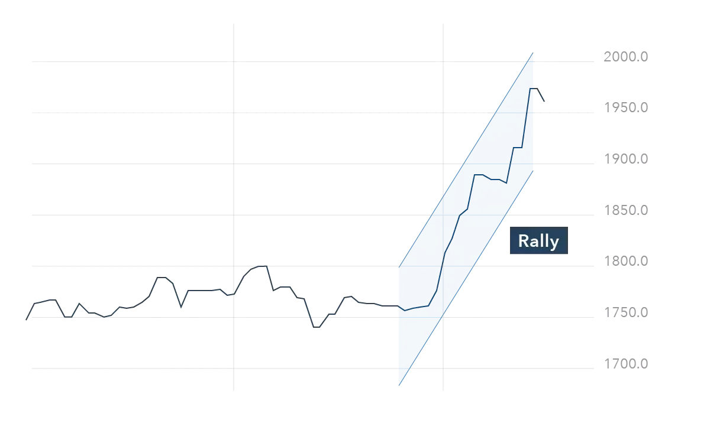

## Table of Contents

## What is a rally in financial markets?

A rally in financial markets is when the prices of stocks, bonds, or other financial assets go up quickly over a short time. This can happen because many people start buying these assets at the same time, pushing the prices higher. It's like a wave of excitement that makes more people want to buy, which keeps the prices going up.

Rallies can happen for many reasons. Sometimes, good news about a company or the economy can start a rally. Other times, it might be because people think the market will keep going up, so they buy more to not miss out. But rallies don't last forever. After a while, the prices might stop going up and start to fall again. It's important for investors to watch rallies carefully and decide when it might be a good time to buy or sell.

## What are the common causes of a market rally?

A market rally often starts because of good news. This could be news about a company doing well, like making more money than expected or launching a new product that people love. It could also be news about the whole economy, like lower unemployment rates or the government passing new laws that help businesses. When people hear this good news, they feel more confident about the future and start buying stocks, which pushes the prices up.

Another reason for a market rally is when people think the market will keep going up. This is called market sentiment. If everyone believes that prices will rise, they rush to buy stocks so they don't miss out on the gains. This rush of buying can create a rally even if there's no new news. It's like a self-fulfilling prophecy where the belief in rising prices actually makes the prices rise.

Sometimes, rallies can also be caused by big investors, like hedge funds or institutional investors, making big moves. If these big players start buying a lot of stocks, it can push the prices up quickly. Smaller investors might see this and decide to buy too, adding more fuel to the rally. But it's important to remember that rallies can be short-lived, and the market can change direction just as quickly.

## How can economic indicators influence a rally?

Economic indicators can have a big impact on whether a market rally happens or not. These indicators are like signals that tell us how the economy is doing. For example, if the unemployment rate goes down, it means more people have jobs and are making money. This good news can make investors feel happy and confident, so they start buying more stocks. When lots of people buy at the same time, it can start a rally. Other important indicators include things like the Gross Domestic Product (GDP), which shows how much the whole country is producing, and consumer confidence, which tells us how people feel about their money and the future.

Sometimes, economic indicators can also stop a rally or make it go the other way. If bad news comes out, like inflation going up a lot, it can make investors worried. High inflation means things cost more, and that can hurt companies' profits and make people feel less sure about spending money. When investors see these signs, they might start selling their stocks to avoid losing money. This selling can turn a rally into a drop in prices. So, economic indicators are really important because they can both start a rally and make it stop, depending on what the news is.

## What role do investor sentiment and market psychology play in rallies?

Investor sentiment and market psychology are like the invisible forces that can make a market rally happen or stop. When investors feel good about the future, they are more likely to buy stocks. This feeling can spread from one person to another, creating a wave of buying that pushes stock prices up. It's like when everyone at a party starts to dance because the music is good; the excitement is contagious. If everyone believes the market will keep going up, they might rush to buy stocks so they don't miss out, and this can start a rally even if there's no new news.

On the other hand, if investors start to feel worried or scared, it can stop a rally or even turn it into a fall in prices. If bad news comes out or if people just start to think the market has gone up too much, they might decide to sell their stocks to avoid losing money. This selling can make prices go down quickly. It's like when the music stops at a party and everyone starts to leave; the mood changes fast. So, how investors feel and think can make a big difference in whether a rally keeps going or not.

## How do central bank policies affect market rallies?

Central bank policies can have a big impact on market rallies. When a central bank, like the Federal Reserve in the U.S., decides to lower interest rates, it makes borrowing money cheaper. This can make people and businesses feel more confident about spending and investing. When they start spending more, it can help the economy grow and make stock prices go up, which can start a rally. On the other hand, if the central bank raises interest rates, borrowing money becomes more expensive. This can make people and businesses more cautious about spending, which might slow down the economy and make stock prices fall, stopping a rally.

Another way central banks can affect market rallies is through their actions in the bond market. When a central bank buys bonds, it puts more money into the economy, which can make investors feel more confident and start buying stocks. This can help start or keep a rally going. But if the central bank starts selling bonds, it takes money out of the economy, which can make investors more worried and might stop a rally. So, what central banks do can really change how investors feel and act, which can make a big difference in whether a market rally happens or not.

## What are the differences between a short-term and a long-term rally?

A short-term rally is when stock prices go up quickly over a few days or weeks. It's like a quick burst of energy in the market. These rallies can happen because of good news, like a company doing better than expected or the government passing a new law that helps the economy. But short-term rallies can be risky because they don't last long. The prices can go back down just as fast as they went up. Investors need to be careful and watch the market closely to decide if they should buy or sell during a short-term rally.

A long-term rally, on the other hand, is when stock prices keep going up over many months or even years. It's like a slow and steady climb. Long-term rallies often happen because the economy is doing well, and people feel confident about the future. They might be caused by things like lower unemployment rates, growing businesses, or new technologies that make people excited. Long-term rallies are usually seen as safer because they are based on strong, lasting changes in the economy. But even long-term rallies can end, so investors still need to keep an eye on the market and be ready for changes.

## Can geopolitical events trigger a rally in financial markets?

Yes, geopolitical events can trigger a rally in financial markets. When something good happens in the world, like countries making peace or signing a big trade deal, it can make investors feel more confident. They might think that the world is getting safer and that businesses will do better. This good feeling can make them want to buy more stocks, pushing the prices up and starting a rally.

But not all geopolitical events lead to rallies. Sometimes, bad news like wars or trade fights can scare investors. If they think the world is getting more dangerous, they might sell their stocks to avoid losing money. This selling can make stock prices go down instead of up. So, whether a geopolitical event starts a rally or not depends a lot on whether the news makes investors feel happy or worried.

## How do technical analysis tools help in identifying a rally?

Technical analysis tools help traders spot a rally by looking at charts and patterns. These tools show how stock prices have moved in the past and can help guess where they might go next. For example, moving averages can show if a stock is starting to go up. If the price of a stock goes above its moving average, it might mean a rally is starting. Traders also look at things like the Relative Strength Index (RSI) to see if a stock is getting overbought or oversold. If the RSI goes up a lot, it can be a sign that a rally is happening.

Another way technical analysis helps is by spotting patterns like "breakouts." A [breakout](/wiki/breakout-trading) happens when a stock price moves above a certain level it has been stuck at for a while. This can be a sign that a rally is starting because it shows that more people are buying the stock, pushing the price up. Traders also use trend lines to see if a stock is going up in a steady way. If the price keeps making higher highs and higher lows, it can mean a long-term rally is happening. By using these tools, traders can make better guesses about when a rally might start and how long it might last.

## What are the risks associated with investing during a market rally?

Investing during a market rally can be exciting because prices are going up, but it also comes with risks. One big risk is that the rally might not last. Rallies can end quickly, and if you buy stocks at a high price during a rally, you might lose money if the prices start to fall. It's like buying a toy that everyone wants right now, but if the trend changes, the toy might not be worth as much later.

Another risk is that you might get caught up in the excitement and make quick decisions without thinking them through. When everyone is buying and prices are going up, it's easy to feel like you need to jump in too. But if you don't do your homework and understand why the rally is happening, you might end up buying stocks that aren't a good fit for your investment goals. It's important to stay calm and make smart choices, even when the market is moving fast.

## How can one differentiate between a genuine rally and a market bubble?

Telling the difference between a real rally and a market bubble can be tricky, but it's important. A genuine rally usually happens because the economy is doing well or because a company is doing better than expected. It's like when a sports team starts winning more games because they're playing better, not just because everyone is cheering for them. You can see signs of a real rally in things like good economic reports, lower unemployment, or a company making more money. These signs show that the rally is based on real improvements, not just people's excitement.

A market bubble, on the other hand, is when prices go up a lot because everyone is buying, but there's no real reason for it. It's like a balloon that gets bigger and bigger until it pops. People might start buying just because they see others doing it, and this can push prices up really high. But if there's no solid reason for the price increase, like good news about the economy or a company, the bubble can burst, and prices can fall quickly. So, to tell the difference, look at the reasons behind the price increase. If it's based on real, strong news, it's more likely a genuine rally. If it's just because everyone is buying without a good reason, it might be a bubble.

## What historical examples illustrate significant market rallies?

One famous example of a big market rally happened in the late 1990s during the dot-com boom. Back then, everyone was excited about the internet and new tech companies. People thought these companies would make a lot of money, so they started buying their stocks like crazy. This pushed the prices up and up, creating a huge rally. But then, in 2000, people realized that a lot of these companies weren't making as much money as they hoped. The rally turned into a bubble that burst, and stock prices crashed.

Another example is the rally that happened after the 2008 financial crisis. The crisis was really bad, and it made the stock market fall a lot. But then, in March 2009, the market started to go up again. This rally lasted for years and was helped by things like the government and central banks taking action to help the economy. By 2013, the stock market had recovered all the losses from the crisis and kept going up. This showed that even after a big fall, a strong rally can happen if the right conditions are in place.

## How do algorithmic trading and high-frequency trading impact the dynamics of a rally?

Algorithmic trading and high-frequency trading can make a rally happen faster and bigger. These types of trading use computers to buy and sell stocks really quickly, sometimes in just a few seconds. When a rally starts, these computers can spot it and start buying more stocks right away. This quick buying can push the prices up even higher and make the rally grow faster than it would if people were doing all the buying and selling by hand. It's like adding fuel to a fire; the rally gets bigger and hotter because of all the fast trading.

But algorithmic and high-frequency trading can also make a rally end quickly. Because these computers can buy and sell so fast, they can also change their minds just as fast. If the computers start to think the rally is over or if they see signs that prices might go down, they can start selling a lot of stocks very quickly. This sudden selling can make the rally stop or even turn into a fall in prices. So, while these types of trading can help start and grow a rally, they can also make it end in a hurry.

## References & Further Reading

Bergstra, J., Bardenet, R., Bengio, Y., & Kégl, B. (2011). "Algorithms for Hyper-Parameter Optimization." This paper discusses methodologies for optimizing algorithm parameters, which are crucial for improving the efficiency and performance of [algorithmic trading](/wiki/algorithmic-trading) systems. The techniques explored, such as Grid Search and Random Search, have widespread applications in optimizing trading algorithms used during market rallies.

"Advances in Financial Machine Learning" by Marcos Lopez de Prado. This book provides a comprehensive overview of machine learning approaches applied to financial markets, with particular emphasis on algorithmic trading. It covers advanced techniques, including pattern recognition and classification methods, that can enhance trading strategies during rallies by identifying profitable trade opportunities through data-driven analysis.

"Evidence-Based Technical Analysis" by David Aronson. Aronson's work is essential reading for understanding the scientific underpinnings of technical analysis. The book argues for a rigorous, evidence-based approach to technical indicators, which aligns well with employing algorithmic trading strategies to identify and exploit rallies in markets.

"Quantitative Trading" by Ernest P. Chan. This book serves as a practical guide for developing and implementing quantitative trading strategies, which are pivotal during market rallies. Chan discusses the quantitative models and statistical techniques that underpin successful trading algorithms, emphasizing the importance of backtesting and risk management in enhancing the probability of success in financial markets.

