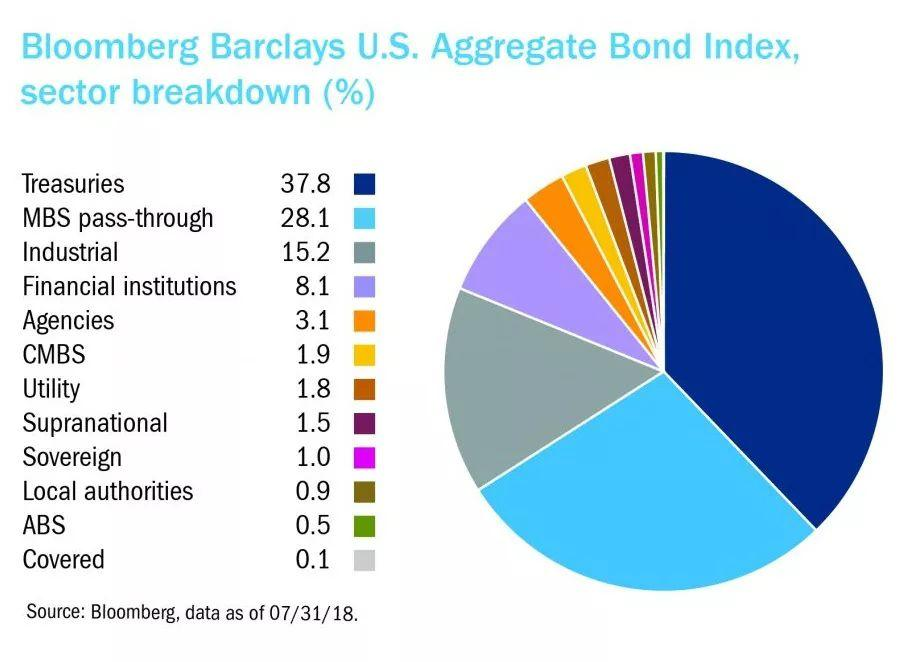

The financial markets are perpetually evolving landscapes influenced by a myriad of factors that dictate the movement of stocks, bonds, and other investment vehicles. These fluctuations are essential to understand for investors aiming to craft successful trading strategies and make informed decisions. Market dynamics are frequently characterized by rally phases, periods during which there is a sustained increase in the prices of securities, reflecting investor optimism and positive market sentiment.

This article aims to explore the dynamics of these rally phases across various market sectors, with a specific focus on bonds, stocks, indexes, and the significant influence of algorithmic trading. Each of these elements plays a distinct role in shaping the market environment. A thorough comprehension of how rallies develop within different sectors allows investors to capitalize on these opportunities to maximize their returns.



Algorithmic trading brings a new dimension to market trading, enabling the rapid execution of trades and interaction with the market at speeds unattainable by human traders. This capability is especially relevant during rallies, where quick decision-making can lead to substantial gains or losses. By understanding these market movements, investors can better interpret signals, adjust their portfolios, and optimize their strategies. Through strategic interpretation and the implementation of advanced trading technologies, the modern investor is better equipped to navigate the complexities of financial markets during periods of rally activity.

## Table of Contents

## Understanding Market Rallies

A market rally is characterized by a sustained increase in the prices of financial instruments such as stocks, bonds, or indexes. These rallies can manifest in both bear and bull markets, significantly influencing investor behavior and market dynamics. In a bull market, rallies generally align with the overall upward trajectory, reinforcing investor confidence and prompting further investment. Conversely, in bear markets, rallies may indicate a temporary respite or a reversal of negative sentiment, although they often require careful analysis to differentiate from short-lived recoveries.

A key element in the emergence of market rallies is increased investor optimism, which can stem from various positive economic indicators. For instance, favorable economic data, such as an increase in gross domestic product (GDP), low unemployment rates, or rising consumer confidence, can signal economic strength, thus bolstering market sentiment and triggering a rally. Furthermore, strong corporate earnings reports often play a pivotal role. When companies report earnings that exceed market expectations, it often leads to increased stock valuations across sectors, fostering a conducive environment for rallies.

Government policies also significantly impact market rallies. Policies perceived as favorable, such as tax cuts, deregulation, or increased government spending, can provide a stimulus to economic growth, potentially leading to rallies. Monetary policies, particularly those involving adjustments to interest rates or quantitative easing measures by central banks, also have profound effects. For example, a cut in interest rates usually leads to cheaper borrowing costs, encouraging investment and consumption, thereby sparking optimism and potentially fueling a market rally.

Conversely, geopolitical events or changes in market fundamentals can quickly alter the trajectory of a rally. It is essential for investors and traders to critically analyze the underpinning drivers of a market rally to ascertain whether it reflects a genuine improvement in economic conditions or is driven by speculative behavior likely to be short-lived. Understanding these dynamics allows investors to make informed decisions, optimizing their responses to such market phenomena.

## Bonds Rally

Bond rallies often occur as a result of declining interest rates, which enhance the appeal of existing bonds featuring higher yields. In a low-[interest rate](/wiki/interest-rate-trading-strategies) environment, current bonds with established higher rates generate more attractive returns compared to newly issued bonds that offer lower yields. This dynamic can drive demand for existing bonds, pushing up their prices and instigating a rally.

Investors frequently pivot towards bonds during periods of economic uncertainty. Bonds are typically perceived as a safer investment choice relative to stocks, as they generally offer fixed interest payments and the return of principal upon maturity. This perceived security becomes particularly appealing during economic downturns or [volatility](/wiki/volatility-trading-strategies), leading to increased bond purchases and further contributing to a rally.

Government policy shifts, including actions such as monetary easing, can amplify bond rallies. Central banks may implement monetary easing to stimulate the economy by lowering interest rates or purchasing government bonds. Such policies have a direct effect on bond prices. When a central bank purchases bonds, it increases demand, subsequently elevating the bond's price and contributing to a rally. Additionally, expectations of continued monetary support can perpetuate this upward [momentum](/wiki/momentum) in bond markets.

Overall, bond rallies are a reflection of investor sentiment and macroeconomic conditions. An environment characterized by declining interest rates, economic uncertainty, and supportive government policies can create a fertile ground for these rallies, offering both opportunities and challenges for investors seeking to optimize their portfolio performance.

## Stock Market Rally

A stock market rally is characterized by a significant and sustained increase in stock prices, signifying robust investor optimism and market confidence. These rallies are typically fueled by a combination of strong corporate earnings reports, positive economic indicators, and optimistic forecasts about economic growth. When companies report better-than-expected earnings, it often triggers increased investor interest and buying activity, propelling stock prices upward.

Understanding and identifying stock market rallies involves the use of various technical indicators. Technical analysis relies on historical price data and trading volumes to forecast future price movements. Common indicators employed to recognize and predict stock rallies include oscillators and moving averages.

Oscillators, such as the Relative Strength Index (RSI) and the Moving Average Convergence Divergence (MACD), help in identifying the momentum and potential overbought or oversold conditions of a stock. The RSI, for instance, measures the speed and change of price movements on a scale of 0 to 100. A reading above 70 typically indicates that a stock might be overbought, while a reading below 30 suggests it may be oversold. This can assist investors in making decisions about entering or exiting positions during a rally phase.

Moving averages provide insight into the overall direction of a stock's price over a specific period. The two most commonly used moving averages are the Simple Moving Average (SMA) and the Exponential Moving Average (EMA). Traders might look for a crossover pattern, where a short-term moving average crosses above a long-term moving average as a potential buy signal, indicative of a rally. For example, a "golden cross" occurs when the 50-day SMA crosses above the 200-day SMA, often viewed as a bullish indicator.

While technical indicators offer valuable insights, it is crucial for investors to consider the broader economic context and company-specific news. This holistic approach enables a more comprehensive understanding of potential stock market rallies, assisting in more informed investment decisions.

## Indexes Rally

Index rallies signify a period of upward trends in major market indexes, such as the S&P 500, Dow Jones Industrial Average, and Nasdaq Composite. These rallies are generally viewed as indicative of overall market confidence, reflecting the collective sentiment and optimism of investors toward the economic landscape. When indexes rally, they typically suggest an increase in value across a wide array of stocks, indicating robustness in the general market environment.

One of the primary catalysts for index rallies is sector-specific growth, where rapid development or performance in certain economic sectors contributes to the positive momentum of the overall index. For example, a surge in the technology sector, dominated by major players like Apple, Microsoft, and Amazon, can significantly drive up the Nasdaq Composite given its heavy weighting in technology stocks. Similarly, robust health care or financial performance can elevate broader indexes like the S&P 500, as these sectors represent significant portions of the index's composition.

Economic improvements also play a crucial role in bolstering index rallies. Factors such as declining unemployment rates, rising consumer confidence, and favorable policy decisions can create a conducive environment for corporate growth and investor participation, further feeding into the upward trajectory of indexes. Inflation rates, interest rate adjustments, and governmental fiscal policies are all pivotal in shaping economic conditions that lead to rallies.

For investors, tracking rally trends in indexes is critical for diversifying investment portfolios and capitalizing on growth opportunities. By monitoring index trends, investors can make informed decisions on asset allocation, shifting weighting towards sectors or stocks demonstrating strong momentum. This strategy can help mitigate risks and balance potential returns across various market phases.

Additionally, investors may employ technical analysis tools to gauge the strength and sustainability of index rallies. Commonly used indicators include moving averages, which smooth out price data to identify trends over specific periods, and relative strength index (RSI), which measures the speed and change of price movements to identify overbought or oversold conditions. By integrating these analytical tools, investors can better understand the potential longevity of an index rally and adjust their strategies accordingly.

In conclusion, index rallies offer crucial insights into market performance and investor sentiment. They represent opportunities for strategic investment adjustments, allowing investors to harness sector-specific growth and economic improvements for optimized portfolio diversification and potential gains.

## The Role of Algorithmic Trading

Algorithmic trading leverages sophisticated computer algorithms to execute trades at speeds that far exceed human capabilities, enabling rapid responses to dynamic market conditions. These algorithms, driven by mathematical models and statistical analyses, are designed to identify and exploit market inefficiencies, contributing significantly to the dynamics of market rallies.

The impact of [algorithmic trading](/wiki/algorithmic-trading) on market rallies is particularly notable due to its capacity to process large volumes of data and execute numerous trades almost instantaneously. For example, an algorithm could be designed to monitor price movements and trading volumes across various securities to detect emerging rally patterns. Upon identification, the algorithm would automatically execute trades to capitalize on the trend, often influencing the rally's momentum itself.

One key advantage of algorithmic trading is its ability to handle complex strategies using technical indicators. For instance, strategies might include mean reversion, where the algorithm anticipates that prices will return to a mean value, or momentum, where it follows the current market trend. Here is a simple Python example demonstrating how an algorithm might use the moving average convergence divergence (MACD) indicator to identify a trading opportunity:

```python
import pandas as pd

def calculate_macd(data, short_window=12, long_window=26, signal_window=9):
    short_ema = data['Close'].ewm(span=short_window, adjust=False).mean()
    long_ema = data['Close'].ewm(span=long_window, adjust=False).mean()
    macd = short_ema - long_ema
    signal = macd.ewm(span=signal_window, adjust=False).mean()
    return macd, signal

# Example data frame
data = pd.DataFrame({'Close': [150, 152, 151, 153, 155, 158, 160]})
macd, signal = calculate_macd(data)
print(macd, signal)
```

In this example, the moving average convergence divergence (MACD) and its signal line are calculated for a series of closing prices. This algorithm could automatically execute a buy order when the MACD line crosses above the signal line, indicating a bullish trend, and a sell order when the opposite occurs.

Furthermore, the sheer [volume](/wiki/volume-trading-strategy) of trades executed through algorithmic trading can amplify market movements, occasionally leading to rallies. These algorithms also facilitate high-frequency trading ([HFT](/wiki/high-frequency-trading-strategies)), where trades are conducted in milliseconds, further contributing to market volatility and momentum shifts.

Overall, algorithmic trading is a powerful component of modern financial markets, providing traders with a tool to exploit rally trends efficiently and effectively. By continuously scanning and analyzing market data, these algorithms not only enhance trading speed and accuracy but also significantly influence the development and sustainability of market rallies.

## Conclusion

Understanding the different facets of market rallies—from bonds to stocks to indexes—is vital for investors looking to capitalize on market trends. Each type of rally presents unique opportunities and challenges, and a nuanced understanding can significantly enhance investment strategies. For instance, bond rallies are often influenced by interest rate fluctuations and government policy measures, offering a relatively safer investment route during periods of economic instability. Conversely, stock market rallies are typically spurred by strong corporate performance and economic optimism, necessitating a more aggressive investment approach.

The advent of algorithmic trading has revolutionized the dynamics of these rallies, dramatically increasing the speed and efficiency with which trades can be executed. This technological leap allows traders to react almost instantaneously to market movements, potentially amplifying rally effects. However, this rapid pace also introduces new risks, such as heightened market volatility and the potential for flash crashes, underscoring the importance of robust risk management strategies in algorithmic trading models.

Investors must therefore remain informed and adaptable. This entails staying abreast of market fundamentals, technical indicators, and shifts in economic policy that might impact market conditions. Moreover, leveraging sophisticated tools and analytics is essential for navigating the complexities of modern financial markets. Utilizing data-driven insights and predictive modeling can help investors anticipate rally phases and strategically position their portfolios to maximize returns while minimizing risk. In this fast-evolving landscape, the ability to harness technology and maintain a flexible investment approach is key to successfully navigating market rallies.

## References & Further Reading

[1]: Bergstra, J., Bardenet, R., Bengio, Y., & Kégl, B. (2011). ["Algorithms for Hyper-Parameter Optimization."](https://dl.acm.org/doi/10.5555/2986459.2986743) Advances in Neural Information Processing Systems 24.

[2]: ["Advances in Financial Machine Learning"](https://www.amazon.com/Advances-Financial-Machine-Learning-Marcos/dp/1119482089) by Marcos Lopez de Prado

[3]: ["Evidence-Based Technical Analysis: Applying the Scientific Method and Statistical Inference to Trading Signals"](https://www.amazon.com/Evidence-Based-Technical-Analysis-Scientific-Statistical/dp/0470008741) by David Aronson

[4]: ["Machine Learning for Algorithmic Trading"](https://github.com/stefan-jansen/machine-learning-for-trading) by Stefan Jansen

[5]: ["Quantitative Trading: How to Build Your Own Algorithmic Trading Business"](https://books.google.com/books/about/Quantitative_Trading.html?id=j70yEAAAQBAJ) by Ernest P. Chan