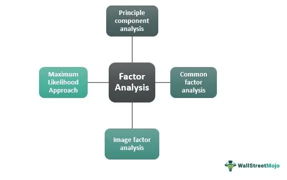

In the fast-paced world of finance, algorithmic trading and quantitative strategies are essential in maximizing returns and managing risk. Algorithmic trading utilizes complex algorithms to execute financial decisions, often involving significant computational power to analyze trading opportunities. The use of algorithmic models allows traders to process and interpret vast datasets, leading to more efficient and effective decision-making processes.

Central to these quantitative strategies are the concepts of factor analysis and random factor analysis, which are integral to interpreting financial data. Factor analysis is a statistical method used to identify variables, or "factors," that influence an observed set of data. By determining these underlying variables, traders can discern patterns and relationships within massive financial datasets that would otherwise remain hidden. This process aids in strategy development, allowing for the identification and exploitation of market inefficiencies.



Random factor analysis expands upon this by treating certain variables as random. This approach enables traders and analysts to draw conclusions about larger populations from smaller, random samples. It is particularly useful in circumstances where it is impractical to gather complete datasets, thereby offering efficiencies in time and cost.

The application of these methods in algorithmic trading is multifaceted. They serve crucial roles in effective strategy development, portfolio optimization, and risk management. For instance, by understanding the factors that influence asset returns, traders can optimize their portfolios to maximize returns while managing systemic risks. Furthermore, factor analysis informs traders on the exposure of their portfolios to various risk factors, facilitating the development of market-neutral strategies that can hedge against market volatility while focusing on alpha generation.

Overall, factor analysis and random factor analysis provide traders with the tools necessary to make informed decisions, leveraging large sets of financial data to create robust trading strategies. These methods not only enhance the precision of financial strategies but also enable a more sophisticated approach to trading in the complex landscape of modern financial markets.

## Table of Contents

## Understanding Random Factor Analysis

Random factor analysis is a statistical technique used to evaluate the quality of outputs through random sampling. By reducing time and cost associated with data collection, it provides a practical approach for inferring statistical properties from a subset of data. The fundamental idea behind random factor analysis is to treat certain variables as random effects, which contrasts with fixed factor analysis where variables are considered constant. This flexibility allows for a more adaptable interpretation of data, especially when dealing with numerous variables that may exhibit random behavior.

In statistical inference, random [factor](/wiki/factor-investing) analysis helps incorporate multiple variables for interpreting data that could be influenced by randomness. For example, in a financial context where asset returns might be driven by various unpredictable factors, such as macroeconomic indicators or geopolitical events, random factor analysis allows analysts to identify patterns and relationships between these random influences.

To illustrate, consider a dataset where an analyst is comparing the performance of multiple assets over time. By defining certain economic indicators as random factors, the analyst can construct a model that better reflects the unpredictable nature of market conditions. This contrasts with a fixed factor model where these indicators would be assumed to have a constant and predictable effect.

In quality control, random factor analysis serves to distinguish between implied quality metrics derived from statistical data and those obtained from controlled assessments. For instance, in a manufacturing setting, variables such as machine performance or environmental conditions can be modeled as random factors. This approach helps in understanding the inherent variability in product quality that might not be apparent in controlled assessments. It facilitates the identification of root causes of quality issues by highlighting variations that are due to random influences rather than consistent, predictable factors.

Ultimately, random factor analysis provides a powerful tool for interpreting complex datasets by acknowledging and utilizing randomness as a component of the analytical process. This dynamic approach enables more accurate and meaningful conclusions across various domains, from finance to manufacturing.

## Core Concepts of Factor Analysis

Factor analysis is a statistical method used to identify underlying variables, or factors, that explain observed patterns in financial data. Its primary aim is to simplify the complexity inherent in financial datasets by reducing the number of variables under consideration. This is particularly useful in quantitative finance, where discerning meaningful patterns and correlations can inform asset pricing, portfolio management, and risk assessment.

The methodology of factor analysis involves constructing factor models that effectively map these underlying influences onto asset returns. Two prominent types of factor models are widely used in the financial industry: single-factor models and multi-factor models.

1. **Single-Factor Models**: These models attribute asset returns to a single common factor in addition to the idiosyncratic risk component. The Capital Asset Pricing Model (CAPM) is a classic example. In CAPM, the expected return of an asset is determined by its sensitivity to the movements of the market portfolio, represented by the formula $E(R_i) = R_f + \beta_i (E(R_m) - R_f)$, where $E(R_i)$ is the expected return on the asset, $R_f$ is the risk-free rate, $E(R_m)$ is the expected market return, and $\beta_i$ is the beta coefficient of the asset.

2. **Multi-Factor Models**: These extend single-factor models by incorporating multiple factors that could include variables such as size, economic conditions, or interest rates. The Fama-French three-factor model is a prevalent example, adding size and value factors to the market risk factor in CAPM, which are calculated using historical data to identify how much each factor influences stock returns.

Apart from building factor models, Principal Component Analysis (PCA) is a crucial technique in factor analysis, especially for dimensionality reduction. PCA helps simplify complex datasets by transforming the original variables into a new set of uncorrelated variables called principal components, ordered by the amount of variance they capture from the data. This is particularly beneficial in large financial datasets where correlating multiple time series can help in identifying the most significant contributing factors.

In Python, implementing PCA can be achieved using libraries like scikit-learn, as shown in the example code below:

```python
from sklearn.decomposition import PCA
import numpy as np

# Sample data
data = np.array([[2.5, 2.4],
                 [0.5, 0.7],
                 [2.2, 2.9],
                 [1.9, 2.2],
                 [3.1, 3.0],
                 [2.3, 2.7],
                 [2, 1.6],
                 [1, 1.1],
                 [1.5, 1.6],
                 [1.1, 0.9]])

# Performing PCA
pca = PCA(n_components=2)
principal_components = pca.fit_transform(data)

print("Principal Components:\n", principal_components)
```

Through these core concepts, factor analysis provides fundamental insights that are essential in simplifying and interpreting financial data. This yields better understanding, improved precision in financial modeling, and informs strategic decisions in areas such as asset allocation, risk management, and performance analysis.

## Applications in Algorithmic Trading

Factor analysis has become an essential tool in [algorithmic trading](/wiki/algorithmic-trading), offering traders the means to effectively manage and optimize portfolios by identifying key factors that influence returns and mitigate risks.

Firstly, portfolio optimization relies significantly on factor analysis. Traders utilize this technique to dissect historical financial data, identifying underlying factors that drive returns. By understanding which factors have historically provided excess returns, traders can construct portfolios that are tilted towards these beneficial factors, potentially enhancing overall performance. For example, a trader might focus on factors such as [momentum](/wiki/momentum), value, or size when choosing assets for inclusion in a portfolio. This approach allows traders to maximize returns while balancing risk exposure. 

In terms of risk management, a clear understanding of systemic risk through factor exposures is critical. Each asset's sensitivity to different factors can be analyzed to determine a portfolio's overall risk profile. By examining factor loadings—coefficients that describe an asset's relationship to a factor—traders identify systemic risks that might affect the entire market or sector. This analysis forms the basis of constructing hedging strategies that protect against undesired factor exposures, thus stabilizing portfolio returns. 

Market-neutral strategies are another area where factor models prove invaluable. Such strategies aim to eliminate broad market risks, focusing instead on relative performance between assets. By using factor models to hedge market risk, traders can isolate and capture alpha—the excess return of an investment relative to the return of a benchmark index. This is typically achieved by taking both long and short positions in assets that are expected to perform differently based on their factor exposures. For instance, a market-neutral strategy might involve going long on assets with positive factor exposure while shorting those with negative exposure.

Historically, [backtesting](/wiki/backtesting) strategies have been a fundamental step in strategy development. Factor analysis aids this process by providing insights into past factor behavior, allowing traders to evaluate the effectiveness of different strategies over time. Common strategies like mean reversion, which anticipates asset prices to revert to a mean or average level, and [trend following](/wiki/trend-following), which capitalizes on asset price trends, rely heavily on precise factor analysis. By understanding how factors have impacted asset pricing in the past, traders can develop strategies that are better aligned with future market conditions.

Overall, the application of factor analysis in algorithmic trading offers a robust framework to enhance portfolio construction, risk management, and strategy development. Its capacity to distill complex financial datasets into actionable factors equips traders with the insights needed to navigate the complexities of financial markets efficiently.

## Examples of Random Factor Analysis in Practice

Random factor analysis finds practical application across various fields, demonstrating its versatility and value. In the context of drug dosage efficacy evaluations, random factor analysis plays a crucial role in understanding variability in treatment responses. Pharmaceutical researchers employ this method to analyze the effects of different dosages, accounting for variability among subjects that may be due to uncontrolled factors. By treating certain variables as random, researchers can assess the aggregate impact across a population, thereby refining dosage recommendations and improving overall treatment outcomes. This approach enables the identification and isolation of random effects, leading to more reliable and generalizable conclusions about a drug's efficacy.

In manufacturing, random factor analysis is used to assess the influence of operators on product quality. Manufacturing processes often involve multiple operators, each introducing variability. By treating operator influence as a random factor, companies can evaluate the overall variability in production and identify if differences in product quality are significantly affected by individual operators. This analysis aids in determining whether observed variations are due to inherent process differences or are simply random fluctuations, thereby guiding decisions on process improvements and training needs.

In predicting sales trends following unexpected events such as natural disasters, random factor analysis can be instrumental. These events can introduce random fluctuations in sales data, which traditional analysis methods might overlook. By incorporating random factors, businesses can better model and understand the effect of such unpredictable events on consumer behavior and sales performance. For example, a retailer might analyze the impact of a natural disaster on regional sales by treating the disaster as a random factor, thereby gaining insights into changes in demand patterns. This helps in adjusting inventory strategies, marketing efforts, and resource allocation to mitigate adverse impacts and leverage any opportunities arising from altered market conditions.

Mathematical models and software like Python can facilitate this type of analysis. For instance, using Python, analysts can leverage libraries such as `statsmodels` or `scikit-learn` to perform mixed-effects analysis, which is suitable for random factor modeling:

```python
import statsmodels.api as sm
from statsmodels.formula.api import mixedlm

# Example model
data = sm.datasets.get_rdataset("dietox", package="geepack").data
model = mixedlm("Weight ~ Time", data, groups=data["Pig"], re_formula="~Time")
result = model.fit()

print(result.summary())
```

In this example, `mixedlm` is used to model weight as a function of time with random effects attributed to individual pigs, representing a situation where random factor analysis is useful in understanding variability due to uncontrolled or random effects.

## Enhanced Factor Analysis Techniques

The integration of [machine learning](/wiki/machine-learning) and [artificial intelligence](/wiki/ai-artificial-intelligence) into factor analysis has significantly advanced the predictive capabilities available to traders and analysts. By leveraging these technologies, individuals in the finance sector can uncover complex patterns and relationships within financial data that were previously difficult to model with traditional statistical approaches.

### Neural Networks

Neural networks are a class of machine learning models designed to recognize patterns by simulating the network of neurons in the human brain. They are particularly effective in capturing non-linear relationships within datasets, making them well-suited for financial markets where such relationships often exist. The architecture of a [neural network](/wiki/neural-network) typically includes multiple layers (input, hidden, and output layers), with each neuron in a layer connected to neurons in the subsequent layer. The flow of data through these layers allows the model to learn hierarchical representations of factors affecting asset returns.

In financial factor analysis, neural networks can be employed to identify and rank various factors influencing asset prices with high precision. The models learn from historical data to predict future asset performances by adjusting weights through a process called backpropagation. This adaptability ensures that the neural networks remain relevant in dynamic market conditions.

### Ensemble Methods: Random Forests and Gradient Boosting

Ensemble methods, such as random forests and gradient boosting, offer another approach to enhance factor analysis. These methods combine multiple learning algorithms to achieve better predictive performance than could be obtained from any of the constituent models alone.

#### Random Forests

Random forests are an ensemble of decision trees, typically trained with the "bagging" method. In this context, several decision trees are created through random sampling of the data, and their predictions are aggregated to improve accuracy and control overfitting. The algorithm is advantageous for factor analysis as it can handle large amounts of features and identify the most informative factors, even when the relationships between inputs and outputs are complex and non-linear.

#### Gradient Boosting

Gradient boosting is another powerful ensemble technique used to enhance factor analysis. Unlike random forests, gradient boosting builds trees sequentially, with each tree reducing the errors of the previous ones. This additive model approach allows intricate patterns to be modeled, and small improvements in accuracy accumulated over many models can lead to significant gains. The flexibility and ability to optimize for various loss functions make gradient boosting highly effective for ranking the significance of different trading factors and ensuring robustness in strategy development.

### Implementation in Trading Strategies

The application of machine learning techniques allows for more precise ranking of factor significance, which in turn facilitates the development of adaptive trading strategies. By employing machine learning models, traders can dynamically adjust their strategies based on real-time data, ensuring that their portfolios remain optimal under changing market conditions. Python code implementations, using libraries such as TensorFlow for neural networks and scikit-learn for ensemble methods, provide accessible means for analysts to harness these advanced techniques. Below is a simplified example of implementing a random forest classifier in Python:

```python
from sklearn.ensemble import RandomForestClassifier
from sklearn.model_selection import train_test_split
from sklearn.datasets import make_classification

# Generate a synthetic dataset
X, y = make_classification(n_samples=1000, n_features=10, random_state=42)

# Split the dataset into training and testing sets
X_train, X_test, y_train, y_test = train_test_split(X, y, test_size=0.3, random_state=42)

# Initialize and train the Random Forest model
rf_model = RandomForestClassifier(n_estimators=100, random_state=42)
rf_model.fit(X_train, y_train)

# Evaluate the model on the test set
accuracy = rf_model.score(X_test, y_test)
print(f'Accuracy: {accuracy:.2f}')
```

By continually refining these models with new data and insights, traders and analysts can form robust strategies that adapt effectively to market shifts, enhancing portfolio performance and risk management. As technology evolves, the role of machine learning and AI in factor analysis will likely become even more integral to quantitative finance, driving innovations and improvements across trading disciplines.

## Conclusion

Factor analysis, both random and structured, is a crucial tool for modern algorithmic traders. By breaking down complex market data into understandable factors, traders can enhance the accuracy of their strategies and improve risk management. This process involves identifying and quantifying the various influences on asset returns, which is essential for developing robust trading strategies and maintaining a competitive edge in financial markets.

The integration of artificial intelligence (AI) into factor analysis offers significant opportunities for advancement. AI technologies such as machine learning algorithms, including neural networks and ensemble methods like random forests and gradient boosting, enable traders to model non-linear relationships more effectively. These advanced methods provide traders with the ability to rank the significance of factors with greater precision, resulting in more adaptable and resilient strategies.

As financial strategies become increasingly complex, there is a growing need for the skilled interpretation of financial data through factor analysis. This involves leveraging state-of-the-art technologies and techniques to extract meaningful insights from vast datasets, ensuring that traders can respond swiftly to market changes and opportunities. The continuous integration of AI and machine learning into factor analysis promises to revolutionize quantitative finance, enabling improvements in strategy precision and risk management practices. This will likely strengthen the demand for professionals who can proficiently interpret and apply factor analysis in trading and investment decisions.

## References & Further Reading

[1]: Bergstra, J., Bardenet, R., Bengio, Y., & Kégl, B. (2011). ["Algorithms for Hyper-Parameter Optimization."](https://dl.acm.org/doi/10.5555/2986459.2986743) Advances in Neural Information Processing Systems 24.

[2]: ["Advances in Financial Machine Learning"](https://www.amazon.com/Advances-Financial-Machine-Learning-Marcos/dp/1119482089) by Marcos Lopez de Prado

[3]: ["Evidence-Based Technical Analysis: Applying the Scientific Method and Statistical Inference to Trading Signals"](https://www.amazon.com/Evidence-Based-Technical-Analysis-Scientific-Statistical/dp/0470008741) by David Aronson

[4]: ["Machine Learning for Algorithmic Trading"](https://github.com/stefan-jansen/machine-learning-for-trading) by Stefan Jansen

[5]: ["Quantitative Trading: How to Build Your Own Algorithmic Trading Business"](https://www.amazon.com/Quantitative-Trading-Build-Algorithmic-Business/dp/1119800064) by Ernest P. Chan