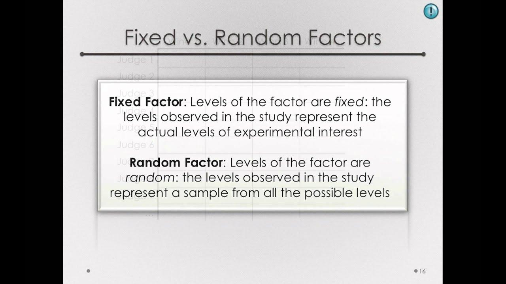

## Table of Contents

## What is Random Factor Analysis?

Random Factor Analysis is a statistical method used to understand how different variables are related to each other. It helps researchers find patterns and connections in data by looking at how these variables change together. Imagine you have a bunch of different pieces of information, like people's ages, incomes, and how much they exercise. Random Factor Analysis can help figure out if there are any hidden groups or factors that explain why these pieces of information seem to go together.

In simpler terms, think of it like sorting a big pile of mixed-up toys into different boxes based on what they have in common. The method looks for underlying themes or factors that can explain the variation in the data. By doing this, researchers can simplify complex data and make it easier to understand. This can be really useful in fields like psychology, where you might want to know what common traits or behaviors group people together.

## How does Random Factor Analysis differ from other statistical methods?

Random Factor Analysis is different from other statistical methods because it focuses on finding hidden patterns or factors in a set of data. Unlike methods like regression analysis, which look at how one variable predicts another, Random Factor Analysis tries to group variables based on how they change together. It's like trying to find the common themes among a bunch of different things. For example, if you're looking at different test scores, Random Factor Analysis might help you see if there's an underlying factor like "intelligence" or "study habits" that explains why certain scores tend to go together.

Another way Random Factor Analysis stands out is that it doesn't assume a specific relationship between variables from the start. Methods like ANOVA (Analysis of Variance) or t-tests are used to compare groups and see if there are significant differences, but they start with a hypothesis about what those differences might be. Random Factor Analysis, on the other hand, is more exploratory. It's used when you want to discover new patterns without having a clear idea of what you're looking for. This makes it really useful in fields like psychology or social sciences, where understanding complex human behaviors and traits is important.

In summary, while other statistical methods might be used to test specific hypotheses or predict outcomes, Random Factor Analysis is more about exploring and understanding the underlying structure of data. It helps researchers simplify complex datasets by identifying common factors, making it easier to see the bigger picture.

## What are the basic steps involved in conducting a Random Factor Analysis?

To start a Random Factor Analysis, you first need to gather your data. This data should include different variables that you want to study. For example, if you're looking at students, you might collect data on their grades, how much they study, and their attendance. Once you have your data, you need to organize it into a format that can be analyzed. This usually means putting it into a computer program that can do the analysis for you. After that, you'll need to check your data to make sure it's clean and ready to use. This means looking for any mistakes or missing information and fixing them.

Next, you'll actually run the Random Factor Analysis. This involves using a special computer program to look at how all your variables relate to each other. The program will try to find groups of variables that seem to go together, which it calls factors. You'll need to decide how many factors to look for, which can be tricky. Sometimes, you might need to run the analysis a few times, trying different numbers of factors until you find a solution that makes sense. Once you have your factors, you'll need to interpret them. This means figuring out what each [factor](/wiki/factor-investing) represents and how it helps explain your data. For example, one factor might represent "study habits" if it includes variables like time spent studying and attendance.

After you've interpreted your factors, the last step is to report your findings. This means writing up what you found in a way that others can understand. You'll need to explain what your factors are, how they relate to your original variables, and what this tells you about your data. It's important to be clear and to back up your interpretations with evidence from your analysis. By the end of this process, you should have a better understanding of the hidden patterns in your data and be able to share that understanding with others.

## What types of data are suitable for Random Factor Analysis?

Random Factor Analysis works best with data that has many different variables that you think might be related in some way. Imagine you have a bunch of information about students, like their grades, how much they study, and how often they go to class. This kind of data is great for Random Factor Analysis because it can help you see if there are any hidden patterns or groups among all these different pieces of information. The method is especially useful when you have a lot of variables and you're not sure how they all fit together.

The data you use should also be what we call "continuous" or "ordinal." Continuous data is stuff like height or weight, where you can have any value within a range. Ordinal data is things like survey responses where you rank things from low to high, like "strongly disagree" to "strongly agree." Random Factor Analysis can handle this kind of data well because it looks at how these variables change together. If your data is more like categories, like "male" or "female," it might not work as well unless you change it into numbers first.

## Can you explain the concept of random factors in the context of this analysis?

In Random Factor Analysis, "random factors" are like hidden groups or themes that help explain why different pieces of information seem to go together. Imagine you have a bunch of data about students, like their grades, how much they study, and how often they go to class. Random Factor Analysis looks at all this data and tries to find patterns. These patterns are the random factors. For example, one random factor might be something we call "study habits," which could include how much time students spend studying and their attendance. This factor helps explain why students with good study habits tend to have better grades.

The idea of random factors is important because it helps us simplify and understand complex data. Instead of looking at each piece of information separately, we can see how they fit into bigger groups. These groups, or random factors, are called "random" because they come from the data itself, not from any guesses we make beforehand. By finding these random factors, we can learn more about what's really going on in our data, like why some students do better in school than others. It's like sorting a big pile of mixed-up toys into different boxes based on what they have in common, making it easier to see the overall picture.

## What are the key assumptions that must be met for Random Factor Analysis to be valid?

For Random Factor Analysis to be valid, the data needs to meet a few key assumptions. One big assumption is that the relationships between the variables should be linear. This means that if you draw a line through the data points, it should be a straight line, not a curve. Another assumption is that the variables should be related to each other in some way. If the variables don't have anything in common, Random Factor Analysis won't be able to find any meaningful patterns or groups.

Another important assumption is that the data should be normally distributed. This means that if you look at a graph of the data, it should look like a bell shape, with most of the data in the middle and less on the sides. This helps make sure that the analysis works correctly. Lastly, the sample size should be big enough. If you don't have enough data, the results might not be reliable. So, it's important to have a good amount of data to make sure the Random Factor Analysis gives you useful information.

## How do you interpret the results of a Random Factor Analysis?

When you finish a Random Factor Analysis, you get a set of factors that represent hidden patterns in your data. Each factor is like a group of variables that seem to go together. For example, if you're looking at students, one factor might be "study habits," which could include things like how much time they spend studying and how often they go to class. You'll see numbers called "factor loadings" that show how strongly each variable is connected to each factor. A high loading means the variable is a big part of that factor. So, if "time spent studying" has a high loading on the "study habits" factor, it means this variable is really important for understanding that factor.

To interpret these results, you need to look at the factors and think about what they might mean. You might name the factors based on the variables that are most strongly connected to them. For example, if a factor includes variables like "grades" and "test scores," you might call it "academic performance." It's also important to look at how much of the total variation in your data each factor explains. This is shown by something called "eigenvalues" or "variance explained." If a factor has a high eigenvalue, it means it's really good at explaining why your variables change together. By understanding these factors, you can learn more about the hidden patterns in your data and share those insights with others.

## What are common software tools used for performing Random Factor Analysis?

There are several software tools that people use for Random Factor Analysis. One popular tool is SPSS, which is easy to use and has a lot of features for doing this kind of analysis. Another common tool is R, which is free and lets you write your own code to do the analysis exactly how you want. R has a lot of packages, like "psych" and "factoextra," that make it easier to do Random Factor Analysis. Then there's SAS, which is often used in big companies and universities. It's powerful but can be a bit harder to learn.

Another tool is Stata, which is good for social science research and has special commands for doing Random Factor Analysis. It's user-friendly and has a lot of support for people who are new to it. Lastly, there's JMP, which is made by the same people who make SAS. JMP is known for its easy-to-use interface and is good for people who want to explore their data visually while doing the analysis. All these tools can help you find the hidden patterns in your data, but which one you choose might depend on what you're used to and what you need for your project.

## How can Random Factor Analysis be applied in real-world scenarios?

Random Factor Analysis can be really helpful in understanding people's behavior and traits in real life. Imagine a school wants to figure out why some students do better than others. They can use Random Factor Analysis to look at different things like how much students study, their grades, and how often they go to class. The analysis might show that there's a hidden pattern called "study habits" that explains why some students have better grades. By understanding these patterns, the school can help students improve their study habits and do better in school.

Another example is in the world of business, where companies might want to know what makes customers happy. They can use Random Factor Analysis to look at different things like how quickly they respond to customer questions, the quality of their products, and how friendly their staff is. The analysis might find a pattern called "customer service" that explains why some customers are more satisfied than others. By focusing on improving their customer service, the company can make more customers happy and grow their business.

## What are some advanced techniques or extensions of Random Factor Analysis?

One advanced technique that builds on Random Factor Analysis is called Confirmatory Factor Analysis (CFA). This method is used when you already have some ideas about what the hidden patterns in your data might be. Instead of just exploring the data to find new patterns, CFA lets you test if your ideas are right. For example, if you think "study habits" is a big factor in how well students do in school, you can use CFA to see if that's true. It's like checking your guesses against the data to see if they hold up.

Another extension is something called Structural Equation Modeling (SEM). This is a fancy way of looking at how different factors are connected to each other and how they affect other things. Imagine you found a factor like "study habits" and another like "academic performance." SEM can help you see if better study habits lead to better academic performance. It's like drawing a map of how all the different parts of your data fit together and influence each other. This can be really useful for understanding complex relationships in fields like psychology or business.

## How do you handle missing data in Random Factor Analysis?

When you're doing a Random Factor Analysis, missing data can be a big problem. If you just ignore the missing parts, your results might not be right. One way to deal with this is to use a method called "listwise deletion," where you only use the data that has all the information you need. But this can mean you lose a lot of your data, which isn't good. Another way is "pairwise deletion," where you use whatever data you have for each pair of variables. This keeps more of your data, but it can make things a bit messy because you're using different sets of data for different parts of your analysis.

A better way to handle missing data is to use something called "imputation." This means you fill in the missing parts with guesses based on the rest of your data. There are different ways to do this, like using the average of the other values or using a special computer program that makes smart guesses. Imputation helps you keep all your data and makes your analysis more accurate. But you need to be careful and make sure you're doing it right, because if you fill in the missing parts with bad guesses, it can mess up your results.

## What are the current research trends and future directions in Random Factor Analysis?

Right now, one big trend in Random Factor Analysis is using computers to do the analysis in new ways. Researchers are working on making the computer programs faster and better at finding the hidden patterns in data. They're also trying to make these programs easier to use, so more people can do Random Factor Analysis without needing to be experts. Another trend is combining Random Factor Analysis with other methods, like [machine learning](/wiki/machine-learning). This can help make the analysis even more powerful and find patterns that might be hard to see with Random Factor Analysis alone.

In the future, Random Factor Analysis might be used even more in fields like psychology and social sciences. As more data becomes available, researchers will be able to use Random Factor Analysis to understand complex human behaviors and traits better. There's also a lot of interest in using it to study big data, like the information collected from the internet or social media. This could help us learn more about how people think and act in the real world. Overall, the future of Random Factor Analysis looks bright, with lots of exciting possibilities for understanding the world around us.

## References & Further Reading

[1]: Bergstra, J., Bardenet, R., Bengio, Y., & Kégl, B. (2011). ["Algorithms for Hyper-Parameter Optimization."](https://dl.acm.org/doi/10.5555/2986459.2986743) Advances in Neural Information Processing Systems 24.

[2]: ["Advances in Financial Machine Learning"](https://www.amazon.com/Advances-Financial-Machine-Learning-Marcos/dp/1119482089) by Marcos Lopez de Prado

[3]: ["Evidence-Based Technical Analysis: Applying the Scientific Method and Statistical Inference to Trading Signals"](https://www.amazon.com/Evidence-Based-Technical-Analysis-Scientific-Statistical/dp/0470008741) by David Aronson

[4]: ["Machine Learning for Algorithmic Trading"](https://github.com/stefan-jansen/machine-learning-for-trading) by Stefan Jansen

[5]: ["Quantitative Trading: How to Build Your Own Algorithmic Trading Business"](https://www.amazon.com/Quantitative-Trading-Build-Algorithmic-Business/dp/1119800064) by Ernest P. Chan