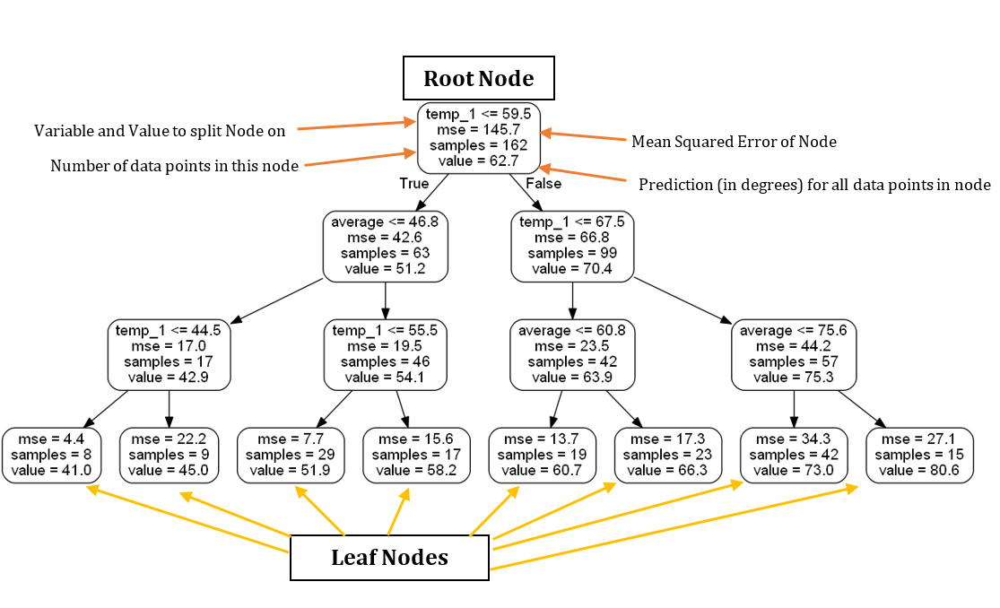

## Table of Contents

## What is the Random Forest Algorithm?

The Random Forest Algorithm is a type of machine learning method that helps make predictions or decisions by using many decision trees. Imagine a decision tree as a flowchart where you ask questions and follow paths based on the answers until you reach a final decision. In a Random Forest, instead of relying on just one tree, you use a whole forest of these trees. Each tree in the forest gives its own prediction, and the final result is decided by taking a vote among all the trees. This makes the Random Forest more reliable because it reduces the chance of making a wrong prediction based on just one tree.

To create a Random Forest, you start by taking your data and randomly choosing parts of it to build each tree. This randomness helps make sure that the trees are different from each other, which is important for getting a good overall prediction. When you want to use the Random Forest to make a prediction, you feed the new data into each tree, and each tree gives its answer. The Random Forest then combines these answers, usually by taking the most common one, to give you the final prediction. This method works well for many types of problems, like predicting whether someone will buy a product or classifying images, because it can handle complex data and still give accurate results.

## How does the Random Forest Algorithm work?

The Random Forest Algorithm works by creating a bunch of decision trees and using them together to make a prediction. Imagine each decision tree as a simple guide that helps you make a choice by asking questions and leading you down different paths based on your answers. In a Random Forest, you don't just use one tree; you use many trees. Each tree is built using a random part of your data, which means each tree might look at different pieces of information. This randomness is important because it helps make sure that the trees are different from each other, which makes the final prediction more reliable.

When you want to use the Random Forest to make a prediction, you take your new data and feed it into each tree in the forest. Each tree will give its own answer based on the paths it follows with your data. For example, if you're trying to predict whether someone will buy a product, each tree might say "yes" or "no." The Random Forest then takes all these answers and combines them, usually by taking a vote. If most of the trees say "yes," then the Random Forest will predict "yes." This way of combining the answers from many trees helps make the prediction more accurate than if you just used one tree.

## What are the key components of a Random Forest?

The key components of a Random Forest are decision trees and randomness. A decision tree is like a flowchart that helps make decisions by asking questions and following different paths based on the answers. In a Random Forest, you use many of these decision trees, and each one is built using a random part of your data. This means that each tree might look at different pieces of information, which helps make the trees different from each other.

The other important component is how the Random Forest combines the predictions from all these trees. When you want to make a prediction with a Random Forest, you feed your new data into each tree, and each tree gives its own answer. The Random Forest then takes all these answers and combines them, usually by taking a vote. If most of the trees say the same thing, that's what the Random Forest will predict. This way of combining the answers from many trees makes the final prediction more accurate and reliable.

## How do you implement a basic Random Forest Classifier in Python?

To implement a basic Random Forest Classifier in Python, you'll need to use a library called scikit-learn. First, you'll import the necessary tools from scikit-learn. You'll need to import the RandomForestClassifier from the ensemble module, and also import train_test_split and accuracy_score from the model_selection and metrics modules, respectively. After importing, you'll load your data, which usually comes in the form of features (X) and labels (y). Then, you'll split your data into training and testing sets using train_test_split. This helps you train your model on one part of the data and test it on another part to see how well it works.

Next, you'll create the Random Forest Classifier. You do this by calling RandomForestClassifier() and setting any parameters you want, like the number of trees (n_estimators) or the maximum depth of the trees (max_depth). After creating the classifier, you'll train it on your training data using the fit method. Once trained, you can use the trained model to make predictions on your test data using the predict method. Finally, you can check how well your model did by comparing its predictions to the actual labels in your test set using accuracy_score. This will give you a number that tells you how accurate your Random Forest Classifier is.

## What are the advantages of using Random Forests over other algorithms?

Random Forests have several advantages over other algorithms. One big advantage is that they are very good at handling different types of data. They can work well with both numbers and categories, which means you don't have to worry too much about preparing your data in a special way. Another advantage is that they are less likely to overfit. Overfitting happens when a model learns too much from the training data and doesn't work well on new data. Random Forests avoid this by using many different trees and combining their predictions, which makes them more reliable.

Another benefit of Random Forests is that they can tell you which pieces of your data are most important for making predictions. This can be really helpful if you want to understand your data better. Also, Random Forests can be used for many different kinds of problems, like predicting numbers, classifying things, or even ranking items. This makes them very versatile. Overall, the ability to handle different data types, reduce overfitting, provide insights into data importance, and be used for various tasks makes Random Forests a powerful and popular choice in [machine learning](/wiki/machine-learning).

## How can you tune the hyperparameters of a Random Forest in Python?

Tuning the hyperparameters of a Random Forest in Python can help you make your model work better. One way to do this is by using a method called Grid Search. With Grid Search, you pick a few hyperparameters that you want to try different values for, like the number of trees (n_estimators) or the maximum depth of the trees (max_depth). You then tell the computer to try all these different combinations and see which one gives the best results. You can use a tool from the scikit-learn library called GridSearchCV to do this. It will go through all the combinations you set up, train your Random Forest with each one, and then tell you which combination worked the best.

Another way to tune hyperparameters is by using Random Search. Random Search is like Grid Search, but instead of trying all possible combinations, it picks random combinations to try. This can be faster because it doesn't have to go through every single option. In Python, you can use RandomizedSearchCV from scikit-learn to do this. You'll set up a range of values for the hyperparameters you want to tune, and the computer will randomly pick values from these ranges to try. Both Grid Search and Random Search can help you find the best settings for your Random Forest, making it more accurate and reliable.

## What are some common metrics used to evaluate the performance of a Random Forest model?

When you want to see how well a Random Forest model is doing, you can use different ways to measure its performance. One common way is to look at accuracy, which tells you how often the model's predictions are correct. If your model says "yes" and it's right 90 out of 100 times, then your accuracy is 90%. Another useful metric is precision, which shows how many of the positive predictions your model makes are actually true. If your model says "yes" 100 times and 90 of those are right, your precision is 90%. There's also recall, which tells you how many of the actual positive cases your model catches. If there are 100 positive cases and your model finds 90 of them, your recall is 90%.

Another important metric is the F1 score, which combines precision and recall into one number. It's good for when you want to balance between catching as many positive cases as possible and making sure your positive predictions are correct. The F1 score is the harmonic mean of precision and recall, so it gives you a single number that shows how well your model is doing overall. Lastly, you can use the Area Under the Curve (AUC) of the Receiver Operating Characteristic (ROC) curve. This metric looks at how well your model can tell the difference between positive and negative cases across different thresholds. A higher AUC means your model is better at distinguishing between the two. These metrics help you understand different aspects of your Random Forest model's performance, so you can see where it's doing well and where it might need improvement.

## How does feature importance work in Random Forests, and how can it be implemented in Python?

Feature importance in Random Forests helps you understand which pieces of your data are most helpful for making predictions. Imagine you're trying to guess if someone will like a movie based on things like the movie's length, the actors, and the genre. Each of these pieces of information is a feature. In a Random Forest, each tree looks at different features to make its guess. After all the trees make their guesses, the Random Forest can tell you which features were used the most and made the biggest difference in the guesses. This is called feature importance. It's like figuring out which clues were the most useful in solving a mystery.

To implement feature importance in Python, you can use the scikit-learn library. First, you'll create and train your Random Forest model using your data. Once the model is trained, you can get the feature importance scores by using the `feature_importances_` attribute of your trained model. This will give you a list of numbers, where each number shows how important a feature is. The higher the number, the more important the feature. You can then sort these numbers to see which features have the highest importance. This helps you understand which parts of your data are most useful for making predictions, and you can use this information to focus on the most important features or even remove less important ones to make your model simpler and faster.

## What are some techniques for handling imbalanced data with Random Forests?

When you use a Random Forest with imbalanced data, it means that some of the things you want to predict are much more common than others. For example, if you're trying to predict if an email is spam or not, most emails might be normal, and only a few might be spam. This can make it hard for the Random Forest to learn how to spot the less common cases. One way to fix this is by using a technique called oversampling. This means you make more copies of the less common cases so that they appear more often in your data. Another way is undersampling, where you remove some of the more common cases so that the numbers are more even. Both of these methods can help the Random Forest learn better about all the different cases you want to predict.

Another technique you can use is called SMOTE, which stands for Synthetic Minority Over-sampling Technique. SMOTE creates new, similar examples of the less common cases by mixing their features. This helps the Random Forest see more examples of the less common cases without just copying them. You can also adjust the Random Forest itself by changing a setting called class_weight. This tells the Random Forest to pay more attention to the less common cases when it's learning. By using these techniques, you can help your Random Forest work better with imbalanced data and make more accurate predictions for all the different cases you're trying to predict.

## How can you use Random Forests for regression tasks in Python?

Random Forests can be used for regression tasks, which means they can help you predict numbers instead of just yes or no answers. In Python, you can use the RandomForestRegressor from the scikit-learn library to do this. First, you'll need to import the RandomForestRegressor and other tools like train_test_split and mean_squared_error from scikit-learn. After importing, you'll load your data, which usually comes in the form of features (X) and the numbers you want to predict (y). Then, you'll split your data into training and testing sets using train_test_split. This helps you train your model on one part of the data and test it on another part to see how well it works.

Next, you'll create the Random Forest Regressor by calling RandomForestRegressor() and setting any parameters you want, like the number of trees (n_estimators) or the maximum depth of the trees (max_depth). After creating the regressor, you'll train it on your training data using the fit method. Once trained, you can use the trained model to make predictions on your test data using the predict method. Finally, you can check how well your model did by comparing its predictions to the actual numbers in your test set using mean_squared_error. This will give you a number that tells you how close your Random Forest Regressor's predictions are to the actual values.

## What are the differences between Random Forests and other ensemble methods like Gradient Boosting?

Random Forests and Gradient Boosting are both types of ensemble methods, which means they use many smaller models to make one big prediction. In a Random Forest, you have a bunch of decision trees, and each tree makes its own guess. The final prediction is made by taking a vote among all the trees. This makes Random Forests good at handling different types of data and less likely to overfit, which means they don't learn too much from the training data and miss out on new data. Random Forests also let you see which parts of your data are most important for making predictions.

Gradient Boosting, on the other hand, builds its trees one at a time, and each new tree tries to fix the mistakes made by the previous ones. This means that each tree in Gradient Boosting depends on the trees that came before it, and they all work together to slowly get better at making predictions. Gradient Boosting can be very accurate, but it can also be more likely to overfit if you're not careful. It's good at handling complex patterns in the data, but it might need more tuning to work well. Both methods are powerful, but they work in different ways and might be better for different kinds of problems.

## How can you implement out-of-bag (OOB) error estimation in a Random Forest model in Python?

Out-of-bag (OOB) error estimation is a cool way to check how well your Random Forest model is doing without needing a separate test set. When you build a Random Forest, each tree is made using only some of your data. The parts of the data that aren't used to build a tree are called out-of-bag samples. You can use these out-of-bag samples to see how well each tree does on data it hasn't seen before. To do this, you let each tree make predictions on its out-of-bag samples, and then you combine all these predictions to get the OOB error. This gives you a good idea of how well your Random Forest will work on new data.

To use OOB error estimation in Python, you'll need to use the RandomForestClassifier or RandomForestRegressor from the scikit-learn library. When you create your Random Forest, you can set a parameter called `oob_score` to `True`. This tells the Random Forest to keep track of the out-of-bag samples and use them to estimate the error. After you train your model with the `fit` method, you can check the OOB error by looking at the `oob_score_` attribute of your trained model. This number tells you how accurate your Random Forest is likely to be on new data, which is really helpful for understanding how well your model is doing.

## How does Random Forest work in algorithmic trading?

Random forest algorithms play a crucial role in [algorithmic trading](/wiki/algorithmic-trading) by utilizing the ensemble learning technique to improve prediction reliability and accuracy over complex trading datasets. This method builds multiple decision trees, each trained on random subsets of the dataset, to provide a comprehensive analysis and mitigate overfitting issues commonly faced with single decision trees.

The ensemble method at the core of random forest is known as "bootstrap aggregating" or "bagging." This process involves creating individual decision trees using different subsets of the data, which are generated by random sampling with replacement. This diversity in training sets encourages unique paths of decision for each tree, thus reducing the likelihood of overfitting to the training data and enhancing the model's generalization to unseen data.

In the context of algorithmic trading, each decision tree analyzes historical trading data to extract patterns and trends. The model then leverages aggregated outcomes from these trees to make predictions. The two most common methods employed to synthesize the outputs of the individual trees in a random forest are the majority vote for classification tasks or averaging for regression tasks. In stock price prediction, where regression is typically the focus, the prediction $\hat{y}$ for a new input is given by the average of predictions from all decision trees as follows:

$$
\hat{y} = \frac{1}{T} \sum_{t=1}^{T} h_t(x)
$$

where $T$ is the number of trees in the forest, and $h_t(x)$ represents the prediction made by the $t$-th decision tree for the input $x$.

This approach stabilizes and improves the accuracy of predictions by leveraging the strengths of multiple models. By aggregating predictions, random forests reduce variance without a significant increase in bias, thus producing models that can better withstand the noisy, fluctuating nature of financial markets.

In practical implementation, the Python programming language, equipped with libraries such as scikit-learn, is often used to construct and deploy random forest models for trading. This library provides comprehensive tools for creating, training, and fine-tuning random forest models, enabling traders to harness the algorithm's full potential in optimizing their algorithmic trading strategies.

## References & Further Reading

[1]: Bergstra, J., Bardenet, R., Bengio, Y., & Kégl, B. (2011). ["Algorithms for Hyper-Parameter Optimization."](https://papers.nips.cc/paper/4443-algorithms-for-hyper-parameter-optimization) Advances in Neural Information Processing Systems 24.

[2]: ["Advances in Financial Machine Learning"](https://www.amazon.com/Advances-Financial-Machine-Learning-Marcos/dp/1119482089) by Marcos Lopez de Prado

[3]: ["Evidence-Based Technical Analysis: Applying the Scientific Method and Statistical Inference to Trading Signals"](https://www.amazon.com/Evidence-Based-Technical-Analysis-Scientific-Statistical/dp/0470008741) by David Aronson

[4]: ["Machine Learning for Algorithmic Trading"](https://github.com/stefan-jansen/machine-learning-for-trading) by Stefan Jansen

[5]: ["Quantitative Trading: How to Build Your Own Algorithmic Trading Business"](https://books.google.com/books/about/Quantitative_Trading.html?id=j70yEAAAQBAJ) by Ernest P. Chan