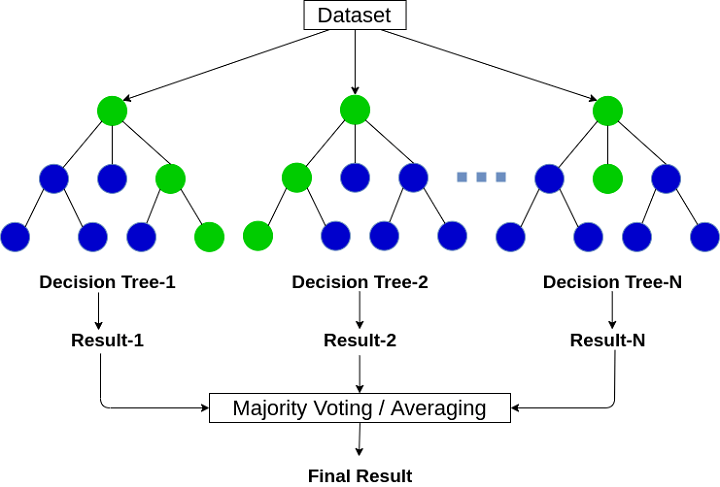

Algorithmic trading has revolutionized financial markets by integrating automated, data-driven strategies to enhance trading efficiency and accuracy. It leverages complex algorithms that can process large volumes of data far quicker than human traders, enabling high-frequency trading and reducing human bias. Within this paradigm shift, machine learning algorithms have become pivotal, facilitating the development of sophisticated models that learn from and adapt to market dynamics.

Among various machine learning techniques, the Random Forest (RF) algorithm stands out for its ability to enhance predictive modeling in trading. RF provides significant advantages over traditional decision trees by addressing issues such as overfitting—a common problem where a model performs well on training data but poorly on new, unseen data. By doing so, random forests improve both the reliability and accuracy of trading models.



This article examines how the random forest method can be effectively applied in algorithmic trading. It explores the algorithm's functionality, evaluates its potential advantages, and highlights possible challenges it may pose within financial markets. The discussion aims to equip traders with insights into leveraging random forests to enhance trading strategies, optimize performance, and ultimately achieve better investment outcomes.

## Table of Contents

## Understanding Decision Trees and Their Limitations

Decision trees are an essential [machine learning](/wiki/machine-learning) model characterized by their intuitive, hierarchical structure of nodes and branches. Each node represents a decision point or a test on a particular feature, while branches correspond to the outcome of the test, eventually leading to leaf nodes, which indicate the final prediction or class label.

Despite their interpretability and ease of use, decision trees can be prone to overfitting, a phenomenon where the model captures noise instead of the underlying pattern in the training data. This susceptibility arises primarily due to their capacity to create very specific and complex models that mirror the training data closely. Consequently, decision trees might perform exceptionally well on training data but struggle with generalizing these findings to new, unseen datasets.

The equation that describes overfitting in decision trees involves minimizing the impurity measure, typically Gini impurity or entropy for classification trees. For example, Gini impurity for node $t$ is given by:

$$

Gini(t) = 1 - \sum_{i=1}^{n} p(i)^2 
$$

where $p(i)$ is the proportion of items classified as class $i$ in node $t$. The tree-building algorithm aims to maximize the reduction of impurity at each split, sometimes resulting in overly complex trees.

To address these limitations, ensemble methods like random forests have been developed. Random forests enhance model robustness by constructing multiple decision trees and aggregating their predictions. The aggregation process, through methods such as majority voting in classification or averaging in regression, helps smooth out the variance associated with individual decision trees, thus reducing the likelihood of overfitting. By incorporating techniques like bagging and feature randomness, random forests introduce diversity among trees, further bolstering the model's generalizability and predictive accuracy.

## What is a Random Forest?

The random forest algorithm is a widely-used ensemble learning technique in machine learning, acclaimed for its robustness and accuracy in prediction tasks. This method combines multiple decision trees, working together to produce a more reliable and generalized model. By aggregating the predictions of a collection of trees, random forests effectively handle the tendency of single decision trees to overfit the training data.

To construct a random forest, the algorithm employs two prominent techniques: random feature selection and bagging (Bootstrap Aggregating). Random feature selection involves choosing a random subset of features for each split in the decision trees, which ensures diversity among the trees. Bagging, on the other hand, involves training each tree on a random sample of the training dataset, drawn with replacement. This leads to the creation of numerous, distinct trees that make independent predictions.

The final output of a random forest is obtained through an aggregation mechanism. For classification tasks, the outcome is determined by majority voting; each tree provides a "vote" for a class label, and the class with the most votes is chosen as the overall prediction. In regression tasks, the final prediction is the average of the predictions from all the trees:

$$
\hat{y} = \frac{1}{N} \sum_{i=1}^{N} f_i(x)
$$

where $\hat{y}$ is the predicted value, $N$ is the number of trees in the forest, and $f_i(x)$ is the prediction from the $i$-th tree.

Overall, the random forest algorithm's ability to handle large datasets with high dimensionality makes it particularly suited for complex problems. Its ensemble nature provides a balance between bias and variance, leading to improved predictive performance and robustness in various applications.

## How Does the Random Forest Algorithm Work in Machine Learning?

Random forests employ ensemble learning by building a multitude of decision trees during the training phase. This method enhances model accuracy and robustness, particularly in dealing with overfitting, a common issue with singular decision tree models.

The initial step in constructing a random forest entails generating random subsets of the original dataset, a process known as bootstrapping. For each subset, a decision tree is trained. This subsetting ensures that each tree in the forest is trained on different portions of the data, bringing diversity to the model's learning process. Moreover, when constructing these trees, a random selection of features is considered at each node split, adding another layer of variability.

The output from each trained decision tree is a prediction or decision. In the context of classification tasks, the final output of the random forest is determined through majority voting across all the individual tree predictions. Mathematically, this can be represented as follows: 

$$
\hat{y} = \text{mode}(T_1, T_2, \ldots, T_n)
$$

where $\hat{y}$ is the predicted class, and $T_1, T_2, \ldots, T_n$ are predictions from the $n$ trees in the forest. For regression tasks, the forest's final prediction is the mean average of the outputs from all trees:

$$
\hat{y}_{\text{reg}} = \frac{1}{n} \sum_{i=1}^{n} T_i(x)
$$

where $\hat{y}_{\text{reg}}$ is the predicted value and $T_i(x)$ is the prediction for input $x$ from the $i$-th tree.

This aggregation of predictions constitutes the ensemble's output and significantly enhances the model's predictive capacity by averaging out the biases from individual trees. The combined effect effectively reduces variance and mitigates overfitting, making random forests particularly suitable for complex datasets where high-dimensionality and non-linear relationships among variables are prevalent. By leveraging the strengths of multiple decision trees, random forests achieve a balance between model complexity and prediction accuracy, ensuring robust generalization to new and unseen data.

## Application of Random Forests in Trading: A Step-by-Step Approach

Implementing the random forest algorithm within [algorithmic trading](/wiki/algorithmic-trading) involves a structured and methodical approach. To begin, data preparation and preprocessing are fundamental to ensure the algorithm can make accurate predictions. The dataset, typically comprising a variety of financial indicators, historical prices, and potentially macroeconomic variables, must be thoroughly cleaned and formatted. Anomalies such as missing data points and non-standardized formats are addressed to prevent skewed results and enhance the model's accuracy.

Once the dataset is prepared, it is crucial to split it into training and testing subsets. This division allows for both the development and subsequent evaluation of the model's predictive capabilities. A common practice is to allocate 70%-80% of the data to training the model and reserve 20%-30% for testing purposes. This separation helps in assessing the model's performance on unseen data, ensuring generalization beyond the training set.

Using Python's scikit-learn library, the random forest algorithm is deployed to handle the intricacies of financial data. The implementation begins with defining the model's parameters, such as the number of trees in the forest (`n_estimators`) and the maximum depth of each tree (`max_depth`). These parameters are crucial and typically fine-tuned to optimize the model's performance. Hyperparameter tuning can be conducted using techniques such as grid search or random search, which explore combinations of parameters to identify the configuration yielding the best validation accuracy.

A valuable feature of the random forest algorithm is its ability to assess feature importance. Feature importance scores indicate the contribution of each input variable in making predictions, enabling traders to pinpoint the most influential factors driving their algorithmic strategies. This insight can guide strategy adjustments and focus on significant market indicators that affect asset prices.

The final step in utilizing random forest for trading is rigorous [backtesting](/wiki/backtesting) with historical data. Backtesting provides a simulated environment to evaluate the strategy's performance as if it had been deployed in past market conditions. Metrics such as accuracy, precision, recall, and the Sharpe ratio are analyzed to ascertain the strategy's validity and profitability potential. It helps in refining the approach, identifying potential flaws, and enhancing strategy robustness before live trading.

Incorporating these systematic steps ensures that random forest algorithms are effectively implemented in algorithmic trading. This comprehensive method not only aids in crafting robust trading strategies but also empowers traders to make data-driven decisions with enhanced confidence.

## Pros and Cons of Using Random Forest in Trading

Random forests are widely recognized for their high accuracy in predictive tasks, including algorithmic trading. They utilize ensemble learning to combine predictions from multiple decision trees, which helps in reducing the risk of overfitting—a common issue with single decision tree models. This robustness makes random forests particularly effective for handling large and complex financial datasets that contain high-dimensional features.

One of the key advantages of random forests is their capability to manage large datasets efficiently. Financial markets often produce vast amounts of data with numerous variables, such as historical prices, trading volumes, and economic indicators. Random forests can process these high-dimensional datasets to extract meaningful patterns and insights, which are crucial for developing effective trading strategies.

However, the computational intensity of random forests can be a significant drawback, especially when applied to extensive financial datasets. Training a random forest model requires substantial computational resources and time. This computational demand comes from the need to build and evaluate a large number of trees, which can be both resource-intensive and time-consuming.

Additionally, while random forests offer high predictive accuracy, their complexity often reduces interpretability. Unlike simpler models, random forests operate as a "black box," making it challenging for traders to understand how specific input variables influence the final predictions. This lack of transparency can be a hurdle when it comes to explaining model decisions to non-technical stakeholders or when adjustments to the trading strategy are required based on model insights.

In terms of code, using Python’s scikit-learn library, one can easily implement a random forest model:

```python
from sklearn.ensemble import RandomForestClassifier

# Example of setting up a random forest classifier
rf_model = RandomForestClassifier(n_estimators=100, max_features='auto', random_state=42)

# Fit the model on training data
rf_model.fit(X_train, y_train)

# Make predictions
predictions = rf_model.predict(X_test)
```

In summary, while random forests provide significant advantages in terms of accuracy and ability to handle rich, complex datasets, their computational demands and interpretability issues cannot be overlooked. These factors need careful consideration when choosing random forests as a tool for algorithmic trading.

## Conclusion

The random forest method significantly enhances model accuracy and robustness within algorithmic trading applications. By leveraging an ensemble of decision trees, it effectively addresses the issue of overfitting that often plagues single decision tree models. The ability to aggregate predictions across multiple trees enables random forests to provide more stable and accurate forecasts, which are crucial for making informed trading decisions.

Despite the computational intensity involved in training random forest models, which can require substantial time and resources, the method offers traders valuable insights into market behavior. These insights come from the feature importance metrics provided by the model, which help traders identify key variables driving asset price movements. This nuanced decision-making capability enables traders to tailor their strategies based on empirical data, potentially enhancing profitability.

As the complexity and [volume](/wiki/volume-trading-strategy) of financial datasets continue to grow, the applicability of random forests remains strong. The method's ability to handle large datasets with numerous features makes it particularly suited to the intricate and multi-dimensional challenges of financial markets. Additionally, as machine learning technology advances, we may see enhancements in computational efficiency, reducing the training time required for these models. Such advancements would make it feasible to apply random forests more extensively in live trading environments, thus broadening their scope of application.

In conclusion, while random forests demand considerable computational power, their benefits in terms of accuracy, robustness, and insight provision make them a vital component of a trader's analytical toolkit. Embracing future technological improvements could enhance their practicality and ensure their continued relevance in the evolving landscape of algorithmic trading.

## References & Further Reading

[1]: Bergstra, J., Bardenet, R., Bengio, Y., & Kégl, B. (2011). ["Algorithms for Hyper-Parameter Optimization."](https://papers.nips.cc/paper/4443-algorithms-for-hyper-parameter-optimization) Advances in Neural Information Processing Systems 24.

[2]: ["Advances in Financial Machine Learning"](https://www.amazon.com/Advances-Financial-Machine-Learning-Marcos/dp/1119482089) by Marcos Lopez de Prado

[3]: ["Evidence-Based Technical Analysis: Applying the Scientific Method and Statistical Inference to Trading Signals"](https://www.amazon.com/Evidence-Based-Technical-Analysis-Scientific-Statistical/dp/0470008741) by David Aronson

[4]: ["Machine Learning for Algorithmic Trading"](https://github.com/stefan-jansen/machine-learning-for-trading) by Stefan Jansen

[5]: ["Quantitative Trading: How to Build Your Own Algorithmic Trading Business"](https://books.google.com/books/about/Quantitative_Trading.html?id=j70yEAAAQBAJ) by Ernest P. Chan