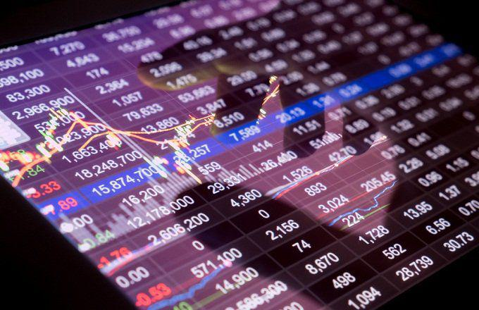

In the trading world, many aspiring traders enter the markets with hopes of making profits but are often unaware of the psychological traps and long-term challenges they may face. The allure of financial success can be overshadowed by the mental and emotional complexities inherent in trading. Traders frequently encounter a phenomenon known as random reinforcement, which plays a significant role in their potential defeat within the markets.

Random reinforcement refers to the misattribution of random outcomes, often leading traders to incorrectly associate these results with their own skill or decision-making. A trader might experience a series of successful trades and prematurely attribute their gains to expertise, while in reality, the success might have been due to random chance. Conversely, when faced with losses, traders may incorrectly perceive these outcomes as failures of personal aptitude rather than natural market variability. This misunderstanding can lead to unhealthy cycles of overconfidence, which can provoke reckless trading behavior, or self-doubt, which may cause traders to abandon successful strategies prematurely.

The intention of this article is to shed light on the impact of random reinforcement on traders by dissecting how this cognitive bias affects decision-making and overall trading psychology. Furthermore, it aims to equip traders with effective strategies to recognize and mitigate the harmful effects of random reinforcement, thereby fostering an environment conducive to disciplined, long-term trading success. Understanding these psychological intricacies is essential for any trader seeking to navigate the unpredictable waters of financial markets with greater resilience and composure.

## Table of Contents

## Understanding Random Reinforcement

Random reinforcement is a concept widely studied within behavioral psychology, and its implications are especially pertinent in the field of trading. This phenomenon manifests when traders incorrectly associate a random outcome with their personal skill or decision-making capabilities. Markets are inherently unpredictable, and the stochastic nature of financial markets can often lead traders to perceive patterns where none exist. This misattribution can significantly affect trading behavior by distorting a trader's self-assessment of ability and strategy effectiveness.

When traders experience success that is largely influenced by luck or chance, they may be prone to developing overconfidence. This overconfidence arises from a cognitive bias that reinforces the notion that their decisions directly resulted in profit. Consequently, this perceived mastery may encourage riskier behavior, such as increasing trade size or deviating from established trading plans, based on the false belief that their skill will continue to yield positive outcomes. Overconfidence fueled by random reinforcement can thus lead to vulnerability during market downturns, as traders maintain heightened risk profiles without acknowledging the role of randomness in their prior successes.

Conversely, when facing losses, traders may fall into a spiral of self-doubt, attributing what is genuinely a defensive or rational strategy as flawed simply because it did not yield immediate gains. This self-doubt can undermine the confidence needed to stick to a sound strategy, particularly when the strategy temporarily underperforms due to the market's unpredictable nature.

Recognizing the randomness inherent in market movements is crucial for traders seeking to avoid these pitfalls. A crucial step in this recognition involves distinguishing between luck-based outcomes and those achieved through skillful decision-making. By applying statistical analysis to evaluate the probability and variance of their trades, traders can discern the extent to which random reinforcement might be influencing their performance. A practical approach can involve the implementation of hypothesis testing, allowing traders to ascertain whether their results significantly deviate from what would be expected under random chance. This quantitative assessment offers traders a more objective foundation for evaluating their success.

In essence, understanding random reinforcement equips traders with the ability to critically assess their trading outcomes, mitigating the risk of succumbing to cognitive biases that could lead to poor decision-making and trading failure. By maintaining an awareness of the unpredictable aspects of market behavior, traders are better positioned to maintain disciplined and rational strategies over the long term.

## The Impact of Random Reinforcement on Trading Psychology

Random reinforcement significantly influences trading psychology by creating an environment where outcomes are often misattributed to skill or poor decision-making, rather than the inherent unpredictability of markets. This phenomenon can substantially affect traders' psychological states, leading to counterproductive behaviors and decisions.

Markets naturally exhibit [volatility](/wiki/volatility-trading-strategies), characterized by price movements that are not always predictable. This unpredictability can result in scenarios where traders are rewarded for poor decisions and penalized for good ones. For instance, a trader might experience considerable gains from a poorly planned trade due to a fortuitous market shift. Conversely, sound strategies may sometimes result in losses, not due to any fault in the method but because of random market fluctuations. This can generate confusion among traders who begin to question their approaches, despite having viable strategies.

As a result, traders often develop overconfidence. Success attributed to mere chance can lead traders to overestimate their abilities, prompting them to take excessive risks under the false assumption of control over random market behaviors. Such overconfidence can skew risk perception, leading traders to open larger positions than their capital permits or ignore risk management protocols, significantly increasing the likelihood of significant financial losses.

Alternatively, random failures can lead to diminished confidence in proven strategies. Traders witnessing their strategies fail due to random market behavior might abandon them in favor of untested or inferior methods, hoping for immediate improvement. This reactionary approach disrupts consistent strategy implementation and encourages a trading mindset based on trial and error rather than calculated analysis.

Psychological missteps influenced by random reinforcement can result in habit formation that is detrimental to long-term success. Over time, the cycle of overconfidence, followed by inevitable losses, can lead to a destabilized mental state where traders struggle to discern between skill-driven outcomes and those driven by random chance. Building bad habits, like continuously changing strategies in response to short-term randomness or ignoring risk management guidelines, can erode any foundation for sustainable trading success.

Understanding the impact of random reinforcement is crucial for traders to avoid falling into these psychological traps. By acknowledging the role of randomness, traders can better prepare themselves to maintain discipline, adhere to sound strategies, and focus on long-term objectives rather than short-term fluctuations.

## Case Studies: Relying on Randomness and Abandoning a Sound Strategy

### Example 1: A Novice Trader and the Illusion of Skill

Consider a novice trader entering the market with minimal experience but a great deal of enthusiasm. Initially, the trader places a few trades, and due to favorable market conditions, experiences an unexpected run of profitability. This success is perceived as a result of personal skill rather than a stroke of luck. As a consequence, the trader becomes overconfident, believing that their strategy and decision-making abilities are more competent than they actually are. This overconfidence can lead to inadequate risk management, with the trader ignoring the need for diversification and other key strategic planning measures. 

Over time, the market conditions change, and the factors that once provided random success now result in losses. The novice trader, however, continues to operate under the misbelief that success is still within reach based on their supposed skill. This persistence in attributing gains to personal aptitude, without recognizing the role of random market movements, can be detrimental. Eventually, the trader's lack of a robust strategy becomes evident as losses accumulate, jeopardizing their financial stability and dampening their confidence in further trading endeavors.

### Example 2: An Experienced Trader’s Crisis of Confidence

In contrast to the novice trader, consider an experienced trader who employs a well-tested trading method that has historically provided consistent returns. Despite a sound strategy, trading inevitably entails periods of drawdowns or losing streaks. During one such downturn, the seasoned trader encounters a series of consecutive losses. These losses set off a psychological response, questioning the validity and effectiveness of the previously successful strategy.

Faced with such losses, the trader is tempted to abandon their proven method in favor of impulsive, untested tactics that seem promising in the face of existing market volatility. This shift in strategy, motivated by short-term pressures rather than empirical evidence, can lead traders down a path of randomness, as new, unproven methods are employed in desperate attempts to recover losses.

In both examples, random reinforcement plays a pivotal role in guiding trader behavior away from strategic planning and towards rash decision-making. For the novice, initial success was falsely attributed to skill, while for the experienced trader, temporary setbacks induced a crisis of confidence, encouraging susceptibility to randomness over established, reliable methods. This reliance on randomness compounds the risk of substantial financial loss and ultimately contributes to overall trading failure.

## Strategies to Mitigate the Effects of Random Reinforcement

Developing a comprehensive trading plan is essential in countering the effects of random reinforcement in trading. A well-defined plan should include clear entry and [exit](/wiki/exit-strategy) criteria, risk management rules, and defined asset allocation. These components help traders reduce emotional reactions when random market movements occur. By committing to a pre-defined strategy, traders prevent themselves from making impulsive decisions based on perceived patterns that may ultimately be random fluctuations.

Maintaining a detailed trading journal is an effective method to discern whether trading outcomes result from skill or random chance. A trading journal should record each trade's rationale, the market conditions at the time, and the outcomes. By analyzing the data, traders can identify patterns and determine if their successes and failures align with their strategies or are merely coincidental. For example, a trader may note that their losses often occur when deviating from their strategy, suggesting that random reinforcement played a role in their suboptimal decisions.

Focusing on long-term goals rather than short-term market fluctuations ensures that traders do not overreact to temporary gains or losses that could be attributed to random reinforcement. Long-term goals encourage traders to evaluate their performance based on extended periods, diminishing the influence of random events. Consulting with a financial advisor or mentor can provide additional support. Professional guidance can offer unbiased perspectives and help traders maintain emotional stability. Advisors can also offer valuable insights into market trends and strategy improvements, reducing the likelihood of succumbing to random reinforcement.

Implementing these strategies involves discipline and consistency, both crucial in mitigating the psychological impacts of random reinforcement. Through structured planning, methodical record-keeping, and a long-term perspective, traders can better manage the psychological challenges presented by the inherent randomness of the markets, ultimately leading to more stable and consistent performance.

## Conclusion

Understanding the impact of random reinforcement is essential for traders aiming to enhance their performance and secure a successful trading career. The unpredictable nature of market movements often leads traders to misattribute outcomes, either overestimating their skills or undermining their confidence due to chance occurrences. Recognizing this cognitive bias allows traders to address its influence effectively.

To mitigate the effects of random reinforcement, traders should implement well-defined strategies that prioritize consistent and long-term success over short-term gains. This involves creating a robust trading plan, adhering to pre-established strategies, and rigorously analyzing outcomes to discern whether they stem from skillful execution or mere randomness. By prioritizing structured approaches and maintaining a detailed trading journal, traders can achieve clarity on their methods and focus on continuous improvement.

Beyond strategies, successful trading requires a harmonious blend of knowledge, discipline, and emotional stability. Knowledge equips traders with insights into market dynamics and potential opportunities. Discipline ensures adherence to trading plans, preventing impulsive decisions that could jeopardize long-term objectives. Emotional stability helps traders navigate the highs and lows of trading, maintaining a balanced approach to both losses and gains.

Ultimately, by addressing random reinforcement with informed strategies and fostering essential trading attributes, traders can enhance their ability to achieve sustained success in unpredictable market environments. Such an approach not only bolsters trading performance but also fortifies the trader's journey towards long-term financial achievements.

## References & Further Reading

[1]: Taleb, N. N. (2007). ["The Black Swan: The Impact of the Highly Improbable."](https://archive.org/details/10.1.1.695.4305) Random House.

[2]: Barberis, N., & Thaler, R. (2003). ["A Survey of Behavioral Finance."](https://www.nber.org/papers/w9222) National Bureau of Economic Research Working Paper Series.

[3]: Dreman, D. (1998). ["Contrarian Investment Strategies: The Next Generation."](https://www.amazon.com/Contrarian-Investment-Strategies-David-Dreman/dp/0684813505) Simon & Schuster.

[4]: Kahneman, D. (2011). ["Thinking, Fast and Slow."](https://psycnet.apa.org/record/2011-26535-000) Farrar, Straus and Giroux.

[5]: Plous, S. (1993). ["The Psychology of Judgment and Decision Making."](https://archive.org/details/psychologyofjudg0000plou) McGraw-Hill.