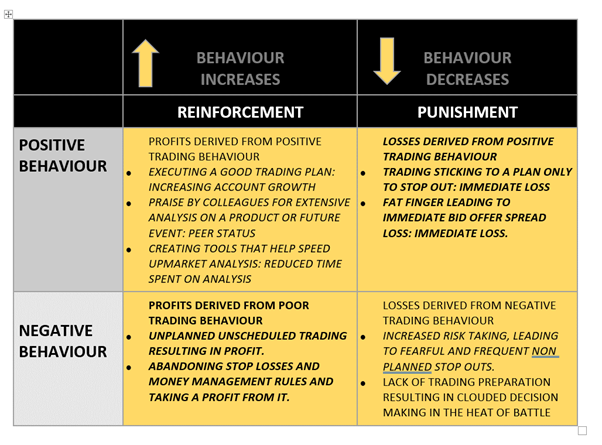

## Table of Contents

## What is random reinforcement in the context of trading?

Random reinforcement in trading is when traders get unexpected or unpredictable rewards or losses. It's like a slot machine where you don't know when you'll win or lose. This can happen when a trader makes a trade based on a hunch or a guess, and sometimes it works out, but other times it doesn't. This unpredictability can make trading exciting but also very risky.

Because of this randomness, traders might start to believe that their guesses or hunches are good strategies, even if they're not. This can lead to bad habits and poor decision-making. It's important for traders to understand that random reinforcement can trick them into thinking they're doing well when they're actually just getting lucky sometimes. To be successful, traders need to use proven strategies and not rely on random wins or losses.

## How does random reinforcement affect a trader's decision-making process?

Random reinforcement can mess with a trader's decision-making process by making them think that their lucky guesses are good strategies. When a trader gets a random win, they might start to believe that their hunch or guess was a smart move. This can lead them to keep making trades based on these hunches, even though it's just luck. Over time, this can make them overconfident and take bigger risks, thinking they have a winning formula when they really don't.

This kind of thinking can be dangerous because it's based on randomness, not skill. Traders might ignore proven strategies and data because they feel good about their past lucky wins. This can lead to big losses when the randomness doesn't go their way. To make better decisions, traders need to stick to strategies that are based on solid data and analysis, not on random wins or losses.

## Can you explain the basic principles of reinforcement learning in trading?

Reinforcement learning in trading is like teaching a computer to trade by letting it learn from its actions. The computer makes trades and then sees if those trades make money or lose money. If a trade makes money, the computer remembers that action as good and is more likely to do it again. If a trade loses money, the computer learns to avoid that action in the future. Over time, the computer gets better at trading by figuring out which actions lead to profits and which lead to losses.

This learning process is guided by rewards and punishments, similar to how people learn from good and bad outcomes. In trading, the reward is usually making money, and the punishment is losing money. The computer keeps trying different things and adjusting its strategy based on these outcomes. The goal is for the computer to find the best way to trade that maximizes profits and minimizes losses. By using [reinforcement learning](/wiki/reinforcement-learning), traders hope to develop smart trading systems that can adapt to changing market conditions and make better decisions over time.

## What are some common examples of random reinforcement in trading?

Random reinforcement in trading happens when traders get lucky sometimes. Imagine a trader who makes a trade based on a gut feeling or a random guess. If that trade makes money, the trader might think, "Wow, my guess was right!" But it was just luck. Another time, the same trader might make a similar guess and lose money. This back-and-forth of winning and losing can trick the trader into thinking they have a good strategy when it's really just random.

This kind of thing can happen a lot in trading. For example, a trader might buy a stock because they heard a rumor, and if the stock goes up, they feel smart. But if they try the same thing again and the stock goes down, they lose money. It's like playing a game where you win sometimes and lose sometimes, but you don't know why. This can make traders feel confused and unsure about what really works and what doesn't.

## How might random reinforcement lead to overtrading or other detrimental trading behaviors?

Random reinforcement can make traders overtrade because they get excited when they win by luck. When a trader makes a random guess and it pays off, they feel good and might want to keep trading more to feel that excitement again. They think they are on a winning streak, but really, it's just random. So, they start trading more often, hoping to get lucky again and again. This can lead to overtrading, where they make too many trades without thinking carefully, and that can cause big losses.

This kind of behavior can also lead to other bad habits. For example, a trader might start ignoring their trading plan because they think their lucky guesses are better. They might also take bigger risks, thinking that they have a secret formula for winning. But since it's all based on random luck, they can end up losing a lot of money. It's important for traders to stick to a plan and not let random wins trick them into making bad decisions.

## What psychological impacts does random reinforcement have on traders?

Random reinforcement can make traders feel confused and unsure about their trading decisions. When a trader gets lucky and makes money from a random guess, they might start to feel good and think they are doing something right. This can make them feel confident, but it's a false confidence because it's based on luck, not skill. Over time, this can lead to a lot of stress and anxiety because they never know if their next guess will be a win or a loss.

This kind of unpredictability can also mess with a trader's emotions. They might feel excited when they win, but then frustrated or disappointed when they lose. This rollercoaster of emotions can make trading feel like a game of chance, which can be really hard on a trader's mental health. It's important for traders to recognize that random wins are just luck and not let these feelings push them into making bad trading decisions.

## How can traders identify if they are being influenced by random reinforcement?

Traders can figure out if they are being influenced by random reinforcement by looking at how they make their trading decisions. If they often make trades based on hunches or guesses instead of a solid plan, they might be relying on random wins. They should also pay attention to their feelings after a trade. If they feel really excited or disappointed based on whether they win or lose, it might be because they're hoping for random luck instead of following a strategy.

Another way to spot random reinforcement is by keeping track of their trades and looking for patterns. If they see that they are making money sometimes but can't explain why, it's probably random luck. Traders should ask themselves if they can explain why a trade worked or if it was just a lucky guess. If it's the latter, they need to be careful not to let those random wins trick them into thinking they have a good strategy.

## What strategies can traders use to mitigate the effects of random reinforcement?

Traders can use a few simple strategies to avoid being tricked by random reinforcement. One good way is to stick to a clear trading plan. This means making trades based on rules and data, not on guesses or feelings. If a trader follows a plan, they can look back at their trades and see if they made money because of their strategy or just by luck. It's also important to keep a trading journal. Writing down why they made each trade and what happened can help traders see if they are relying too much on random wins.

Another helpful strategy is to set strict rules for when to trade and when to stop. This can stop traders from making too many trades just because they feel lucky. They should also take breaks if they start feeling too excited or upset about their trades. Talking to other traders or a mentor can also help. They can give advice and help traders see if they are making decisions based on luck or a real strategy. By using these simple steps, traders can make better choices and avoid the traps of random reinforcement.

## How does random reinforcement impact long-term trading success?

Random reinforcement can hurt a trader's long-term success. When traders get lucky and make money from random guesses, they might start thinking those guesses are good strategies. This can make them keep making trades based on luck instead of a real plan. Over time, this can lead to big losses because luck doesn't last. Traders might lose more money than they win, and their account can go down a lot. It's important for traders to understand that random wins are not a good way to make money in the long run.

To be successful in trading over the long term, traders need to use strategies that are based on data and careful planning. They should make trades because they have good reasons, not because they feel lucky. By sticking to a solid plan and not letting random wins trick them, traders can make better decisions and have a better chance of making money over time. Random reinforcement can be a big problem, but traders can avoid it by being smart and sticking to what really works.

## Can you discuss any studies or research that have analyzed the effects of random reinforcement in trading?

There have been studies that look at how random reinforcement affects trading. One study by psychologists at Stanford University found that traders who made decisions based on random wins were more likely to take bigger risks. The study showed that these traders thought they had a good strategy when they were really just lucky sometimes. This made them overconfident and led to more trading and bigger losses over time. The researchers suggested that traders need to be careful and not let random wins trick them into thinking they are doing well.

Another study from the University of Chicago looked at how random reinforcement can lead to bad habits in trading. The researchers found that traders who got lucky often started to ignore their trading plans. They made trades based on feelings instead of data, which led to worse results in the long run. The study showed that traders need to stick to a plan and not let random wins make them feel too confident. By understanding these effects, traders can make better decisions and avoid the traps of random reinforcement.

## How do experienced traders adapt their strategies to account for random reinforcement?

Experienced traders know that random reinforcement can trick them into making bad decisions. So, they stick to a clear trading plan and use data to make their choices. They don't let a lucky win make them feel too confident. Instead, they look at why a trade worked and see if it was because of their strategy or just luck. By doing this, they can avoid making trades based on guesses and feelings.

These traders also keep a trading journal to track their decisions and results. This helps them see if they are relying too much on random wins. They set strict rules for when to trade and when to stop, which helps them avoid overtrading. Experienced traders know that random wins don't last, so they focus on long-term success by using strategies that are based on solid data and careful planning.

## What advanced techniques or tools can traders use to better manage the influence of random reinforcement?

Experienced traders can use advanced tools like [algorithmic trading](/wiki/algorithmic-trading) systems to help manage the influence of random reinforcement. These systems use math and data to make trading decisions, which helps take the guesswork out of trading. By using algorithms, traders can stick to a plan and not let random wins trick them into making bad choices. These systems can also backtest strategies, which means they can see how a strategy would have worked in the past. This helps traders see if their wins are because of a good strategy or just luck.

Another helpful tool is risk management software. This kind of software helps traders set limits on how much they can lose on each trade. By setting these limits, traders can avoid taking big risks just because they feel lucky. Risk management tools also help traders keep their emotions in check, which is important because random wins can make traders feel too excited or confident. By using these advanced tools, traders can make better decisions and focus on long-term success instead of chasing random wins.

## References & Further Reading

[1]: Taleb, N. N. (2007). ["The Black Swan: The Impact of the Highly Improbable."](https://archive.org/details/10.1.1.695.4305) Random House.

[2]: Barberis, N., & Thaler, R. (2003). ["A Survey of Behavioral Finance."](https://www.nber.org/papers/w9222) National Bureau of Economic Research Working Paper Series.

[3]: Dreman, D. (1998). ["Contrarian Investment Strategies: The Next Generation."](https://www.amazon.com/Contrarian-Investment-Strategies-David-Dreman/dp/0684813505) Simon & Schuster.

[4]: Kahneman, D. (2011). ["Thinking, Fast and Slow."](https://psycnet.apa.org/record/2011-26535-000) Farrar, Straus and Giroux.

[5]: Plous, S. (1993). ["The Psychology of Judgment and Decision Making."](https://archive.org/details/psychologyofjudg0000plou) McGraw-Hill.