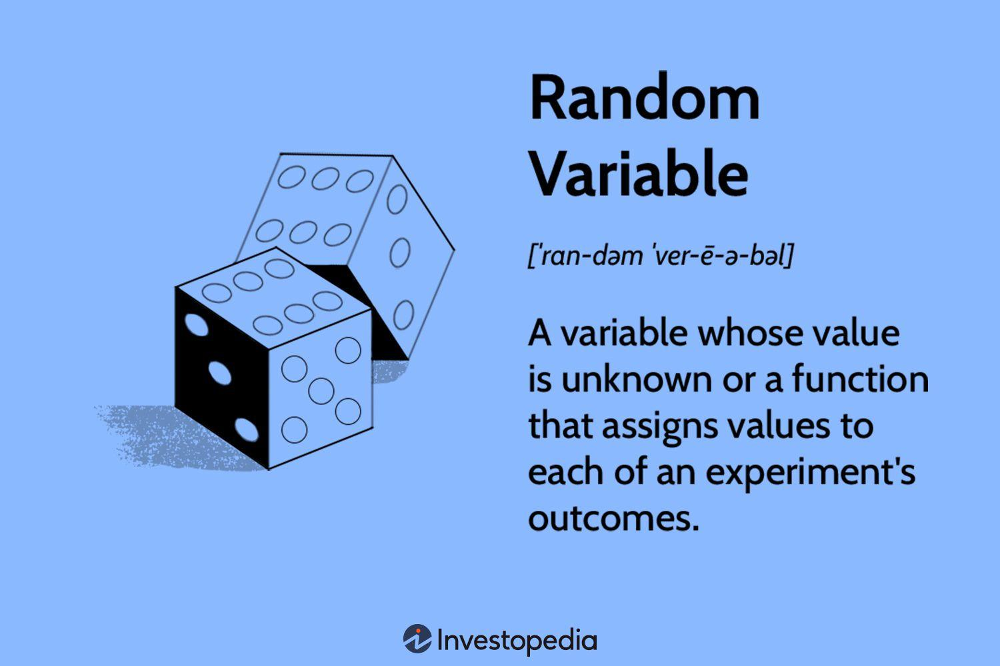

## Table of Contents

## What is a random variable?

A random variable is like a special kind of number that can change based on chance. Imagine you roll a dice. The number you get can be different each time you roll it. That number is a random variable because it can be any number from 1 to 6, and you can't predict exactly what it will be before you roll.

In math and statistics, random variables help us understand and work with things that aren't certain. They can be used to describe things like how much it might rain tomorrow or how long it takes to get to school. By studying random variables, we can make guesses about what might happen and plan better for the future.

## What are the two main types of random variables?

The first type of random variable is called a discrete random variable. This kind of variable can only take on certain specific values, like whole numbers. Think about rolling a dice again. You can only get numbers like 1, 2, 3, 4, 5, or 6. You can't get a number like 2.5 or 3.7. So, the result of rolling a dice is a discrete random variable.

The second type is called a continuous random variable. This kind of variable can take on any value within a range. For example, think about the height of a person. It could be any number, like 1.75 meters or 1.82 meters. It's not limited to just whole numbers. So, height is a continuous random variable because it can be any value within a certain range, not just specific numbers.

## Can you explain the difference between discrete and continuous random variables?

Discrete random variables are like counting numbers. They can only take on specific values, like whole numbers. Imagine you're counting the number of apples in a basket. You can have 1 apple, 2 apples, or 3 apples, but you can't have 1.5 apples. That's because the number of apples is a discrete random variable. It's limited to certain numbers and can't be anything in between.

Continuous random variables are different. They can take on any value within a range, not just specific numbers. Think about measuring the length of a piece of string. It could be 10 centimeters, 10.5 centimeters, or even 10.0001 centimeters. The length of the string is a continuous random variable because it can be any number within a certain range. It's not limited to just whole numbers or specific values.

## What is the probability distribution of a random variable?

The probability distribution of a random variable tells us how likely it is to get each possible value of that variable. Imagine you're rolling a dice. The probability distribution would show you the chances of rolling a 1, a 2, a 3, and so on. For a fair dice, each number has an equal chance of coming up, so the probability distribution would be the same for each number.

For a discrete random variable, the probability distribution is usually shown as a list or a table of all the possible values and their probabilities. For a continuous random variable, it's a bit different. Instead of a list, we use a smooth curve called a probability density function. This curve shows us the likelihood of the variable falling within any range of values. Both types of distributions help us understand and predict the behavior of random variables.

## How do you calculate the expected value of a random variable?

The expected value of a random variable is like an average of all the possible values it can take, but weighted by how likely each value is to happen. Imagine you're playing a game where you can win different amounts of money, but some amounts are more likely than others. The expected value is what you would win on average if you played the game many, many times. To find it, you multiply each possible value by its probability, and then you add up all those products.

For a discrete random variable, you list all the possible values and their probabilities. Then, you multiply each value by its probability and add them all together. For example, if you can win $1 with a 50% chance or $2 with a 50% chance, the expected value would be (1 * 0.5) + (2 * 0.5) = 1.5. For a continuous random variable, you use a formula that involves integrating the product of the value and its probability density function over the whole range of possible values. This is a bit more complicated, but it's the same idea: you're finding a weighted average.

## What is the variance of a random variable and how is it calculated?

The variance of a random variable tells us how spread out the values are around the expected value. Imagine you have a bunch of numbers, and you want to know how far they are from the average. Variance is like a measure of how much the numbers differ from the average. If the numbers are all close to the average, the variance is small. If they're spread out a lot, the variance is big.

To calculate the variance of a discrete random variable, you follow these steps: first, find the expected value (the average). Then, for each possible value of the random variable, subtract the expected value and square the result. After that, multiply each of these squared differences by the probability of that value happening. Finally, add up all these products. For a continuous random variable, you use a similar idea but with integration instead of summing. You integrate the squared difference between the variable and its expected value, multiplied by the probability density function, over the whole range of possible values.

## Can you provide examples of discrete random variables in real-life applications?

Imagine you're at a carnival and you're playing a game where you throw a ball into a basket. The number of times you successfully get the ball in the basket is a discrete random variable. It can only be whole numbers like 0, 1, 2, or 3. You can't have half a success, so it's discrete. This kind of variable is useful for understanding how well people do in games or sports where you count points or goals.

Another example is counting the number of cars that pass by a certain spot on the road in an hour. This number can be 10, 20, or 30 cars, but not 15.5 cars. It's a whole number, so it's a discrete random variable. Traffic engineers use this kind of data to plan roads and traffic lights, making sure they can handle the number of cars that come through.

## How are continuous random variables used in statistical modeling?

Continuous random variables are really important in statistical modeling because they help us understand things that can have any value, not just specific numbers. Imagine you're trying to predict how long it will take to drive to work. The time can be any number, like 20 minutes, 20.5 minutes, or even 20.001 minutes. By using continuous random variables, we can make models that show us how likely it is to take different amounts of time. These models can help us plan better and understand what might happen.

In statistical modeling, continuous random variables are often used with something called a probability density function. This is like a smooth curve that shows us the chances of the variable being in different ranges. For example, if you're studying the height of people, the probability density function can show you how likely it is for someone to be between 1.6 and 1.7 meters tall. By using these functions, we can make predictions and understand patterns in data that wouldn't be possible if we only looked at whole numbers.

## What are some common probability distributions for discrete random variables?

One common probability distribution for discrete random variables is the binomial distribution. Imagine you're flipping a coin. The binomial distribution helps you figure out the chances of getting a certain number of heads in a set number of flips. It's useful when you have something that can only have two outcomes, like success or failure, and you want to know the probability of getting a certain number of successes in a fixed number of tries.

Another common distribution is the Poisson distribution. This one is great for counting how many times something happens in a certain amount of time or space. For example, it can help you figure out the chances of getting a certain number of phone calls in an hour or the number of cars passing a point on the road in a minute. The Poisson distribution is all about understanding how often rare events happen, and it's really handy for planning and predicting in situations where you're counting events.

## What are some common probability distributions for continuous random variables?

One common probability distribution for continuous random variables is the normal distribution, also known as the bell curve. Imagine you're measuring the heights of a bunch of people. Most people will be around the average height, with fewer people being much taller or much shorter. The normal distribution shows this pattern, where the values are more likely to be close to the average and less likely to be far away from it. It's used a lot in [statistics](/wiki/bayesian-statistics) because many things in nature and society follow this pattern, like test scores or people's weights.

Another common distribution is the exponential distribution. This one is useful when you're looking at how long you have to wait for something to happen. For example, think about how long it takes for a bus to come after you arrive at the stop. The exponential distribution can tell you the chances of waiting a certain amount of time. It's often used for things like the time between phone calls at a call center or the lifespan of a light bulb. It's all about understanding how long you might have to wait for events that happen at a steady rate.

## How do random variables apply to the field of machine learning?

Random variables are super important in machine learning because they help us deal with uncertainty. Imagine you're trying to teach a computer to recognize pictures of cats and dogs. The computer needs to learn from examples, but each picture is a little different. By using random variables, we can model these differences and help the computer understand that even though each picture is unique, it still fits into a pattern. This makes the computer better at guessing whether a new picture is a cat or a dog.

In machine learning, we also use random variables to make our models more accurate. For example, when we're training a model, we might use something called a random forest, which is a bunch of decision trees working together. Each tree makes its own guess, and they're all a bit different because they're based on random samples of the data. By combining these guesses, we get a better overall prediction. Random variables help us create these different samples and make our models stronger and more reliable.

## What advanced statistical techniques use random variables for complex data analysis?

One advanced technique that uses random variables is called Bayesian statistics. Imagine you're trying to guess the weather for tomorrow. You might start with a guess based on what you know now, but as new information comes in, like the current temperature or cloud cover, you can update your guess. Bayesian statistics is all about using random variables to make these updates. It helps us combine what we already know with new data to make better predictions. This technique is super useful in fields like medicine, where doctors might use it to figure out the best treatment for a patient based on their symptoms and test results.

Another technique is Monte Carlo simulation. Think of it like playing a game many, many times to see what might happen. In this game, random variables are used to represent things that can change, like stock prices or the time it takes to complete a project. By running the game over and over again with different random values, we can see all the possible outcomes and figure out how likely each one is. This helps us make better decisions and plan for the future, especially when dealing with complex systems where it's hard to predict exactly what will happen.

## What are the statistical foundations of algorithmic trading?

Algorithmic trading is a method where computer programs are used to execute trades based on predefined strategies. These strategies are often built upon mathematical and statistical principles. Central to the development of such strategies are statistical tools like regression analysis, time series analysis, and [machine learning](/wiki/machine-learning).

Regression analysis aids in understanding the relationships between different market variables, allowing traders to make predictions about price movements. Multiple linear regression, for example, models the relationship between a dependent variable, such as an asset's return, and one or more independent variables, which could be economic indicators. The general form of a multiple linear regression model is:

$$
Y = \beta_0 + \beta_1X_1 + \beta_2X_2 + \ldots + \beta_nX_n + \epsilon
$$

Where $Y$ is the dependent variable, $\beta_0$ is the y-intercept, $\beta_1, \beta_2, \ldots, \beta_n$ are the coefficients for the independent variables $X_1, X_2, \ldots, X_n$, and $\epsilon$ is the error term.

Time series analysis is vital in [algorithmic trading](/wiki/algorithmic-trading) to forecast future price movements based on historical data. Popular models like ARIMA (AutoRegressive Integrated Moving Average) help in understanding and predicting temporal behaviors in market data. These models are used to identify trends, seasonality, and cyclic patterns critical for developing trading strategies.

Machine learning brings an adaptive element to trading strategies, allowing for dynamic adjustment to new data. Techniques such as supervised learning help in predicting outcomes based on input variables, while unsupervised learning can identify hidden patterns and clusters in datasets, enhancing predictive capabilities.

Historical price data guide the back-testing of strategies, enabling traders to simulate trading scenarios and refine their models. Back-testing involves running the trading strategy on past data to assess its performance and adjust accordingly. This process is crucial in verifying the strategy's viability before deploying it in live markets.

Advanced techniques like Monte Carlo simulations and GARCH (Generalized Autoregressive Conditional Heteroskedasticity) models play an essential role in risk assessment and [volatility](/wiki/volatility-trading-strategies) modeling. Monte Carlo simulations generate a range of possible outcomes by simulating the process of random sampling, providing a probabilistic assessment of risk. GARCH models, on the other hand, focus on estimating volatility by accounting for autocorrelation in squared returns, a characteristic often seen in financial time series.

Integrating statistical methods into trading algorithms enhances their robustness and adaptability. These methods provide a systematic framework for decision-making, reducing the emotional bias in trading and improving consistency and reliability. Furthermore, the continuous evolution of statistical tools and computational techniques fosters the development of more sophisticated and responsive trading systems, catering to the dynamic nature of financial markets.

## References & Further Reading

[1]: Bergstra, J., Bardenet, R., Bengio, Y., & Kégl, B. (2011). ["Algorithms for Hyper-Parameter Optimization."](https://papers.nips.cc/paper/4443-algorithms-for-hyper-parameter-optimization) Advances in Neural Information Processing Systems 24.

[2]: ["Advances in Financial Machine Learning"](https://www.amazon.com/Advances-Financial-Machine-Learning-Marcos/dp/1119482089) by Marcos Lopez de Prado.

[3]: ["Evidence-Based Technical Analysis: Applying the Scientific Method and Statistical Inference to Trading Signals"](https://www.amazon.com/Evidence-Based-Technical-Analysis-Scientific-Statistical/dp/0470008741) by David Aronson.

[4]: ["Machine Learning for Algorithmic Trading - Second Edition"](https://github.com/PacktPublishing/Machine-Learning-for-Algorithmic-Trading-Second-Edition) by Stefan Jansen.

[5]: ["Quantitative Trading: How to Build Your Own Algorithmic Trading Business"](https://www.amazon.com/Quantitative-Trading-Build-Algorithmic-Business/dp/1119800064) by Ernest P. Chan.

[6]: Glasserman, P. (2003). ["Monte Carlo Methods in Financial Engineering."](https://link.springer.com/book/10.1007/978-0-387-21617-1) Springer.