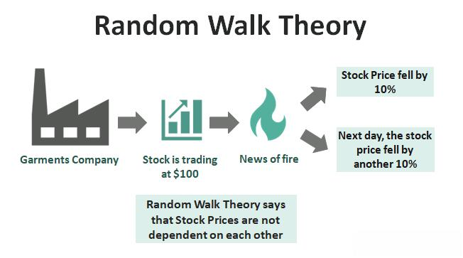

The world of finance is a complex ecosystem characterized by a multitude of theories and models developed to explain and predict market behaviors. Among these, the Random Walk Theory stands out due to its unconventional perspective on market dynamics. It challenges traditional views by asserting that the movement of stock prices is inherently random and, therefore, unpredictable. This randomness suggests that analyzing past price trends offers no reliable insight into future movements.

The significance of the Random Walk Theory extends beyond its theoretical assertions; it plays a crucial role in financial modeling and algorithmic trading. By proposing that markets are efficient and prices reflect all available information, it aligns with the Efficient Market Hypothesis. This intersection presents challenges for financial practitioners aiming to develop predictive models for market movements, as the conventional assumption of rational markets becomes questionable.



Algorithmic trading, which relies on mathematical and statistical models to make trading decisions, also faces implications from the Random Walk Theory. The theory suggests that consistent prediction of price movements is unattainable, prompting algorithmic strategies to adapt by embracing market randomness rather than exploiting predictable trends.

Despite its prominence, the Random Walk Theory has not escaped criticism from market technicians and analysts. Critics argue it disregards observable patterns that skilled traders exploit successfully. Alternative theories, such as Dow Theory, propose that market trends can indeed be identified and analyzed, offering counterpoints to the randomness argument.

However, the application of the Random Walk Theory in real-world trading scenarios provides valuable insights into its impact on investment strategies. Studies and experiments, including infamous tests comparing professional traders to random selections, illustrate the theory's practical implications.

Ultimately, the Random Walk Theory presents a compelling argument about the unpredictability of financial markets. It challenges the traditional approaches of both manual and algorithmic trading, advocating for a disciplined, long-term investment strategy. Recognizing the potential randomness of market movements encourages more resilient and adaptive trading practices. This article endeavors to explore the nuances of the Random Walk Theory, discussing its implications, criticisms, and applications within the financial world.

## Table of Contents

## Understanding Random Walk Theory

Random Walk Theory proposes that stock prices evolve in a manner akin to a random sequence, essentially implying that price changes are unpredictable and do not follow a discernible pattern. This theory is rooted in the idea that markets are efficient, meaning that at any given time, stock prices fully reflect all available information. Consequently, predicting future price movements based purely on historical data becomes impossible because each price change is independent of the previous changes.

One of the foundational assumptions of the Random Walk Theory is the independence of stock price changes. Mathematically, this can be represented as a stochastic process where $P_t$ denotes the price of a stock at time $t$. The random walk can be described by the equation:

$$
P_t = P_{t-1} + \epsilon_t
$$

where $\epsilon_t$ is a random error term, which is assumed to be identically and independently distributed with a mean of zero. This indicates that the best estimate of tomorrow's price is simply today's price, with an adjustment for random fluctuations that cannot be anticipated.

This theory aligns closely with the Efficient Market Hypothesis (EMH), proposed by Eugene Fama in the 1960s. EMH posits that it is impossible to consistently achieve returns that exceed average market returns on a risk-adjusted basis, since stock prices should only react to new information. As all known data is already incorporated into stock prices, only new and unforeseen information can change current prices, underscoring the random nature of stock movements.

For investors and traders, the implications of Random Walk Theory are profound. If stock prices truly follow a random walk, then technical analysis — which involves predicting future stock price movements based on historical price trends and patterns — would be rendered ineffective. Investors should instead focus on building a well-diversified portfolio to mitigate unsystematic risk and consider strategies that do not rely on timing the market.

The theory also suggests that passive investment strategies, such as index fund investing, may be more effective over the long term compared to active trading strategies that seek to exploit perceived market inefficiencies. Recognizing the randomness in market price movements encourages a long-term investment horizon and disciplined approach that prioritizes [fundamental analysis](/wiki/fundamental-analysis) over short-term speculation.

Overall, Random Walk Theory challenges the notion of predictable stock price movements, urging market participants to reconsider the reliance on past data for future predictions and to adapt strategies that acknowledge the inherent uncertainties of market dynamics.

## Financial Modeling and Random Walk Theory

Financial modeling typically operates under the assumption that markets exhibit rational behavior, and prices adjust based on the influx of pertinent information. This foundational belief allows analysts and investors to develop predictive models aiming to forecast future market trends and behaviors. However, the Random Walk Theory upends this traditional framework by positing that price movements are inherently unpredictable and follow a random pattern.

According to the Random Walk Theory, stock prices take a random path, making it impossible to predict future movements based on past data or trends. This perspective introduces significant challenges for financial modeling, particularly in the construction of predictive models. Traditional models often rely on the notion of statistical trends and historical patterns, assuming that past behavior can offer insights into future performance. The theory, therefore, questions the validity of models that attempt to forecast market movements based on historical data.

To adapt to the uncertainty highlighted by the Random Walk Theory, financial models must incorporate elements that account for randomness. One approach is the use of stochastic processes, such as the geometric Brownian motion (GBM), to model stock prices. The GBM model, used in the Black-Scholes option pricing model, assumes that stock prices follow a continuous path driven by a random component. The stochastic differential equation representing GBM is given by:

$$
dS_t = \mu S_t dt + \sigma S_t dW_t
$$

Here, $S_t$ represents the stock price at time $t$, $\mu$ is the drift coefficient, $\sigma$ is the [volatility](/wiki/volatility-trading-strategies), and $W_t$ is the Wiener process, which introduces the randomness [factor](/wiki/factor-investing). This equation aligns with the Random Walk Theory by incorporating both predictable trends (drift) and randomness (volatility).

Furthermore, Monte Carlo simulations can be utilized to address the unpredictability aspect. These simulations involve generating a large number of potential future price paths for stocks using random sampling techniques. By considering a wide range of outcomes, Monte Carlo methods help assess the impact of random movements on investment portfolios, offering insights into potential risks and returns.

Ultimately, by integrating stochastic processes and Monte Carlo simulations, financial models can better accommodate the randomness proposed by the Random Walk Theory. While these methods cannot predict specific price movements, they provide a framework for estimating probabilities and potential outcomes, allowing investors to make more informed decisions under conditions of uncertainty. This approach acknowledges the limitations of prediction while highlighting the importance of risk management in financial modeling.

## Algoritmic Trading and Random Walk Theory

Algorithmic trading is a sophisticated technique that employs mathematical models and computational algorithms to make trading decisions, frequently focusing on exploiting market trends and patterns. This approach hinges on the premise that historical data and observable market patterns can be leveraged to predict future price movements. However, the Random Walk Theory fundamentally challenges this assumption by positing that stock prices evolve according to a random path, rendering them inherently unpredictable.

According to the Random Walk Theory, any past market movement is not indicative of future trends, suggesting that price changes are analogous to a sequence of random numbers. This unpredictability implies that even the most intricate algorithmic systems may struggle to consistently outperform the market. In the context of [algorithmic trading](/wiki/algorithmic-trading), the random nature of price movements poses a significant challenge to the development of predictive trading models, which traditionally rely on historical data to forecast market trends.

To adapt to the constraints imposed by the Random Walk Theory, algorithmic trading strategies have evolved. Some approaches acknowledge market randomness and instead focus on exploiting market inefficiencies or employing statistical [arbitrage](/wiki/arbitrage) strategies. These methods typically involve identifying temporary price discrepancies among related assets and executing trades designed to profit from the eventual correction of these discrepancies. This approach is based on the statistical properties of price movements rather than deterministic forecasts.

For instance, [momentum](/wiki/momentum)-based strategies, which attempt to capitalize on short-term price trends, are often supplemented with risk management and diversification techniques to account for the inherent randomness in price movements. Similarly, [machine learning](/wiki/machine-learning) models that incorporate a degree of randomness in their forecasting can be employed to better adapt to unpredictable market conditions. These models can learn patterns from large datasets but also factor in the known stochastic nature of financial markets.

```python
# Example of a simple momentum-based strategy in Python using Random Walk principles

import numpy as np
import pandas as pd

# Simulate random walk for stock prices
np.random.seed(42)  # For reproducibility
n_days = 252  # Number of days in a trading year
mean_return = 0
daily_volatility = 0.01  # Assumed volatility

daily_returns = np.random.normal(mean_return, daily_volatility, n_days)
price_series = 100 * (1 + daily_returns).cumprod()

# Implement a simple momentum-based strategy
window_size = 20  # Look at the last 20 days
signals = pd.DataFrame(index=range(n_days))
signals['price'] = price_series
signals['momentum'] = signals['price'].pct_change(window_size).shift(-window_size)

# Generate trading signals based on momentum
signals['signal'] = 0
signals.loc[signals['momentum'] > 0, 'signal'] = 1  # Buy signal
signals.loc[signals['momentum'] < 0, 'signal'] = -1  # Sell signal

# View the first few entries
signals.head()
```

The adaptation of algorithmic trading strategies in light of the Random Walk Theory involves accepting the stochastic nature of financial markets and designing systems that are robust to uncertainty. While these strategies may not provide miraculous predictive insights, they aim to achieve consistent performance by leveraging a probabilistic understanding of market movements.

## Criticisms and Alternatives to Random Walk Theory

The Random Walk Theory, while influential in financial economics, has been subject to various criticisms. One of the primary criticisms is its dismissal of the potential for trends and patterns in market data, which experienced traders utilize to inform their trading strategies. Market technicians, often referred to as technical analysts, argue that historical price data and [volume](/wiki/volume-trading-strategy) can reveal repeatable patterns and trends, enabling traders to predict future price movements. These analysts use various charting tools and statistical indicators, such as moving averages, relative strength index (RSI), and Fibonacci retracements, to identify potential buying or selling opportunities.

Critics of the Random Walk Theory also point to the existence of market anomalies and macroeconomic patterns as evidence that markets are not entirely random. For example, phenomena such as the January effect, where stock prices tend to rise in January more than in other months, challenge the Random Walk Theory’s premise of randomness. Additionally, behavioral finance theories provide counterarguments by highlighting that cognitive biases and emotional responses of investors can cause predictable patterns in market behavior.

Alternatives to the Random Walk Theory suggest methodologies for identifying and capitalizing on these trends. The Dow Theory, a foundational approach to technical analysis, posits that markets move in predictable waves or trends. According to Dow Theory, long-term upward or downward trends can be identified and analyzed, allowing investors to align their strategies accordingly. This theory emphasizes the importance of analyzing market swings or primary trends and secondary reactions (short-term deviations) to make informed investment decisions.

Another prominent alternative is the Adaptive Market Hypothesis, which combines principles from the Efficient Market Hypothesis and elements of behavioral finance. This hypothesis asserts that markets are adaptive systems influenced by a multitude of factors, such as the number of competing participants and their strategies, making them subject to periods of inefficiency that traders can exploit.

While the Random Walk Theory emphasizes market efficiency and randomness, these criticisms and alternative theories underline the complexity and multifaceted nature of financial markets. They suggest that while markets are influenced by random events, trends, patterns, and human behaviors also play significant roles, providing opportunities for skilled traders and informed investors to potentially achieve superior returns.

## Random Walk Theory in Real-World Trading

Several studies and experiments have been conducted to evaluate the practical implications of the Random Walk Theory in real-world trading scenarios. A notable experiment that often surfaces in discussions about the theory's validity is the one involving the performance comparison between professional traders and random stock selections achieved through dart throws. This experiment vividly illustrates the core principle of the Random Walk Theory: the purported unpredictability of stock prices. Conducted to highlight the randomness in the markets, the study found that random selections sometimes performed on par with, or even exceeded, the returns generated by seasoned traders. This outcome challenges the conventional wisdom that professional expertise or market analysis can consistently lead to superior returns.

One can analyze the practical application of Random Walk Theory by modeling stock price movements as a stochastic process, specifically a random walk. A simple mathematical representation of this concept can be defined as:

$$
S_{t+1} = S_t + \epsilon_t
$$

where $S_t$ represents the stock price at time $t$ and $\epsilon_t$ is a random variable representing the change in price, often assumed to follow a normal distribution with a mean of zero.

Real-life trading strategies that embrace the principles of Random Walk Theory often focus on long-term investment rather than short-term speculative strategies. The reasoning is that if price movements are unpredictable in the short term, a diversified, long-term approach may mitigate risks associated with volatility. Empirical studies examining the performance of such strategies typically show that they offer a level of protection against market biases and speculative bubbles, aligning well with basic investment theories like the Efficient Market Hypothesis.

The Random Walk Theory has induced a variety of responses in trading circles. Some traders use it as a basis for algorithms designed to operate under the assumption of market unpredictability, placing trades based on [statistical arbitrage](/wiki/statistical-arbitrage) or utilizing machine learning techniques to identify fleeting opportunities among the noise. These approaches often involve extensive back-testing and rely heavily on technology to identify subtle patterns in what appears to be randomness.

Python, a common language in quantitative finance, can be used to simulate the application of Random Walk Theory. By using libraries like NumPy and pandas, traders can model stock prices and test the effects of different trading strategies under the assumption of randomness. For example:

```python
import numpy as np
import pandas as pd
import matplotlib.pyplot as plt

# Simulate random walk
np.random.seed(42)
n_steps = 1000
price_changes = np.random.normal(0, 1, n_steps)
stock_prices = np.cumsum(price_changes)

# Plot the random walk
plt.plot(stock_prices)
plt.title('Simulated Stock Price as a Random Walk')
plt.xlabel('Time Steps')
plt.ylabel('Stock Price')
plt.show()
```

This Python code snippet illustrates a simple simulation of a stock price as a random walk, showcasing the inherent variability and volatility in such models. Through this lens, the Random Walk Theory aids investors in comprehending the potential limitations of predictive models and reaffirms the viability of adaptive and diversified investment strategies.

## Conclusion

The Random Walk Theory presents a compelling argument about the inherent unpredictability of financial markets by positing that stock prices move randomly and independently of past behavior. This perspective challenges the efficacy of both traditional investment strategies, which often rely on historical price trends, and algorithmic trading models designed to predict future market movements using complex algorithms. By asserting that every price change is random and new information is rapidly reflected in stock prices, the theory implies that markets are efficient and leaves little room for consistently outperforming the market through predictive modeling or trend analysis.

However, this does not render investment strategies obsolete. Instead, it suggests a shift toward more disciplined, long-term investment approaches. Investors can potentially improve their outcomes by embracing diversification and focusing on maintaining a balanced portfolio rather than attempting to time the market or predict short-term price fluctuations.

Despite the criticisms the theory faces, primarily from those who argue that it neglects discernible patterns and trends, Random Walk Theory offers important insights about market dynamics. It highlights the vital role of randomness and uncertainty in trading, urging investors to develop strategies that are resilient to the volatility and erratic movements of market prices.

In conclusion, acknowledging the element of randomness in financial markets encourages market participants to adopt adaptive strategies that are more informed by maintaining a long-term perspective and managing risk effectively. This understanding fosters resilience and allows traders and investors to navigate the complexities of the financial world with a robust approach that counteracts the influence of emotional decision-making and speculative trading.

## References & Further Reading

[1]: Malkiel, B. G. (1973). ["A Random Walk Down Wall Street: The Time-Tested Strategy for Successful Investing."](https://www.amazon.com/Random-Walk-Down-Wall-Street/dp/0393330338) W.W. Norton & Company.

[2]: Fama, E. F. (1970). ["Efficient Capital Markets: A Review of Theory and Empirical Work."](https://www.jstor.org/stable/2325486) The Journal of Finance, 25(2), 383-417.

[3]: Lo, A. W. (2004). ["The Adaptive Markets Hypothesis: Market Efficiency from an Evolutionary Perspective."](https://papers.ssrn.com/sol3/papers.cfm?abstract_id=602222) Journal of Portfolio Management.

[4]: Shiller, R. J. (2003). ["From Efficient Markets Theory to Behavioral Finance."](https://www.aeaweb.org/articles?id=10.1257/089533003321164967) Journal of Economic Perspectives, 17(1), 83-104.

[5]: Mandelbrot, B. B., & Hudson, R. L. (2004). ["The (Mis)behavior of Markets: A Fractal View of Risk, Ruin, and Reward."](https://searchworks.stanford.edu/view/9081909) Basic Books.