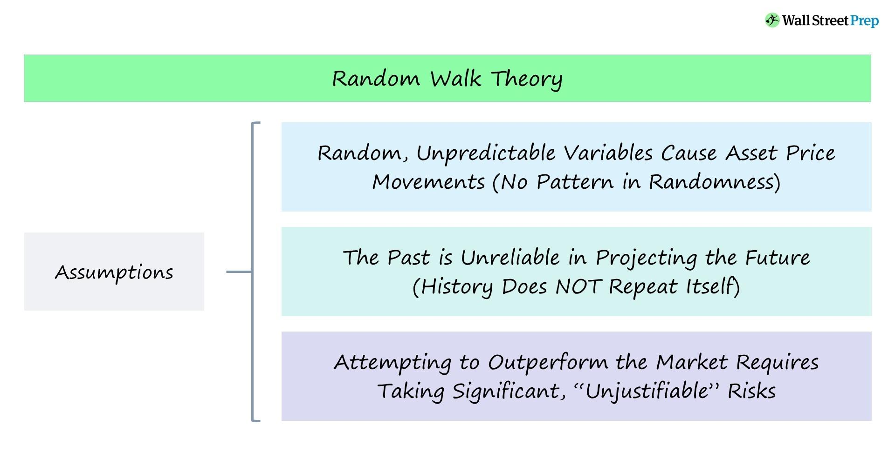

## Table of Contents

## What is the Random Walk Theory?

The Random Walk Theory is an idea in finance that says stock prices move in a random way. It means that you can't predict where the stock price will go next just by looking at past prices. This theory suggests that the stock market is very efficient, meaning all the information that could affect a stock's price is already included in its current price. So, trying to beat the market by picking certain stocks or timing the market is really hard, if not impossible.

This theory was first talked about by a man named Maurice Kendall in the 1950s. He looked at stock prices and saw that they didn't follow any clear pattern. Later, a book called "A Random Walk Down Wall Street" by Burton Malkiel made the theory more popular. The book explains that since stock prices move randomly, the best way to invest might be to just buy and hold a mix of different stocks, rather than trying to pick winners or time the market. This approach is often called passive investing.

## How does the Random Walk Theory apply to stock prices?

The Random Walk Theory says that stock prices move in a way that's hard to predict. It means that if you look at the past prices of a stock, you won't be able to guess what the price will do next. This is because the theory believes that all the information that could affect a stock's price is already included in its current price. So, if something new happens, like a company announcing good news, the stock price will change right away to reflect that news. But after that, the price will keep moving randomly.

Because of this, the Random Walk Theory suggests that trying to beat the stock market by [picking](/wiki/asset-class-picking) certain stocks or trying to buy and sell at the right times is very difficult. Instead, the theory supports the idea of passive investing. This means you should just buy a mix of different stocks and hold onto them for a long time. This way, you don't have to worry about trying to predict the market, which the theory says is nearly impossible. Many people follow this advice and invest in things like index funds, which are designed to match the performance of the whole market.

## What is the difference between a random walk and a biased random walk?

A random walk is when something moves in a way that's totally unpredictable. Imagine you're walking and at every step, you flip a coin. If it's heads, you go forward; if it's tails, you go backward. You can't guess where you'll end up because each step is random. In the stock market, this means the price of a stock goes up or down randomly, without any pattern you can use to predict the next move.

A biased random walk is different because it has a little bit of a pattern. It's like the coin flip walk, but now the coin is not fair. Maybe it lands on heads more often than tails, so you're more likely to move forward than backward. This means over time, you'll probably end up further ahead than if it was a completely random walk. In the stock market, a biased random walk might mean that even though the price moves randomly, there's a slight tendency for it to go up or down more often, making it a bit easier to guess where it might go next.

## Can you explain the concept of a random walk in the context of physics?

In physics, a random walk is like watching a tiny particle, like a pollen grain in water, move around in a zigzag way. This movement happens because the particle is being bumped around by lots of tiny water molecules all the time. Each bump sends the particle in a new direction, and because these bumps are random, the path the particle takes looks like it has no pattern. Scientists call this kind of movement "Brownian motion," named after Robert Brown, who first noticed it in the 1800s.

This idea of random walks is really useful in physics because it helps explain how things spread out over time. For example, if you drop a drop of ink into a glass of water, the ink molecules will start to spread out everywhere. They do this by taking random walks through the water, bumping into other molecules and changing direction. Over time, the ink spreads evenly throughout the water. Random walks help scientists understand not just how particles move, but also how heat spreads, how gases mix, and even how information travels in some materials.

## What are the mathematical foundations of the Random Walk Theory?

The Random Walk Theory is based on some simple math ideas. It starts with the idea that each step in a random walk is independent from the others. This means that knowing where you are now doesn't help you guess where you'll be next. In math terms, this is like saying each step is a random variable with its own probability. For example, in a simple random walk, you might have a 50% chance of moving up and a 50% chance of moving down. The key thing is that these probabilities don't change based on what happened before.

Another important part of the math behind random walks is the idea of summing up these random steps. If you keep adding up these random moves, you get what's called a "random walk process." Over time, this process can be described by something called a "normal distribution" or "bell curve." This means that if you look at where you end up after a lot of steps, you're most likely to be near the middle, with fewer people ending up far away in either direction. This idea helps explain why, in the stock market, prices might seem to move randomly but still follow certain patterns over the long run.

## How is the Random Walk Theory used in financial modeling?

The Random Walk Theory is used in financial modeling to help understand how stock prices move over time. In simple terms, it says that stock prices change in a way that's hard to predict because each price change is random and doesn't depend on what happened before. Financial models that use this theory often assume that the best way to guess where a stock price might go is to look at the whole market, not just the past prices of that one stock. This helps in creating models that focus on the big picture rather than trying to predict small changes.

These models are often used to test how well different investment strategies might work. For example, if you believe in the Random Walk Theory, you might think that trying to pick certain stocks to beat the market is a waste of time. Instead, you might use a model that suggests putting your money into a mix of many different stocks, like an index fund. This approach is called passive investing, and it's based on the idea that since stock prices move randomly, it's better to spread your risk and not try to outsmart the market.

## What are the limitations of the Random Walk Theory in predicting market movements?

The Random Walk Theory says that stock prices move randomly and you can't predict them just by looking at past prices. But this theory has some limits. One big problem is that it doesn't take into account all the things that can affect the market. For example, big events like economic news, changes in government rules, or even what people are feeling about the market can make stock prices move in ways that aren't random. These things can create patterns that you might be able to spot and use to make better guesses about where prices will go next.

Another limit of the Random Walk Theory is that it assumes everyone in the market has the same information and uses it in the same way. But in real life, some people might know more than others or they might use the information differently. For example, if a company insider knows about a big change coming up, they might buy or sell stocks based on that information before everyone else knows about it. This can make stock prices move in ways that don't seem random at all. So, while the Random Walk Theory is a useful way to think about the market, it doesn't capture everything that can happen in the real world.

## How do simulations of random walks help in understanding complex systems?

Simulations of random walks help us understand complex systems by showing us how things move and spread out over time. Imagine you're trying to understand how a disease spreads in a community. By simulating how people move around randomly, like taking random walks, you can see how the disease might spread from one person to another. This helps scientists and health workers plan better ways to stop the disease from spreading. It's like playing out different scenarios to see what might happen without actually having to wait for real life to show us.

These simulations are also useful in other areas, like understanding how ideas spread through social networks or how particles move in a gas. By watching how random walks play out in a computer model, we can see patterns and behaviors that are hard to notice in real life. This helps us make better predictions and understand the rules that govern these complex systems. Even though the movements are random, over time, they can show us important things about how the whole system works.

## What are some real-world applications of the Random Walk Theory outside of finance?

Random walks are used in many areas outside of finance, like in biology to study how animals move around. Scientists use random walk models to understand how animals search for food or find their way back home. For example, if you watch a bee flying around, it might look like it's moving randomly. By using random walk models, scientists can figure out how bees cover a lot of ground to find flowers and then return to their hive. This helps us learn more about animal behavior and how they interact with their environment.

Another place where random walks are useful is in physics, especially when studying how tiny particles move. This is called Brownian motion, named after Robert Brown who first noticed it. Imagine a speck of dust floating in water. It moves around in a zigzag pattern because it's being bumped by water molecules. Scientists use random walk models to understand this movement and how it affects things like how heat spreads or how gases mix. This helps in designing better materials and understanding natural processes at a very small scale.

## How does the Random Walk Theory relate to the Efficient Market Hypothesis?

The Random Walk Theory and the Efficient Market Hypothesis are closely related ideas in finance. The Random Walk Theory says that stock prices move in a random way and you can't predict where they will go next just by looking at past prices. This idea supports the Efficient Market Hypothesis, which says that all the information that could affect a stock's price is already included in its current price. If the market is efficient, then stock prices should move randomly because any new information will cause the price to change right away, making it hard to predict future movements based on past prices.

Because of this connection, the Efficient Market Hypothesis suggests that trying to beat the market by picking certain stocks or timing the market is very difficult. If stock prices move randomly and all information is already in the price, then no one can have an advantage in predicting where prices will go next. This leads many people to believe in passive investing, where you just buy a mix of different stocks and hold onto them for a long time. This approach is based on the idea that since you can't predict the market, it's better to spread your risk and not try to outsmart it.

## What advanced statistical methods are used to analyze random walks in research?

In research, scientists use advanced statistical methods to study random walks. One common method is called time series analysis. This helps researchers look at how things change over time, like stock prices or the movement of particles. They use this to see if there are any patterns or if the movements really are random. Another method is called Monte Carlo simulations. These are like playing out many different scenarios on a computer to see what might happen. By doing this over and over, researchers can understand how random walks behave in the long run and see if there are any trends or patterns that might not be obvious at first.

Another important tool is the use of stochastic processes, which are mathematical models that help describe systems that change randomly over time. Researchers use these models to predict how a random walk might evolve and to test different theories about how these systems work. For example, they might use a model called the Wiener process, which is a type of continuous random walk often used in finance and physics. By analyzing these models, scientists can learn more about the underlying rules that govern random walks and how they apply to real-world situations.

## How have recent developments in computational power affected the study and application of random walks?

Recent developments in computational power have made it much easier to study and use random walks. Before, scientists had to do a lot of math by hand or use slow computers to run simulations. Now, with powerful computers, they can run thousands or even millions of random walk simulations quickly. This means they can look at a lot more scenarios and see patterns that they might have missed before. It's like having a super fast calculator that helps them understand how things move and spread out in ways that were hard to see before.

These advances also help in using random walks in real life. For example, in finance, people can now use complex models to predict how stock prices might move. In biology, scientists can study how animals move around or how diseases spread through a population. And in physics, they can look at how tiny particles move in gases or liquids. All of these things help us make better decisions and understand the world around us. With more computing power, the study of random walks keeps getting more useful and interesting.

## What is the Understanding of Random Walk Theory?

Random Walk Theory proposes that stock prices evolve in a manner akin to a random sequence, essentially implying that price changes are unpredictable and do not follow a discernible pattern. This theory is rooted in the idea that markets are efficient, meaning that at any given time, stock prices fully reflect all available information. Consequently, predicting future price movements based purely on historical data becomes impossible because each price change is independent of the previous changes.

One of the foundational assumptions of the Random Walk Theory is the independence of stock price changes. Mathematically, this can be represented as a stochastic process where $P_t$ denotes the price of a stock at time $t$. The random walk can be described by the equation:

$$
P_t = P_{t-1} + \epsilon_t
$$

where $\epsilon_t$ is a random error term, which is assumed to be identically and independently distributed with a mean of zero. This indicates that the best estimate of tomorrow's price is simply today's price, with an adjustment for random fluctuations that cannot be anticipated.

This theory aligns closely with the Efficient Market Hypothesis (EMH), proposed by Eugene Fama in the 1960s. EMH posits that it is impossible to consistently achieve returns that exceed average market returns on a risk-adjusted basis, since stock prices should only react to new information. As all known data is already incorporated into stock prices, only new and unforeseen information can change current prices, underscoring the random nature of stock movements.

For investors and traders, the implications of Random Walk Theory are profound. If stock prices truly follow a random walk, then technical analysis — which involves predicting future stock price movements based on historical price trends and patterns — would be rendered ineffective. Investors should instead focus on building a well-diversified portfolio to mitigate unsystematic risk and consider strategies that do not rely on timing the market.

The theory also suggests that passive investment strategies, such as index fund investing, may be more effective over the long term compared to active trading strategies that seek to exploit perceived market inefficiencies. Recognizing the randomness in market price movements encourages a long-term investment horizon and disciplined approach that prioritizes [fundamental analysis](/wiki/fundamental-analysis) over short-term speculation.

Overall, Random Walk Theory challenges the notion of predictable stock price movements, urging market participants to reconsider the reliance on past data for future predictions and to adapt strategies that acknowledge the inherent uncertainties of market dynamics.

## What is the relationship between Financial Modeling and Random Walk Theory?

Financial modeling typically operates under the assumption that markets exhibit rational behavior, and prices adjust based on the influx of pertinent information. This foundational belief allows analysts and investors to develop predictive models aiming to forecast future market trends and behaviors. However, the Random Walk Theory upends this traditional framework by positing that price movements are inherently unpredictable and follow a random pattern.

According to the Random Walk Theory, stock prices take a random path, making it impossible to predict future movements based on past data or trends. This perspective introduces significant challenges for financial modeling, particularly in the construction of predictive models. Traditional models often rely on the notion of statistical trends and historical patterns, assuming that past behavior can offer insights into future performance. The theory, therefore, questions the validity of models that attempt to forecast market movements based on historical data.

To adapt to the uncertainty highlighted by the Random Walk Theory, financial models must incorporate elements that account for randomness. One approach is the use of stochastic processes, such as the geometric Brownian motion (GBM), to model stock prices. The GBM model, used in the Black-Scholes option pricing model, assumes that stock prices follow a continuous path driven by a random component. The stochastic differential equation representing GBM is given by:

$$
dS_t = \mu S_t dt + \sigma S_t dW_t
$$

Here, $S_t$ represents the stock price at time $t$, $\mu$ is the drift coefficient, $\sigma$ is the [volatility](/wiki/volatility-trading-strategies), and $W_t$ is the Wiener process, which introduces the randomness [factor](/wiki/factor-investing). This equation aligns with the Random Walk Theory by incorporating both predictable trends (drift) and randomness (volatility).

Furthermore, Monte Carlo simulations can be utilized to address the unpredictability aspect. These simulations involve generating a large number of potential future price paths for stocks using random sampling techniques. By considering a wide range of outcomes, Monte Carlo methods help assess the impact of random movements on investment portfolios, offering insights into potential risks and returns.

Ultimately, by integrating stochastic processes and Monte Carlo simulations, financial models can better accommodate the randomness proposed by the Random Walk Theory. While these methods cannot predict specific price movements, they provide a framework for estimating probabilities and potential outcomes, allowing investors to make more informed decisions under conditions of uncertainty. This approach acknowledges the limitations of prediction while highlighting the importance of risk management in financial modeling.

## What is the Role of Random Walk Theory in Real-World Trading?

Several studies and experiments have been conducted to evaluate the practical implications of the Random Walk Theory in real-world trading scenarios. A notable experiment that often surfaces in discussions about the theory's validity is the one involving the performance comparison between professional traders and random stock selections achieved through dart throws. This experiment vividly illustrates the core principle of the Random Walk Theory: the purported unpredictability of stock prices. Conducted to highlight the randomness in the markets, the study found that random selections sometimes performed on par with, or even exceeded, the returns generated by seasoned traders. This outcome challenges the conventional wisdom that professional expertise or market analysis can consistently lead to superior returns.

One can analyze the practical application of Random Walk Theory by modeling stock price movements as a stochastic process, specifically a random walk. A simple mathematical representation of this concept can be defined as:

$$
S_{t+1} = S_t + \epsilon_t
$$

where $S_t$ represents the stock price at time $t$ and $\epsilon_t$ is a random variable representing the change in price, often assumed to follow a normal distribution with a mean of zero.

Real-life trading strategies that embrace the principles of Random Walk Theory often focus on long-term investment rather than short-term speculative strategies. The reasoning is that if price movements are unpredictable in the short term, a diversified, long-term approach may mitigate risks associated with volatility. Empirical studies examining the performance of such strategies typically show that they offer a level of protection against market biases and speculative bubbles, aligning well with basic investment theories like the Efficient Market Hypothesis.

The Random Walk Theory has induced a variety of responses in trading circles. Some traders use it as a basis for algorithms designed to operate under the assumption of market unpredictability, placing trades based on [statistical [arbitrage](/wiki/arbitrage)](/wiki/statistical-arbitrage) or utilizing [machine learning](/wiki/machine-learning) techniques to identify fleeting opportunities among the noise. These approaches often involve extensive back-testing and rely heavily on technology to identify subtle patterns in what appears to be randomness.

Python, a common language in quantitative finance, can be used to simulate the application of Random Walk Theory. By using libraries like NumPy and pandas, traders can model stock prices and test the effects of different trading strategies under the assumption of randomness. For example:

```python
import numpy as np
import pandas as pd
import matplotlib.pyplot as plt

# Simulate random walk
np.random.seed(42)
n_steps = 1000
price_changes = np.random.normal(0, 1, n_steps)
stock_prices = np.cumsum(price_changes)

# Plot the random walk
plt.plot(stock_prices)
plt.title('Simulated Stock Price as a Random Walk')
plt.xlabel('Time Steps')
plt.ylabel('Stock Price')
plt.show()
```

This Python code snippet illustrates a simple simulation of a stock price as a random walk, showcasing the inherent variability and volatility in such models. Through this lens, the Random Walk Theory aids investors in comprehending the potential limitations of predictive models and reaffirms the viability of adaptive and diversified investment strategies.

## References & Further Reading

[1]: Malkiel, B. G. (1973). ["A Random Walk Down Wall Street: The Time-Tested Strategy for Successful Investing."](https://www.amazon.com/Random-Walk-Down-Wall-Street/dp/0393330338) W.W. Norton & Company.

[2]: Fama, E. F. (1970). ["Efficient Capital Markets: A Review of Theory and Empirical Work."](https://www.jstor.org/stable/2325486) The Journal of Finance, 25(2), 383-417.

[3]: Lo, A. W. (2004). ["The Adaptive Markets Hypothesis: Market Efficiency from an Evolutionary Perspective."](https://papers.ssrn.com/sol3/papers.cfm?abstract_id=602222) Journal of Portfolio Management.

[4]: Shiller, R. J. (2003). ["From Efficient Markets Theory to Behavioral Finance."](https://www.aeaweb.org/articles?id=10.1257/089533003321164967) Journal of Economic Perspectives, 17(1), 83-104.

[5]: Mandelbrot, B. B., & Hudson, R. L. (2004). ["The (Mis)behavior of Markets: A Fractal View of Risk, Ruin, and Reward."](https://searchworks.stanford.edu/view/9081909) Basic Books.