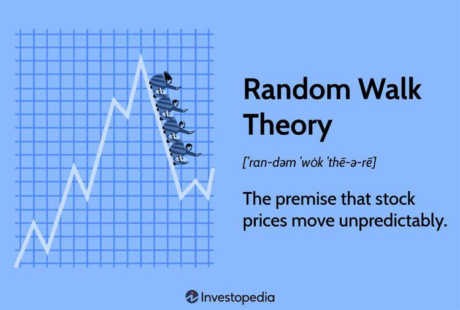

In financial markets, theories and algorithms are pivotal in shaping investment strategies and guiding decision-making. The Random Walk Theory stands out as a significant concept in finance. It suggests that stock market prices follow an unpredictable trajectory, making future movements essentially random and independent of past behavior. The theory’s implications for finance are profound, influencing how market efficiency and trading strategies are perceived and developed.

Algorithmic trading, a modern approach to executing trades using pre-defined rules and computer algorithms, intersects with these financial theories. The utilization of algorithms in trading endeavors to account for or benefit from perceived randomness in market movements. By integrating insights from Random Walk Theory, algorithmic trading strategies can be designed to navigate the unpredictable nature of stock prices, potentially improving market efficiency.



Understanding how these elements interact offers valuable perspectives for investors and market participants. By considering the intersection of financial theory and algorithmic techniques, stakeholders can gain insights into the ever-evolving landscape of market dynamics, enhancing strategic planning and investment outcomes.

## Table of Contents

## Understanding Random Walk Theory

Random Walk Theory posits that stock prices evolve randomly and are essentially unpredictable based on historical data. This theory traces its origins to the early 20th century, with French mathematician Louis Bachelier, who introduced the concept in his 1900 dissertation, "Théorie de la spéculation". However, the theory gained widespread recognition through economist Burton Malkiel's seminal book "A Random Walk Down Wall Street," published in 1973. 

According to Random Walk Theory, changes in stock prices are independent of each other, suggesting that any future price movement bears no correlation to past movements. This concept is analogous to the random outcome of a coin toss, where each flip's result does not affect subsequent flips. Thus, the theory challenges traditional analysis forms, such as fundamental and technical analysis, which often rely on historical price data and patterns to forecast future market behavior. 

By demonstrating the unreliability of past price performance as an indicator of future outcomes, Random Walk Theory aligns closely with the Efficient Market Hypothesis (EMH). This hypothesis asserts that financial markets are "informationally efficient," meaning they incorporate and reflect all available information at any given time, leaving no room for consistent market outperformance through prediction or speculation. The theory thus supports the notion that, rather than attempting to outperform the market through speculative strategies, investors might be better served by pursuing strategies that embrace the market's inherent uncertainties.

## Implications of Random Walk Theory for Traders

Traders who adhere to Random Walk Theory maintain that attempting to consistently predict market movements or beat the market through speculative means is fundamentally futile. This perspective is grounded in the principle that stock price movements are inherently unpredictable and that past performance does not dictate future outcomes. As such, traders are encouraged to adopt a buy-and-hold strategy, a method advocating for investment retention over extended periods to optimize the potential for capital appreciation and mitigate the impact of short-term market [volatility](/wiki/volatility-trading-strategies).

This long-term investment perspective is typically supported by a preference for diversified portfolios. From this standpoint, investors often opt for Exchange-Traded Funds (ETFs) and index funds that aim to replicate the performance of a market index, rather than attempting to outperform it through selective stock [picking](/wiki/asset-class-picking). This approach aligns with the belief embedded in Random Walk Theory that achieving consistent market outperformance is not only challenging but also involves considerable risk. By dispersing investments across various asset classes, traders can reduce unsystematic risk, which pertains to individual stocks or sectors, thereby stabilizing returns over time.

Moreover, Random Walk Theory underscores the importance of maintaining disciplined, strategic approaches to investment in the context of market fluctuations. By recognizing the limitations of predictive capabilities, traders foster resilience against emotional and reactive decision-making, which can often lead to suboptimal outcomes. Emphasizing a structured approach to asset allocation and risk management, this theory continues to influence the strategic mindset of investors navigating the complexities of financial markets.

## Algorithmic Trading and Market Efficiency

Algorithmic trading refers to the use of computer algorithms to execute trades at overclocked speeds and high frequencies, outperforming human capabilities. This method relies heavily on advanced mathematical models and statistical techniques to deploy trading strategies, leveraging vast amounts of market data in real-time. The integration of elements from Random Walk Theory within [algorithmic trading](/wiki/algorithmic-trading) mainly focuses on optimizing market efficiency and harnessing data-driven decisions to enhance trading performance.

Random Walk Theory asserts that stock prices follow an unpredictable path, implying a level of market efficiency where prices fully reflect all available information. This aligns with certain algorithmic trading strategies that capitalize on the market's efficient processing of information. By acknowledging the inherent randomness suggested by the theory, algorithmic traders aim to identify and exploit minute price discrepancies and transient trends that may be overlooked by traditional analysis methods. For example, while the random walk suggests unpredictability, algorithmic models can identify short-lived inefficiencies that occur due to temporary [liquidity](/wiki/liquidity-risk-premium) constraints or market microstructure noise.

The automation inherent in algorithmic trading presents significant benefits, chiefly by minimizing human biases and errors. Algorithms can operate based on objective criteria derived from quantitative analysis, reducing emotional and cognitive biases that often impair human decision-making. This requires sophisticated models incorporating statistical and [machine learning](/wiki/machine-learning) techniques to parse market data, detect patterns, and execute trades effectively. Python, with its extensive libraries such as pandas for data manipulation, numpy for numerical computations, and scikit-learn for machine learning, serves as a preferred language for developing such models. Here is a simple example of identifying price anomalies using Python:

```python
import numpy as np
import pandas as pd
from sklearn.ensemble import IsolationForest

# Assuming 'data' is a DataFrame with historical price data
# Feature engineering: calculate returns
data['returns'] = data['price'].pct_change()

# Fit Isolation Forest model to identify anomalies
model = IsolationForest(contamination=0.01)
data['outlier'] = model.fit_predict(data[['returns']])

# Outliers flagged as -1; normal data as 1
outlier_data = data[data['outlier'] == -1]
```

This script demonstrates detecting price anomalies in a dataset, which can emerge as potential signals for trading actions, albeit within the boundaries set by randomness.

Despite the challenges posed by the random nature of markets, algorithmic trading fosters the innovation of unique strategies that embrace unpredictability. Algorithms can be crafted to adapt dynamically to changing market conditions, continuously learning and evolving from incoming data. This reflects a synthesis of Random Walk Theory principles with algorithmic advancements, where embracing uncertainty can potentially lead to novel insights and improved trading outcomes. Hence, the convergence of these fields helps drive the evolution of more robust, adaptive trading frameworks capable of navigating complex financial markets.

## Criticisms of Random Walk Theory

Critics of Random Walk Theory argue that it oversimplifies the complexities inherent in financial markets and overlooks consistent patterns that skilled investors might exploit to their advantage. One of the prominent examples used to challenge the theory is the consistent outperformance by investors such as Warren Buffett. Buffett's success, among others, suggests the possibility of identifying underpriced stocks and achieving sustained profits, which contradicts the theory's premise that markets are efficient and prices are solely random.

Technical analysis presents another significant challenge to Random Walk Theory. Technical analysts assert that historical price data reveal trends and patterns which can predict future movements. This perspective implies that market psychology and investor behavior contribute to these patterns, thereby disputing the notion that price changes are purely random.

Moreover, critics highlight that information asymmetry and insider trading can lead to price distortions that are not accounted for by Random Walk Theory. Information asymmetry occurs when some investors have access to material information not available to the general public, allowing them to make informed trading decisions and influence market prices. Such imbalances suggest that markets may not always be as efficient as the theory claims, with certain participants able to capitalize on privileged information.

Despite these criticisms, Random Walk Theory retains a pivotal role in financial discussions, serving as a fundamental framework for understanding market behavior. It continues to encourage debate over market efficiency and the predictability of stock prices, which remains crucial for advancing financial theories and strategies.

## Integrating Random Walk in Trading Strategies

Financial experts are increasingly exploring innovative methodologies to incorporate Random Walk Theory into actionable trading strategies. This exploration hinges on several key approaches that utilize the theory’s intrinsic acceptance of market unpredictability.

One significant application is the use of [backtesting](/wiki/backtesting) algorithms within a random framework. By simulating historical market conditions under the assumption of randomness, these algorithms can evaluate the robustness of a trading strategy against uncertain market movements. This involves computing the statistical properties of past price movements and assessing potential risks. One example of a backtesting model could be implementing a Monte Carlo simulation. Here is a Python snippet demonstrating a basic structure of such a simulation:

```python
import numpy as np

def monte_carlo_simulation(start_price, days, mu, sigma, simulations):
    results = []
    for _ in range(simulations):
        prices = [start_price]
        for _ in range(days):
            daily_return = np.random.normal(mu / days, sigma / np.sqrt(days))
            prices.append(prices[-1] * (1 + daily_return))
        results.append(prices)
    return results
```

This code simulates potential stock price paths over a designated period, considering average return (`mu`) and volatility (`sigma`), thus offering insights into potential future behaviors under random conditions.

Moreover, Random Walk Theory advocates for diversification within trading portfolios, which helps mitigate risks associated with over-reliance on specific asset forecasts. By spreading investments across a wide range of assets or indexes, traders can cushion portfolios against market volatility, aligning with the theory’s premise that price movements are fundamentally unpredictable.

Another critical development involves leveraging data analytics and machine learning techniques. Traders are increasingly employing machine learning algorithms that account for randomness to enhance predictive models. These advanced analytics enable traders to process large datasets and detect subtle patterns that might otherwise be obscured by noise. Algorithms like Random Forests or Neural Networks could be adapted to integrate randomness into their operations, continuously refining predictions based on evolving market conditions.

The successful integration of Random Walk Theory into trading strategies demands a delicate balance between the randomness inherent in the theory and empirical evidence derived from market analysis. This process calls for adaptive trading methods that respond to real-time data and shifting market dynamics. By integrating empirical research with theoretical frameworks, traders can construct more resilient strategies capable of navigating the complexities of financial markets. 

Overall, these strategies underline the potential of Random Walk Theory as a foundation for developing sophisticated trading models that respect the inherent uncertainties of financial markets while seeking profit opportunities within those boundaries.

## Conclusion

Random Walk Theory remains a significant yet controversial concept in financial market theories and trading strategies. It challenges traders and analysts to rethink traditional methodologies that rely heavily on predictive analytics. The theory posits that stock prices move in an unpredictable and random manner, suggesting that consistently outperforming the market is inherently difficult. This randomness is not just a theoretical construct but serves as a practical tool urging participants to embrace market uncertainties rather than seeking to fully eliminate them.

Algorithmic trading offers a fascinating perspective on applying Random Walk Theory by utilizing technology to harness and navigate inherent market randomness. Through sophisticated algorithms and high-speed computations, traders can identify and capitalize on transient market inefficiencies that are often imperceptible to human observers. Despite the random nature of market movements, algorithmic trading systems are designed to detect subtle patterns and anomalies, thereby providing an edge in executing trades.

While criticisms of Random Walk Theory persist, such as its perceived oversimplification of market behavior and dismissal of potential patterns, understanding and integrating its core tenets can enhance investment strategies. By acknowledging market inefficiencies and randomness, investors can adopt more robust, diversified, and flexible approaches. This integration encourages the development of strategies that are adaptive and resilient, even in the face of unpredictable market conditions.

As financial markets evolve with increasing complexity and technological advancement, the interplay between randomness as posited by Random Walk Theory and strategic innovation in trading approaches remains vital. This ongoing dialogue not only reshapes investment paradigms but also fosters a deeper insight into the dynamics of market behavior, paving the way for financial success and innovation.

## References & Further Reading

[1]: Bachelier, L. (1900). ["Théorie de la spéculation."](https://archive.org/details/bachelier-theorie-de-la-speculation) Annales Scientifiques de l'École Normale Supérieure.

[2]: Malkiel, B. G. (1973). ["A Random Walk Down Wall Street"](https://en.wikipedia.org/wiki/A_Random_Walk_Down_Wall_Street). W. W. Norton & Company.

[3]: Fama, E. F. (1970). ["Efficient Capital Markets: A Review of Theory and Empirical Work."](https://www.jstor.org/stable/2325486?read-now=1&googleloggedin=true) Journal of Finance, 25(2), 383-417.

[4]: Chan, E. P. (2013). ["Algorithmic Trading: Winning Strategies and Their Rationale"](https://github.com/ftvision/quant_trading_echan_book). Wiley. 

[5]: Lopez de Prado, M. (2018). ["Advances in Financial Machine Learning"](https://books.google.com/books/about/Advances_in_Financial_Machine_Learning.html?id=oU9KDwAAQBAJ). Wiley.