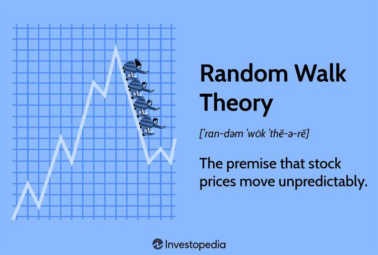

## Table of Contents

## What is a random walk?

A random walk is like a path that someone or something takes when they move around without any plan. Imagine you are walking in a park and at every step, you flip a coin. If it's heads, you take a step forward. If it's tails, you take a step backward. You keep doing this without knowing where you'll end up. This is a simple example of a random walk.

Random walks are used in many areas, like math, science, and even finance. In finance, people use random walks to study how stock prices move. They think that stock prices can go up or down randomly, just like our steps in the park. This helps them understand and predict how markets might behave over time.

## How does a random walk differ from other types of walks?

A random walk is different from other types of walks because it has no set path or goal. In a random walk, each step is decided by chance, like flipping a coin to decide whether to go left or right. This means you can't predict where you'll end up because each move is random. Other walks, like a planned hike, have a clear start and end point, and you follow a set route to get there.

In contrast, a directed walk has a specific destination in mind, and each step is taken to get closer to that goal. For example, if you're walking to a friend's house, you choose each step to move towards that house. A random walk doesn't care about getting anywhere; it's all about the randomness of each step. This difference makes random walks useful for studying things like stock prices or the movement of particles, where the path taken is unpredictable.

## What are the basic rules governing a random walk?

A random walk follows simple rules. You start at a point, and then you take steps in different directions. Each step you take is decided by chance, like flipping a coin. If it's heads, you might go one way, and if it's tails, you might go another way. You keep doing this for as many steps as you want. The important thing is that each step is random and doesn't depend on where you've been before.

These rules make random walks different from other walks. In a random walk, you don't plan where you're going. You just keep moving based on chance. This means you can't predict where you'll end up. It's like wandering around without a map or a goal. Because of this, random walks are used to study things that move unpredictably, like stock prices or the way particles move.

## Can you explain the concept of a random walk with an example?

Imagine you are walking in a big field. You start at a specific spot, and every time you take a step, you flip a coin. If the coin lands on heads, you take a step forward. If it lands on tails, you take a step backward. You keep doing this, flipping the coin and moving according to its result, without knowing where you'll end up. This is a simple example of a random walk. Each step you take is random and not planned, so you can't predict where you'll be after a certain number of steps.

Random walks are used to understand things that move unpredictably. For example, think about how stock prices change every day. They can go up or down, and it's hard to know exactly what will happen next. People use random walks to model this kind of movement. They imagine that each change in the stock price is like a step in a random walk, where each step is decided by chance. This helps them study and predict how stock prices might behave over time, even though they can't know for sure where the prices will end up.

## What are some common applications of random walks in real life?

Random walks are used in many areas of life. One big area is finance. People use random walks to understand how stock prices move. They think that stock prices can go up or down randomly, just like taking steps in a random walk. This helps them predict how the stock market might behave over time, even though they can't know for sure where prices will end up.

Another area where random walks are used is in science, like studying how particles move. Imagine tiny particles moving around in a liquid. They bump into each other and move in random directions, kind of like taking random steps. Scientists use random walks to understand and predict how these particles will spread out over time.

Random walks also help in understanding how information spreads through social networks. When people share news or posts, it can move from one person to another in a random way. This is similar to a random walk, where each step represents someone sharing something with a friend. By studying this, we can learn more about how information travels and how quickly it can spread through a community.

## How is a random walk used in financial markets?

In financial markets, a random walk is used to understand how stock prices move. Imagine you are watching a stock's price every day. Sometimes it goes up, and sometimes it goes down. People who study the stock market think that these changes can be like steps in a random walk. Each day's price change is random, just like flipping a coin to decide whether to take a step forward or backward. By using a random walk model, they can try to predict how stock prices might behave over time, even though they can't know exactly where the prices will end up.

This idea helps investors and traders make decisions. If they believe that stock prices follow a random walk, they might think that past price movements don't help predict future movements. Instead, they focus on other things, like the overall health of the economy or news about a company. Using random walks, they can test different strategies and see how well they might work in a market where prices move randomly. This way, they can better understand the risks and rewards of investing in the stock market.

## What is the difference between a simple random walk and a biased random walk?

A simple random walk is like walking in a field where you flip a coin to decide each step. If it's heads, you go one way, like forward. If it's tails, you go another way, like backward. Each step is equally likely to go in any direction, and there's no plan or pattern to where you'll end up. It's all about chance, and every step is fair and random.

A biased random walk is different because it's not fair. Imagine flipping a coin that's not balanced, so it lands on heads more often than tails. In a biased random walk, you're more likely to go in one direction than another. For example, you might be more likely to take a step forward than backward. This means that over time, you'll probably end up in a certain part of the field more often. Biased random walks are used to model things where there's a preference or a push in one direction, like how a river might flow more in one direction due to the slope of the land.

## How do random walks relate to the concept of diffusion?

Random walks are closely related to the concept of diffusion. Diffusion is when particles, like molecules of a gas, spread out from where they are more concentrated to where they are less concentrated. Imagine dropping a drop of ink into a glass of water. The ink particles start to move around and spread out until the water is evenly colored. This spreading out is diffusion, and it happens because the ink particles are moving randomly, kind of like taking steps in a random walk. Each particle moves in a random direction, bumping into other particles and changing direction, just like steps in a random walk.

Scientists use random walks to study and understand how diffusion works. By modeling the movement of particles as a random walk, they can predict how quickly the particles will spread out and how far they will go. This helps them understand things like how quickly a smell spreads through a room or how fast medicine moves through the body. The random walk model shows that even though each particle's path is unpredictable, the overall spread of the particles follows a pattern that can be studied and understood.

## What mathematical models are used to describe random walks?

Mathematicians use different models to describe random walks. One common model is the simple random walk on a line. Imagine you start at zero on a number line. You flip a coin, and if it's heads, you move one step to the right (to +1). If it's tails, you move one step to the left (to -1). You keep doing this for as many steps as you want. This model helps us understand how things move randomly in one direction.

Another model is the random walk on a lattice. Picture a grid, like graph paper, where you can move up, down, left, or right. Each move is decided by chance, like rolling a die to decide which direction to go. This model is useful for studying how things spread out in two or more dimensions, like how particles move in a liquid or how information spreads through a network. Both models help us predict and understand the behavior of things that move randomly, even though we can't know exactly where they will end up.

## How can random walks be simulated using computer algorithms?

To simulate a random walk using a computer, you can write a program that makes choices based on chance, just like flipping a coin. Start by setting up a starting point, like zero on a number line. Then, use a random number generator to decide each step. If the random number is less than 0.5, you can move one step to the left (or backward). If it's 0.5 or more, you move one step to the right (or forward). Keep doing this for as many steps as you want, and the computer will track where you end up after each step.

You can also use a computer to simulate a random walk on a grid. Imagine a simple grid where you can move up, down, left, or right. Use a random number generator to pick a direction for each step. For example, you could divide the random number into four parts: 0 to 0.25 for moving left, 0.25 to 0.5 for moving right, 0.5 to 0.75 for moving up, and 0.75 to 1 for moving down. Each time you generate a random number, you move in the direction it tells you to. This way, the computer can simulate how something might move randomly in two dimensions.

## What are the statistical properties of random walks, such as mean and variance?

When you look at the statistical properties of a random walk, like the mean and variance, you're trying to understand how the path behaves over time. The mean of a random walk tells you where you would expect to be on average after taking a certain number of steps. For a simple random walk where each step is equally likely to go forward or backward, the mean stays at zero. This means that over many walks, you'd expect to end up back where you started, on average. But, if the walk is biased, meaning you're more likely to go one way than the other, the mean will shift in that direction.

The variance of a random walk tells you how spread out the possible ending points are. It measures how much the ending points can differ from the mean. For a simple random walk, the variance grows with the number of steps you take. If you take more steps, the possible ending points spread out more. This means that even though the mean might be zero, you could end up far away from where you started. The variance helps you understand the uncertainty in where you'll end up after a random walk.

## How do random walks in higher dimensions differ from those in one dimension?

Random walks in higher dimensions are different from those in one dimension because they allow for more possible directions to move. In one dimension, like walking on a number line, you can only go left or right, forward or backward. But in two dimensions, like on a grid, you can go up, down, left, or right. This means that in higher dimensions, the path of the random walk can spread out in more ways. Imagine playing on a big chessboard where you can move in any direction at each step. This makes the random walk more complex and unpredictable than just moving back and forth on a line.

The statistical properties of random walks also change in higher dimensions. In one dimension, the mean stays at zero for a simple random walk, and the variance grows with the number of steps. But in higher dimensions, the mean can still be zero if the walk is unbiased, but the variance grows even faster. This means that the possible ending points of the walk spread out more quickly in higher dimensions. For example, if you're walking randomly on a flat surface, you can end up much farther away from your starting point than if you were just walking back and forth on a line. This makes higher-dimensional random walks useful for studying things like how particles spread out in space or how information moves through a network.

## What is the Understanding of Random Walk Theory?

Random walk theory is a fundamental concept in finance and mathematics, originally introduced by French mathematician Louis Bachelier in his 1900 dissertation, "Théorie de la Spéculation". The theory postulates that asset prices in financial markets move according to a stochastic process, implying that price changes are random and cannot be predicted. A 'random walk' describes a path where each step is independent of the previous one, suggesting that historical price movements or trends do not inform future price changes.

Mathematically, a random walk can be represented as:

$$
P_t = P_{t-1} + \epsilon_t
$$

where $P_t$ is the price at time $t$, and $\epsilon_t$ is a random error term with a mean of zero, representing the unpredictability or noise in the market.

Under this framework, the theory asserts that stock prices follow a path that makes it impossible to consistently outperform the market using prediction models based on past price data alone. This randomness leads to the conclusion that price changes have no memory, aligning with the 'martingale' property, where the expected future value of a price, conditional on the present information, equals its current price.

The Efficient Market Hypothesis (EMH), developed by Eugene Fama in the 1970s, extends the concept of random walks by asserting that all available information is already reflected in asset prices, and no amount of analysis can provide investors with an advantage over the market. EMH comes in three forms: weak, semi-strong, and strong, each suggesting different levels of information efficiency. The weak form of EMH relates closely to the random walk theory by proposing that past prices and [volume](/wiki/volume-trading-strategy) are fully reflected in stock prices, thereby supporting the notion of unpredictability.

While random walk theory and EMH share the idea of market unpredictability, they differ in their scope. Random walk theory focuses more on the stochastic nature of price changes, implying inherent randomness, whereas EMH includes the informational efficiency of markets, which suggests that prices reflect all known information.

Despite its foundational role, random walk theory has been challenged by empirical evidence showing market anomalies and patterns that could allow predictability, such as [momentum](/wiki/momentum) and mean reversion. These critiques suggest that while the theory offers a robust starting point, real-world markets may not strictly adhere to a random walk, with investors and models sometimes identifying exploitable inefficiencies.

## What are Random Walk Models and how are they used in Time Series Analysis?

Time series models are fundamental in algorithmic trading, providing a framework to analyze and predict price movements over time. A particular focus on random walk models is essential, as they suggest that price movements are stochastic and follow past movements unpredictably. The random walk model assumes that the future price of a security is independent of its past, with changes in price following a normal distribution.

**Residual Series and Correlograms**

Residual series and correlograms are vital tools in identifying randomness in price movements. The residual series in a time series model represents the differences between observed and predicted values. When modeling asset prices, if the residuals exhibit no discernible pattern and resemble white noise, it suggests that the model captures the data's dynamics well, supporting the random walk hypothesis.

Correlograms, or autocorrelation plots, graphically represent the correlation of a time series with its own lagged values. If the random walk theory holds true, the autocorrelations of price changes should rapidly diminish, indicating no predictable relationship between past and future prices. In a correlogram, this manifests as spikes in autocorrelation close to zero for all lags beyond the immediate past. Mathematically, this is represented as:

$$
\text{ACF}(k) = \frac{\sum_{t=1}^{n-k}(X_t - \bar{X})(X_{t+k} - \bar{X})}{\sum_{t=1}^{n}(X_t - \bar{X})^2}
$$

where $\text{ACF}(k)$ is the autocorrelation function at lag $k$, $X_t$ is the price at time $t$, and $\bar{X}$ is the mean price.

**Practical Application**

In practical terms, time series analysis tools help traders distinguish random walk behaviors from exploitable trends. One common method is to apply the Augmented Dickey-Fuller (ADF) test, which tests for a unit root in a series. A series with a unit root is consistent with a random walk. If the ADF test does not reject the null hypothesis of a unit root, it suggests that the series is non-stationary, aligning with the random walk theory.

Another application involves Monte Carlo simulations to model price paths under the assumption of randomness. By simulating numerous potential future paths of a price series based on its historical [volatility](/wiki/volatility-trading-strategies) and drift, traders can assess potential risks and outcomes under random walk assumptions.

Python provides tools for conducting these analyses, such as the `statsmodels` library for ADF tests and `pandas` for handling time series data. Below is a simple example of how one might conduct an ADF test using Python:

```python
import pandas as pd
from statsmodels.tsa.stattools import adfuller

# Example price series
prices = pd.Series([100, 101, 99, 98, 97, 99, 101, 100, 102, 101])

# Conduct Augmented Dickey-Fuller test
result = adfuller(prices)
print('ADF Statistic:', result[0])
print('p-value:', result[1])
```

The use of these analytical tools assists in understanding market conditions, aiding traders in recognizing whether a security's price is following a random walk or if potential patterns exist that may be exploited for profit. Consequently, time series analysis remains an invaluable asset in developing and testing algorithmic trading strategies.

## What are the practical implications for traders?

Traders and quantitative analysts often face the challenge of developing strategies that can navigate the random nature of financial markets, a concept central to the random walk theory. This theory posits that future price movements are unpredictable and follow a stochastic process. However, traders can still apply its principles to create robust trading strategies.

To integrate random walk concepts, one approach is to employ strategies that do not rely on prediction but on the statistical properties of asset returns. For instance, traders can use momentum strategies that capitalize on short-term trends without assuming long-term predictability affected by any random walk behavior.

Diversification techniques also play a crucial role when dealing with random walk theory. By allocating investments across a broad range of asset classes, sectors, or geographic regions, traders can reduce unsystematic risk that is random and not tied to any specific security. This approach follows the principle of not putting all eggs in one basket, which acknowledges the unpredictability of returns as suggested by random walk.

A practical diversification technique involves Modern Portfolio Theory (MPT), which utilizes the concept of optimizing the trade-off between risk and return. The formula for calculating the expected return $E(R_p)$ of a portfolio is:

$$

E(R_p) = \sum_{i=1}^{n} w_i \cdot E(R_i) 
$$

where $w_i$ is the weight of asset $i$ in the portfolio, and $E(R_i)$ is the expected return of asset $i$.

To overcome the limitations of random walk theory, it is essential for traders to continuously validate their models with real market data and adapt to changing market conditions. Regular backtesting of strategies over historical data helps in assessing their robustness. Additionally, incorporating machine learning algorithms that can detect patterns not immediately apparent could help identify and exploit imperfections in the market's randomness.

For those implementing algorithmic trading strategies, using a data-driven approach that involves machine learning requires setting up proper validation techniques like cross-validation. Python, a popular programming language among quants, can be used to implement such models. Here's an example of a simple backtest validation using Python and NumPy:

```python
import numpy as np

def backtest(sigma, mu, S0, steps):
    dt = 1/steps
    prices = [S0]
    for _ in range(steps):
        drift = (mu - 0.5 * sigma**2) * dt
        shock = sigma * np.sqrt(dt) * np.random.normal()
        S0 = S0 * np.exp(drift + shock)
        prices.append(S0)
    return prices

# Parameters: annual volatility, annual return, initial price, number of steps
simulated_prices = backtest(sigma=0.2, mu=0.1, S0=50, steps=1000)
```

This backtest function simulates a Geometric Brownian Motion, a standard model in quantitative finance for stock prices assuming a random walk.

Ultimately, while random walk theory presents challenges, it also encourages traders to develop sophisticated and adaptable strategies, focusing on risk management and leveraging statistical tools to navigate market unpredictability.

## References & Further Reading

[1]: Bachelier, L. (1900). "Théorie de la spéculation." Annales scientifiques de l'École Normale Supérieure. [Available in English in "The Random Character of Stock Market Prices" edited by Paul Cootner, MIT Press, 1964.]

[2]: Fama, E. F. (1970). ["Efficient Capital Markets: A Review of Theory and Empirical Work."](https://www.jstor.org/stable/2325486) The Journal of Finance, 25(2), 383-417.

[3]: Lo, A. W., & MacKinlay, A. C. (1999). ["A Non-Random Walk Down Wall Street."](https://www.jstor.org/stable/j.ctt7tccx) Princeton University Press.

[4]: Malkiel, B. G. (2015). ["A Random Walk Down Wall Street: The Time-Tested Strategy for Successful Investing."](https://www.academia.edu/10850809/A_Random_Walk_Down_Wall_Street_The_Time_Tested_Strategy_for_Successful_Investing) W.W. Norton & Company.

[5]: Challet, D., & Zhang, Y.-C. (1998). ["Emergence of Cooperation and Organization in an Evolutionary Game."](https://www.sciencedirect.com/science/article/pii/S0378437197004196) Nature, 392, 440-443.

[6]: Mandelbrot, B. (1997). ["Fractals and Scaling in Finance."](https://link.springer.com/book/10.1007/978-1-4757-2763-0) Springer.

[7]: Box, G. E. P., & Jenkins, G. M. (1970). ["Time Series Analysis: Forecasting and Control."](https://link.springer.com/chapter/10.1057/9781137291264_6) Holden-Day.

[8]: Tsay, R. S. (2005). ["Analysis of Financial Time Series."](https://onlinelibrary.wiley.com/doi/book/10.1002/9780470644560) Wiley-Interscience.

[9]: J.P. Morgan & Reuters (1996). ["RiskMetrics—Technical Document."](https://www.msci.com/documents/10199/5915b101-4206-4ba0-aee2-3449d5c7e95a)

[10]: Cont, R. (2001). ["Empirical Properties of Asset Returns: Stylized Facts and Statistical Issues."](https://www.tandfonline.com/doi/abs/10.1080/713665670) Quantitative Finance, 1(2), 223-236.