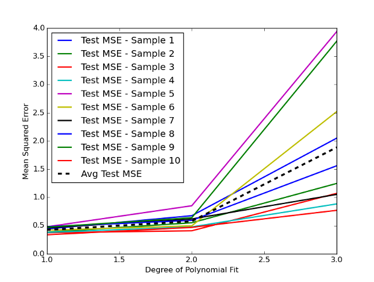

## Table of Contents

## What is randomized search cross-validation?

Randomized search cross-validation is a way to find the best settings for a machine learning model. Instead of trying every possible combination of settings, which can take a long time, it randomly picks different combinations to test. This makes it faster and still helps find good settings for the model. It works by choosing random values for the settings from a list of possible values that you give it.

Once it has these random combinations, it uses a method called cross-validation to see how well the model works with each combination. Cross-validation means splitting the data into smaller parts, using some parts to train the model and other parts to test it. By doing this many times with different parts of the data, you get a good idea of how well the model will work in general. The combination of settings that does the best in these tests is chosen as the best one for the model.

## How does randomized search differ from grid search?

Randomized search and grid search are two ways to find the best settings for a machine learning model. Randomized search picks random combinations of settings to test. This means it doesn't try every possible combination, but instead, it chooses them randomly from a list of possible values you give it. This makes it faster because it doesn't have to check every single combination, which can take a lot of time, especially if there are many settings to adjust.

On the other hand, grid search tries every single combination of settings that you tell it to. If you have three settings and each can be one of three values, grid search will test all 27 possible combinations (3 x 3 x 3). This can be very thorough but also very slow, especially with many settings or when each test takes a long time. Randomized search can be a good choice when you want to find good settings quickly, while grid search is better when you have the time and want to be sure you've checked every possibility.

## What are the basic steps to implement randomized search cross-validation?

To implement randomized search cross-validation, you first need to decide which settings you want to change and what possible values they can have. For example, if you're working with a decision tree, you might want to adjust the maximum depth and the minimum number of samples per leaf. You would list out possible values for these settings, like maximum depth could be 1, 5, or 10, and minimum samples per leaf could be 1, 2, or 3. Then, you tell the randomized search to pick random combinations of these values.

Once you've set up the possible values, you run the randomized search. It will randomly choose different combinations of the settings and use cross-validation to see how well the model works with each combination. Cross-validation means splitting your data into parts, using some parts to train the model and other parts to test it. The randomized search will do this many times with different parts of the data to get a good idea of how well the model works overall. After testing many random combinations, it will pick the one that did the best and tell you those are the best settings for your model.

## What parameters can be optimized using randomized search cross-validation?

Randomized search cross-validation can be used to find the best values for many different settings in a machine learning model. For example, if you're using a decision tree, you might want to change the maximum depth of the tree, the minimum number of samples required to split a node, or the minimum number of samples per leaf. If you're using a support vector machine, you might adjust the kernel type, the regularization parameter C, or the kernel coefficient gamma. These are just a few examples; almost any setting that affects how a model works can be optimized using randomized search.

The key is to decide which settings you want to change and what possible values they can have. You list out these possible values, and then the randomized search picks random combinations from your list. It tests these combinations using cross-validation, which means it splits your data into parts, trains the model on some parts, and tests it on other parts. By doing this many times with different parts of the data, it gets a good idea of how well the model works with each combination. The combination that does the best is chosen as the best settings for your model.

## How do you choose the number of iterations for randomized search?

Choosing the number of iterations for randomized search means deciding how many different combinations of settings you want to try. The more iterations you use, the more combinations you test, which can help you find better settings for your model. But, using more iterations also takes more time. So, you need to find a balance between getting good results and not waiting too long.

A good way to choose the number of iterations is to start with a smaller number, like 10 or 20, and see how well the model does. If you think the results could be better, you can try more iterations, like 50 or 100. This way, you can keep increasing the number until you're happy with the results or until you can't wait any longer. Remember, the goal is to find good settings without spending too much time.

## What are the advantages of using randomized search over grid search?

Randomized search is faster than grid search because it doesn't try every single combination of settings. Instead, it picks random combinations to test. This means you can find good settings for your model much quicker. If you have a lot of settings to adjust, trying every possible combination with grid search can take a very long time. Randomized search helps you get good results without waiting too long.

Another advantage is that randomized search can explore a wider range of settings. With grid search, you have to pick specific values to test, and it will only try those exact values. But with randomized search, it can choose any value within the range you give it. This means it might find better settings that you wouldn't have thought of with grid search. So, randomized search can be more flexible and sometimes find even better settings for your model.

## Can you explain how cross-validation integrates with randomized search?

When you use randomized search to find the best settings for your model, you also use cross-validation to make sure the settings work well. Cross-validation means splitting your data into smaller parts, using some parts to train the model and other parts to test it. Randomized search picks different random combinations of settings, and then cross-validation checks how well each combination works. It does this by trying the model with each combination on different parts of the data many times. This helps you see how well the model will work in general, not just with one set of data.

By doing this many times with different parts of the data, cross-validation gives you a good idea of how well each random combination of settings will work. The randomized search keeps track of which combination does the best in these tests. Once it has tried enough combinations, it picks the one that did the best overall. This way, you can be more sure that the settings you choose will work well with new data, not just the data you used to find the settings.

## What metrics can be used to evaluate the performance during randomized search cross-validation?

When you use randomized search cross-validation to find the best settings for your model, you need to decide how to measure how well the model is doing. Common ways to do this are accuracy, which tells you how often the model gets the right answer, and error rate, which tells you how often it gets the wrong answer. For problems where you want to predict a number, you might use mean squared error, which measures how far off the model's guesses are on average, or mean absolute error, which measures the average size of the mistakes without worrying about whether they are too high or too low.

There are also other ways to measure how well the model is doing, especially if your data is not balanced. For example, if you're trying to predict something that happens rarely, like fraud in credit card transactions, you might use precision, which tells you how often the model is right when it says something is fraud, or recall, which tells you how often the model finds all the fraud cases. Another useful measure is the F1 score, which combines precision and recall into one number. By choosing the right metric, you can make sure the model is working well for your specific problem.

## How does the choice of distribution for hyperparameters affect randomized search?

When you use randomized search to find the best settings for your model, the way you pick the possible values for those settings can make a big difference. These settings are called hyperparameters. You tell the randomized search what range of values it can choose from for each hyperparameter. For example, if you're adjusting the maximum depth of a decision tree, you might say it can be any number between 1 and 20. The way you choose these values, or the distribution, can affect what combinations the randomized search tries. If you use a uniform distribution, every value in the range has an equal chance of being picked. But if you use a different distribution, like a logarithmic one, some values might be picked more often than others.

Choosing the right distribution for your hyperparameters can help the randomized search find better settings faster. For example, if you think smaller values for a hyperparameter are more likely to work well, you might use a distribution that picks smaller values more often. This can help the search focus on the settings that are more likely to be good. On the other hand, if you use a distribution that doesn't match what you know about your problem, the randomized search might waste time trying settings that are not likely to work well. So, thinking carefully about the distribution you use can make a big difference in how well and how quickly the randomized search works.

## What are some common pitfalls to avoid when using randomized search cross-validation?

One common mistake people make when using randomized search cross-validation is not trying enough different combinations of settings. If you don't let the search try enough combinations, it might miss the best settings for your model. It's important to find a good balance between trying enough combinations to find good settings and not waiting too long for the search to finish. Starting with a smaller number of tries and then increasing it if you need to can help you find this balance.

Another pitfall to watch out for is not choosing the right range of values for the settings you're adjusting. If the range is too small, you might miss out on good settings that are just outside of it. If the range is too big, the search might waste time trying settings that are not likely to work well. Also, the way you pick values from the range, called the distribution, can affect how well the search works. Picking the right distribution can help the search focus on the settings that are more likely to be good for your problem.

## How can randomized search cross-validation be scaled for large datasets?

When you have a lot of data, using randomized search cross-validation can take a long time. To make it faster, you can use a smaller part of your data, called a subset, to do the search. This way, the search can try different settings more quickly because it's not using all of your data. But you need to be careful that the subset you choose is a good representation of your whole dataset. If it's not, the settings you find might not work well with all of your data.

Another way to make randomized search cross-validation work with big datasets is to use more computers to do the work at the same time. This is called parallel processing. Instead of trying different settings one at a time, you can try many settings at once on different computers. This can make the search much faster, but it can also be more complicated to set up. By using these methods, you can make randomized search cross-validation work well even with large datasets.

## What advanced techniques can be combined with randomized search to further optimize model performance?

One advanced technique you can use with randomized search is called Bayesian optimization. Instead of [picking](/wiki/asset-class-picking) settings completely at random like randomized search does, Bayesian optimization uses what it learns from past tries to pick the next settings to test. This can help find the best settings faster because it focuses on the settings that are more likely to work well. You can use Bayesian optimization to guide the randomized search, making it smarter about which settings to try next.

Another technique is called ensemble methods. This means using several models together instead of just one. After you use randomized search to find good settings for different models, you can combine these models to make predictions. This can make your overall predictions better because the models can learn different things from the data. By using randomized search to find the best settings for each model in the ensemble, you can make the whole group of models work even better.

## What is the role of cross-validation in algorithmic trading?

Cross-validation is a fundamental statistical method utilized to evaluate the performance of [machine learning](/wiki/machine-learning) models, ensuring their robustness and reliability. In [algorithmic trading](/wiki/algorithmic-trading), this technique is crucial for optimizing predictive models, which are employed to forecast market trends and make informed trading decisions.

The essence of cross-validation lies in its systematic approach to assessing how well a model will perform when faced with new, unseen data—a vital consideration in trading, where market conditions are constantly evolving. The process generally involves dividing a dataset into distinct parts or "folds." Typically, the data is segmented into training and validation sets. The model is trained on one subset of the data, while another subset is used to validate the model's predictive accuracy.

For instance, in k-fold cross-validation, the dataset is divided into k equally sized folds. During each iteration, one fold is reserved for validation, and the remaining folds are used for training. This process is repeated k times, with each fold serving as the validation set once. The results from each iteration are averaged to provide an overall estimate of the model's predictive performance. Mathematically, the cross-validated score (CVS) can be expressed as:

$$
\text{CVS} = \frac{1}{k} \sum_{i=1}^{k} \text{Score}_i
$$

where $\text{Score}_i$ is the performance metric obtained from the $i$-th fold.

This iterative approach allows traders to understand how the predictive model generalizes beyond the initial training data, thereby improving the credibility and reliability of the trading strategy. Cross-validation also aids in identifying potential overfitting, a scenario where the model performs well on training data but poorly on unseen data.

Implementing cross-validation within algorithmic trading systems enhances the model's capability to adapt to varying market scenarios, ultimately leading to more robust and effective trading strategies. This ensures that the predictive models employed not only capture historical market patterns but are also resilient to dynamic market changes, providing traders with a competitive edge in decision-making processes.

## How can Randomized Search be implemented in Algorithmic Trading?

To successfully implement randomized search cross-validation in algorithmic trading, a comprehensive understanding of both the trading strategy and machine learning techniques is necessary. This process requires a methodological approach to effectively fine-tune predictive models, which are crucial for making informed trading decisions. 

### Setting Up the Predictive Model

Traders can leverage Python libraries like scikit-learn to create sophisticated predictive models. Scikit-learn provides a robust framework for machine learning, offering functions specifically for randomized search cross-validation. A typical implementation involves several key steps:

#### Step 1: Importing Necessary Libraries

First, import the necessary libraries:

```python
import numpy as np
from sklearn.model_selection import RandomizedSearchCV
from sklearn.ensemble import RandomForestRegressor
```

#### Step 2: Defining the Parameter Grid

Next, define a parameter grid that outlines the hyperparameters subject to optimization. For a RandomForestRegressor, typical hyperparameters might include:

```python
param_distributions = {
    'n_estimators': np.arange(10, 200, step=10),
    'max_depth': np.arange(1, 30), 
    'min_samples_split': np.arange(2, 10), 
    'min_samples_leaf': np.arange(1, 10)
}
```

#### Step 3: Initializing the Predictive Model

A predictive model is initialized as per the trading requirements. For instance, a RandomForestRegressor can be used for predicting stock prices:

```python
model = RandomForestRegressor()
```

#### Step 4: Executing Randomized Search

Conduct the randomized search, which efficiently samples from the parameter grid:

```python
random_search = RandomizedSearchCV(estimator=model, param_distributions=param_distributions, n_iter=100, cv=5, random_state=42)
random_search.fit(X_train, y_train)
```

Here, `X_train` and `y_train` represent the training dataset features and target values, respectively. The `cv` parameter denotes the number of cross-validation folds, while `n_iter` specifies the number of parameter settings sampled.

### Key Implementation Considerations

1. **Data Preprocessing:** Ensure the data is preprocessed to remove any noise and anomalies that might skew model training. Techniques like normalization and scaling are crucial for maintaining data integrity.

2. **Feature Selection:** Select features that significantly impact the trading algorithm's performance. Feature selection techniques such as correlation analysis and feature importance scores can help identify the most influential features.

3. **Trading-Specific Needs:** Tailor the machine learning strategy to meet the specific needs of the trading algorithm. This involves understanding market conditions, such as volatility and liquidity, and adjusting the model accordingly.

### Math Formulation for Hyperparameter Tuning

Randomized search selects hyperparameters uniformly at random. If a hyperparameter space $\mathcal{H}$ is defined with dimensions corresponding to different hyperparameters, then randomized search uniformly samples from $\mathcal{H}$ as follows:

$$ h_i = \text{random.choice}(\mathcal{H}_i) \quad \text{for each hyperparameter dimension} \quad \mathcal{H}_i $$

The process is repeated for `n_iter` times, each time evaluating the model’s performance on a validation set.

By efficiently utilizing randomized search cross-validation, traders can improve the performance of their trading algorithms. This method not only enhances predictive accuracy but also significantly reduces the computational resources required compared to other exhaustive search techniques.

## References & Further Reading

[1]: Bergstra, J., Bardenet, R., Bengio, Y., & Kégl, B. (2011). ["Algorithms for Hyper-Parameter Optimization."](https://papers.nips.cc/paper/4443-algorithms-for-hyper-parameter-optimization) Advances in Neural Information Processing Systems 24.

[2]: ["Advances in Financial Machine Learning"](https://www.amazon.com/Advances-Financial-Machine-Learning-Marcos/dp/1119482089) by Marcos Lopez de Prado

[3]: ["Evidence-Based Technical Analysis: Applying the Scientific Method and Statistical Inference to Trading Signals"](https://www.amazon.com/Evidence-Based-Technical-Analysis-Scientific-Statistical/dp/0470008741) by David Aronson

[4]: ["Machine Learning for Algorithmic Trading"](https://github.com/stefan-jansen/machine-learning-for-trading) by Stefan Jansen

[5]: ["Quantitative Trading: How to Build Your Own Algorithmic Trading Business"](https://books.google.com/books/about/Quantitative_Trading.html?id=j70yEAAAQBAJ) by Ernest P. Chan