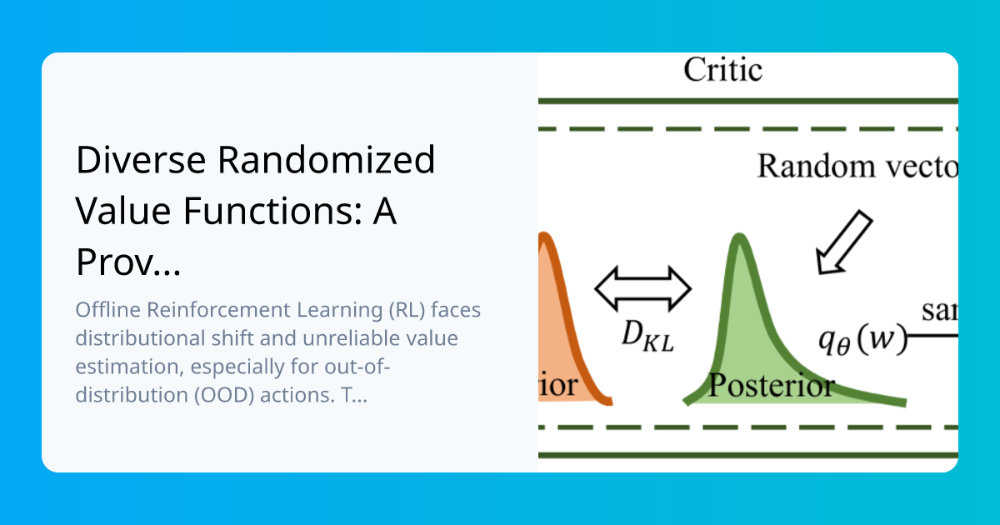

## Table of Contents

## What are Randomized Value Functions in the context of machine learning?

Randomized Value Functions (RVFs) are a concept in reinforcement learning, a type of machine learning where an agent learns to make decisions by interacting with an environment. In traditional reinforcement learning, an agent uses a value function to estimate the expected future rewards for taking certain actions. RVFs introduce randomness into these estimates, which can help the agent explore the environment more effectively and potentially find better strategies. By adding a bit of randomness, RVFs can make the learning process more robust and help the agent avoid getting stuck in sub-optimal solutions.

Think of RVFs like adding a small amount of noise to a GPS system's route suggestions. Normally, a GPS gives you the best route it knows, but if you always follow that one route, you might miss out on other good options. By adding some randomness, the GPS might suggest different routes occasionally, helping you discover new paths that could be faster or more scenic. In the same way, RVFs help the learning agent explore different actions and find better ways to achieve its goals, making the learning process more effective and adaptable.

## How do Randomized Value Functions differ from traditional value functions?

Traditional value functions in reinforcement learning estimate the expected future rewards for taking certain actions in a given state. They provide a deterministic estimate, meaning that for a specific state and action, the value function will always return the same value. This can sometimes lead to the agent getting stuck in sub-optimal solutions because it might not explore other potentially better actions.

Randomized Value Functions (RVFs) introduce randomness into these estimates. Instead of always returning the same value for a given state and action, RVFs add a bit of randomness to the estimate. This randomness encourages the agent to explore different actions more often, which can help it discover better strategies and avoid getting stuck in local optima. By exploring more, the agent can potentially find paths to higher rewards that it might have missed with a traditional value function.

To illustrate, imagine a traditional value function as a map that always shows the same route to a destination. An RVF would be like a map that sometimes suggests different routes, helping you find new and possibly better ways to reach your goal. This added exploration can make the learning process more robust and effective, leading to better overall performance in the long run.

## What is the Randomized Ensembled Mixture (REM) model and how does it relate to Randomized Value Functions?

The Randomized Ensembled Mixture (REM) model is a way to make value functions in [reinforcement learning](/wiki/reinforcement-learning) even better. It mixes together a bunch of different value functions, each with a little bit of randomness added to it. This mix helps the learning agent see different possible futures and choose the best actions more wisely. By using many value functions together, REM can give a more complete picture of what might happen next, which can lead to smarter decisions.

REM is closely related to Randomized Value Functions (RVFs) because it builds on the idea of adding randomness to value estimates. While RVFs add randomness to a single value function, REM takes it a step further by using many RVFs together. This ensemble approach helps reduce the chance that the agent will miss out on good actions. By combining the strengths of multiple randomized value functions, REM can help the agent explore the environment more thoroughly and find better strategies to reach its goals.

## Can you explain the concept of a Noisy Linear Layer and its role in Randomized Value Functions?

A Noisy Linear Layer is a special kind of layer in a [neural network](/wiki/neural-network) that adds a bit of randomness to its calculations. Imagine you're trying to predict something, like how much you'll enjoy a new movie. Normally, a neural network would use fixed numbers to make its guess. But with a Noisy Linear Layer, it adds some random noise to those numbers, which can help the network explore different possibilities and make better predictions over time. This randomness is controlled and can be adjusted to be more or less, depending on what works best for the task at hand.

In the context of Randomized Value Functions (RVFs), Noisy Linear Layers play a key role by introducing this randomness into the value estimates. When a neural network uses RVFs to estimate future rewards, the Noisy Linear Layer helps by making these estimates a bit unpredictable. This unpredictability encourages the learning agent to try out different actions, which can lead to discovering better strategies. By using Noisy Linear Layers, RVFs can help the agent explore more effectively and avoid getting stuck with sub-optimal choices, ultimately leading to better performance in reinforcement learning tasks.

## What are the advantages of using Randomized Value Functions in reinforcement learning?

Randomized Value Functions (RVFs) help make reinforcement learning better by adding a bit of randomness to the way an agent guesses future rewards. This randomness encourages the agent to try out different actions more often, which can lead to finding better ways to reach its goals. Imagine you're playing a game and always choosing the same move because it seems good. With RVFs, you might try other moves and discover a winning strategy you hadn't thought of before. This exploration can help the agent avoid getting stuck in a rut and find new paths to success.

Another advantage of RVFs is that they can make the learning process more robust. By exploring different actions, the agent can learn about the environment in a more thorough way. This can be especially helpful in complex situations where the best action isn't always clear. RVFs help the agent adapt to changes and surprises, making it more likely to perform well over time. In the end, using RVFs can lead to smarter and more flexible decision-making in reinforcement learning tasks.

## How do Randomized Value Functions help in improving exploration in reinforcement learning?

Randomized Value Functions (RVFs) help improve exploration in reinforcement learning by adding a bit of randomness to the way an agent guesses future rewards. Imagine you're playing a game and always choosing the same move because it seems good. With RVFs, the agent might try other moves and discover a winning strategy it hadn't thought of before. This randomness encourages the agent to explore different actions more often, which can lead to finding better ways to reach its goals. By exploring more, the agent can avoid getting stuck in a rut and find new paths to success.

Another way RVFs help with exploration is by making the learning process more robust. In complex situations where the best action isn't always clear, RVFs help the agent learn about the environment in a more thorough way. By trying out different actions, the agent can adapt to changes and surprises, making it more likely to perform well over time. In the end, using RVFs can lead to smarter and more flexible decision-making in reinforcement learning tasks.

## What are some practical applications of Randomized Value Functions?

Randomized Value Functions (RVFs) can be used in video games to make the computer players smarter. Imagine you're playing a game where the computer controls the enemy. With RVFs, the enemy might try different moves and strategies, making the game more challenging and fun. This randomness helps the computer explore different ways to beat you, leading to a more exciting and unpredictable gameplay experience.

Another practical use of RVFs is in robotics. Robots often need to learn how to navigate new environments or perform new tasks. By using RVFs, a robot can try different actions to see what works best, helping it learn faster and adapt to changes. For example, a delivery robot might use RVFs to find the quickest and safest path through a busy city, improving its efficiency and effectiveness over time.

## How can Randomized Value Functions be implemented in a deep learning framework?

To implement Randomized Value Functions (RVFs) in a [deep learning](/wiki/deep-learning) framework, you can start by adding a Noisy Linear Layer to your neural network. This special layer adds a bit of randomness to the calculations, which helps the network explore different possibilities. You can use a deep learning library like PyTorch or TensorFlow to create this layer. For example, in PyTorch, you can define a NoisyLinear class that inherits from the regular Linear layer but adds noise to the weights and biases. By including this layer in your network, you're introducing randomness into the value estimates, which is the key idea behind RVFs.

Once you have the Noisy Linear Layer set up, you can train your network using standard reinforcement learning algorithms, like Q-learning or policy gradient methods. The randomness from the Noisy Linear Layer will encourage your agent to try out different actions, helping it explore the environment more effectively. Over time, this exploration can lead to better performance as the agent discovers new and potentially better strategies. By tweaking the amount of noise added by the Noisy Linear Layer, you can control how much randomness is introduced, allowing you to balance exploration and exploitation to suit your specific task.

## What are the challenges and limitations of using Randomized Value Functions?

Using Randomized Value Functions (RVFs) in reinforcement learning can be tricky. One challenge is finding the right amount of randomness to add. If you add too much, the agent might explore too much and never settle on a good strategy. If you don't add enough, the agent might not explore enough and miss out on better actions. Balancing this randomness is key to making RVFs work well. Another limitation is that RVFs can make the learning process slower because the agent is always trying out new things. This might be okay for some tasks, but for others, you might need quicker results.

Another challenge with RVFs is that they can make it harder to understand why the agent is making certain decisions. The randomness can make the agent's actions seem unpredictable, which can be confusing when you're trying to figure out what's going on. This can make it harder to trust the agent, especially in situations where you need to know exactly why it's doing what it's doing. Despite these challenges, RVFs can still be very helpful in making the agent explore more and find better strategies over time.

## How do Randomized Value Functions compare to other exploration strategies like epsilon-greedy or entropy regularization?

Randomized Value Functions (RVFs) add a bit of randomness to the way an agent guesses future rewards, encouraging it to try different actions. This is different from epsilon-greedy, which picks the best action most of the time but sometimes chooses a random action. With RVFs, the randomness is part of the value estimate itself, making the agent explore more naturally. Epsilon-greedy can be simpler to set up, but RVFs might help the agent find better strategies because the randomness is more integrated into the learning process.

Entropy regularization is another way to encourage exploration, where the agent tries to keep its actions unpredictable. This is done by adding an extra term to the learning process that rewards the agent for being less predictable. RVFs, on the other hand, focus on adding randomness to the value estimates directly. While entropy regularization can be effective, RVFs might be easier to understand and adjust because they work directly with the value function. Both methods aim to make the agent explore more, but they do it in different ways, and the best choice depends on what you need for your specific task.

## Can you discuss any recent advancements or research in the field of Randomized Value Functions?

Recent research in Randomized Value Functions (RVFs) has focused on improving how they help [agents](/wiki/agents) explore and learn. One interesting study looked at combining RVFs with other methods, like entropy regularization, to make the exploration even better. They found that by mixing these methods, the agent could explore more effectively and find better strategies faster. This research shows that RVFs can be even more powerful when used together with other exploration techniques, helping agents learn in complex environments.

Another advancement in RVFs is the development of more sophisticated ways to add randomness. Researchers have been working on new types of Noisy Linear Layers that can adjust the amount of randomness based on how well the agent is doing. This means the agent can explore more when it needs to and focus on what works when it's doing well. These new methods make RVFs more flexible and adaptable, helping agents learn more efficiently in different situations.

## What are the future prospects and potential developments for Randomized Value Functions in machine learning?

The future of Randomized Value Functions (RVFs) in [machine learning](/wiki/machine-learning) looks promising. Researchers are exploring ways to make RVFs even better at helping agents explore and learn. One exciting area is combining RVFs with other exploration techniques, like entropy regularization. By mixing these methods, agents could explore more effectively and find better strategies faster. This could be especially useful in complex environments where the best action isn't always clear. Another potential development is creating more advanced Noisy Linear Layers that can adjust the amount of randomness based on the agent's performance. This would make RVFs more flexible and adaptable, helping agents learn more efficiently in different situations.

In the coming years, we might see RVFs being used in more practical applications, like robotics and video games. For example, a robot using RVFs could learn to navigate new environments more quickly by trying out different actions and discovering the best paths. In video games, RVFs could make computer players smarter and more challenging by encouraging them to try different strategies. As researchers continue to refine and improve RVFs, we can expect them to become a more common tool in reinforcement learning, helping agents learn and adapt in increasingly complex and dynamic environments.

## References & Further Reading

[1]: Fortunato, M., Azar, M. G., Piot, B., Menick, J., Osband, I., Graves, A., ... & Blundell, C. (2018). ["Noisy Networks for Exploration."](https://arxiv.org/abs/1706.10295) International Conference on Learning Representations (ICLR).

[2]: Osband, I., Blundell, C., Pritzel, A., & Van Roy, B. (2016). ["Deep Exploration via Bootstrapped DQN."](https://arxiv.org/abs/1602.04621) Advances in Neural Information Processing Systems (NeurIPS).

[3]: Plappert, M., Houthooft, R., Dhariwal, P., Sampedro, R., Radford, A., Klimov, O., ... & Andrychowicz, M. (2018). ["Parameter Space Noise for Exploration."](https://arxiv.org/abs/1706.01905) International Conference on Learning Representations (ICLR).

[4]: Burda, Y., Edwards, H., Storkey, A., & Klimov, O. (2018). ["Exploration by Random Network Distillation."](https://arxiv.org/abs/1810.12894) International Conference on Learning Representations (ICLR).

[5]: Sutton, R. S., & Barto, A. G. (2018). ["Reinforcement Learning: An Introduction."](https://web.stanford.edu/class/psych209/Readings/SuttonBartoIPRLBook2ndEd.pdf) MIT Press.

[6]: Bellemare, M. G., Dabney, W., & Munos, R. (2017). ["A Distributional Perspective on Reinforcement Learning."](https://arxiv.org/abs/1707.06887) International Conference on Machine Learning (ICML).