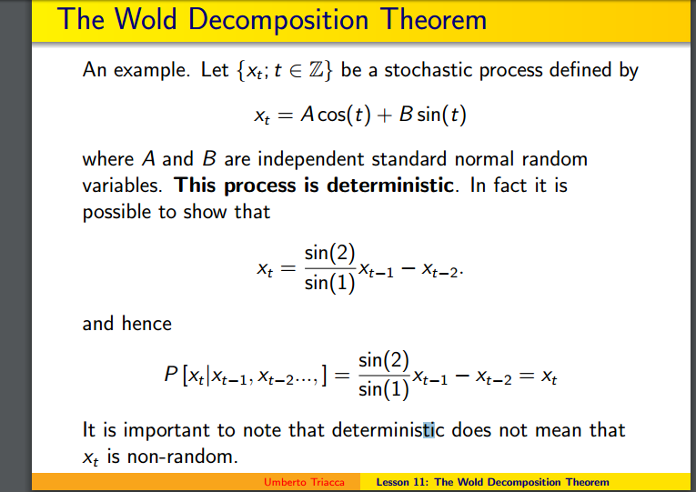

## Table of Contents

## What is randomness?

Randomness is when things happen without a pattern that we can predict. Imagine flipping a coin. You can't know if it will land on heads or tails because it's random. Randomness is important in many areas like games, science, and even computer programs. It helps make sure things are fair and unpredictable.

In everyday life, we see randomness all the time. For example, the weather can change in ways we don't expect, or you might meet someone new by chance. Scientists use randomness to study things like how diseases spread or how animals behave. They use special tools and math to understand these random events better.

## What is a deterministic formula?

A deterministic formula is a math rule where if you know the starting point, you can always figure out the exact answer. It's like a recipe that always gives you the same cake if you use the same ingredients and steps. For example, if you add 2 and 2, you will always get 4. There's no surprise or randomness; it's predictable every time.

In science and computers, deterministic formulas are very useful. Scientists use them to predict things like how planets move or how chemicals react. In computers, these formulas help run programs smoothly because the computer knows exactly what to do next. Unlike random events, deterministic formulas give us certainty and reliability, which is important in many fields.

## Can randomness exist in a deterministic system?

In a deterministic system, everything follows strict rules, so you might think randomness can't exist. But, even in these systems, something called "pseudo-randomness" can happen. This is when things look random even though they're made by a formula. For example, a computer game might use a special math rule to decide what happens next, and it can seem very unpredictable to players.

This pseudo-randomness comes from using very long and complicated formulas that make it hard to see the pattern. Even though the system is deterministic, the results can be so complex that they seem random to us. So, while true randomness, where things happen without any pattern at all, can't exist in a deterministic system, it can still feel like randomness is there because the patterns are too hard to spot.

## How can we simulate randomness using deterministic formulas?

We can simulate randomness using deterministic formulas by using something called a "pseudo-random number generator." This is a special math rule that starts with a number called a "seed." When you use this rule over and over, it makes a list of numbers that seem random. Even though the numbers follow a pattern, the pattern is so long and complicated that it looks like true randomness to us.

For example, imagine you have a simple rule like "multiply the number by 16807 and take the remainder when you divide by 2^31 - 1." If you start with a seed like 123, you'll get a new number. Keep doing this, and you'll get a long list of numbers that seem to jump around unpredictably. People use these pseudo-random numbers in games, computer programs, and even scientific studies to mimic real randomness. Even though it's not truly random, it works well enough for many purposes.

## What is a pseudo-random number generator (PRNG)?

A pseudo-random number generator (PRNG) is like a math trick that makes numbers that look random but aren't really. It starts with a number called a "seed," and then uses a special rule to make the next number. You keep using the rule over and over, and it gives you a list of numbers that seem to jump around in a way that's hard to predict. Even though these numbers follow a pattern, the pattern is so long and tricky that it looks like true randomness to us.

People use PRNGs in all sorts of places, like in video games, computer programs, and even in science. For example, in a game, a PRNG might decide what happens next, like where the enemy will appear or what treasure you might find. In science, researchers might use PRNGs to run experiments that need random numbers, like studying how diseases spread. Even though PRNGs aren't truly random, they're good enough for many things because the numbers they produce are very hard to guess.

## How do PRNGs use deterministic formulas to produce random-like sequences?

PRNGs use a special math rule, called an algorithm, to make numbers that seem random. This rule starts with a number called a seed. When you use the rule on the seed, you get a new number. Then you use the rule on that new number to get another number, and so on. Each time, the rule makes the next number in the sequence. Even though this process follows a strict pattern, the pattern is so long and complicated that the numbers look like they're jumping around randomly.

This method works because the rule is designed to spread the numbers out in a way that's hard to predict. For example, a common rule is to multiply the current number by a big number, then take the remainder when you divide by another big number. This makes the numbers seem to bounce around a lot, even though they're still following the rule. People use these numbers in games, computer programs, and science because they're good enough to act like real random numbers, even though they're made by a deterministic formula.

## What are the limitations of using deterministic formulas for randomness?

Using deterministic formulas to create randomness has some limits. The biggest problem is that the numbers aren't truly random. They follow a pattern, even if it's a very long and hard-to-see one. If someone knows the starting number, called the seed, and the rule used to make the numbers, they can predict the whole sequence. This means that in situations where you really need true randomness, like in some security systems or scientific experiments, using a deterministic formula might not be good enough.

Another issue is that the sequence of numbers can repeat after a while. Even though the pattern might be very long, it's not endless. This can be a problem if you need a lot of random numbers that don't repeat. Also, if the rule used to make the numbers isn't good enough, the numbers might not spread out evenly. This can make the results less useful for things like simulations or games where you want the numbers to be as unpredictable as possible.

## What is the difference between true randomness and pseudo-randomness?

True randomness is when things happen without any pattern that can be predicted. It's like flipping a coin; you can't know if it will land on heads or tails because it's completely up to chance. True randomness is important in things like security systems, where you need numbers that no one can guess, and in scientific experiments where you need to study things like how diseases spread or how animals behave without any bias.

Pseudo-randomness, on the other hand, is when numbers look random but are actually made by a special math rule called a deterministic formula. This rule starts with a number called a seed and makes a sequence of numbers that seem to jump around unpredictably. Even though these numbers follow a pattern, it's so long and complicated that it's hard to see. People use pseudo-random numbers in games, computer programs, and some scientific studies because they're good enough for many things, even though they're not truly random.

The main difference is that true randomness has no pattern at all, while pseudo-randomness follows a hidden pattern. If someone knows the seed and the rule used to make pseudo-random numbers, they can predict the whole sequence. This makes true randomness better for things that need to be completely unpredictable, while pseudo-randomness is useful when you just need numbers that seem random enough for most purposes.

## How can the quality of randomness in deterministic formulas be measured?

The quality of randomness in deterministic formulas can be measured by how well the numbers they produce look like true random numbers. Scientists and computer experts use special tests to check this. They look at things like how evenly the numbers are spread out, how often the numbers repeat, and how hard it is to guess the next number in the sequence. If the numbers pass these tests, it means the formula is doing a good job of making numbers that seem random.

One important test is called the "statistical randomness test." This test checks if the numbers from the formula look like they come from a truly random source. For example, it might count how many times each number appears and see if it matches what you'd expect from true randomness. If the numbers pass this test, it means they're good enough for many uses, like in games or simulations. But if they fail, it means the formula might need to be improved to make the numbers look more random.

## What are some advanced techniques for improving the randomness of deterministic formulas?

One advanced technique for improving the randomness of deterministic formulas is to use multiple layers of formulas, also known as "cascading." Imagine you have a few different math rules. You start with a seed and use the first rule to make a number. Then, you take that number and use it as the seed for the second rule, and so on. By chaining these rules together, the final numbers become much harder to predict and look more random. This method helps spread out the numbers more evenly and makes the pattern harder to see.

Another technique is to mix in some real-world data, like the time down to the millisecond or the temperature, as part of the seed. This is called "seeding with entropy." By using real-world data that changes all the time, you make it much harder for someone to guess the starting point of your formula. This helps make the numbers look more like true randomness because the seed is always changing in ways that are hard to predict. Both of these techniques help make the numbers from deterministic formulas look and act more like truly random numbers.

## How do chaotic systems relate to randomness in deterministic formulas?

Chaotic systems are like a special kind of math puzzle where tiny changes at the start can lead to big differences later on. Imagine you're trying to guess where a leaf will land after it falls from a tree. Even if you know everything about the wind and the leaf, a tiny change in how it starts falling can make it land in a completely different spot. This is what happens in chaotic systems – they follow rules, but the rules make things so sensitive that the results seem random. In a way, chaotic systems can help make numbers from deterministic formulas look more random because the tiny changes make it hard to see the pattern.

Using chaotic systems in deterministic formulas is like adding a twist to the math rule. For example, if you start with a simple rule to make numbers, you can add a chaotic part that makes small changes to the rule every time you use it. This means the numbers you get will jump around a lot more, making them look more like true random numbers. Even though the whole thing still follows a rule, the chaos makes it really hard to predict what the next number will be. So, chaotic systems can help improve the randomness of deterministic formulas by making the results more unpredictable and harder to guess.

## What are the implications of using deterministic formulas for randomness in cryptographic applications?

Using deterministic formulas to make random numbers in cryptography can be risky. Cryptography is all about keeping things secret and safe, and it needs truly random numbers to do that well. If someone figures out the seed and the rule used in a deterministic formula, they can predict all the numbers. This means they could break into secure systems or read secret messages. So, using these formulas in cryptography is not a good idea because the numbers aren't really random and can be guessed.

To make things safer, people use special devices called "hardware random number generators" in cryptography. These devices use real-world events, like tiny changes in temperature or electrical noise, to make truly random numbers. This way, the numbers are much harder to predict because they don't follow a pattern. While deterministic formulas can be useful in other areas, like games or simulations, they're not good enough for the high level of security needed in cryptography.

## What are some case studies that demonstrate randomness in action?

Mean reversion strategies in [algorithmic trading](/wiki/algorithmic-trading) leverage randomness to identify profitable opportunities. These strategies operate on the principle that asset prices, in the short term, tend to return to a historical average or mean. A key component of mean reversion is the random fluctuation of asset prices around their mean values. This randomness creates opportunities for traders to enter and [exit](/wiki/exit-strategy) trades profitably.

One common approach to mean reversion involves using stochastic models to predict the likelihood of price movements reverting to the mean. The Ornstein-Uhlenbeck process is a mathematical model frequently employed, defined by the stochastic differential equation:

$$
dX_t = \theta(\mu - X_t)dt + \sigma dW_t
$$

where $X_t$ is the price at time $t$, $\theta$ is the rate of mean reversion, $\mu$ is the long-term mean, $\sigma$ is the volatility, and $dW_t$ is a Wiener process representing the random market shocks. By applying such models, traders can mathematically forecast price movements and generate trading signals.

Market anomalies present fertile ground for the application of randomness in algorithmic trading. Anomalies such as sudden price spikes or unexpected [volume](/wiki/volume-trading-strategy) surges often deviate from traditional market patterns. Randomness helps to model these anomalies, enabling trading algorithms to adjust dynamically. This capability is crucial in addressing events that fall outside historical norms, which deterministic models might fail to account for.

Machine learning algorithms also make extensive use of randomness to improve their performance in trading applications. One technique involves the incorporation of random data sampling, also known as bootstrapping, during model training. By using random subsets of data to train models, traders can build robust predictive systems that generalize well to new data. Random forests, a popular ensemble learning method, harness randomness by constructing multiple decision trees using random samples of the training data and random subsets of features.

Python remains a favored language for implementing these concepts due to its robust libraries such as NumPy, pandas, and scikit-learn. An example of implementing a basic mean reversion strategy with Python could look like this:

```python
import numpy as np
import pandas as pd

# Generate synthetic price data
np.random.seed(42)
prices = pd.Series(np.random.normal(100, 1, 1000))

# Calculate moving average
moving_average = prices.rolling(window=20).mean()

# Identify mean reversion opportunities
deviations = prices - moving_average
entry_points = deviations[deviations < -2]
exit_points = deviations[deviations > 2]

print(f"Buy signals at:\n{entry_points}")
print(f"Sell signals at:\n{exit_points}")
```

This code calculates a moving average, identifies buy and sell signals based on deviations from this average, and prints the identified points. This method exemplifies using randomness and statistical methods to design effective trading strategies.

## What is the Mathematics Behind Randomness and Determinism?

The application of randomness in algorithmic trading lies in its ability to capture the unpredictability inherent in financial markets. In the algorithms used for trading, deterministic and stochastic models play crucial roles. The foundation of this approach is built on mathematical models that define and integrate randomness into deterministic systems to achieve robustness and adaptability.

Mathematical models for randomness typically encompass probability distributions, stochastic processes, and simulation techniques. These models aid in the formulation of hypotheses regarding market behavior and are essential in creating algorithms that can respond dynamically to real-time data. The concept of randomness in mathematics is often represented by stochastic processes, such as Brownian motion, which is used to model random movements in financial assets.

Integrating stochastic elements into algorithms takes a structured approach. For instance, Monte Carlo simulations are widely used to incorporate randomness. This technique involves running a large number of simulations to generate a distribution of possible outcomes, assisting in the valuation of financial derivatives or the assessment of risk. Typically programmed in Python, a simple implementation could involve using NumPy to simulate random walks:

```python
import numpy as np

# Parameters
n_steps = 1000
n_simulations = 10
step_size = 1

# Simulate random walks
random_walks = np.zeros((n_simulations, n_steps))
for sim in range(n_simulations):
    random_steps = np.random.choice([-1, 1], size=n_steps) * step_size
    random_walks[sim] = np.cumsum(random_steps)

print(random_walks)
```

In the context of algorithmic trading, one common stochastic model is the Geometric Brownian Motion (GBM), used to predict the future prices of financial instruments. The GBM formula is expressed as:

$$
S(t) = S(0) \exp((\mu - 0.5\sigma^2)t + \sigma W(t))
$$

where $S(t)$ is the stock price at time $t$, $\mu$ is the drift coefficient, $\sigma$ is the volatility, and $W(t)$ represents a Wiener process or standard Brownian motion. This model accounts for the randomness and volatility inherent in stock prices, which is crucial for pricing options and managing risk.

Statistical methods are integral to integrating randomness in deterministic contexts. Techniques such as regression analysis, hypothesis testing, and [machine learning](/wiki/machine-learning) are used to extract patterns from randomized data, providing insights into probable future market movements. Moreover, by employing machine learning algorithms that rely on randomized training data, traders can develop predictive models that are more adept at handling a variety of market conditions.

In summary, the mathematics behind randomness in algorithmic trading involves advanced modeling and simulation techniques that facilitate the blend of stochastic variables with deterministic ones. These methods enable the creation of sophisticated trading strategies capable of adapting to the volatile nature of financial markets.

## References & Further Reading

[1]: Chan, E. P. (2009). ["Quantitative Trading: How to Build Your Own Algorithmic Trading Business"](https://github.com/ftvision/quant_trading_echan_book). Wiley.

[2]: Aronson, D. R. (2006). ["Evidence-Based Technical Analysis: Applying the Scientific Method and Statistical Inference to Trading Signals"](https://www.amazon.com/Evidence-Based-Technical-Analysis-Scientific-Statistical/dp/0470008741). Wiley.

[3]: Jansen, S. (2020). ["Machine Learning for Algorithmic Trading"](https://github.com/stefan-jansen/machine-learning-for-trading). Packt Publishing.

[4]: Lopez de Prado, M. (2018). ["Advances in Financial Machine Learning"](https://www.amazon.com/Advances-Financial-Machine-Learning-Marcos/dp/1119482089). Wiley.

[5]: Nyquist, S. (2015). ["Trading Systems and Methods"](https://www.wiley.com/en-us/Trading+Systems+and+Methods%2C+5th+Edition-p-9781119202561). Wiley.

[6]: Taleb, N. N. (2005). ["Fooled by Randomness: The Hidden Role of Chance in Life and in the Markets"](https://www.amazon.com/Fooled-Randomness-Hidden-Markets-Incerto/dp/0812975219). Random House.