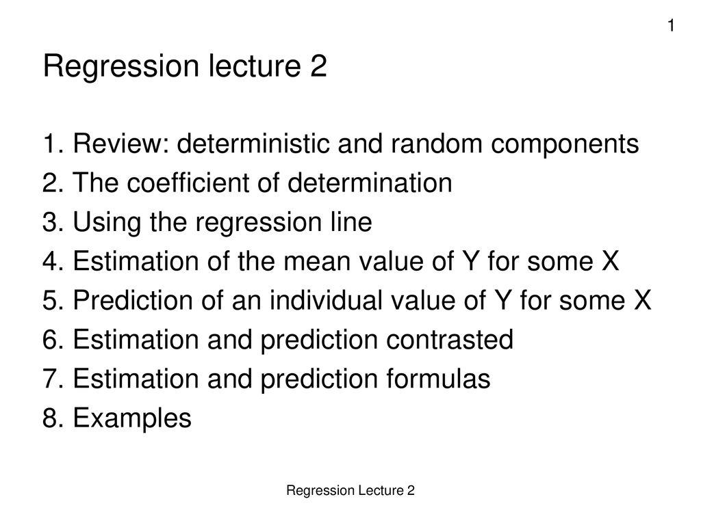

Algorithmic trading refers to the use of computer programs to execute trading strategies based on predetermined rules. These algorithms leverage complex formulas to analyze market data and decide upon trade executions, often at speeds and frequencies unattainable by human traders. The essence of algorithmic trading lies in its reliance on formulas that aim to capitalize on specific patterns and inefficiencies within financial markets. These formulas, inherently deterministic, provide a structured approach to trading by enabling the creation of strategies that can be consistently applied across varying market conditions.

The importance of deterministic formulas in algorithmic trading strategies cannot be overstated. They offer a precise framework that eliminates emotional decision-making, relying instead on rigorous data analysis. These formulas are grounded in mathematical models that predict outcomes based on historical data, allowing traders to assess potential risks and returns with greater certainty. Through deterministic algorithms, traders strive for predictability and control, seeking to optimize returns by efficiently managing their trading positions.



However, there exists a paradox where randomness plays an integral role in systems based on deterministic formulas. Financial markets are characterized by their inherent unpredictability, with countless variables influencing price movements at any given moment. This uncertainty introduces the concept of randomness into the otherwise orderly world of algorithmic trading. By integrating elements of randomness, traders can enhance the adaptability of their strategies, enabling them to respond to unforeseen market fluctuations and anomalies that rigid deterministic models might overlook.

The purpose of this article is to explore the role of randomness within algorithmic trading, elucidating how it complements deterministic formulas to tackle the complexities of financial markets. By examining the interplay between systematic precision and stochastic variability, we aim to highlight the effectiveness of incorporating randomness into trading algorithms. This exploration will reveal the potential benefits randomness provides in enhancing trading performance, alongside the challenges and considerations it introduces.

## Table of Contents

## Understanding Deterministic Formulas in Algorithmic Trading

Deterministic formulas in algorithmic trading refer to mathematical expressions or computational procedures that produce predictable and repeatable outcomes from a given set of inputs. These formulas operate under the assumption that, if the same input data is applied, the output will always be consistent and unaffected by random variability. In the context of trading, this implies a precise and methodical approach to making decisions, largely based on historical data and predefined rules.

### Definition of Deterministic Formulas

Deterministic formulas are characterized by their ability to provide specific results without exposure to stochastic elements. These formulas typically involve mathematical equations or algorithms where the outcome is fully determined by the input values, lacking any element of randomness. Such formulas are essential in environments where predictability and reliability are critical.

### Examples of Deterministic Strategies

Several [algorithmic trading](/wiki/algorithmic-trading) strategies rely on deterministic formulas. A notable example is the Moving Average Crossover strategy. This strategy uses two moving averages, often a short-term and a long-term average. A buy signal is generated when the short-term average crosses above the long-term average, and a sell signal is prompted when the opposite occurs. The deterministic nature allows traders to anticipate market movements based solely on historical price data.

Another strategy is the Fixed Ratio or Martingale strategy, which dictates position sizing based on predetermined increments or ratios. Here, the deterministic aspect ensures that trading decisions follow strict arithmetic progressions or decremental patterns instead of random fluctuations.

### The Appeal of Predictability and Control

The primary appeal of deterministic formulas in algorithmic trading lies in their predictability and control over trading outcomes. Traders and algorithm developers are drawn to deterministic systems because they offer a method to systematically approach trading without the need for guesswork. This predictability is crucial, especially in high-frequency trading environments where rapid decision-making is essential.

In deterministic strategies, the clarity of the input-output relationship allows investors to backtest and analyze strategies with a high degree of accuracy. This contributes to building trust in the system's ability to perform under certain market conditions. Furthermore, the transparency of deterministic formulas aids in understanding and mitigating potential risks, which is invaluable in managing large-scale trading portfolios.

By leveraging deterministic formulas, traders can exert more control over their trading operations, relying on calculable and measurable outcomes rather than volatile market sentiments. This foundation of predictability makes deterministic formulas a cornerstone of many algorithmic trading systems, offering a robust framework for developing strategies that navigate the complexities of financial markets.

## The Role of Randomness in Algorithmic Trading

Algorithmic trading relies on the use of deterministic formulas to navigate financial markets. Despite this deterministic nature, randomness is often intentionally incorporated into these systems. The integration of randomness serves several purposes: enhancing flexibility, improving robustness, and allowing for the exploration of various market scenarios that purely deterministic models might overlook.

Incorporating randomness helps mitigate model overfitting. Overfitting occurs when a model is excessively tailored to historical data, capturing noise as if it were a true pattern. By introducing random elements, traders ensure that their strategies can adapt to unforeseen changes in the market environment. For instance, Monte Carlo simulations are used to assess the impact of randomness on the potential outcomes of trading strategies by generating a wide range of possible scenarios.

Trading algorithms often use techniques like randomized sampling or perturbations to improve decision-making processes. An example is the use of genetic algorithms in evolving trading strategies. Genetic algorithms manipulate a population of potential solutions using operations akin to natural selection and mutation, with randomness playing a vital role in the mutation process. This randomness ensures that the algorithm explores a broader solution space, potentially identifying more robust and profitable strategies.

Furthermore, randomness aids in balancing predictability and adaptability in algorithmic trading systems. Predictability ensures that trading decisions are based on historical data and established trends, while adaptability allows for quick responses to new information and unforeseen market shifts. Stochastic processes, such as those driven by Brownian motion, are often used to model asset prices and [volatility](/wiki/volatility-trading-strategies). These processes introduce an element of randomness, helping strategies remain responsive to the inherent uncertainties in financial markets.

Python provides libraries such as NumPy and Pandas, which facilitate the incorporation of randomness through random number generation and statistical functions. For example, a simple Python snippet using NumPy to simulate random price movements might look like this:

```python
import numpy as np

# Setting initial parameters for price simulation
initial_price = 100  # Initial asset price
mean_return = 0.0005  # Expected daily return
volatility = 0.01  # Volatility as the standard deviation

# Simulating price movements for 100 trading days
np.random.seed(42)
random_price_changes = np.random.normal(mean_return, volatility, 100)
price_series = initial_price * np.exp(np.cumsum(random_price_changes))

print(price_series)
```

This simulation creates a series of prices that include a random component, allowing traders to test their strategies under varying conditions, thus achieving a balance between deterministic precision and the need to adapt to real-time market dynamics. By embracing randomness, algorithmic trading can effectively navigate the complex and unpredictable nature of financial markets.

## Case Studies: Randomness in Action

Mean reversion strategies in algorithmic trading leverage randomness to identify profitable opportunities. These strategies operate on the principle that asset prices, in the short term, tend to return to a historical average or mean. A key component of mean reversion is the random fluctuation of asset prices around their mean values. This randomness creates opportunities for traders to enter and [exit](/wiki/exit-strategy) trades profitably.

One common approach to mean reversion involves using stochastic models to predict the likelihood of price movements reverting to the mean. The Ornstein-Uhlenbeck process is a mathematical model frequently employed, defined by the stochastic differential equation:

$$
dX_t = \theta(\mu - X_t)dt + \sigma dW_t
$$

where $X_t$ is the price at time $t$, $\theta$ is the rate of mean reversion, $\mu$ is the long-term mean, $\sigma$ is the volatility, and $dW_t$ is a Wiener process representing the random market shocks. By applying such models, traders can mathematically forecast price movements and generate trading signals.

Market anomalies present fertile ground for the application of randomness in algorithmic trading. Anomalies such as sudden price spikes or unexpected [volume](/wiki/volume-trading-strategy) surges often deviate from traditional market patterns. Randomness helps to model these anomalies, enabling trading algorithms to adjust dynamically. This capability is crucial in addressing events that fall outside historical norms, which deterministic models might fail to account for.

Machine learning algorithms also make extensive use of randomness to improve their performance in trading applications. One technique involves the incorporation of random data sampling, also known as bootstrapping, during model training. By using random subsets of data to train models, traders can build robust predictive systems that generalize well to new data. Random forests, a popular ensemble learning method, harness randomness by constructing multiple decision trees using random samples of the training data and random subsets of features.

Python remains a favored language for implementing these concepts due to its robust libraries such as NumPy, pandas, and scikit-learn. An example of implementing a basic mean reversion strategy with Python could look like this:

```python
import numpy as np
import pandas as pd

# Generate synthetic price data
np.random.seed(42)
prices = pd.Series(np.random.normal(100, 1, 1000))

# Calculate moving average
moving_average = prices.rolling(window=20).mean()

# Identify mean reversion opportunities
deviations = prices - moving_average
entry_points = deviations[deviations < -2]
exit_points = deviations[deviations > 2]

print(f"Buy signals at:\n{entry_points}")
print(f"Sell signals at:\n{exit_points}")
```

This code calculates a moving average, identifies buy and sell signals based on deviations from this average, and prints the identified points. This method exemplifies using randomness and statistical methods to design effective trading strategies.

## The Mathematics Behind Randomness and Determinism

The application of randomness in algorithmic trading lies in its ability to capture the unpredictability inherent in financial markets. In the algorithms used for trading, deterministic and stochastic models play crucial roles. The foundation of this approach is built on mathematical models that define and integrate randomness into deterministic systems to achieve robustness and adaptability.

Mathematical models for randomness typically encompass probability distributions, stochastic processes, and simulation techniques. These models aid in the formulation of hypotheses regarding market behavior and are essential in creating algorithms that can respond dynamically to real-time data. The concept of randomness in mathematics is often represented by stochastic processes, such as Brownian motion, which is used to model random movements in financial assets.

Integrating stochastic elements into algorithms takes a structured approach. For instance, Monte Carlo simulations are widely used to incorporate randomness. This technique involves running a large number of simulations to generate a distribution of possible outcomes, assisting in the valuation of financial derivatives or the assessment of risk. Typically programmed in Python, a simple implementation could involve using NumPy to simulate random walks:

```python
import numpy as np

# Parameters
n_steps = 1000
n_simulations = 10
step_size = 1

# Simulate random walks
random_walks = np.zeros((n_simulations, n_steps))
for sim in range(n_simulations):
    random_steps = np.random.choice([-1, 1], size=n_steps) * step_size
    random_walks[sim] = np.cumsum(random_steps)

print(random_walks)
```

In the context of algorithmic trading, one common stochastic model is the Geometric Brownian Motion (GBM), used to predict the future prices of financial instruments. The GBM formula is expressed as:

$$
S(t) = S(0) \exp((\mu - 0.5\sigma^2)t + \sigma W(t))
$$

where $S(t)$ is the stock price at time $t$, $\mu$ is the drift coefficient, $\sigma$ is the volatility, and $W(t)$ represents a Wiener process or standard Brownian motion. This model accounts for the randomness and volatility inherent in stock prices, which is crucial for pricing options and managing risk.

Statistical methods are integral to integrating randomness in deterministic contexts. Techniques such as regression analysis, hypothesis testing, and [machine learning](/wiki/machine-learning) are used to extract patterns from randomized data, providing insights into probable future market movements. Moreover, by employing machine learning algorithms that rely on randomized training data, traders can develop predictive models that are more adept at handling a variety of market conditions.

In summary, the mathematics behind randomness in algorithmic trading involves advanced modeling and simulation techniques that facilitate the blend of stochastic variables with deterministic ones. These methods enable the creation of sophisticated trading strategies capable of adapting to the volatile nature of financial markets.

## Algorithms, Randomness, and Market Uncertainty

Market unpredictability presents one of the most significant challenges to algorithmic trading systems. These systems often rely on historical data to predict future market movements. However, the inherent uncertainty in financial markets necessitates the incorporation of randomness to enhance the robustness and adaptability of trading algorithms. Randomness, when strategically applied, can bolster an algorithm's ability to navigate unpredictable market conditions and respond effectively to unforeseen events.

Randomness is introduced into algorithmic trading systems to simulate various market conditions, thereby enabling the algorithms to adapt to a broader range of scenarios. For instance, stochastic modeling is often employed to introduce randomness in price movements and volatility. By incorporating stochastic processes, such as Brownian motion or geometric Brownian motion, trading systems can better account for random price fluctuations that occur in the market.

Incorporating randomness can also enhance the robustness of trading strategies by preventing overfitting. Overfitting occurs when a model is too closely tailored to historical data, thereby performing poorly under different conditions. By adding noise or randomness to data inputs during [backtesting](/wiki/backtesting) and model training, algorithms can be designed to perform consistently across diverse market environments. This enhances their ability to withstand market anomalies and sudden shifts in market dynamics.

While randomness can bolster robustness, it also introduces limitations and risks. Excessive randomness may lead to unpredictable and erratic trading behaviors, resulting in suboptimal performance. The key is finding a balance where randomness is used to simulate realistic market conditions without compromising the determinism that underpins algorithmic strategies. Proper calibration of random inputs and thorough testing are essential to mitigate these risks.

Furthermore, reliance on randomness can obscure the underlying logic of trading decisions, complicating the interpretation and explanation of results. Traders and algorithm developers must carefully document and monitor the incorporation of random elements to ensure this does not lead to unforeseen adverse outcomes.

In conclusion, randomness plays a pivotal role in enhancing the robustness and adaptability of trading algorithms amidst market uncertainty. While it introduces certain risks, its strategic application can significantly improve the resilience and effectiveness of trading strategies in unpredictable markets.

## Practical Applications and Tools

Implementing randomness in trading platforms involves the application of random processes or stochastic elements into trading algorithms to enhance their robustness and performance. Randomness can be introduced at several stages of algorithm development, from strategy formation to testing and optimization.

### Tools and Software to Incorporate Randomness

Several tools and software platforms are designed to facilitate the implementation of randomness in algorithmic trading:

1. **QuantLib**: An open-source library in C++ focused on quantitative finance. It supports a variety of stochastic processes and offers tools to incorporate randomness into pricing and risk management models.

2. **Python Libraries**: Libraries such as NumPy and SciPy provide comprehensive tools for statistical analysis and random number generation. They can be used to simulate random market conditions or to add stochastic elements in algorithmic strategies.

   ```python
   import numpy as np
   # Generate random market conditions
   random_shock = np.random.normal(loc=0, scale=1, size=100)
   ```

3. **Trading Platforms**: Platforms like MetaTrader and NinjaTrader allow for the integration of custom indicators and scripts that can include random elements. These platforms have scripting capabilities (MQL for MetaTrader, NinjaScript for NinjaTrader) that can handle stochastic processes.

4. **Backtesting Tools**: Tools such as Backtrader and QuantConnect offer features to incorporate and evaluate randomness. They provide environments where historical data can be used to simulate the presence of random elements in trading strategies.

5. **R and MATLAB**: These platforms offer extensive packages and toolboxes for statistical computing, which can be utilized to introduce randomness in trading models.

### Steps for Testing and Backtesting Random Elements

Testing and backtesting are critical steps when integrating randomness into trading strategies to ensure that the algorithms remain robust and effective under diverse market conditions. The process involves the following steps:

1. **Define the Random Process**: Clearly specify the type of randomness to be included, such as random walks or Monte Carlo simulations, and determine the parameters (e.g., mean, variance) that describe these processes.

2. **Integrate Random Elements**: Introduce randomness into the algorithmic strategy. For example, randomness can be injected into the entry or exit points of trades or in the weighting of portfolio components.

   ```python
   # Example of random entry point
   entry_point = np.random.choice([True, False], p=[0.1, 0.9])
   ```

3. **Simulate Random Scenarios**: Use the defined random processes to simulate various market conditions and observe how the trading strategy performs. This helps in understanding the strategy's behavior and adaptability to randomness.

4. **Performance Evaluation**: Analyze the outcomes of the backtests using performance metrics such as the Sharpe ratio, drawdowns, and win/loss ratios. This evaluation will highlight the strategy's strengths and vulnerabilities under stochastic environments.

5. **Iterative Refinement**: Based on the backtesting results, refine the strategy by adjusting the stochastic parameters. The goal is to optimize the balance between randomness and the desired level of control and predictability.

6. **Real-world Testing**: Before full implementation, conduct paper trading with live market data, incorporating stochastic elements, to further validate the strategy's robustness.

By thoughtfully integrating randomness, traders and researchers can potentially improve the adaptability and resilience of algorithmic trading strategies against the unpredictable nature of financial markets.

## Conclusion

The interplay between randomness and deterministic formulas in algorithmic trading presents a unique paradigm where predictability and uncertainty coexist. Randomness, when systematically integrated, offers a mechanism to introduce variability and adaptability in otherwise rigid deterministic strategies. This incorporation can enhance the capacity of algorithms to adapt and respond to unpredictable market behaviors, potentially improving trading performance.

Randomness impacts trading performance by introducing diversity in trading signals, thus enabling algorithms to explore a broader range of market scenarios. This variability can prevent overfitting to historical data, a common pitfall in trading strategies that rely solely on deterministic rules. By mitigating overfitting, randomness can enhance the robustness and longevity of trading algorithms, allowing them to remain effective across different market conditions. Furthermore, stochastic elements can mimic market noise, equipping algorithms to better deal with real-world trading environments, which are inherently noisy and unpredictable.

The potential of randomness in algorithmic trading continues to expand with advancements in technology and quantitative techniques. As machine learning and [artificial intelligence](/wiki/ai-artificial-intelligence) applications grow within the trading sector, the role of randomness is expected to become increasingly prominent. Machine learning models, which often include stochastic processes in their learning algorithms, may further integrate randomness to improve decision-making accuracy and adaptability.

In future outlooks, we foresee randomness being leveraged more extensively to develop algorithms that are not just reactive but proactive, predicting market shifts with higher accuracy. This evolution could lead to more sophisticated trading strategies that balance precision with adaptability, ultimately leading to enhanced trading performance across diverse market landscapes. As financial markets continue to evolve, randomness will likely remain an essential component in the development of cutting-edge algorithmic trading strategies.

## References & Further Reading

[1]: Chan, E. P. (2009). ["Quantitative Trading: How to Build Your Own Algorithmic Trading Business"](https://github.com/ftvision/quant_trading_echan_book). Wiley.

[2]: Aronson, D. R. (2006). ["Evidence-Based Technical Analysis: Applying the Scientific Method and Statistical Inference to Trading Signals"](https://www.amazon.com/Evidence-Based-Technical-Analysis-Scientific-Statistical/dp/0470008741). Wiley.

[3]: Jansen, S. (2020). ["Machine Learning for Algorithmic Trading"](https://github.com/stefan-jansen/machine-learning-for-trading). Packt Publishing.

[4]: Lopez de Prado, M. (2018). ["Advances in Financial Machine Learning"](https://www.amazon.com/Advances-Financial-Machine-Learning-Marcos/dp/1119482089). Wiley.

[5]: Nyquist, S. (2015). ["Trading Systems and Methods"](https://www.wiley.com/en-us/Trading+Systems+and+Methods%2C+5th+Edition-p-9781119202561). Wiley.

[6]: Taleb, N. N. (2005). ["Fooled by Randomness: The Hidden Role of Chance in Life and in the Markets"](https://www.amazon.com/Fooled-Randomness-Hidden-Markets-Incerto/dp/0812975219). Random House.