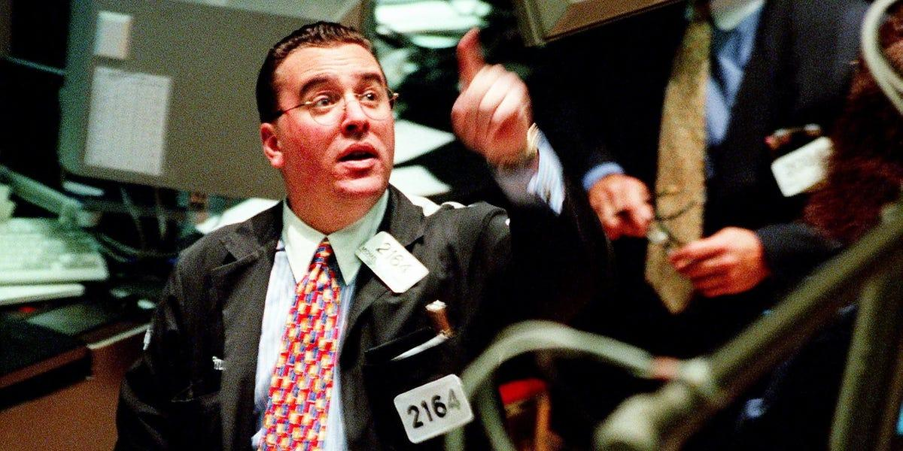

Randy McKay is a distinguished figure in the trading industry, celebrated for his effective trading strategies and the valuable insights he has shared through trading literature. Over the course of his impressive 30-year career, McKay has demonstrated a remarkable ability to transform modest initial investments into substantial multi-million dollar successes. This prowess has solidified his reputation as a master trader, earning him a prominent feature in Jack Schwager's influential book, "New Market Wizards." Through this publication, McKay's methodologies have permeated the trading community, significantly impacting both novice traders looking to establish their strategies and seasoned traders seeking to refine their approaches.

This article aims to explore Randy McKay's trading journey, insights, and the enduring impact of his strategies on algorithmic trading. By examining the core elements of his methodologies, readers will gain a deeper understanding of McKay's contributions to the trading world. It will highlight the transformative nature of his strategies and how they continue to inspire new generations of traders. The forthcoming sections will delve into McKay's early life, notable achievements, and his profound influence on both traditional and algorithmic trading practices.



## Table of Contents

## Early Life and Trading Beginnings

Randy McKay was born into an environment that nurtured an interest in trading, largely due to his family's connection to the financial markets. The influence of his older brother, a prominent figure at the Chicago Mercantile Exchange (CME), played a crucial role in McKay's early career development. This connection enabled him to secure an entry-level job at the CME, marking the beginning of his immersion in the world of trading.

Initially, McKay faced significant financial challenges, which are common among many novice traders. However, his astute ability to comprehend market dynamics and his unwavering determination led to a pivotal turning point in his career. Demonstrating a keen sense for currency futures, McKay managed to transform a modest sum of $2,000 into an impressive $70,000. This achievement was not only a testament to his budding skills but also solidified his confidence as a trader. McKay's transition from financial struggles to early success showcases the combination of opportunity, familial influence, and personal tenacity in forging his initial path in trading.

## Notable Achievements and Trading Philosophy

Randy McKay’s trading career is punctuated by noteworthy achievements and a distinct trading philosophy that have earned him a place among the most respected figures in the industry. One of his landmark achievements occurred during 1976 with a successful trade in the British Pound, a move that is often highlighted as a testament to his foresight and acumen. During this period, the currency markets were highly volatile, yet McKay adeptly navigated these fluctuations to secure significant profits. His approach was characterized by a deep understanding of market dynamics and the ability to anticipate movements through rigorous analysis.

McKay’s trading philosophy was centered around a combination of thorough market analysis and strategic risk-taking. He consistently stressed the importance of understanding market fundamentals and mastering technical analysis to inform trading decisions. Rather than relying solely on instinct or experience, McKay preferred a systematic approach to trading. This involved detailed market analysis to identify trends and potential reversals, thereby enabling him to optimize his entry and [exit](/wiki/exit-strategy) points.

Another key element of McKay's philosophy was his belief in monitoring multiple markets simultaneously. He advocated for a diversified approach, tracking different financial instruments and markets to uncover diverse trading opportunities. By observing various markets, McKay was able to capitalize on broader economic trends and reduce dependency on a single market, thereby spreading risk and enhancing potential returns.

Overall, McKay’s achievements and trading philosophy exemplify disciplined trading practices supported by comprehensive market analysis and strategic decision-making. His ability to adapt to changing market conditions while maintaining rigorous risk management protocols has left an indelible impact on the trading community, influencing traders across different strategies and timeframes.

## Randy McKay's Trading Strategies

Randy McKay's trading strategies are distinguished by a refined approach to both entry and exit points, primarily characterized by his 'Predator Method.' This method is noted for its trend-following nature, wherein McKay adeptly capitalizes on market [momentum](/wiki/momentum) while precisely timing his trades to maximize returns. He successfully integrated technical and [fundamental analysis](/wiki/fundamental-analysis), enabling him to capture a broad spectrum of relevant market signals.

In technical analysis, McKay utilized moving averages and Fibonacci retracements to analyze price patterns and potential reversal points. Moving averages, which smooth out price data by creating a constantly updated average price, served as a tool for identifying prevailing trends. For instance, a 50-day moving average intersecting above a 200-day moving average might signal a potential bullish trend. On the other hand, Fibonacci retracements helped identify potential levels of support and resistance by predicting the extent of a retracement in a trending market.

Furthermore, McKay's 'Sniper Method' complemented his Predator approach by targeting longer-term opportunities while maintaining a disciplined focus on risk management. This method required the identification of high-probability trades with the potential for significant gains, ensuring a proportionate balance between risk and return. By setting stringent criteria for trade entry based on both technical signals and broader market contexts, McKay was able to effectively manage risk and limit exposure to adverse market movements.

Through these strategies, McKay has demonstrated the importance of adapting trading methods to diverse market conditions, thereby securing a successful and enduring trading career. His ability to seamlessly blend different analytical techniques into cohesive strategies continues to offer valuable insights for modern traders looking to optimize their trading performance.

## Impact on Algorithmic Trading

Randy McKay's trading principles have proven influential in the context of [algorithmic trading](/wiki/algorithmic-trading). His strategies emphasize data-driven decision-making, a practice that is fundamental to the development and implementation of algorithmic systems. McKay's approach focused on thorough market analysis and adaptable techniques, which align seamlessly with the core processes of algorithmic trading systems that analyze vast datasets to generate trading signals.

The transition from McKay’s manual trades to automated systems underscores a foresight into the evolution of trading methodologies. Traditional methods relied heavily on manual decision-making, predominantly based on intuition and experience. In contrast, algorithmic trading systems are predominantly grounded in quantitative analysis and systematic processes, allowing for the efficient processing of market information. McKay's emphasis on risk management and strategic decision-making is mirrored in automated trading, where algorithms enforce stop-loss mechanisms and optimize trade entries and exits based on predefined parameters.

In algorithmic trading, the incorporation of moving averages, Fibonacci retracements, and other technical analysis tools espoused by McKay reflect the integration of his methodologies in systematized trading environments. A simple moving average (SMA) can be computed using the formula:

$$
\text{SMA}_t = \frac{1}{n}\sum_{i=0}^{n-1} P_{t-i}
$$

where $P_{t-i}$ represents the price at time $t-i$ and $n$ is the number of data points.

Python programming language is widely used to implement such strategies, where the calculation of moving averages might be coded as follows:

```python
import pandas as pd

def calculate_sma(prices, window):
    return prices.rolling(window=window).mean()

# Example usage with a Pandas Series
prices = pd.Series([92, 94, 96, 98, 100])
window_size = 3
sma = calculate_sma(prices, window_size)
print(sma)
```

The adaptive nature of McKay's techniques is reflected in modern algorithmic trading's ability to adjust strategies based on evolving market conditions. By leveraging real-time data, algorithms can recalibrate their parameters to address contemporary market environments, a concept that was foundational in McKay's trading philosophy.

In summary, Randy McKay's trading philosophy provides a framework that complements algorithmic trading practices. His insights into risk management and adaptive trading have greatly enriched the systematic approach to market speculation, ensuring that his legacy persists in the constantly evolving landscape of financial trading.

## Quotes and Insights from Randy McKay

Randy McKay, a seasoned trader, has frequently underscored the crucial role that risk management plays in achieving sustained success in trading. One of his most resonant pieces of advice is to "never let a loser get out of hand." This statement encapsulates the idea that traders must maintain control over their losses. McKay believed that a trader should be prepared for the possibility of being wrong multiple times in a row—"twenty or thirty times," as he put it. This level of preparedness ensures that a trader's financial foundation remains intact, allowing them to continue to operate even during a series of adverse outcomes.

McKay's insights into trading extend beyond risk management to the personalization of trading strategies. He noted that "virtually every successful trader I know ultimately ended up with a trading style suited to his personality." This observation highlights the importance of developing a trading approach that aligns with an individual's temperament and decision-making processes. The idea is to craft a methodology that not only capitalizes on market opportunities but also coexists harmoniously with the trader's psychological preferences and strengths.

His emphasis on tailored strategies suggests a recognition of diverse pathways to success, wherein each trader's distinctive characteristics play a pivotal role. This concept challenges the one-size-fits-all mentality and suggests that the path to profitability is as unique as the traders themselves. The integration of personalized strategies with disciplined risk management forms a core part of McKay's trading philosophy, illustrating his profound understanding of both the technical and psychological components of trading.

## Randy McKay's Legacy in Trading

Randy McKay remains a pivotal figure in trading, having left an indelible mark with his innovative strategies and disciplined approach. His methodologies continue to inspire traders globally, from novices to seasoned professionals, reaffirming the significance of disciplined trading and effective risk management.

McKay’s legacy is deeply rooted in his commitment to understanding market dynamics and recognizing the critical importance of risk management. His famous dictum, "Never let a loser get out of hand," underscores a fundamental trait of successful trading: the ability to accept losses and move forward without letting emotions dictate trading decisions. This wisdom highlights the importance of psychological resilience, a crucial aspect often overshadowed by the lure of profits.

Moreover, McKay's dedication to monitoring multiple markets and his strategic approach to risk-taking laid the groundwork for many contemporary trading strategies. His emphasis on tailored trading styles also suggests that understanding one's psychological makeup and aligning it with an appropriate trading strategy is essential for long-term success.

The strategies developed by McKay have not only provided profit-generating methods but have also emphasized the necessity of psychological endurance. This focus on mental toughness is just as relevant today as it was during his early trading years. His insights have permeated modern trading practices, ensuring his lasting influence on both discretionary and algorithmic trading strategies.

In conclusion, Randy McKay’s contributions to the field of trading are timeless, serving as a testament to the enduring principles of trading strategy and psychological preparedness. His legacy continues to educate and shape traders, reinforcing the idea that success is as much about mental integrity as it is about technical skill.

## References & Further Reading

[1]: Schwager, J. D. (1992). ["The New Market Wizards: Conversations with America's Top Traders."](https://www.amazon.com/New-Market-Wizards-Conversations-Americas/dp/0887306675) HarperBusiness.

[2]: Aronson, D. R. (2006). ["Evidence-Based Technical Analysis: Applying the Scientific Method and Statistical Inference to Trading Signals."](https://www.amazon.com/Evidence-Based-Technical-Analysis-Scientific-Statistical/dp/0470008741) Wiley Trading.

[3]: Chan, E. P. (2009). ["Quantitative Trading: How to Build Your Own Algorithmic Trading Business."](https://github.com/ftvision/quant_trading_echan_book) Wiley Trading.

[4]: Jansen, S. (2020). ["Machine Learning for Algorithmic Trading: Predictive models to extract signals from market and alternative data for systematic trading strategies with Python."](https://github.com/stefan-jansen/machine-learning-for-trading) Packt Publishing.

[5]: Lopez de Prado, M. (2018). ["Advances in Financial Machine Learning."](https://www.amazon.com/Advances-Financial-Machine-Learning-Marcos/dp/1119482089) Wiley.

[6]: Clenow, A. G. (2013). ["Following the Trend: Diversified Managed Futures Trading."](https://www.amazon.com/Following-Trend-Diversified-Managed-Futures/dp/1118410858) Wiley Trading.