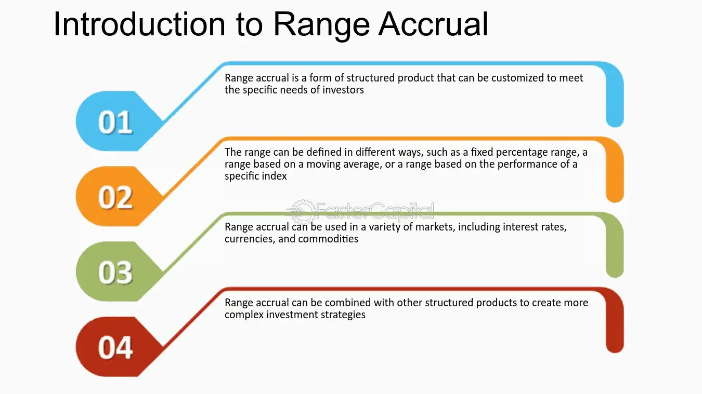

## Table of Contents

## What are Range Accrual Options?

Range Accrual Options are a type of financial product that pays out based on how often an underlying asset, like a stock or interest rate, stays within a specific range over a set period. If the asset's value stays within the set range on a given day, the option accrues a certain amount of value. At the end of the period, the total payout is based on how many days the asset stayed within the range.

These options can be useful for investors who have a view on the stability of an asset's price rather than its direction. For example, if an investor believes that interest rates will remain stable, they might buy a range accrual option that pays out more the longer the rates stay within a certain range. However, if the asset moves outside the range frequently, the option might not pay out much, making it riskier than traditional options.

## How do Range Accrual Options differ from traditional options?

Range Accrual Options are different from traditional options because they focus on how often an asset stays within a set range, not just its price at the end of the option period. With traditional options, you get a payout if the asset's price is above or below a certain level when the option expires. But with Range Accrual Options, you earn a little bit each day the asset stays within the range, and your total payout depends on how many days it stayed in that range.

This makes Range Accrual Options good for people who think an asset's price will stay stable, not go up or down a lot. Traditional options are better if you think the price will move a lot in one direction. Range Accrual Options can be riskier because if the asset moves outside the range a lot, you might not get much money at the end. But if it stays in the range most of the time, you could earn more than with a traditional option.

## What are the basic components of a Range Accrual Option?

A Range Accrual Option has a few main parts that make it work. First, there's the underlying asset, like a stock or an interest rate, that the option is based on. Then, there's the range, which is like a window that the asset's value needs to stay inside. If the asset's value is inside this window on a certain day, the option earns a bit of value for that day. The option also has a time period, which is how long the option lasts, like a few months or a year.

The other important part is the payout. At the end of the time period, you add up all the days the asset was inside the range, and that decides how much money you get. The more days the asset stayed in the range, the more money you earn. If the asset stays outside the range a lot, you might not get much money. So, the payout depends on how stable the asset's value is during the option's time period.

## What types of Range Accrual Options exist?

Range Accrual Options come in different types, each with its own way of working. One type is the Fixed Coupon Range Accrual Option. With this kind, you get a fixed amount of money for each day the asset stays inside the range. If the asset stays in the range a lot, you can earn a good amount of money. Another type is the Floating Coupon Range Accrual Option. Here, the amount of money you earn each day can change, depending on things like interest rates or other factors. This makes it a bit more unpredictable but can also lead to bigger payouts if things go well.

Another type is the Dual Range Accrual Option. This one has two ranges instead of one. You earn money if the asset stays inside either of the two ranges. This can be good if you think the asset's value might move around a bit but still stay within certain limits. There are also Barrier Range Accrual Options. These work like regular Range Accrual Options, but they have an extra rule: if the asset's value goes outside a certain barrier at any time, the option stops working and you don't get any more money. This makes them riskier but can also mean bigger rewards if the asset stays within the range and doesn't hit the barrier.

## How is the accrual period defined in Range Accrual Options?

The accrual period in Range Accrual Options is the time during which the option earns value. It's like a calendar that counts the days when the asset's price stays within the set range. This period can last for a few months or even a year, depending on how the option is set up. Each day within this period is checked to see if the asset's price is inside the range. If it is, the option earns a little bit of value for that day.

At the end of the accrual period, all the days when the asset was inside the range are added up. The total number of these days decides how much money you get from the option. So, the accrual period is really important because it's the time when the option is working and earning value based on the asset's stability.

## What is the formula used to calculate the payoff of a Range Accrual Option?

The payoff of a Range Accrual Option is calculated by adding up the days when the asset's price stayed within the set range during the accrual period. For each day the asset's price is inside the range, the option earns a certain amount of value. This daily value can be fixed or it can change, depending on the type of Range Accrual Option. At the end of the accrual period, you count the number of days the asset was in the range and multiply it by the daily value to find out the total payoff.

For example, if you have a Fixed Coupon Range Accrual Option with a daily value of $10, and the asset's price was inside the range for 200 out of 365 days, the payoff would be $2,000. If it's a Floating Coupon Range Accrual Option, the daily value might change each day based on factors like interest rates. So, you would need to add up the daily values for all the days the asset was in the range to find the total payoff. This way, the payoff depends on how stable the asset's price is during the accrual period.

## Can you explain the concept of the accrual rate in Range Accrual Options?

The accrual rate in Range Accrual Options is like the interest you earn on a savings account, but it only happens when the asset's price stays inside a certain range. If the asset's price is in the range on a specific day, you earn a little bit of money for that day. The accrual rate tells you how much money you earn each day the asset is in the range. It can be a fixed amount, like $10 per day, or it can change each day, depending on things like interest rates.

For example, if you have a Range Accrual Option with a fixed accrual rate of $10 per day, and the asset's price stays in the range for 200 days out of a year, you would earn $2,000 by the end of the year. If the accrual rate is floating, it might be different each day, so you would add up the daily rates for all the days the asset was in the range to find your total earnings. The accrual rate is important because it decides how much money you can make from the option, based on how stable the asset's price is during the option's time period.

## How do market conditions affect the value of Range Accrual Options?

Market conditions can really change how much a Range Accrual Option is worth. If the market is calm and the price of the asset stays inside the set range a lot, the option becomes more valuable. This is because you earn money for each day the asset is in the range, so more days in the range means more money at the end. But if the market is very up and down, and the asset's price moves outside the range often, the option might not be worth as much. This is because you won't earn money on the days the asset is outside the range, so your total earnings could be lower.

Sometimes, other things in the market can affect the value of the option too. For example, if interest rates are expected to stay steady, a Range Accrual Option based on interest rates might be more valuable. But if people think interest rates will jump around a lot, the option might not be worth as much because it's less likely the rates will stay in the range. So, understanding what's happening in the market and what people expect to happen can help you figure out how valuable a Range Accrual Option might be.

## What are some common strategies for trading Range Accrual Options?

One common strategy for trading Range Accrual Options is to bet on stability. If you think the price of the asset, like a stock or interest rate, will stay pretty much the same, you might buy a Range Accrual Option. You earn money each day the price stays in the range, so if the market is calm and the price stays steady, you could make a good amount of money. This strategy works well when you expect the market to be quiet and not move around a lot.

Another strategy is to use Range Accrual Options as a way to get a higher return than you might get from regular investments. If you think the asset's price will stay in the range most of the time, but you're okay with taking a bit more risk, you could buy a Range Accrual Option. If the price stays in the range a lot, your earnings could be higher than what you'd get from a regular investment. But if the price moves outside the range often, you might not make as much, so you have to be comfortable with that risk.

Some traders also use Range Accrual Options to hedge other investments. If you have other investments that could lose value if the market moves a lot, you might buy a Range Accrual Option to earn money if the market stays calm. This can help balance out any losses from your other investments. It's like having a safety net that pays you if the market doesn't move too much.

## How can one hedge a portfolio using Range Accrual Options?

One way to hedge a portfolio using Range Accrual Options is to use them as a safety net against market volatility. If you have investments that could lose value if the market moves a lot, you can buy a Range Accrual Option based on the same or a related asset. If the market stays calm and the asset's price stays within the range most of the time, the Range Accrual Option will earn you money. This can help offset any losses from your other investments that happen because the market didn't move much.

For example, imagine you own stocks that do well when the market goes up but lose value if the market stays the same. You could buy a Range Accrual Option that pays you if the stock's price stays in a certain range. If the stock's price doesn't move much and stays in the range, you earn money from the option. This money can help make up for the fact that your stocks didn't go up in value. So, using Range Accrual Options like this can help protect your portfolio from the risk of the market not moving enough.

## What are the advanced pricing models for Range Accrual Options?

Advanced pricing models for Range Accrual Options often use something called the Monte Carlo simulation. This method is like playing out many different possible futures for the asset's price to see how often it stays in the range. By running these simulations, you can estimate how much money the option might earn over time. The model takes into account things like how much the asset's price might move around, how likely it is to stay in the range, and what the accrual rate is. This helps traders figure out a fair price for the option, considering all the possible ways the market could go.

Another advanced model is the finite difference method. This model breaks down the option's life into small time steps and looks at how the asset's price might change from one step to the next. It's a bit like looking at a movie frame by frame to see how the story unfolds. By doing this, the model can calculate how the option's value changes over time, depending on whether the asset's price stays in the range or not. This method is good for understanding how different factors, like interest rates or how much the asset's price moves, affect the option's value.

Both of these models help traders make better guesses about what a Range Accrual Option is worth. They take into account the complicated ways that markets can move and help set a price that reflects all the risks and rewards of the option. By using these advanced models, traders can be more confident in their decisions and better manage their investments.

## How do regulatory changes impact the structuring and trading of Range Accrual Options?

Regulatory changes can have a big impact on how Range Accrual Options are structured and traded. If new rules come out, they might change what kinds of options can be sold, how they can be sold, or who can buy them. For example, if a new law says that only certain investors can buy Range Accrual Options, then fewer people might trade them. This could make the options less popular and might change how much they are worth. Also, if the rules make it harder to create new options, companies might have to change how they structure them to follow the new rules. This can make the options more complicated or less attractive to investors.

Sometimes, regulatory changes can also affect the costs of trading Range Accrual Options. If new rules make it more expensive to sell these options, like by requiring more paperwork or higher fees, the cost of the options might go up. This could make them less appealing to buyers, which might mean fewer people trade them. On the other hand, if the rules make the market safer or more transparent, more people might feel comfortable buying and selling Range Accrual Options. So, keeping up with regulatory changes is important for anyone involved in trading these options, as it can change how they work and how much they are worth.

## What are Range Accrual Options and how do they work?

Range accrual options are a form of structured financial product that derive their value from the performance of an underlying index. These derivatives are particularly appealing because they offer the potential for enhanced returns, contingent upon the index's behavior within a pre-defined range. The fundamental concept behind range accrual options involves rewarding investors when the reference asset remains within specified upper and lower thresholds during an accrual period.

The performance of range accrual options is largely contingent upon market stability, making them attractive in environments where the underlying index exhibits minimal volatility. When the index stays within the specified range, the option accrues interest at an enhanced rate, which contributes to the overall yield. As such, investors may earn returns that are significantly higher than those offered by traditional fixed-income securities, provided the index volatility remains within expected parameters.

Mathematically, the payoff of a range accrual option can be represented by the following function:

$$

\text{Payoff} = C \times \frac{n}{N} 
$$

where $C$ is the coupon rate offered by the option, $n$ is the number of days the index remains within the specified range, and $N$ is the total number of days in the accrual period. This formula highlights that the coupon payment is proportional to the duration the index remained within the desired range.

Investors in range accrual options thus benefit from environments where the underlying index exhibits moderate variance. The structured nature of these options allows for precise targeting of market conditions, providing attractive yields that correspond to the risk exposure linked to the position of the reference index. While these products present potential for substantial returns, they also [carry](/wiki/carry-trading) risks, particularly in markets characterized by unpredictability or rapid change, where the index may frequently breach the predefined bounds.

## What are the Mechanics of Range Accrual Options?

Range accrual options are structured to accrue interest based on whether a reference index remains within a pre-defined range, known as the 'accrual range', during the observation period. This structured product is primarily used to leverage stable market conditions, providing investors with a higher yield than traditional fixed-income investments, though accompanied by unique conditions and risks.

The core mechanism of these options involves the accrual of a fixed coupon rate, which occurs only when the reference index, like a stock index or [interest rate](/wiki/interest-rate-trading-strategies), is consistently within the mandated accrual range. This range is defined prior to the inception of the option and can vary in width, depending on the market conditions and the issuer's strategy.

Assuming an option with an observation period subdivided into daily intervals, if the reference index remains within the specified accrual range each day, the option accumulates interest at the fixed coupon rate. Conversely, if the index strays outside the accrued range during any given interval, the interest accrual stops for that period, leading to a forfeiture of potential earnings. For instance, if the predefined coupon rate is 5% annually and the index remains within the accrual range for 200 days in a year, the investment would yield interest only for those 200 days rather than the entire year.

Quantitatively, the mechanics can be illustrated as follows:

Let $C$ denote the annual coupon rate, $D_{\text{in}}$ the number of days the index stays within the range, and $N$ the total number of days in a year. The interest accrued, $I$, in this case, would be calculated by the formula:

$$
I = C \times \frac{D_{\text{in}}}{N}
$$

Moreover, if implemented computationally, a Python script might track the index levels against the specified range and compute the cumulative interest. Here is a basic example:

```python
def calculate_accrual(coupon_rate, index_values, accrual_range):
    days_in_range = sum(accrual_range[0] <= value <= accrual_range[1] for value in index_values)
    total_days = len(index_values)
    return coupon_rate * (days_in_range / total_days)

coupon_rate = 0.05
index_values = [100, 102, 103, 98, 97, 101, 104]  # example daily index values
accrual_range = (99, 103)

interest_accrued = calculate_accrual(coupon_rate, index_values, accrual_range)
print(f"Accrued Interest: {interest_accrued}")
```

This script calculates how many days the index values fall within the specified range and subsequently determines the pro rata interest based on the coupon rate. In practice, a more complex system might incorporate real-time data feeds and adapt to more intricate financial environments, but this example captures the foundational logic driving range accrual options.

## How do you calculate Range Accrual Payoffs?

Range accrual options operate with payoff calculations akin to those used in fixed-income securities, utilizing the underlying index's behavior within predetermined parameters to determine returns. A critical component of this process is the assessment of daily accrual interest, contingent on the position of the underlying index relative to the specified accrual range.

### Daily Accrual Interest Calculation

The calculation of daily accrual interest hinges on monitoring the index's performance each day within the option's lifecycle. Specifically, if the index remains within the defined accrual range on a given day, the option accrues interest for that day. The accrued interest for each day can be expressed mathematically as:

$$

\text{Accrued Interest (Daily)} = \begin{cases} 
\frac{C}{N} & \text{if } L \leq I_t \leq U \\ 
0 & \text{otherwise}
\end{cases} 
$$

Where:
- $C$ is the fixed coupon rate.
- $N$ is the total number of days in the accrual period.
- $L$ is the lower bound of the accrual range.
- $U$ is the upper bound of the accrual range.
- $I_t$ represents the index value on day $t$.

### Monthly Payment Calculation

To compute the monthly payoff, the accrued interest for each day within the month is aggregated to determine the total monthly interest payment. The formula can be represented as:

$$
\text{Total Monthly Payment} = \sum_{t=1}^{M} \text{Accrued Interest (Daily)}
$$

Where:
- $M$ represents the total number of days in the specific month being evaluated.

### Example Calculation

Suppose an investor holds a range accrual option with a fixed coupon rate $C$ of 10%, over an accrual period of 30 days. The specified accrual range is set between 1000 and 2000. For this example, let us assume the underlying index remains within this range for 20 out of the 30 days in the month.

The daily interest for those 20 days would be:

$$

\text{Accrued Interest (Daily)} = \frac{10\%}{30} = 0.333\%
$$

Thus, the total monthly payment would be:

$$
\text{Total Monthly Payment} = 0.333\% \times 20 = 6.66\%
$$

This percentage represents the realized return for the month, provided the index adhered to the stipulated range criteria.

### Computational Approach

Using Python, investors can simulate and compute these calculations to manage and optimize their portfolios more effectively:

```python
def calculate_monthly_payment(coupon_rate, total_days, range_bounds, index_values):
    daily_rate = coupon_rate / total_days
    accrued_payments = [daily_rate if L <= idx <= U else 0 for idx in index_values]
    return sum(accrued_payments)

# Sample data
coupon_rate = 0.10
total_days = 30
range_bounds = (1000, 2000)
index_values = [1050, 980, 1950, 2005, 1990, 1000] * 5  # Example index values for 30 days

monthly_payment = calculate_monthly_payment(coupon_rate, total_days, range_bounds, index_values)
print("Monthly Payment:", monthly_payment)
```

In summary, the payoff computations for range accrual options involve straightforward but critical evaluation of daily adherence by the underlying index within a predefined range. This establishes a methodical approach to capturing potential returns and understanding such products' strategic financial planning.

## References & Further Reading

[1]: Heidari, A., & Wendt, O. (2005). ["Valuation of Range Accruals in a Jump-Diffusion Model."](https://www.researchgate.net/publication/360757123_A_NUMERICAL_METHOD_FOR_PRICING_PERPETUAL_AMERICAN_OPTIONS_UNDER_REGIME_SWITCHING_JUMP_DIFFUSION_MODELS) The Journal of Computational Finance, 9(3), 53-92.

[2]: Rubio, F. J. (2013). ["Range Accrual and Forward Start Range Accrual Swaps: Pricing and Risk Management."](https://quant.stackexchange.com/questions/466/pricing-callable-range-accruals-on-spreads) Applied Mathematical Finance, 20(3), 225-247.

[3]: Hull, J. C. (2017). ["Options, Futures, and Other Derivatives,"](https://www.semanticscholar.org/paper/Options%2C-Futures%2C-and-Other-Derivatives-Hull/89bdee500c8623864fc9eb7a471546aa713acc44) 10th Edition. Pearson.

[4]: Geman, H. (2005). ["Commodities and Commodity Derivatives: Modeling and Pricing for Agriculturals, Metals and Energy."](https://download.e-bookshelf.de/download/0000/5675/90/L-G-0000567590-0015270354.pdf) Wiley Finance.

[5]: Choudhry, M. (2010). ["Structured Credit Products: Credit Derivatives and Synthetic Securitisation,"](https://onlinelibrary.wiley.com/doi/book/10.1002/9781118390504) 2nd Edition. Wiley.